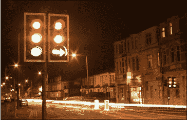
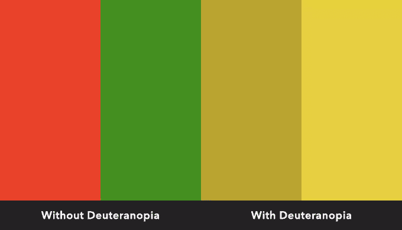
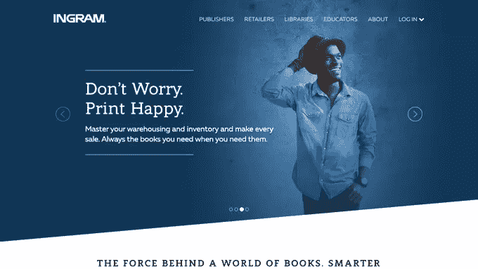
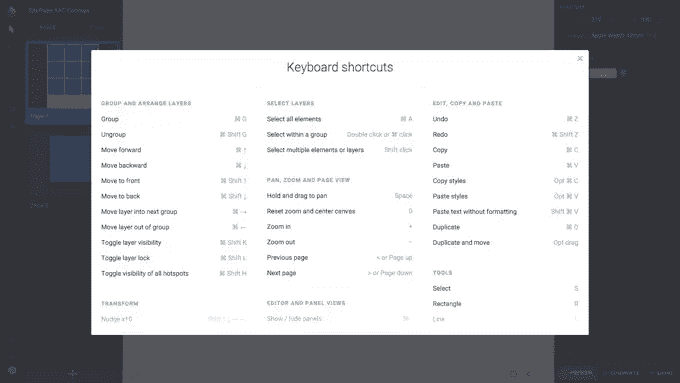

# 为残障用户提供更好 UX 的 5 种方法

> 原文：<https://www.sitepoint.com/5-ways-offer-better-ux-disabled-users/>

在整个人群中，空间推理能力因人而异。然而，公平地说，设计师通常有高于平均水平的能力来可视化和理解网站如何工作。这通常是我们首先被设计吸引的原因。

那么，这是否让我们成为设计网站的理想候选人呢？

实际上没有。

为了给所有人提供流畅的用户体验，你需要能够“站在用户的立场上”。如果你是一个精明、老练的网站用户，这可能会非常困难。

现实是，即使设计师可能有创建网站的技术技能，我们通常没有做好设计网站的准备。出于这个原因，用户界面设计中的一个巨大因素是用户*测试*，但这并不意味着我们不能做出直观的决定。

忘记平衡、色彩感觉或其他经典的设计师特质。移情作为一个用户界面设计师应该具备的技能是无与伦比的。穿着别人的鞋子走路(或者*通过他们的眼睛看*可能是一个更好的比喻)，可以暂时代替手边有一个用户/测试人员。

让我们来看看一些我们经常忘记的残疾。

## 色觉缺陷

模拟幻视&幻视

色觉缺陷是这个列表中最普遍的缺陷，也是最容易被忽视的。它经常被错误地描述为色盲，它影响了全球约 8%的男性(尽管女性较少)。如果你在设计时没有考虑色觉缺陷，你就忽略了世界上大约 8%的地方。

色盲患者并非对颜色视而不见——他们只是对颜色的感知不同，最常见的障碍会影响他们对红色和绿色的视觉理解。它叫做德意志乌托邦。

正如你从图像中看到的，红色和绿色看起来是两种不太明显的黄色。因为红色和绿色经常与“是”和“否”联系在一起，例如在设计按钮时，这使得那些色觉缺陷的人在黑暗中(*双关语不是故意的！*)关于按钮的作用。

第一课:我们看到的东西不尽相同。

## 一般性视觉障碍

实话实说:我们大多数人会发现很难记住，更不用说仔细考虑所有可能的视觉障碍类型了，但是有*一些需要掌握的关键技巧，将有利于各种视觉障碍的互联网用户。*

您应该已经在使用描述性的 alt 标签，为简单的基于文本的链接加下划线，并正确显示带点的缩写(例如“C.V.D”而不是“CVD”)。我不会喋喋不休地让你厌烦，因为这种东西以前已经被广泛地讨论过了。

*长话短说:屏幕阅读器需要 alt 标签和格式正确的缩写来正确地指示用户*。

然而，所有这些技巧和技术的共同点是，它们通过**对比**变得更好。对比度不仅仅是通过使用颜色和色调值的明显差异来提高的；您可以通过切换字体来增加对比度，以便更好地区分标题和文本块，甚至可以简单地使用负空格来清楚地显示一个部分何时结束，另一个部分何时开始。

这里有一个由 [Ingram](http://www.ingramcontent.com/) 创作的极好的例子——注意清晰的字体(有衬线和无衬线字体),大的文本和极好的间距使用，所有这些都没有牺牲众所周知的趋势和吸引人的图像。

总的来说，更大、更鲜明、更明显是前进的方向。

第二课:残疾比你想象的更普遍。

## 诵读困难症

诵读困难被称为“阅读障碍”,它影响了世界上多达 7%的人，使其成为最常见的学习障碍。尽管智力正常，那些有阅读障碍的人会发现很难拼写单词，“读出”单词或快速阅读。

对于有阅读障碍的人来说，任何缺乏对比或者可读性差的网页设计几乎是不可能阅读的。但是我们究竟如何解决这个问题呢？

其实解决方法还是那一次，*对比*。除此之外，诵读困难者倾向于“翻转”字母。因此，字母 **b** 可能读作 a**d**，或者字母 **p** 可能读作 a**q**。

通过使用更大的大写字母，字符之间额外的字距调整，不一致的高度，倾斜的形式，如果可能的话，为每个字母设计一个完全独特的设计，阅读障碍患者可以轻松地解析每个句子。

诵读困难字体的创始人克里斯蒂安·波尔(他自己也是一名诵读困难者)详细解释了他的研究如何帮助他更好地阅读。任何印刷术迷都会欣赏这项研究。

虽然(可悲的是)没有多少字体是专门为阅读障碍用户设计的，但你仍然可以识别出阅读障碍友好型字体，并在你的网页设计中使用它们。

第三课:如果没有可读性，美学就毫无用处。

## 耳聋

对于大多数网站来说，耳聋通常不是一个优先考虑的问题。我自己 85%是聋子，但是由于网页主要是被阅读而不是听力所消耗，我基本上做得还可以。视频是重听人不得不面对的一个领域。显然，我说的不是背景视频——因为它们没有噪音——而是介绍视频。

即使它们转换得很好，因为它们使用户不必阅读(并且它们也迎合其他残疾人，即盲人用户)，字幕也经常被遗忘。

第四课:网页设计不应该完全依赖声音或视频。

## 运动障碍

有运动障碍的人(老年人或其他人)在使用鼠标和键盘导航时有困难。我必须承认，我在尝试激活 Photoshop 的“保存为 Web 格式”功能时遇到了麻烦(command+option+shift+s)，我甚至没有被禁用。

Sketch 处理这种类型的交互要有效得多。比如*矩形*简单来说就是“R”。键盘快捷键在网页设计中也是完全可行的， [Atomic.io](https://atomic.io/) 和 [Dribbble](https://dribbble.com/) 都使用了这个功能。

对于那些有运动障碍的人来说，精确的运动可能是一个棘手的壮举，所以最好使用可以通过听写工具视觉识别的大点击目标；即不要将重要信息隐藏在导航或其他基于悬停的组件之后。

第五课:更少的互动让每个人都开心。

## 结论

为残疾人设计不需要很难。实际上，这很简单，结果也能对非残疾人产生积极的影响。如果你能最大限度地减少浏览网站所需的交互量，那么你就为每个人提供了出色的用户体验，而不仅仅是残疾用户。

为残疾用户设计应该是你最关心的问题。

任何网站都不应该附带最低*物理*要求或说明手册。许多国家甚至没有接入互联网(准确地说是 60%)，所以我们不要让那些接入互联网的国家感到尴尬。

## 分享这篇文章