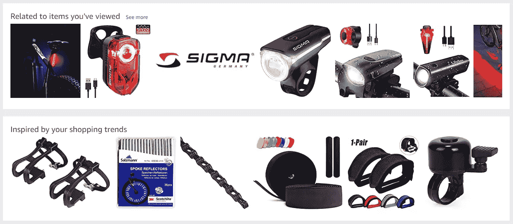
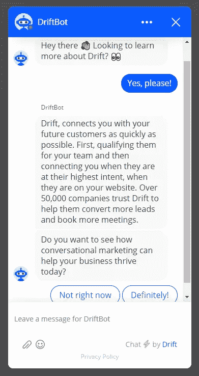
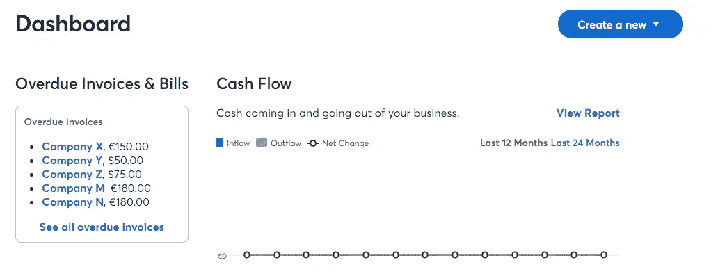
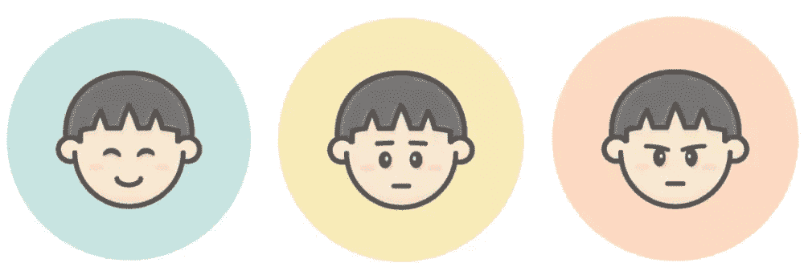

# 用机器学习改善用户体验的 5 种方法

> 原文：<https://www.sitepoint.com/5-ways-to-improve-user-experience-with-machine-learning/>

好莱坞电影制作人喜欢将人工智能描述为比人类更有能力的智能代理。幸运的是，我们还没有达到这种状态。我们仍然需要工程师开发创新的算法和工具，以改善人类与软件和系统的交互。不要担心——我们无法用机器学习来解决用户体验，也不接近。

多年来，机器学习已经成熟，允许我们从收集的数据中获得更多见解。我们甚至可以实现机器学习来改变 UX 设计师、产品设计师和交互设计师的工作。

本文介绍了我们如何利用机器学习来改善用户体验的五种不同策略。

让我们开始吧！

## 1.提供更高层次的个性化

个性化仍然是 2020 年的热门趋势。机器学习帮助你向客户提供更高层次的个性化服务。

用 Booking.com 的话说:

> 基于机器学习的个性化提供了一种更具可扩展性和准确性的方式来为个人用户实现独特的体验。它不是用基于规则的个性化来细分用户，而是允许你利用算法来提供这些一对一的体验，通常是以产品或内容推荐的形式。

以下是由机器学习驱动的个性化示例列表:

*   个性化电子邮件根据用户的搜索历史和以前的购买情况推荐符合用户兴趣的产品。
*   根据用户的兴趣为博客提供内容建议，这样可以降低跳出率，增加用户在网站上停留的时间。
*   通过创建个性化的奖励系统提供更多适用的折扣。

## 2.提供更高质量的建议

Amazon.de 根据我与自行车相关的购买历史提供产品建议

企业通过提供更高质量的推荐而获胜，因为他们可以增加收入。用户也是赢家，因为他们花更少的时间寻找产品。

埃森哲的一项研究显示，2018 年，63%的购物者更喜欢产品推荐。对于千禧一代来说，这个数字甚至更高，达到 69%的人喜欢产品推荐，而不是手动搜索相关产品。

[协同过滤](https://developers.google.com/machine-learning/recommendation/collaborative/basics)是一种广泛使用的方法，用于提供更加个性化的内容推荐。协同过滤基于用户的评论和购买，基于具有相似品味的用户提供内容建议。

例如，一个学生和一个商人给了几家餐馆相似的分数。他们很可能有相似的个人品味。因此，我们可以向学生推荐商人评分为“9”的特定餐馆，因为我们希望学生喜欢该餐馆。

## 3.提高客户服务质量和速度

作为一家公司，你可以通过提高客户服务速度来大幅改善用户体验。Drift.com 的研究显示，46%的受访者表示，他们希望在使用聊天机器人时能在五秒或更短的时间内得到回复，43%的人希望在使用在线实时聊天时得到回复，33%的人希望在使用电话或视频通话时得到回复。

换句话说，是时候开始使用机器学习驱动的聊天机器人了。最重要的是，同一项研究发现，聊天机器人的最大用例是回答时间敏感的问题。

不及时回复紧急问题会给你留下负面的用户体验。不幸的是，有时不可能有人随时回答最紧迫的问题。

因此，您可以利用聊天机器人，因为它们可以从以前的客户互动中快速学习。机器学习算法可以检测客户交互之间的模式和相似性，让他们在未来更快地回答类似的问题。

此外，聊天机器人比人类更具可扩展性。在选择聊天机器人时，人类的角色是回答聊天机器人无法解决的复杂问题。除此之外，人类可以向聊天机器人提供数据，以提高他们处理问题的能力。

## 4.通过分析用户行为优化布局

通过测量用户行为，我们可以优化应用程序的布局。

假设我们想要优化发票应用程序的布局。对于我们的应用程序来说，最关键的操作是发票创建按钮。我们想确定用户能多快找到这个按钮。

右上角显示发票创建按钮的 Waveapps.com 仪表盘

为了回答这个问题，我们可以测量用户点击这个按钮所需的时间。通过测量所需的时间，我们可以发现放置不正确的按钮，并尝试优化我们的布局。

假设发票创建按钮隐藏在菜单中。通过利用机器学习结合用户数据，我们可以检测出达到特定结果的缓慢行动模式。接下来，我们可以通过将按钮放置在更显眼的位置或更改按钮样式来缩短用户到达发票创建页面所需的时间。

换句话说，我们可以使用机器学习进行更有效的 A/B 测试，并减少用户搜索特定功能的时间。

此外，您可以发现用户频繁返回上一页的模式。这种模式表明特定的流是不正确的，或者用户期望不同的东西。

简而言之，我们的目标是找到那些不清楚或者需要太多时间才能完成的交互，这通常会对用户体验产生负面影响。除此之外，我们希望减少导航应用程序时的人为错误，以创建更加无缝的产品体验。

但是，不要太频繁地改变 UI 组件的顺序。不断发展的用户界面阻碍了用户反复学习新的用户界面。最重要的是，它可能会对客户保持率产生负面影响。

## 5.情感分析:情感人工智能

最后，当用户与网站、产品、博客文章或广告互动时，情感分析可以更清晰地展现用户的情感。测量一个人的情绪涉及到面部识别软件。然而，你也可以利用文本分析来获得感觉。但是这种策略不可能用来衡量人们对广告的反应。

通过判断用户对内容或广告的反应，你可以创作出更吸引人的广告。一些营销机构试图为具有其他兴趣、年龄或财富的用户制作不同的广告。

简而言之，您可以利用情感分析来创建:

*   更好地回答用户问题的内容
*   抓住用户兴趣的广告
*   更精准解决用户需求的产品

## 关于机器学习和用户体验的一个注记

机器学习是改善 UX 各方面的一个很好的工具。然而，不要在没有验证洞察的情况下实现每一个机器学习洞察。拥有一个用户测试过程来验证提议的变更仍然是有价值的。

比方说，你的机器学习算法揭示了特定的 UI 组件应该放置在不同的位置，或者可以受益于替代样式。您可以使用用户测试来验证这些想法，并尝试各种样式。

此外，您可以使用金丝雀测试来降低坏的 UI 更改的风险。金丝雀测试让你只向一小部分用户推出产品更新。

总之，我们相信机器学习和用户体验设计在未来将继续朝着彼此发展。当合并机器学习和用户体验设计时，可以发现明显的好处。

## 分享这篇文章