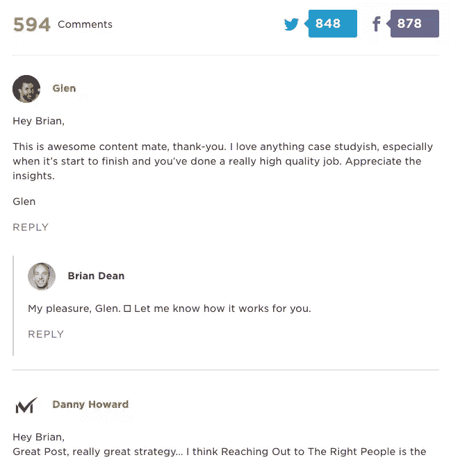
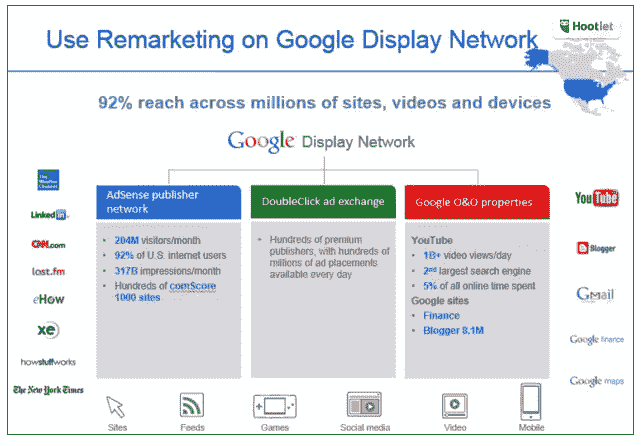
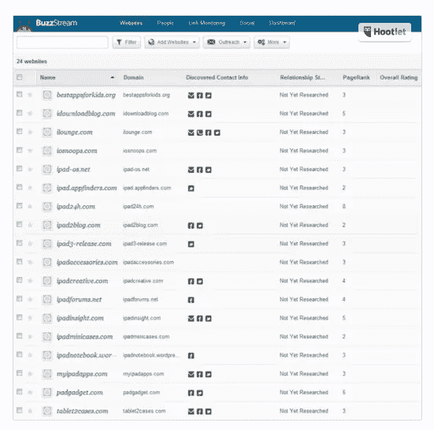
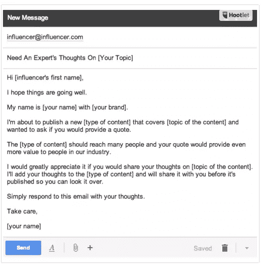
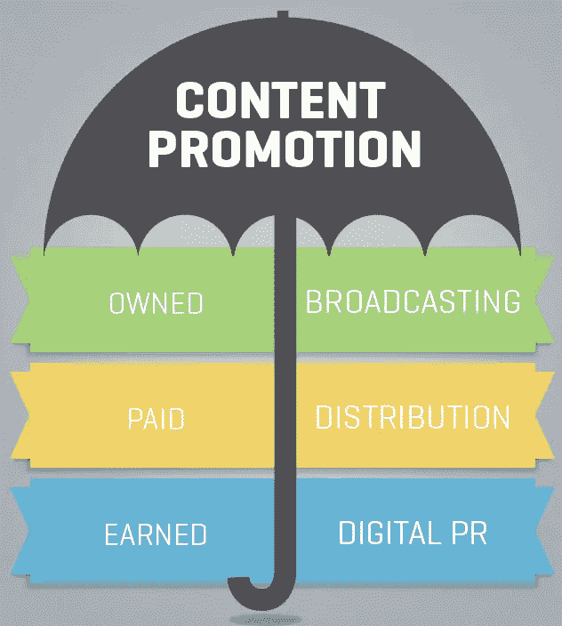

# 通过内容推广增加网站流量的 5 种方法

> 原文：<https://www.sitepoint.com/5-ways-to-use-content-promotion-to-drive-more-traffic-to-your-website/>

如果你花时间创造高质量的内容，而不是推广它，你就输掉了内容营销游戏。

内容营销的目标是建立受众。只有把你的内容送到消费者手中，你才能做到这一点。越多的人消费你的内容，你的受众就越多。

[社交触发器](http://socialtriggers.com/)的 Derek Halpern 使用的规则是花 80%的时间推广内容，只花 20%的时间创造内容。原因很简单:更明智的做法是花时间推广你已经拥有的内容，建立你的电子邮件列表，而不是创造更多更少人知道的内容。这是你能真正最大化你的内容投资回报率的唯一方法。

就像他们对产品说的:你不能只指望你‘造出来，他们就来’；有了内容，就不能只指望‘你创造了，他们就会来’。你必须推广内容！

***所以黄金问题是，你如何推广内容？***

这篇文章将涵盖 5 种方法来推广你的内容，并为你的网站带来更多的流量。所以让我们开始吧！

## 策略 1:评论者和分享者拓展

这种策略包括接触与你计划推广的内容相似的评论者和分享者。因此，如果你写了一篇关于无人驾驶汽车的博客文章，而其他人也写了一篇关于类似主题的文章，并有现有的社交参与，你可以联系那些已经评论和分享了另一篇文章的人，让他们知道你的文章。因为他们之前已经参与过类似的帖子，很明显他们对这个话题感兴趣，所以他们参与你的帖子的几率很高！

看看这篇博文的评论。它在脸书上有超过 594 条评论、848 条推文和 878 条评论和分享。大多数评论者都链接到社交媒体或评论平台，如 Disqus，所以有可能联系到他们，让他们知道你的帖子。

[(图片来源)](http://backlinko.com/skyscraper-technique)

想象一下，让观众对你的帖子感兴趣，然后邀请他们参与进来，会有多么强大。他们的评论和反馈是非常宝贵的，也是推广你的内容的好方法。人们更有可能阅读有一些社会参与的帖子，所以邀请已经对你的话题感兴趣的人是一个很好的内容推广策略。

评论营销包括让你成为你所在领域的“专家”。通过提出有见地的问题并作为领域专家分享你的知识，你将自己定位为你所在领域的思想领袖，鼓励人们访问你的网站并消费你的内容。

## 战术 2:付费广告

你总是可以选择付费在社交媒体上推广你的内容。这包括脸书和 Twitter 的付费广告，LinkedIn 上的赞助更新和付费广告等等。你可以增加帖子，让它们出现在你的受众的社交媒体档案的“新闻源”上。

再营销在这方面特别有用，因为一旦用户访问你的博客/内容，你就可以让你的广告跟随他们。这之所以有效，是因为人们在采取任何具体行动之前，需要至少看 7 次你的营销信息。这就是所谓的七个的[法则。](https://www.tutorialspoint.com/management_concepts/the_rule_of_seven.htm)

使用再营销，你将能够接触到近 84%的内容访问者，每月 10-18 天。这对于建立一个令人难忘的品牌来说是非常强大的。利用 Google display 网络来保持在客户心目中的领先地位。它涵盖了 AdSense 出版商网络、数百家优质出版商和各种谷歌网站，如下所示:

[(图片来源)](http://www.wordstream.com/blog/ws/2014/03/26/content-promotion)

推广内容与广告服务的区别在于，推广内容通常能为客户解决问题。例如，如果有人在寻找圣诞节装饰房子的方法，那么在谷歌显示网络上推广的关于“如何装饰你的房子”的电子书，可能比宣传“圣诞节室内装饰服务”的谷歌广告更能有效地产生点击。人们想知道你在乎，而内容是展示你在乎的最好方式！

## 策略 3:专家围捕帖子

专家综述文章是一篇博客文章，包括专家的见解、评论和意见，并让他们参与内容创作过程。因此，如果你正在写一篇关于数字营销的文章，其中包括来自尼尔·帕特尔(Neil Patel)或阿维纳什·考希克(Avinash Kaushik)等业内精英的见解，将会吸引大量读者。

这种促销策略之所以神奇，是因为它有助于你与最有影响力的人建立关系。其次，让有影响力的人参与到你的文章中，可以让你利用他们的关系网，通过他们给你的网站带来流量。这可能是一个真正的双赢。

在你的帖子中提到影响者也可能为你赢得他们博客或网站的链接，并为你赢得要求影响者在他们的社交网络上分享你的内容的权利。这可以刺激大量的社会参与，因为有影响力的人拥有大量的社会追随者。

使用 [Followerwonk](https://moz.com/followerwonk/) 或 [BuzzStream](http://www.buzzstream.com/) 来寻找拥有大量社交追随者的影响者名单。最重要的是他们的追随者的质量和他们对你的内容的兴趣。研究你的影响者的社交追随者，通过社交或电子邮件联系他们。向他们要一个你可以放在帖子里的报价是一个很好的开始！BuzzStream 通常会显示出你正在搜索的特定领域的知名网站&博客列表，如下图所示:

[(图片来源)](https://blog.kissmetrics.com/17-advanced-methods/)

您可以使用以下电子邮件模板联系影响者:

[(图片来源)](https://blog.kissmetrics.com/17-advanced-methods/)

影响者营销是对你的时间和金钱的巨大投资。统计数据显示，在影响者营销上每投入[1 美元，就会产生 6.5 美元的收入](http://www.adweek.com/prnewser/study-influencer-marketing-pays-6-50-for-every-dollar-spent/111584)。这是一个你不能忽视的渠道！

## 策略 4: LinkedIn 和脸书集团

你可以对内容做的最明智的事情是:建立你的社区。这不仅包括建立你的电子邮件列表，还包括在社交媒体上建立你的社交追随者。通过创建一个关于你的话题的脸书或 LinkedIn 群，你可以邀请人们加入你的群，发起对话并分享你的内容。

你并不总是需要创建自己的社交群，也可以在现有的在线群中分享你的内容，只要你不试图出售某些东西。这个想法是成为一个社会团体的一部分，就像你离线一样！如果你真正增加了价值，并在必要的地方分享了你的内容，你将会受到欢迎和重视。

如果你想创建自己的群组，在你开始评估内容投资回报率之前，达到 1000 个成员是一个很好的基准。另一件要注意的事情是对你的内容采取“敏捷”或“精益”的方法。发布优秀的内容，评估结果和参与度，然后根据结果调整内容创作。这是一个很好的投资内容的方式，可以执行和消除所有不必要的内容工作。

## 策略 5:反向客座博文

这种策略包括邀请那些知名作者，并在他们的内容上获得大量赞和分享的人为你的博客写稿。邀请受欢迎的内容创建者为你的博客写作，对于推广你的博客上的现有内容是非常有益的。当人们看到知名的内容创作者为你的博客写作时，他们开始注意到你的博客。

所以，如果你尝试过客座博文，但它对你不起作用，那就试试相反的方法吧！值得一试，也可以建立自己的博客作为重要的信息来源。

寻找优秀的作家为你的博客写稿可能会很有挑战性。你可以接触所有你喜欢亲自阅读其内容的作家。联系伟大作家的一个有效方式是通过 Twitter。作为一个开放的社交网络，如果你能抓住一个让你感兴趣的作者的兴趣，你就能建立你需要的关系，让你的博客有固定的贡献者。

在这个过程中，重要的是你要积极地想出一个“双赢”的方案。要求伟大的作家为你的博客写作，却不给他们任何回报，这是行不通的。站在他们的角度考虑问题，并抱有“这对他们有什么好处？”。只有这样，你才能制定出互利的策略！

## 包装它

[(图片来源)](http://relevance.com/content-promotion-vs-content-distribution-whats-the-difference/)

像任何数字营销策略一样，一个好的内容推广策略将采取一种综合的方法，涵盖付费、自有和盈利的媒体渠道。通过战略公关关系和付费媒体，在正确的时间在正确的渠道上平衡内容分发，可以大大提高内容营销投资的回报。

## 分享这篇文章