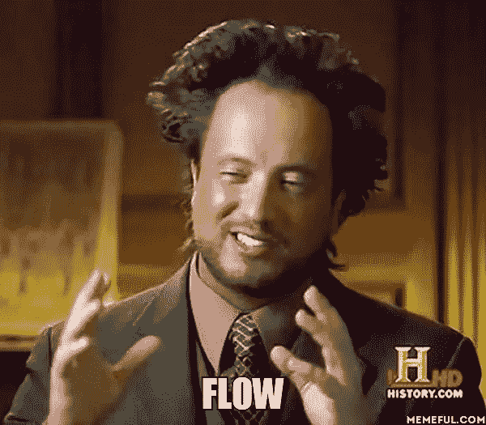
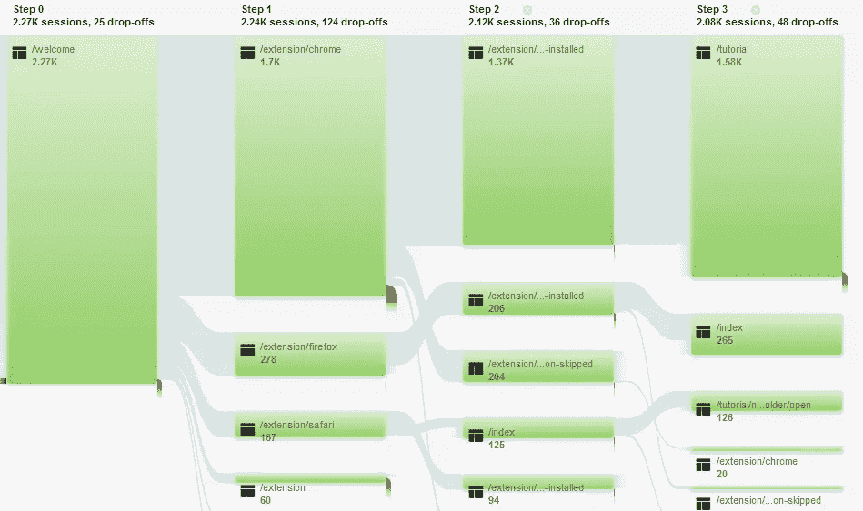
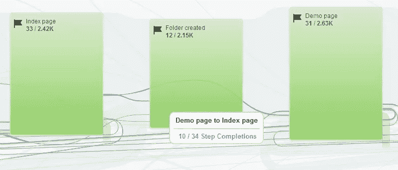
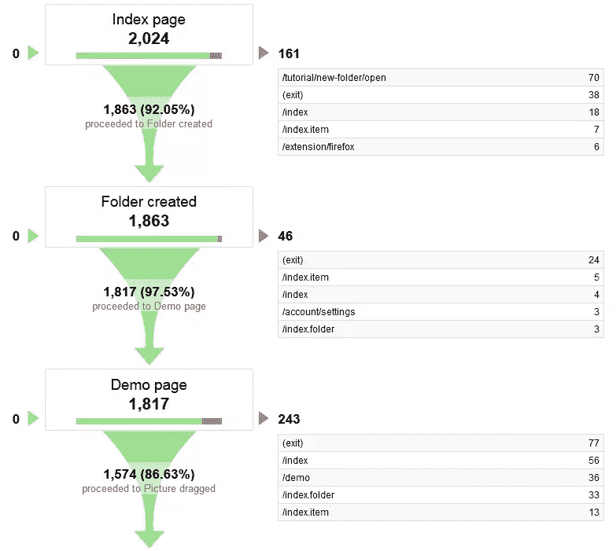
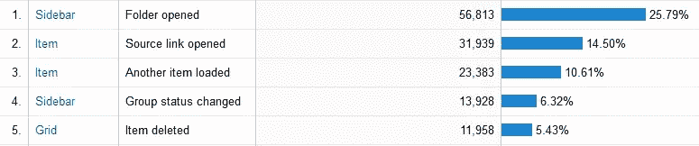
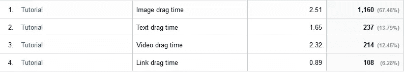

# 使用谷歌分析进行 UX 研究的 5 种方法

> 原文：<https://www.sitepoint.com/5-ways-use-google-analytics-ux-research/>

[](https://www.flickr.com/photos/75001512@N00/717223703/)

照片:Joelk75

当用户在你睡觉的时候访问你的网站时，你会不会有一种轻微的痛苦感——就像你去买牛奶的时候把一个小孩单独留下了？

让我们面对现实吧——你真的不知道他们在做什么。他们迷路了吗？他们被困在哪里了吗？他们正在做家务吗？

我有时候就是这种感觉。你的用户经常会被误导、迷路或者根本不知道他们在你的网站上做什么。更重要的是，他们可能会因为做出错误的决定(例如删除他们的一些重要数据)而打破一些东西或伤害自己。

我是 Dragdisbuild 团队的一员，这是一个专门帮助创意专业人士收集和组织灵感的工具。如果你是为经验丰富的创意专家设计，你需要仔细考虑*尤其是*交互，让每一个使用场景都完美。

我们喜欢说"*你的道路必须畅通*"



事实是，不管你的 UX 决策有多好的研究，都不可能预测所有可能的用例。所以，我们需要尽早获得用户行为反馈，以做出适当的设计调整。

此外，如果你正在创业，你的目标是尽快关闭精益 UX 的反馈回路。

因此，在这篇文章中，我将介绍如何从你推出设计的那一刻起就获得关于你的 UX 的反馈(统计数据)。

## 为什么选择谷歌分析

虽然谷歌分析被广泛认为是一个营销工具，但它提供了一个强大的功能集，对于任何需要即时洞察力的 UX 研究人员来说，这可能是一个拯救，而无需添加新的工具层。

以下是我们最终选择 GA 作为主要 UX 研究工具的原因:

*   虽然大多数 UX 工具会占用您的预算，但基本 GA 帐户是免费的。没有必要支付额外费用，因为免费数据对我们来说已经足够了。
*   GA 提供的灵活性几乎是无限的。你可以设置它来观察使用趋势，行动，跟踪错误…太多了，这里无法列出。这真的取决于你提取答案的需要。
*   数据的可视化是理解数据的最佳方式之一。GA 允许您以多种方式分割数据，然后在各种图表中显示。
*   部署起来很简单。粘贴一小段 JavaScript 代码，就可以开始了。

当然，GA 也不是万能的。可用性测试过程中需要非现场数据的任务，如眼球追踪或观察，将需要使用其他 UX 工具进行。

## 遗传算法跟踪结构基础

在开始使用 GA 进行用户分析之前，您应该熟悉 GA 跟踪的基本级别。在您的 GA 中，您可以有多个帐户、属性和视图:

*   最顶层是*‘账户’*。你应该用这个来区分你想要跟踪的**单个项目**或网站，比如 example.com 或 test.org
*   *属性*为您提供了一种**将关注点分离到单个项目**中的方法。假设 example.com*有一些*公共页面*用于获取用户，有*内部页面*用于已经注册的用户。这些应该成为单独的属性，因为它们有不同的用途。通过这种方式，你的用户流和指标将保持清晰和明确。*
*   *视图*只是数据分离的另一个层次。如果你想让**过滤和额外处理**来自你的网站的输入数据来查看不同的上下文，这是很有用的。

> 提示:如果你的网站为不同的用户群*(例如注册用户和新访客)*提供不同的部分，你应该**总是**将它们分成不同的 GA 属性——否则你会看到不准确的转化率。

## 要跟踪的事物

当您设置 GA 或配置报告时，首先您应该清楚地知道您想要发现什么。以下是进行基本 UX 分析所需的 5 个最简单的追踪要素。

### 1.标准的页面浏览量跟踪

默认情况下，GA 为您提供标准的跟踪代码，观察您的用户如何导航，以及一些并行数据，告诉您用户的一些细节(例如，他们使用的技术，他们如何到达您的网站)。基本跟踪允许您回答这些简单的问题:

*   用户从哪里进入，又从哪里离开你的网站？
*   他们通过什么途径穿过你的网站？
*   他们用了什么技术*(手机还是桌面，屏幕分辨率，OS 等等……)*？

由于标准跟踪更面向营销，通常你可能只会从它那里得到肤浅的见解，因为它只跟踪实际的页面，而不是我们想要了解的用户互动。

然而，我们可以很容易地使它更强大，通过使用虚拟页面点击来增加跟踪代码，从而更详细地观察用户行为。“虚拟页面点击”意味着每次用户执行你想要跟踪的动作时，你必须通过调用跟踪功能来手动设置 GA。

例如，如果你想知道你的用户是否正在打开一个特定的标签页或者加载另一个没有重新加载你的整个页面的图库项目，你可以在你的 JavaScript 中添加一行代码，告诉 g a 将特定的交互作为页面点击来跟踪。

```
ga('send', 'pageview', '/your-custom-pageview');

```

### 2.行为流

当你建立你的页面时，你得到的闪亮的新珍珠是**行为流**(在*行为*部分下)。这是一份大会报告，确切地告诉你*你的用户如何浏览你的网站。*

该特定报告有助于:

*   分析用户在你的流程的某一点上的行为
*   查看用户采取特定步骤或访问特定页面之前/之后发生的事情
*   调查用户执行不同交互的精确顺序
*   隔离用户是否正在采取任何不必要的步骤，或者出于任何原因返回到以前的状态
*   确定场景中的哪些步骤最容易失败(当用户的行为不符合您的预期时)

一旦你进入这个新的报告，选择视图类型*“自动分组页面”*，你会看到你所有的用户流，如下图所示。如果您点击特定页面(或步骤)，您将能够突出显示通过该页面的流量——或者甚至将其设置为所有可视化的开始参考*(菜单选项探索通过此处的流量)*



### 3.漏斗太棒了

漏斗和目标是为观察你最敏感的数据而设计的功能——你的网站“如果”和“如何”实现它的目的。

GA 中的目标通常代表你的网站目标(销售转化是一个常见的目标)，而 T2 漏斗是你的用户为实现目标而采取的一系列预定义的步骤。

在 GA 的*管理*部分为每个视图单独设置目标。换句话说，对于同一个网站，你可以在不同的环境中有不同的目标。例如，一个时事通讯订阅页面与你的结帐有不同的目标。

一开始，你应该为你网站的每个目标设定目标，比如*“订单完成”*或*“用户注册”*。这将告诉 GA 如何计算转换，并将提供良好的性能报告。

另一方面，漏斗是真正的宝藏。您可以为每个目标定义多达 20 个步骤，然后分析每个步骤的绩效。这是一些细粒度的控制！

每一步都代表一次页面点击或虚拟页面点击，它只受你想象力的限制。但是一般来说，最佳实践是在用户能够放弃场景的任何地方创建一个漏斗步骤。

您应该使用目标和漏斗来:

*   跟踪您的油井网站如何完成其目标
*   找出场景中失败的地方
*   监控场景的整体性能

一旦你设定了目标，你就可以在*转换*部分使用报告。**目标流程**报告将为你提供与*行为流程*相同的见解，尽管是从目标完成的角度。在这里，您将能够分析用户如何在漏斗步骤之间跳跃，并看到他们在哪里离开您的漏斗或跳回它。

这使得更容易发现场景逻辑中的缺陷，并容易识别用户迷失的断点。



另一个强大的报告是**漏斗可视化**，您将在单一视图中看到您的所有漏斗表现——它将显示每个步骤的有效程度(有多少用户成功通过该步骤达到目标),以及如果用户在特定步骤离开您的漏斗，他们会去哪里。



*漏斗可视化*与*目标流程*的不同之处在于，*漏斗可视化*在用户跳过步骤时报告“填充”步骤，并将漏斗表示为直接的场景。*目标流程*报告显示了用户实际上是如何在步骤之间导航的。

> 提示:如果您的漏斗步骤显示 0%(无用户通过)或 100%(所有用户通过)转化率，可能是您的漏斗设置有问题。每一步至少应该有一些传球和一些转身，转化率最低的步骤清楚地表明你应该在哪里提高你的 UX。

### 4.你的用户在磨什么特性

如果你想创造流畅的用户体验，细节和微交互非常重要，尽管你不能以浏览量的形式跟踪它们，因为这会干扰和扰乱行为流报告中的数据。这里 GA 事件跟踪助一臂之力。

GA 中的 Events 表示用户正在采取的独立操作，因此跟踪诸如上下文菜单打开或列表视图更改之类的交互是完美的。所有事件都是自定义的，每个事件都有 4 个属性，由您自己定义:

*   类别只是为了方便而对事件进行分组的值(例如，索引页面事件；入职活动)
*   动作是一个代表事件本身的简称，在这里你应该具体说明
*   标签(可选)用户跟踪附加文本数据
*   Value(可选)用户跟踪可在自定义报告中用作指标的附加数字数据

> 提示:用过去式动词命名事件动作，有助于创建更直观、可读性更强的报告。例如“点击设置图标”、“通知取消”

要跟踪一个事件，您需要添加不同的代码行，类似于浏览量跟踪。例如:

```
ga('send', 'event', 'Category', 'Menu click', 'Menu item title', 100);

```

可以在*行为- >事件*部分下访问所有事件报告。这里最有用的报告是**顶级事件**，在这里你可以看到你的用户通常执行什么动作。

> 提示:如果您想在一个平面中查看所有列出的事件，只需选择*事件动作*作为您的第二个维度，如果您选择按**性能**查看表格，则可以直观地表示每个动作的强度。



### 5.时机很重要

在 UX，时间经常被忽略，但是有时候你需要记录时间。通过测量时间，你可以确定用户是否遇到了阻碍，或者发现自己无法完成给定的任务。

此方法将帮助您回答以下问题:

*   用户在你的网站上达到目标的速度有多快？
*   给定的操作或动作需要多长时间？
*   你的网站有哪些点让用户等待？
*   哪些微交互比较混乱或者比其他的需要更多的时间？

为了给你提供这些问题的答案，GA 实现了一个叫做**用户计时**的特性。这是另一种定制点击类型，旨在测量时间——事情在你的网站上花费的时间。

也许与直觉相反，GA 本身并没有**而不是**提供计时功能，所以诀窍是你需要通过你所拥有的*(例如 javascript 中简单的时间戳比较)*的任何方式来测量时间。之后，只需在您的自定义点击跟踪代码中提供计时数据，其中您必须指定 4 个参数:

*   类别只是一个用于对定时事件进行分组的值(与简单事件相同)
*   代表事件本身的简称
*   以毫秒计的时间
*   标签(可选)用户跟踪附加文本数据

```
ga(‘send’, ‘timing’, ‘Category’, ‘Watched video for’, 1000, ‘Some custom text’);
```

您将能够在*行为- >站点速度*部分下的**用户计时**报告中分析所有您跟踪的计时。与事件报告相同，如果您选择*计时变量*作为第二个维度，您将能够在单一视图中看到您的所有计时事件。



## 那么从哪里开始呢？

总的来说，这 5 个特征基本上可以为你收集一个数据宝库，但最终重要的是你如何去分析它。你不必实现所有这些跟踪功能，因为*你可以*

把它们当做回答问题和收集反馈的工具就好了。就从一个需要答案的问题开始，看看 GA 报告能教会你什么。

## 分享这篇文章