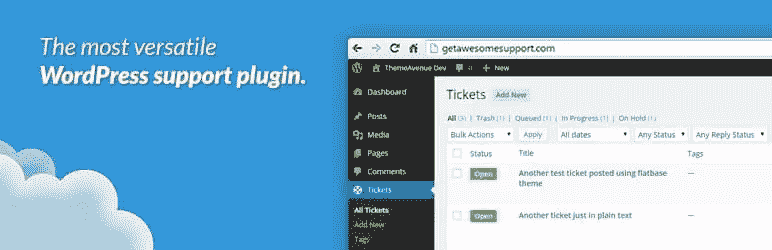
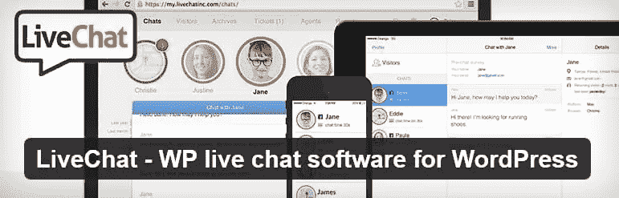
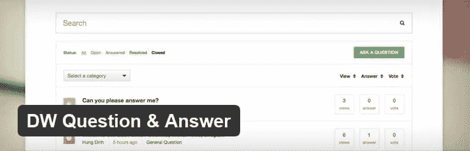

# 使用 WordPress 提供卓越客户支持的 5 种方法

> 原文：<https://www.sitepoint.com/5-ways-use-wordpress-provide-exceptional-customer-support/>

本文是与 SiteGround 合作创作的系列文章的一部分。感谢您对使 SitePoint 成为可能的合作伙伴的支持。

无论你是开发网络应用，销售 WordPress 插件和主题，还是经营网上商店，提供强大的客户支持是成功的关键。做得好，你会有满意的顾客，并使你从竞争对手中脱颖而出。做得不好，它会反过来咬你。

让支持变得简单。开发一个全面的系统，为您的用户提供多种联系方式，并在可接受的时间框架内对支持请求做出响应。目标是超越他们的期望。这是支持成功的一个经验证的公式。例如，我们的合作伙伴 SiteGround 坚持这样做，每年他们的[满意度都超过 96%](https://www.siteground.com/blog/2016-client-survey/) 。

你是怎么做到的？

WordPress 为你的支持系统提供了一个很好的平台。有超过 10，000 个与支持相关的插件,使您能够设置票务系统、实时聊天、支持论坛、常见问题等。一些插件就能做很多事情。

但是 10，000 个插件是很难通过的。在本文中，我们将为您带来五个类别中的最佳插件——我们推荐的插件被用户广泛使用并给予高度评价。

您可能不想在您的支持系统中实现所有五个类别。当你通读这篇文章的时候，想想哪一个对你的生意最有意义。

## 1.一体化支持插件

这里有一种方法可以简化你的支持系统。与其为每个策略选择不同的插件，不如安装一个覆盖所有基础的插件。

### [强大的支持——WordPress 帮助台&支持插件](https://wordpress.org/plugins/awesome-support/)

*   费用:基本插件免费，扩展插件单独或捆绑出售(199 美元起)
*   活跃安装数:5，000 以上
*   评分:4.5 分(81 条评论)

这个全面的插件将会做除了聊天之外的所有你需要的事情。基本的功能是免费的，但是一些你想要的功能是要付费的。

> Awesome Support 是 WordPress 最通用、功能最丰富的支持插件。这是三年多工作、研究和改进的结果。这些特性是对用户要求一个可靠的、基于 WordPress 的帮助台的回应，这也是它最棒的地方！

该免费插件的功能包括:

*   票务:用户可以从前端提交票，而你的代理从 WordPress 后端对它们做出响应。
*   电子邮件通知:通过可定制的电子邮件通知各方某些操作。
*   文件上传:您可以控制文件上传的时间、数量和大小。
*   多种产品:为您想要的任意多种产品提供支持。
*   多个部门:为多个部门提供支持。
*   条款和条件:在用户打开票证之前，要求他们同意您的条款和条件
*   旧票:使用标签快速识别旧票
*   分类和过滤:包括一个惊人的灵活的分类，过滤和标签系统
*   优先化你的方式:创建你自己的优先方案——你不必被 1-5 个优先方案所束缚！
*   时间跟踪:包括基本的时间跟踪！管理员甚至可以调整时间，所有时间更改都直接记录在票证中。

流行的高级扩展:

*   电子邮件管道:仅使用电子邮件回复票证并进行协作。
*   WooCommerce:你的 WooCommerce 商店和强大支持之间的桥梁。
*   预设回复:对常见问题的预配置回复。
*   重力表单:创建自定义的票证表单。
*   满意度调查:自动收集调查反馈，对您的代理在票据上的表现进行评级。
*   常见问题:强大的常见问题管理使您的代理更有效率。
*   通知:通过 pushbullet 获得 slack 中重要事件的通知。通过电子邮件通知第三方重要的票证事件。

其他受欢迎的支持插件包括 [Zendesk 对 WordPress 的支持](https://en-au.wordpress.org/plugins/zendesk/)和 [WP MUDEV 支持系统插件](https://premium.wpmudev.org/project/support-system/)。

## 2.通过票证提供支持

票务系统可能会成为你的支持系统的核心。这是在复杂问题上给予支持的最佳方式——它让你跟踪进展和澄清问题，优先处理工作，并系统地解决它们。它让每个人都了解情况，也提供了过去如何处理问题的资源。这是一个插件的巨大价值！

### [WP 支持加响应票系统](https://wordpress.org/plugins/wp-support-plus-responsive-ticket-system/)

*   费用:免费，可单独或捆绑购买专业附加软件(99.99 美元起)
*   活跃安装数:9，000 以上
*   评分:4.7 分(149 条评论)

> 这个插件为 WordPress 增加了一个完整的票务系统的功能，具有 100%的响应能力和 100%的 Ajax 功能。这允许用户提交票证来报告问题或获得任何您想要的支持。用户可以设置每个票证的状态、优先级和类别。

特点:

*   无限票提交。
*   每张票据的优先级、状态、类别选择。
*   票证的多文件附件。
*   将票证分配给代理。
*   基于座席的票证统计。
*   与所有 WordPress 主题的平滑集成。
*   常见问题功能。
*   为支持人员添加注释，以便在支持团队中保留私人注释(对客户隐藏)。
*   代理回答常见问题的录音回复。
*   用于编辑电子邮件内容的电子邮件模板。

Pro add-ons:

*   票的电子邮件管道。
*   Woocommerce 整合。
*   轻松的数字下载集成。
*   票的 CSV 导出。
*   公司或用户组。
*   计时器(计算车票花费的时间)。
*   google 日历事件。
*   高级录音回复。

其他流行的抢票插件还有 [WSDesk](https://wsdesk.com/) 和 [WPHelpDesk](https://wphelpdesk.com/) 。

## 3.通过实时聊天提供支持

我们生活在一个聊天的时代，许多人发短信比拿起电话更舒服。它也是客户支持的一个很好的媒介，特别是对于不太复杂的问题，或者您想帮助用户自己完成工作的情况。

### [live chat–用于 WordPress 的 WP 实时聊天软件](https://wordpress.org/plugins/wp-live-chat-software-for-wordpress/)

*   费用:免费，带专业插件(39.95 美元起)
*   活跃安装次数:30，000 次以上
*   评分:4.6 分(共 341 条评论)

> 最划算的实时聊天插件。免费与您的访客聊天！WP 实时聊天支持非常适合小型企业。不需要第三方连接。为了更好地了解您的访问者，无需支付实时聊天月费。这是一个全功能的实时聊天插件。当你的访问者准备好使用 WP 实时聊天支持时，通过直接与他们交流来提高你的转化率。

该免费插件的功能包括:

*   无限制的同时实时聊天。
*   直接与您的访问者进行实时聊天。
*   用户可以在页面上拖动实时聊天框。
*   更改实时聊天框的颜色。
*   完全响应的管理聊天仪表板。
*   离线消息被存储。
*   访问历史实时聊天记录。
*   兼容翻译插件。
*   谷歌分析集成。
*   当您不在线时，创建自定义的脱机邮件表单。
*   在聊天之前或之后，将调查或投票添加到您的聊天框中。
*   匿名访问。
*   不需要每月实时聊天订阅。
*   允许实时聊天框自动弹出。
*   查看您可能错过的任何实时聊天。
*   启用/禁用移动设备上的聊天框。
*   根据 IP 地址禁止访问者与您聊天。

专业功能包括:

*   无限的实时聊天代理。
*   发起与在线访问者的实时聊天。
*   快速响应(在您的实时聊天框中插入预定义的响应)。
*   数据触发器(时间触发器、滚动触发器、页面触发器、页面离开触发器)。
*   报告(聊天统计、热门页面、投资回报跟踪和报告、客户满意度)。
*   每个聊天会话的客户满意度评分。
*   投资回报跟踪。
*   加密您的实时聊天对话。
*   完全响应的管理聊天仪表板。
*   将聊天转移给其他代理。
*   部门。
*   设置您的用户配置文件。
*   支持。

现在，您可以选择在自己的网站(使用自己的资源)或 live chat 的服务器(使用他们的资源)上主持您的实时聊天。后者将提高您的聊天性能高达 300%，并减少主机上的负载。

其他流行的实时聊天插件还有 [Zendesk Chat](https://wordpress.org/plugins/zopim-live-chat/) 、[蒂迪奥实时聊天](https://wordpress.org/plugins/tidio-live-chat/)和[Chat——实时聊天支持销售](https://wordpress.org/plugins/chats/)。

## 4.通过全面的常见问题提供支持

在用户需要联系您之前，为他们提供解决自身问题所需的信息和资源。他们自己能解决的问题越多，你的支持系统承受的压力就越小。首先是详细的常见问题部分。

### [终极常见问题解答](http://www.etoilewebdesign.com/plugins/ultimate-faq/)

*   成本:30 美元起(含 6 个月支持的单一站点终身许可证)
*   活跃安装次数:10，000 次以上
*   评分:4.4 分，5 颗星(54 条评论)

> FAQ 插件可以让你创建 FAQ，组织 FAQ，并通过你的 WordPress 管理面板发布你的 FAQ。从多种常见问题样式和常见问题布局中进行选择。您可以使用切换 FAQ 和/或折叠 FAQ 样式，在单击时显示一个扩展的 FAQ 答案，或者选择在页面加载时显示所有 FAQ，可选的列表 FAQ 样式提供更传统的 FAQ 布局。

免费插件的特性:

*   无限的常见问题，无限的常见问题标签和无限的常见问题类别支持。
*   创建常见问题类别。
*   创建常见问题帖子并为其分配类别。
*   AJAX 常见问题搜索表单。
*   将所有常见问题导出为 PDF，以创建用户手册。
*   插入自定义 CSS 来设计你的 FAQ 帖子。

其他流行的 FAQ 插件包括 [FAQ Manager](https://wordpress.org/plugins/wordpress-faq-manager/) 、 [HTML5 响应式 FAQ](https://wordpress.org/plugins/html5-responsive-faq/) 和 [FAQ](https://wordpress.org/plugins/faq-responsive/) 。

## 5.通过论坛扩大您的支持

一个论坛不仅能让你的用户提问，还能帮助他们回答问题。它还提供了一个有用的参考，在那里他们可以找到他们的问题的答案，假设他们以前被问过。

论坛是灵活的。他们可以处理产品问题(就像你在亚马逊或易贝上看到的那样)以及支持问题。“棘手问题”功能可以作为一个适当的常见问题。事实上，根据您的业务，论坛可能是您需要的唯一支持解决方案。

### [DW 提问&回答](https://wordpress.org/plugins/dw-question-answer/)

*   费用:免费
*   活跃安装次数:10，000 次以上
*   评分:4.1 分(97 条评论)

这个论坛插件是为自上而下的支持而设计的。虽然不像下面列出的一些选择那样受欢迎或排名靠前，但它是支持论坛的一个很好的选择。

> DW 问答是一个 WordPress 插件，它为你的 WordPress 站点建立了一个完整的问答系统，像 Quora 或 Stackoverflow。该插件支持多语言，短代码，reCAPTCHA，电子邮件通知系统等。

特点:

*   提交/过滤/排序/编辑/删除问题。
*   回答和评论问题。
*   投票选出最佳答案。
*   电子邮件通知系统。
*   通过关键字进行即时搜索。
*   支持验证码。
*   私人/公共问答。
*   问题/答案遵循功能。
*   棘手的问题。

其他流行的直播论坛插件还有[论坛——WP foro](https://wordpress.org/plugins/wpforo/)、 [bbPress](https://wordpress.org/plugins/bbpress/) 和[阿斯加洛斯论坛](https://wordpress.org/plugins/asgaros-forum/)。

## 分享这篇文章