# 2020 年具有真正持久力的 5 个网页设计趋势

> 原文：<https://www.sitepoint.com/5-web-design-trends-for-2020-with-real-staying-power/>

*这篇赞助文章由我们的内容合作伙伴 [BAW 媒体](https://bawmedia.com)创作。感谢您对使 SitePoint 成为可能的合作伙伴的支持。*

新年的开始总是令人兴奋的时刻。每个人都承诺要变得更好，感觉更好，做得更好。但是就像许多新年决心很快被抛到一边或被遗忘一样，时尚类的网页设计趋势也有类似的趋势。

这是因为人们很容易沉迷于现在很酷的东西，而不是专注于我们能做些什么来使一个网站日益强大。

## 5 个真正有持久力的网页设计趋势

看看 [BeTheme](https://themes.muffingroup.com/be/splash/) 和它的 500+预建网站。这些干净而经典的设计具有真正的持久力。

这是因为它们围绕着强有力的设计原则。不是华而不实的调色板，时髦的字体选择，或者你的用户没有准备好或者不需要的技术。这是关键，对吗？

你在为最终用户建立网站，而不是为你自己。

花时间使用来来去去的网页设计趋势对你的访问者几乎没有任何影响。你可以利用这些久经考验、久经考验的网页设计趋势…

## 趋势 1:去掉多余的内容，创建一个超级最小化的导航

网络向移动优先体验转变的一个令人敬畏的优势是，在桌面上浏览网站也变得更简单、更容易导航。

随着越来越多的消费者通过智能手机上网，网站菜单不得不缩小尺寸。不仅在它们所包含的空间方面，而且在链接的数量方面。

从 2020 年开始，网站的主菜单中将只有最重要的页面。二级链接将被降级到页脚和侧边栏等区域。因此，这将有助于清理页面上的设计。它们不会到处都是指向内页的行动号召按钮。

[BeRepair 预制场地](https://themes.muffingroup.com/be/repair3/?utm_source=sitepoint.com&utm_medium=content&utm_campaign=jan20)就是一个很好的例子。它的导航隐藏在汉堡菜单图标下:

[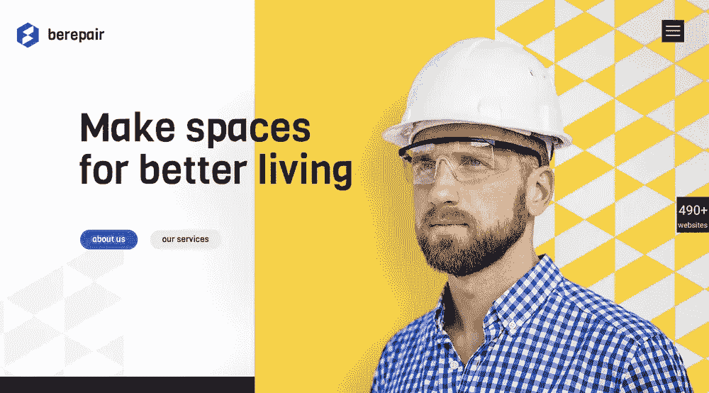](https://themes.muffingroup.com/be/repair3/?utm_source=sitepoint.com&utm_medium=content&utm_campaign=jan20)

打开时，弹出菜单遵循少即是多的趋势。它有一个简短且易于导航的链接列表，由一堆空格包围:

[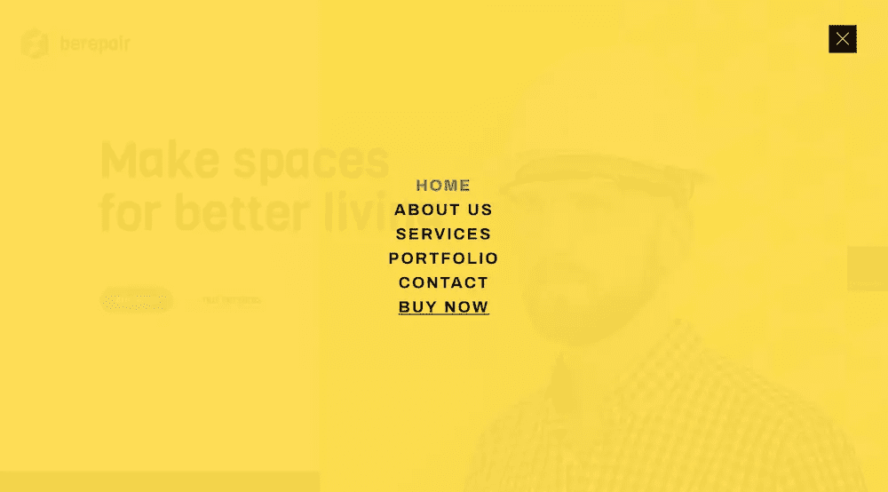](https://themes.muffingroup.com/be/repair3/?utm_source=sitepoint.com&utm_medium=content&utm_campaign=jan20)

非传统导航也可以从这种形式的极简主义中受益。 [BeGarden](https://themes.muffingroup.com/be/garden4/?utm_source=sitepoint.com&utm_medium=content&utm_campaign=jan20) 用它的左对齐菜单演示了这一点:

[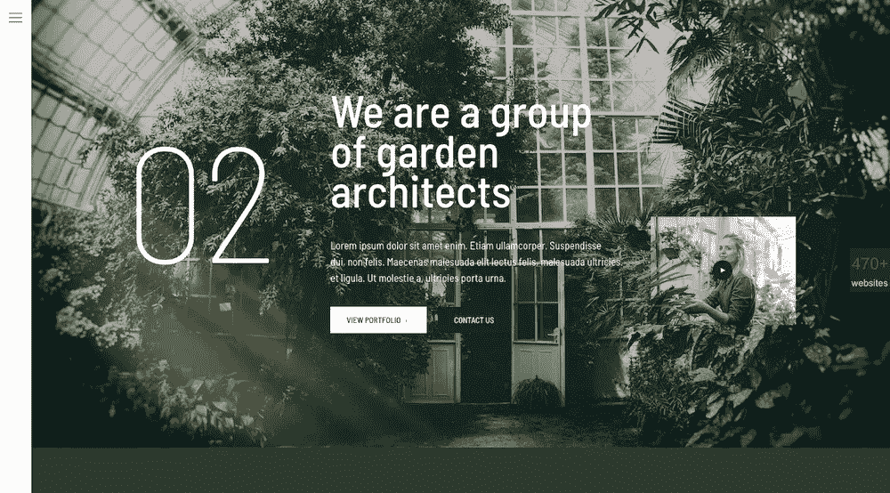](https://themes.muffingroup.com/be/garden4/?utm_source=sitepoint.com&utm_medium=content&utm_campaign=jan20)

## 趋势 2:用空白让你的信息更加集中

用户每次访问互联网时，都会被内容、优惠和其他令人分心的事物弄得超负荷。你真的希望你的网站成为又一个让他们感到压力，进而犹豫不决的东西吗？

当你设计留白的时候，它会让你摆脱试图将尽可能多的信息和尽可能多的选项放入一个部分或页面的习惯。相反，它鼓励你少花钱多办事。

简洁的信息+开阔的空间=有利于你的转化率。

举个例子，在 [BeWine](https://themes.muffingroup.com/be/wine2/?utm_source=sitepoint.com&utm_medium=content&utm_campaign=jan20) 的底部，有一个简短但功能强大的视频横幅:

[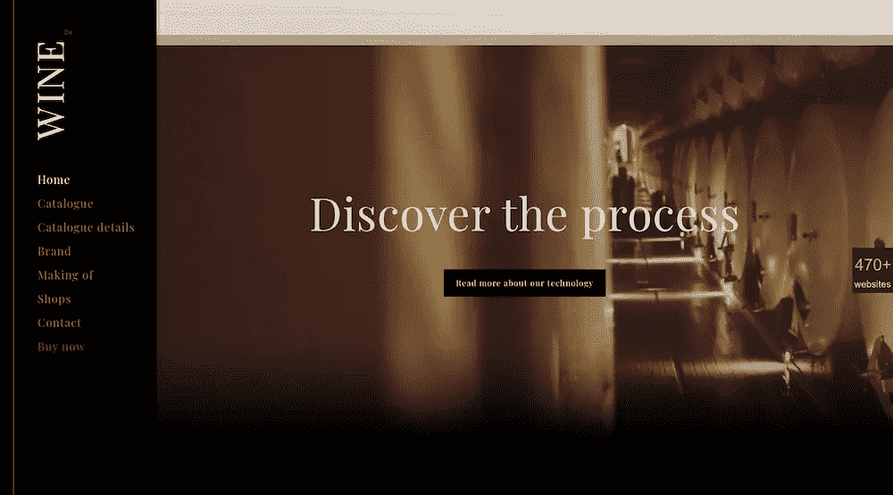](https://themes.muffingroup.com/be/wine2/?utm_source=sitepoint.com&utm_medium=content&utm_campaign=jan20)

你可以找到其他方式让强烈而简单的图像讲述你的品牌故事，就像 [BeWeddingPlanner 网站](https://themes.muffingroup.com/be/weddingplanner/?utm_source=sitepoint.com&utm_medium=content&utm_campaign=jan20)所做的那样:

[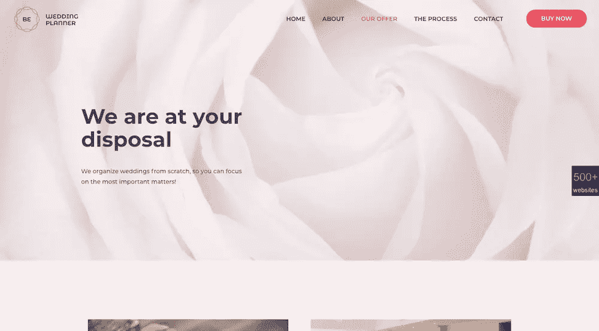](https://themes.muffingroup.com/be/weddingplanner/?utm_source=sitepoint.com&utm_medium=content&utm_campaign=jan20)

## 趋势 3:给访问者一张可以交流的人脸

你的网站或品牌服务于谁并不重要。它可以是博客读者、在线购物者或寻找新软件的商业客户。他们在寻找忠诚的品牌。

对一家公司的忠诚不仅会减少他们的工作。这让他们放心，因为他们知道每次都能获得高质量的产品或结果。

有时候你并不负责塑造公司的产品。但是你向世界展示网站的方式会影响访问者最初的感受。

因此，不要使用数字构建的设计，在你的网站中集成更多的人脸和真实世界的物体。与潜在客户建立关系的最佳方式是让他们觉得他们是在与某人互动，而不是与 T2 互动。

即使对于从事销售业务的公司来说，给你的图片注入一些活力也有助于提高访问者与你网站的联系。

例如，BeEcoFood 用这个充满活力的标题给它的网站增添了温暖:

[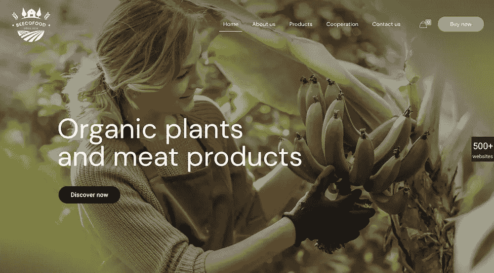](https://themes.muffingroup.com/be/ecofood/?utm_source=sitepoint.com&utm_medium=content&utm_campaign=jan20)

becate ing 也很好地为其产品增加了人情味。(这是现实世界中必不可少的东西，但往往不如食物重要):

[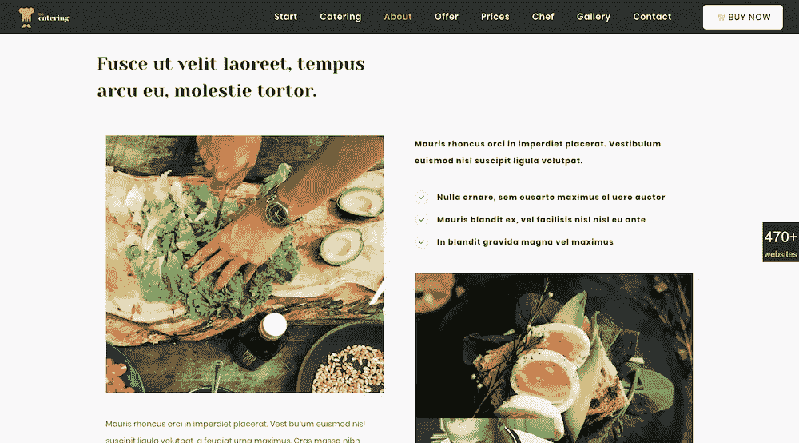](https://themes.muffingroup.com/be/catering2/?utm_source=sitepoint.com&utm_medium=content&utm_campaign=jan20)

## 趋势#4:用普遍接受的版式创造一致的体验

在过去的几年里，我们已经看到大量的网站在玩装饰性的字体设计，特别是为了引起怀旧的感觉。然而，这样做的问题是，许多创造性的字体并不能很好地在所有设备上翻译。

你花了这么多时间来创建你的网页设计，那么你为什么允许你的访问者的浏览器或设备最终选择他们将在你的网站上看到的备份字体呢？

随着我们进入 20 世纪 20 年代，我们将会看到更多的网站在排版上更加安全。首先，它允许在所有设备上获得更一致的体验。这对你网站的表现也有好处。

此外，通过使用网页安全衬线和无衬线字体，你可以在其他元素上投入你的创造力。就像 [BeParty](https://themes.muffingroup.com/be/party2/?utm_source=sitepoint.com&utm_medium=content&utm_campaign=jan20) 网站上的这个动画:

[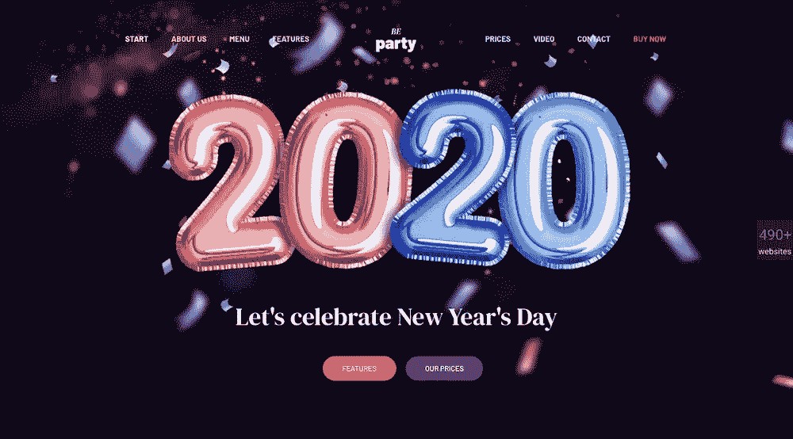](https://themes.muffingroup.com/be/party2/?utm_source=sitepoint.com&utm_medium=content&utm_campaign=jan20)

或者你可以像 [BeTheme](https://themes.muffingroup.com/betheme/?utm_source=sitepoint.com&utm_medium=content&utm_campaign=jan20) 一样，简单地从上到下专注于创造一个引人注目、令人印象深刻的设计:

[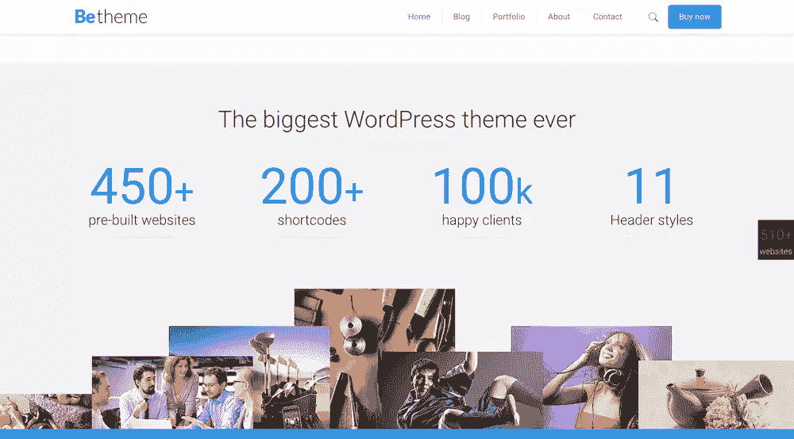](https://themes.muffingroup.com/betheme/?utm_source=sitepoint.com&utm_medium=content&utm_campaign=jan20)

## 趋势 5:拥抱黑暗模式

这是一个较新的网页设计趋势，但它已经显示出了很大的持久力。只要看看你自己的移动设备，你的应用程序(甚至设备本身)有多少黑暗模式选项。

许多研究表明，当在弱光环境下观看和阅读较小的文本时，黑暗模式对眼睛更友好。消费者——尤其是手机用户——没有显示出减少看屏幕时间的迹象。**所以，这么多人对黑暗模式**赞不绝口也就不足为奇了。

因此，许多网页设计者正在转向深色模式风格的调色板，即使只是用于网站的关键部分。

从长远来看，为了创建一个更加用户友好的网站，网站可能会在正确的环境下变得更黑暗，就像 [BeBoxing](https://themes.muffingroup.com/be/boxing/?utm_source=sitepoint.com&utm_medium=content&utm_campaign=jan20) 简洁但强大的英雄形象所做的那样:

[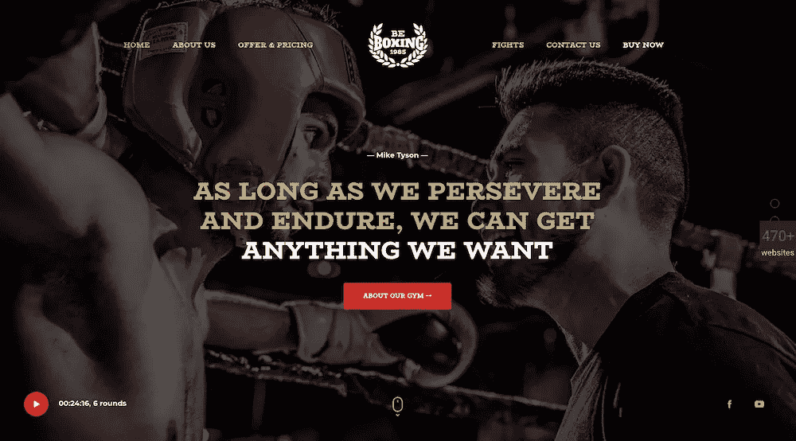](https://themes.muffingroup.com/be/boxing/?utm_source=sitepoint.com&utm_medium=content&utm_campaign=jan20)

此外还有 [BeHosting](https://themes.muffingroup.com/be/hosting3/?utm_source=sitepoint.com&utm_medium=content&utm_campaign=jan20) ，它使用更富戏剧性的调色板来吸引人们对其关键信息的注意，就像主页上的这个:

[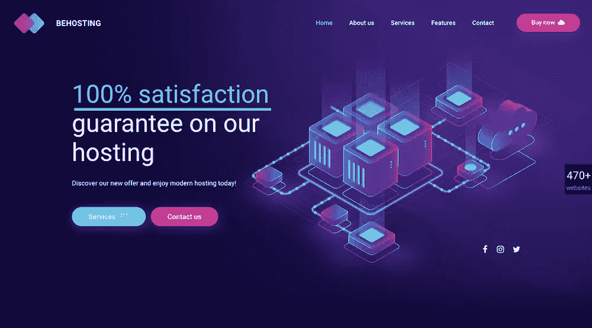](https://themes.muffingroup.com/be/hosting3/?utm_source=sitepoint.com&utm_medium=content&utm_campaign=jan20)

价格表中还有另一个很好的例子，生动、深色的调色盘被用来引起人们对最佳价值计划的注意，而无需明确指出:

[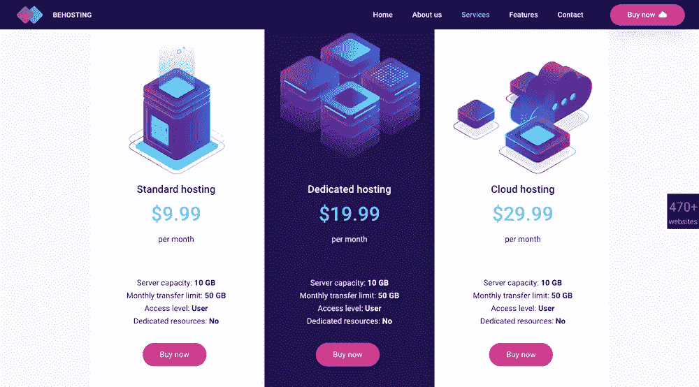](https://themes.muffingroup.com/be/hosting3/?utm_source=sitepoint.com&utm_medium=content&utm_campaign=jan20)

## 今年你会采纳哪些网页设计趋势？

作为一名网页设计师，关注流行趋势对你最有利——但不要在网页设计趋势上花费太多精力，这些趋势肯定会成为时尚。在有意义的时候使用它们并没有错，只要你致力于在它们过时的时候换掉它们。

但是，如果你的目标是建立更强大的网站，你的重点需要放在设计具有真正持久力的趋势上。正如我们在这篇文章中看到的，你可以通过 BeTheme 的 500 多个预建网站中的任何一个[轻松地将这个目标变成现实。](https://themes.muffingroup.com/be/splash/)

## 分享这篇文章