# 5 个 WordPress 框架来启动你的主题设计

> 原文：<https://www.sitepoint.com/5-wordpress-frameworks-to-jumpstart-your-theme-designs/>

SitePoint 的最新版本，包含了你为世界上最受欢迎的在线出版平台创建令人惊叹的主题所需要知道的一切。为了让你体验一下里面的内容，我们将第 1、4 和 5 章作为[的免费样本 PDF](https://www.sitepoint.com/premium/library) 提供。这篇文章摘自第 4 章的第一部分，是关于使用主题框架来加速主题开发的越来越受欢迎的选择。如果你想要更多，你可以[从 SitePoint 直接](https://www.sitepoint.com/premium/library)购买整本书，既可以是印刷书，也可以是数字包(包含 PDF、MOBI 和 EPUB 格式)。

精明的开发人员知道，重新发明轮子是傻瓜才会做的事情，当你想以正确的方式开始时，在框架之上构建通常会更快更容易。PHP 开发者有 CakePHP 或 CodeIgniter 这样的框架；Ruby 极客有 Ruby on Rails。NET 开发者有 ASP.NET。WordPress 主题社区也不例外——主题开发框架的出现使你创建自己的主题变得更加简单。

WordPress 主题开发框架看起来就像普通的主题——我们敢说，甚至有点无聊——但是在它们朴素的外表下隐藏着强大的功能，可以作为你自己的主题开发的脚手架。在这一章中，我们将看看为什么框架是一个如此好的想法，如何为你选择最好的主题框架，以及如何用我们自己的风格和定制功能来扩充框架。

## 为什么要使用框架？

我打赌你很忙，对吗？你可能也很兴奋尽快开始你的主题开发。随着你的主题事业的发展，你会感激任何能帮你节省时间的事情。主题开发框架让你的生活变得更加简单。

框架提供了标记、功能元素，通常还有一些基本的 CSS，所有这些都可以作为你自己主题的基础。对于初学者来说，使用框架意味着你可以花更少的时间编写代码，更多的时间专注于你的设计。这也是了解 WordPress 主题是如何组合在一起的一个很好的方式，尤其是如果你对 PHP 相当陌生的话。

稍后，一旦你成为世界知名的 WordPress 主题摇滚明星，你会发现使用框架节省了你的时间:你将花更少的时间做每个主题需要的重复工作，更多的时间在你最新杰作的细节上。

## 儿童主题:建立在框架上的聪明方法

回到过去，如果你想修改 WordPress 主题的输出，你必须直接编辑主题。很少有机会在不改变模板文件的情况下改变主题的标记或功能。如果你开始的主题被升级了，那么你必须花时间仔细地将你的改动整合到最新更新的原始主题中——这几乎不是最有效的利用你的时间。

WordPress 2.7 改变了这一切，它引入了*子主题* 的概念——一个扩展了另一个主题功能的主题。至少，一个子主题只需要一个样式表(`style.css`)在它自己的目录中，另一个主题被指定为父主题。当 WordPress 构建一个页面时，它会从子主题中获取样式表，从父主题中获取模板。

但是对于更冒险的人来说，子主题可以帮助你走得更远，有两种方法可以覆盖父主题的行为。还有一个额外的文件`functions.php`，可以用来将你自己的代码添加到主题中。此外，存储在子主题目录中的模板文件将覆盖父主题的模板文件。这意味着，如果您想对父主题的标记或功能进行更改，您需要做的只是编写一个自定义函数，或者制作您自己版本的相关模板——瞧，完全控制。

这里是最好的一点:虽然 WordPress 社区已经开发了许多功能丰富的框架，特别是为了这个目的，任何主题都可以作为其父。如果你最喜欢的主题允许修改它的许可证，你可以自由地继续使用它作为你可爱的新主题的框架，而不用以任何方式编辑原来的。

没有什么可以阻止你直接修改一个主题框架，如果那能让你的船漂浮起来的话，但是明智的做法是尽可能经常地使用一个子主题。每当你的父主题的开发者更新他们的主题时，更新你的主题就像安装父主题的新版本一样简单。您的儿童主题将同时即时更新，这意味着您不用花太多时间担心如何整合您的更改。

在这一章中，我们将牢记一条非常重要的格言:不要干涉父主题！这是最干净、最简单的方法来建立一个主题，避免绊倒自己。

## 我如何选择一个好的框架？

正如我在本章前面提到的，你可以使用任何主题作为框架——当然，前提是它的许可允许你这么做。这通常意味着，对于任何想要免费发布主题的人来说，付费主题都不是一个好的选择。以下是一些需要检查的要点。

Clean, semantic HTML

一个具有有效语义的 HTML 的主题意味着用你自己的 CSS 来设计你的主题将是轻而易举的事情。如果你的预期主题有一个演示页面，通过 W3C 验证器运行它，看看会有什么结果。你也应该留意大量的类钩子来挂你的 CSS，因为这将使你在创建你的孩子主题时更加容易。

CSS examples

理想情况下，一个好的框架会附带一些最小的 CSS，你可以用它作为你自己风格的开始。一个好的框架会有许多布局可供你使用；理想情况下，它还会有不同的风格关注点，如放置在单独文件中的排版、颜色和布局，使您可以轻松地从默认设置中进行挑选。

SEO benefits

如果你梦想在成千上万的热门博客上看到你的主题，你可以打赌 SEO 将是这些博客作者心中最重要的东西；它应该也在你的上面。你的框架的标记应该遵循良好的 SEO 实践，比如合理地使用标题和语义元素，描述性的`title`元素，以及良好地使用`meta`元素。

Widget-ready

你的框架应该为 WordPress 小部件提供足够的空间。如果你的主题只允许侧边栏中有小部件，你的用户将不会留下深刻印象。挑剔的博主们寻找支持文章上下、页眉和页脚、甚至任何他们可以塞进他们喜欢的小工具和好东西的主题。

Plays well with plugins

理想情况下，你选择的框架应该能够很好地与流行的插件兼容。一些框架已经包含了最流行插件的 CSS，至少，框架开发者应该已经在安装了大量插件的博客上测试过这个主题。

Documentation and support

一个好的主题框架应该有文档和支持途径，无论是论坛、wiki、邮件列表，甚至是支持票系统。环顾四周，看看这个社区是什么样的——他们是乐于助人的天使还是暴躁的巨魔？如果你购买的是付费主题，这一点尤其正确；为什么要放弃所有的现金来换取寒酸或不存在的支持呢？

## 值得检验的框架

虽然任何主题都可以作为一个框架，但是一些值得注意的例子是专门为这个目的设计的。我们现在来看看这些，以及一些由它们创建的儿童主题。

### 免费赠品

这里只是提供的几个伟大的免费框架。

#### 专题

伊恩·斯图尔特的主题，如图[图 1 所示，“一个简单的主题演示，使用默认风格”](#fig_thematic_demo "Figure 1. A plain Thematic demo, using the default styles")，是最著名的主题框架之一，这是有充分理由的:它拥有数千名用户，它已经用几十个流行的插件进行了测试，还有大量有用的免费社区支持。你可以从 [ThemeShaper、](http://www.themeshaper.com/) 获取主题，那里也有大量关于构建儿童主题的教程，以及创建你自己的框架。

**图一。一个简单的主题演示，使用默认样式**

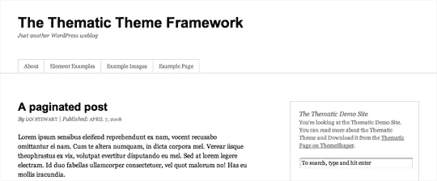

主题子主题很多:[图 2，“ThemeShaper 使用主题子主题”](#fig_themeshaper "Figure 2. ThemeShaper uses a Thematic child theme")、[图 3，“Commune，作者 Cristian anto he”](#fig_commune "Figure 3. Commune, by Cristian Antohe")和[图 4，“The Neutica+ child theme，作者 Allan Cole”](#fig_neutica "Figure 4. The Neutica+ child theme, by co-author Allan Cole")展示了这个框架的灵活性。

**图二。ThemeShaper 使用一个主题子主题**

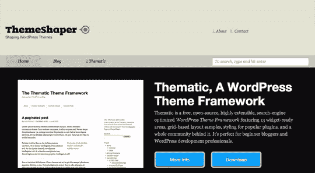

**图 3。[公社，由克里斯蒂安·安托赫](http://www.cozmoslabs.com/2009/04/07/green-anyone-try-commune-thematic-child-theme/)创立**

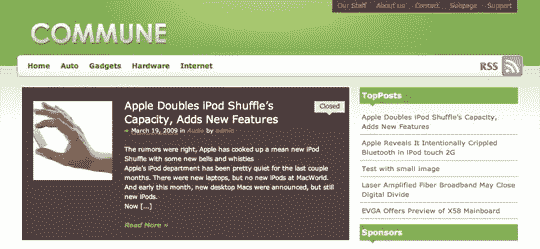

**图 4。合著者 Allan Cole 的 [Neutica+](http://fthrwght.com/neuticaplus/) 儿童主题**

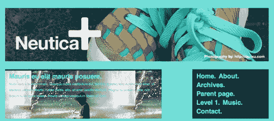

#### 杂交

Justin Tadlock 的 Hybrid，如图[图 5，“Hybrid in action”](#fig_hybrid "Figure 5. Hybrid in action")，拥有大量的文档和支持，并且是免费和开源的。你还会发现一个语言翻译的集合，大量的子主题可以下载和尝试，以及混合特定的插件来增强你对这个优秀的免费主题的使用。访问大量深入的教程和论坛只需花费 25 美元。

**图 5。行动中的混合动力**

可以从[主题混血儿下载混血儿。当你在那里的时候，看看贾斯汀的一些可爱的孩子主题的例子；其中两张截图可见于](http://themehybrid.com/)[图 6，“与世界分享你的想法，用生活拼贴”](#fig_lifecollage "Figure 6. Share your thoughts with the world, with Life Collage")和[图 7，“很好玩，很 hip，很老派”](#fig_oldschool "Figure 7. It’s fun, it’s hip, it’s Old School")。

**图 6。与世界分享你的想法，用生活拼贴**

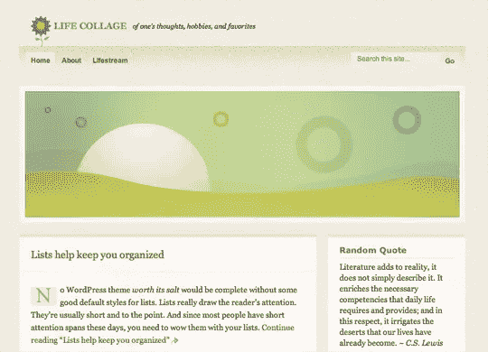

**图 7。很有趣，很时髦，很老派**

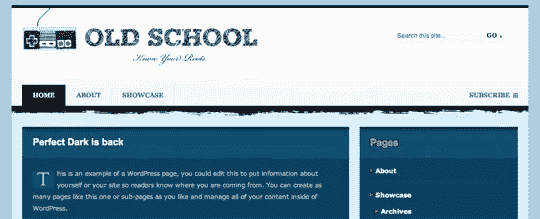

#### 卡灵顿

CrowdFavorite 的[卡林顿](http://carringtontheme.com/)框架是开源的，有四种风格:一种带有一些内置的图形设计([图 8，“博客和开发者友好的卡林顿博客”](#fig_carringtonblog "Figure 8. The blogger- and developer-friendly Carrington Blog"))，一种没有任何标记，一种专门为移动设备设计，还有一种普通的传统风格。有官方和社区的支持，还有大量的文档供好奇的编码者使用。

**图 8。博客和开发者友好的卡林顿博客**

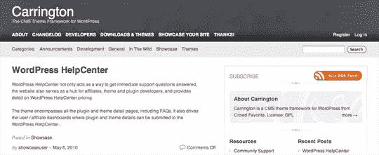

### 付费框架

这些付费框架附带了一堆华而不实的东西，强大的企业和 SEO 焦点，以及额外的支持。

#### 论文

DIY 主题 的[论文框架承诺终结你所有的 SEO 担忧](http://diythemes.com/)，为最终用户和专业主题开发者提供大量选择。在 Thesis 中，您在主题本身中修改自定义 CSS 和函数文件，而不是使用上面提到的子主题方法，但它仍然是一个坚如磐石的框架。在撰写本文时，个人使用的论文价格为 87 美元，开发者为 164 美元，并且有一个[繁荣的论文皮肤市场。](http://thesisthemes.com/)默认的论文皮肤如图[图 9，“坚如磐石的论文框架”](#fig_thesis "Figure 9. The rock-solid Thesis framework")。

**图 9。坚如磐石的论文框架**

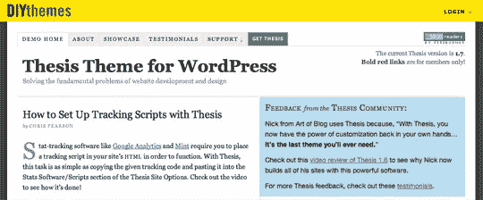

论文带动了一些流行的博客；在下面的[图 10，“可爱超载——可爱形象中的极品”](#fig_cuteoverload "Figure 10. Cute Overload—for the finest in cute imagery")和[图 11，“CopyBlogger 的引人入胜的内容”](#fig_copyblogger "Figure 11. The compelling content of CopyBlogger")中，查看它的一些高调用户。

**图 10。可爱超载——最佳可爱形象**

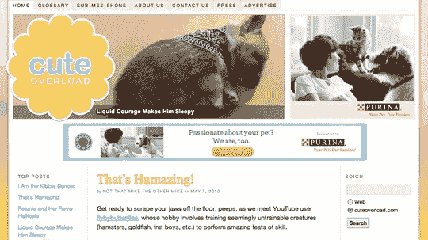

**图 11。CopyBlogger 的精彩内容**

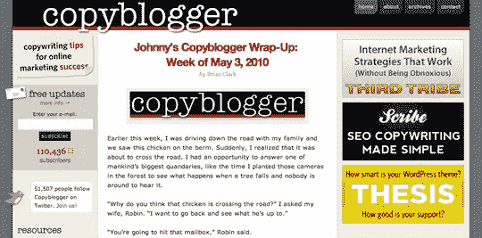

#### 创世纪

StudioPress 的 [Genesis framework](http://www.studiopress.com/) 提供了一个简单、实用的主题和众多包含的布局，只需要一点 CSS 爱好就能真正发光。一些特定于 Genesis 的小部件有助于将这一主题扩展到替代产品之外。你自己用要 59.95 美元，还有一个官方的创世纪主题市场出售你的儿童主题。[图 12，“查看创世纪主题演示”](#fig_genesis "Figure 12. Viewing the Genesis theme demo")和[图 13，“这个创世纪子主题是真正的进取”](#fig_genesis_enterprise "Figure 13. This Genesis child theme is truly enterprising")展示了你可以用创世纪框架实现的一些很酷的变化。

**图 12。观看创世纪主题演示**

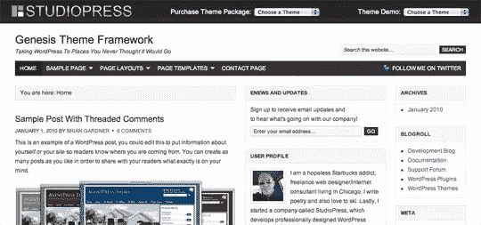

**图 13。这个创世纪儿童主题非常有创意**

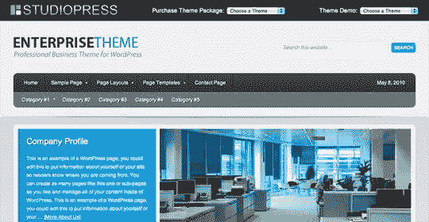

### 那么哪个框架是最好的呢？

来吧，SitePoint，告诉我们哪一个是最好的！

当然，你可以使用的最好的主题框架完全取决于你和你的需求。事实上，你可能会认为它们都不适合你，而你更愿意自己开发。对你有用的就行！

关于如何使用主题框架构建令人惊叹的主题的更多信息，[下载*的免费示例 PDF 文件*。该示例包含完整的第 4 章(本文就是从这一章中得出的)和第 5 章(更深入地讨论了如何利用主题框架的力量)。你可以](https://www.sitepoint.com/premium/library)[从 SitePoint 直接](https://www.sitepoint.com/premium/library)购买整本书，既可以是纸质书，也可以是数字包(包含 PDF、Mobi 和 EPUB 格式)。

## 分享这篇文章