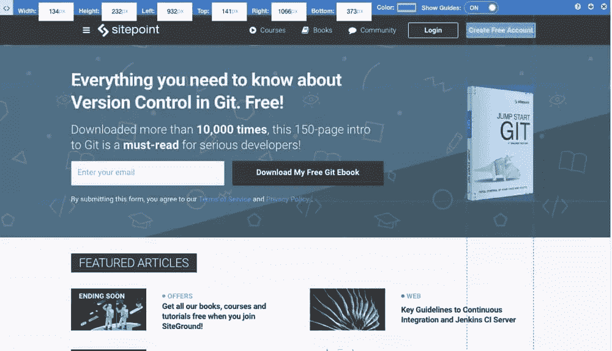
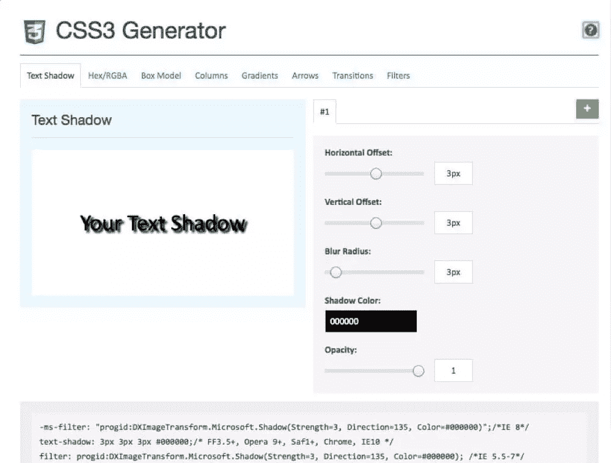
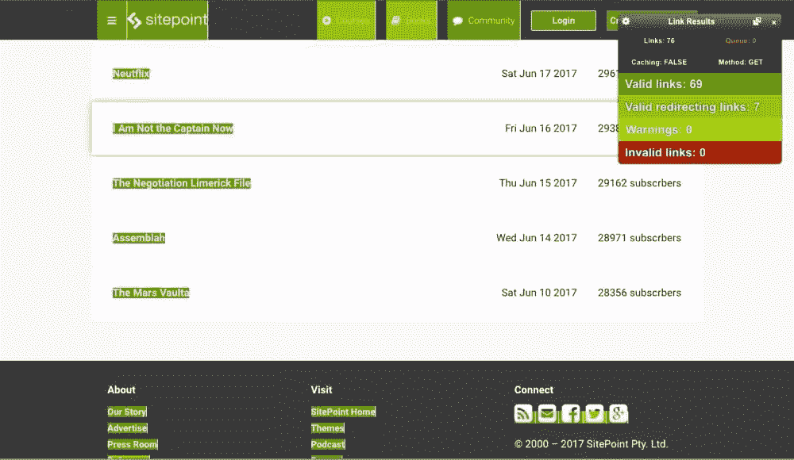
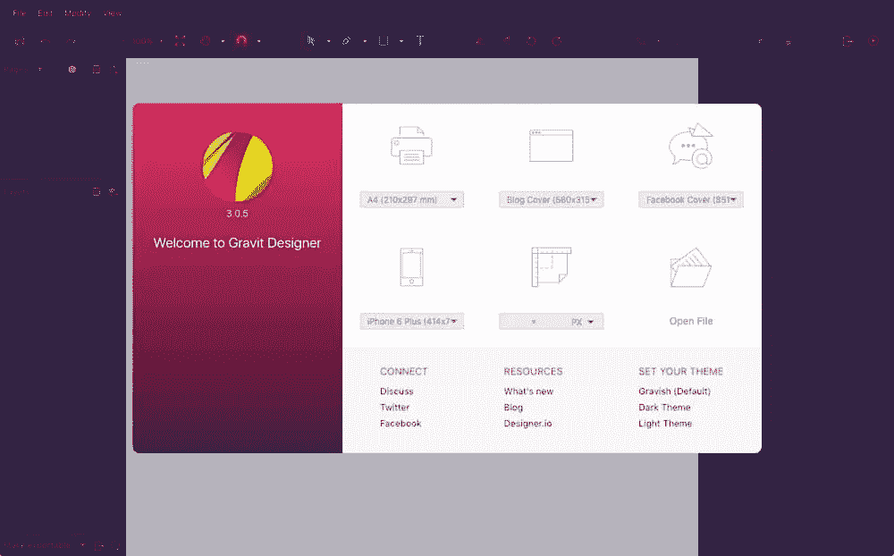
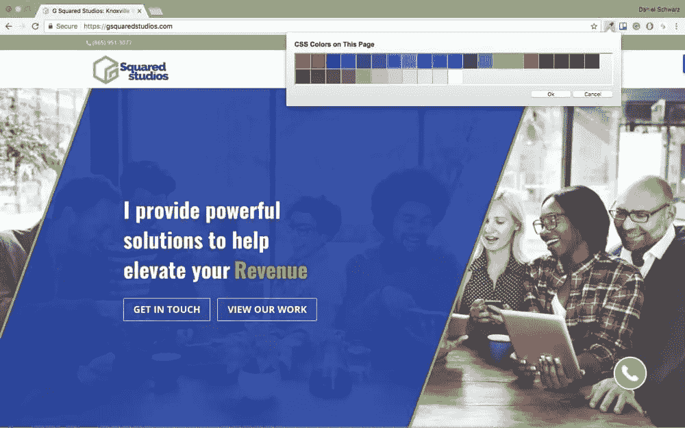
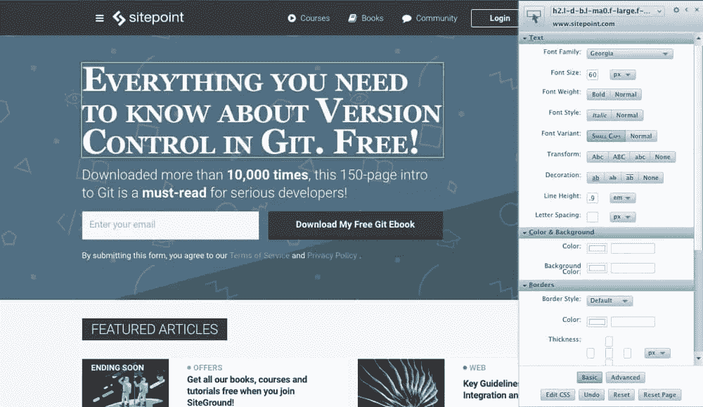

# 2017 年对设计师来说超级有用的 7 个 Chrome 扩展

> 原文：<https://www.sitepoint.com/6-chrome-extensions-designers/>

所有的设计师都有自己的工作方式。无论你是直接在浏览器中设计(我的意思是用代码)，还是只使用网络浏览器来实时测试网页设计(或者其他方式)，Chrome 都有大量的扩展供设计师使用，这会让你的生活变得更加简单。我最讨厌的事？不得不打开一个巨大的桌面应用程序来完成一个相对较小的任务，所以我一直在寻找能够快速解决常见设计问题的 Chrome 扩展。

这里有 7 个非常有用的 Chrome 扩展，我不能没有它们，如果你也使用 Firefox 的话，这里还有 [6 个优秀的 Firefox 扩展供设计者使用](https://www.sitepoint.com/6-great-firefox-extensions-designers/)、
(如果你是一个 web 开发人员，你可能会在所有浏览器中交叉测试！).

## 1.[页尺](https://chrome.google.com/webstore/detail/page-ruler/jlpkojjdgbllmedoapgfodplfhcbnbpn/)

Page Ruler 是一个有用的 Chrome 扩展，用于找出浏览器中任何元素的位置和/或大小——它比使用 Chrome 代码检查器更快，或者更糟，笨拙地浏览 CSS 文件。首先，使用十字光标在有问题的元素周围绘制选择。浏览器顶部的栏将告诉您该元素的长度和宽度，以及它离屏幕的每个边缘有多远(就好像它已经应用了固定/绝对定位)。

提示:使用箭头键来微调您的选择，以获得最大的准确性。

## 2.[what font](https://chrome.google.com/webstore/detail/whatfont/jabopobgcpjmedljpbcaablpmlmfcogm)

由于我经常需要检查网页上的字体，查看某些文本块上使用的字体大小，实际的字体名称及其颜色，WhatFont Chrome 扩展对我来说非常有用。

点击文本的任何部分，找出十六进制/RGBA 值，重量，行高，字体风格，当然还有字体家族。

有时，在浏览器底部添加 Chrome inspect 窗口会在您工作时干扰您的工作，因此能够在不打开整个 inspect 窗口的情况下获取所有这些信息会让事情变得容易得多！

## 3. [CSS3 发生器](https://chrome.google.com/webstore/detail/css3-generator/dmlgmehijaodgkkooghkknjjkddahmej)

CSS3 Generator 是一个 Chrome 应用程序，它将帮助你生成一些复杂或难以记忆的 CSS 代码片段。对于简单的事情，您不会需要它，但让我们面对它，一些 CSS 值很难从头编码(例如创建跨浏览器兼容的渐变所需的 CSS，或 CSS 转换)。只需几次点击，你就可以生成一些非常有用的 CSS，在扩展预览中预览，然后复制 CSS 并将代码粘贴到真正的 CSS 文件中。

以下是支持的内容列表:

*   多重文本阴影
*   十六进制/RGBA 代码
*   CSS 转换
*   边界半径
*   多框阴影
*   Css 列
*   箭头(用于工具提示)
*   渐变(线性、放射状…甚至条纹)

## 4.[查看我的链接](https://chrome.google.com/webstore/detail/check-my-links/ojkcdipcgfaekbeaelaapakgnjflfglf)

很容易输入错误的网址(或者忘记完全包含它们，但这是另一个故事)，所以无论你的客户需要现有网站的帮助，或者如果你正在从头开始建立一个网站，检查我的链接是任何网页设计师的必备工具。

“检查我的链接”将扫描网页并查找断开的链接，就这么简单。这省去了您自己手动检查它们的麻烦。用户界面非常直观。“检查我的链接”不会显示无用链接的列表，而是简单地将实际网页上的坏链接显示为红色，而有效链接将显示为绿色，因此您一眼就可以看到要修复的内容。简单！

## 5. [Gravit 设计师](https://chrome.google.com/webstore/detail/gravit-designer/pdagghjnpkeagmlbilmjmclfhjeaapaa)

如果你需要设计一个图形，但你不想打开一个资源密集型的设计应用程序(或者如果你没有/不想花钱买一个)，下载 Chrome 的免费 Gravit Designer 扩展。

令人惊讶的是，它真的很快。使用常用的画板尺寸开始设计非常容易，包括博客图形、社交媒体图形和常见打印尺寸的预设。Gravit 是一款矢量设计应用，让设计可扩展的分辨率独立设计变得轻而易举。

我对许多选项和功能感到惊讶——这与使用 Sketch 等高级设计应用程序没有太大区别，尽管视觉 UI 感觉更像 Affinity Designer。

期待明显的东西，如形状，对齐，翻转，旋转，模糊，阴影，复合形状的创建，等等。Gravit Designer 还能够导出到 PNG、JPG、SVG 和 PDF、符号功能(如 Sketch 和 Adobe XD)、复杂的 SVG 编辑工具(beziers 和 bezigons ),甚至是过滤器，对于想要创建营销图形的专业设计师、摄影师和业余设计师来说，Gravit Designer 实际上是一个非常有吸引力的选择。

我的意思是，想象一下能够在谷歌浏览器中创建设计，而不必打开 Photoshop、Illustrator、Sketch 或 Adobe XD。其实你不用想象，现在就可以下载 Gravit Designer，免费！

## 6. [ColorZilla](https://chrome.google.com/webstore/detail/colorzilla/bhlhnicpbhignbdhedgjhgdocnmhomnp)

ColorZilla 是 Google Chrome 的吸管工具——它可以让你通过几次点击从网页中取样任何颜色。首先，单击 Chrome 中的 ColorZilla 扩展图标，并将光标悬停在您想要采样的区域上。您将获得该颜色的 HSL、十六进制和 RGBA 值。通常情况下，你需要截屏网站，并将其导入 Photoshop，但 ColorZilla 更快。ColorZilla 还可以从任何网站按需生成调色板，并通过颜色历史功能保存您最近的颜色，这使它在与 ColorPick 滴管等竞争对手的竞争中脱颖而出。

## 7. [StyleBot](https://chrome.google.com/webstore/detail/stylebot/oiaejidbmkiecgbjeifoejpgmdaleoha)

Stylebot 是一个方便的 Chrome 扩展，适用于那些想要在实时网站上快速尝试自定义 CSS 的人。它让你有机会尝试不同的字体、不同的颜色、不同的风格等，而不必在代码编辑器和谷歌浏览器之间来回切换。我们发现 Stylebot 是一种有用的方式，可以在实际提交到代码库之前，在一个实时网站上对微小的调整和更改进行原型化。

## 结论

有了这些节省时间的扩展，通常繁琐的任务，或者需要你打开/购买更多软件的任务，只需点击几下就可以完成，你甚至不用离开网络浏览器就可以完成。设计者和开发者都会发现这些 Chrome 扩展非常有用。

Chrome 扩展对那些开发网站的人来说肯定是有用的，但那些希望从实时网站中提取视觉信息，以便在 Sketch、Adobe XD 或 Photoshop 中使用的设计师也将很快看到显著的节省时间的好处。

## 分享这篇文章