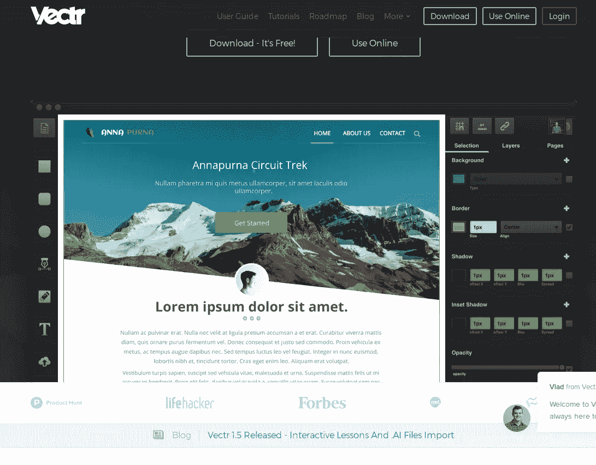
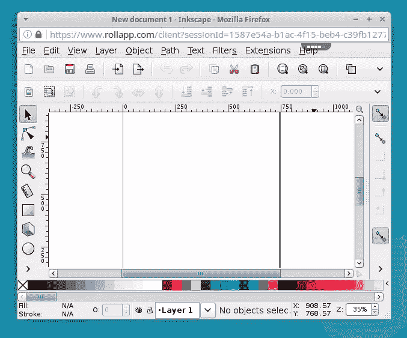
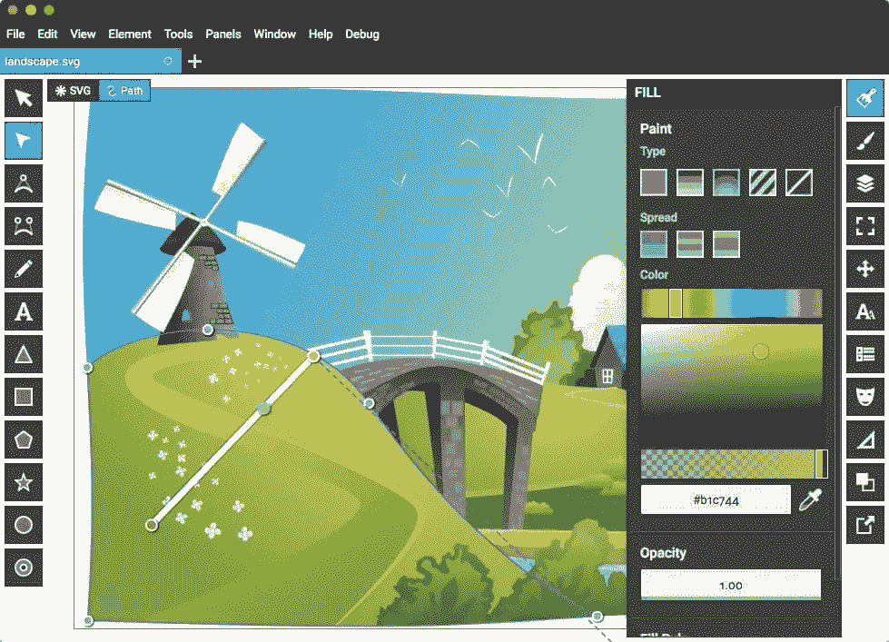
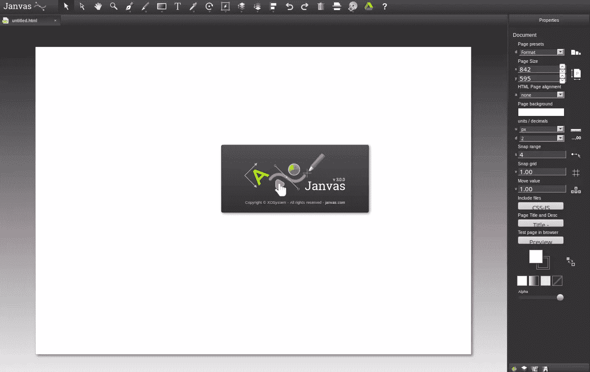
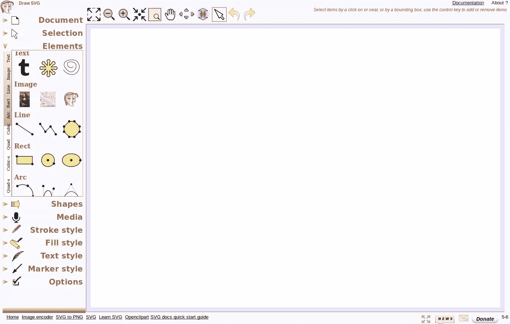
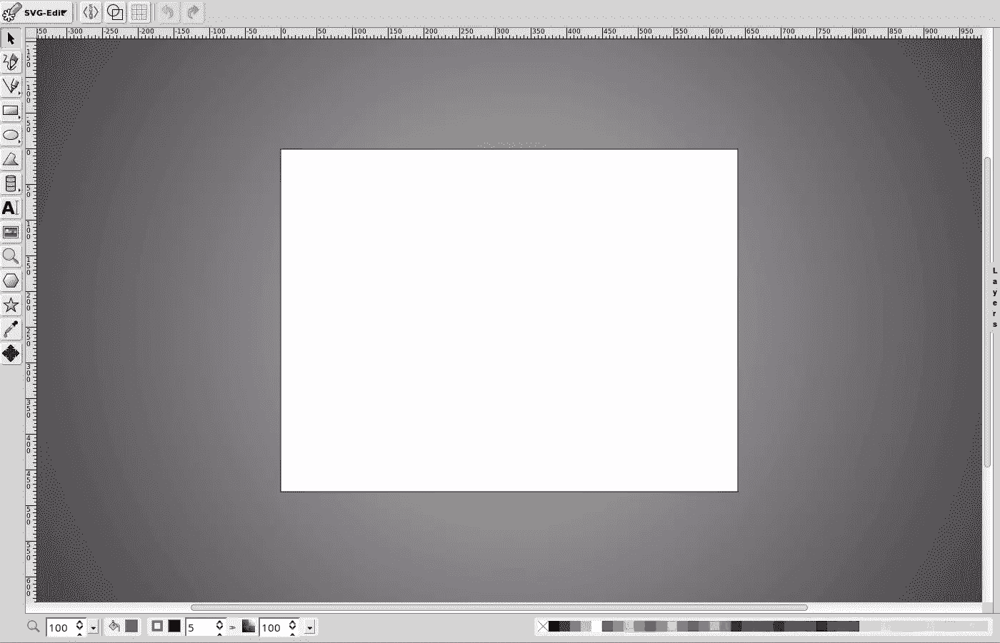

# 比较了 6 个免费的基于 Web 的 SVG 编辑器

> 原文：<https://www.sitepoint.com/6-free-web-based-svg-editors-compared/>

虽然 SVG 图像可能不像我们最喜欢的位图格式(如 PNG 或 JPG)那样常见，但矢量的优势使越来越多的设计师希望将它们引入他们的项目。

过去，我们通常会查看 Adobe Illustrator 和 Inkscape 等桌面应用程序，但在 2017 年，你不必离开网络浏览器来进行矢量设计。所以，如果你正在寻找一个免费的 SVG 编辑器，这 6 个免费的基于网络的 SVG 编辑器是一个好的开始。

## 1.Vectr

无论对于初学者还是更高级的 SVG 用户，Vectr 都是不错的选择。它的界面简洁，不会被你从未用过的大量工具淹没。这对矢量插图的新手来说很好，因为你不应该在不知道该用什么的工具中迷失。它还附带了一些教程，所以即使您对 SVG 完全陌生，也应该能够很快开始使用它。

这并不意味着 Vectr 缺少功能——它拥有所有基本的东西，如形状、文本、图层、阴影、边框、背景等。你需要创造一个基本的形象。它没有成熟的桌面编辑器的荣耀，但是对于一些快速的设计和编辑来说，它已经足够了。您可以从头开始创建新文件，也可以上传现有图像。

请注意，当上传复杂的插图到 Vectr 时，您可能会感到沮丧，例如，地图或详细的图表，因为我们发现它并不总是能很好地处理它们。但是对于更简单的 SVGs 图标、徽标之类的——基本上没问题。

如果你觉得网页版没有提供你所需要的，你可以在桌面版的应用中找到更多的功能，桌面版适用于 Windows，Mac，Linux 和 Chromebook。

也许 Vectr 提供的最酷的特性是能够直接从 Vectr 站点链接和嵌入你的 Vectr 图形——这有效地成为你的 SVG 的托管服务。由于许多服务阻止 SVG 文件的上传，这是一个相当大的问题。这意味着你可以在外部 WordPress、Medium、Tumblr 或其他网站上展示你的 Vectr SVG 作品，这些网站允许展示 SVG，但阻止上传 SVG 到他们的服务器。

Vectr 还提供了在 Vectr 编辑器面板中共享矢量图形的能力，允许其他人编辑您提供给他们的图形。这意味着，例如，您可以在模板设计中提供一个 SVG 徽标，然后用户可以根据自己的要求进行定制——在浏览器中实时显示。

为此，Vectr 最近发布了一个名为[的产品版本，这是 Vectr](https://wordpress.org/plugins/vectr-embedded-graphics-editor/) 的一个 WordPress 插件。

## 2.罗拉普

与列表中的其他工具不同，当你进入 RollApp 的主页时，你不会马上看到该工具。原因是 RollApp 不是一个单独的应用程序，它是一个应用程序包，它们的 SVG 编辑器只是这些应用程序中的一个。不过，这是一个很棒的工具，因为这是基于浏览器的 Inkscape 版本。

如果您想使用 RollApp，您需要一个帐户。你可以注册一个新账户，或者登录谷歌、脸书、亚马逊——非常方便，因为我真的讨厌创建数千个新账户，却发现我注册的应用程序不是我需要的。

登录后，您将看到以下内容:

是的，这是它所有的荣耀！毫无疑问，RollApp 是这个列表中功能最丰富的应用——你几乎是在浏览器中使用 Inkscape！我没有逐项比较，但看起来他们非常具有 Inkscape 的所有功能，如图层、对象、文本、路径、过滤器、效果、扩展等。

请注意，对于较大的文件，速度不会太快，因为您是通过互联网在他们的服务器上执行操作。简而言之，如果你想编辑大而复杂的东西，RollApp 可能不是理想的，但对于基本编辑之外的任何其他任务，这可能是最好的基于网络的编辑器。

## 3.BoxySVG

如果你一直在阅读 SitePoint，你可能已经知道了 [BoxySVG](https://boxy-svg.com) ，因为我们在过去的 12 个月里已经对 BoxySVG 做了相当多的报道。我不打算更详细地评论它，因为这个 [BoxySVG 评论](https://www.sitepoint.com/boxy-svg-a-fast-simple-insanely-useful-svg-editor)告诉我的比我能告诉的更多，所以请阅读它。

重要的是，自从 Alex 的原始评论以来，BoxySVG 已经添加了一个代码检查器，使它成为 web 开发人员最相关的 SVG 工具之一。

## 4.扬瓦斯

几年前，Janvas 是一个非常受欢迎的 SVG 编辑器。不幸的是，近年来它似乎没有得到积极的发展，尽管它仍然在工作，但随着网络的发展和 Janvas 的停滞不前，它越来越不是一个选择。事实上，来自 SitePoint 的 Alex 在 2013-14 年使用了相当多的时间(包括付费版本)，甚至在一段时间内回答了 Janvas Google+上的一些支持问题。Janvas 是一个强大的应用程序。

Janvas 的主要问题是它不是很新。随着浏览器的发展，不发展的应用程序每天都在变得更加糟糕。Janvas 有大量的功能，包括形状、文本、绘图工具、路径、遮罩和图层，但正如论坛中的用户报告所证明的那样，这些功能中的许多并没有产生预期的结果。

令人鼓舞的消息是，新版本的 Chrome 应用即将推出。希望它能解决这些问题。

## 5.DrawSVG

也许你已经在应用程序中找到了免费的基于网络的 SVG 编辑器，但是如果你还没有，这里有更多。DrawSVG 是一个完全符合标准的 SVG 编辑器，具有很多特性。我真正喜欢它的是，它具有 Web 应用程序的外观和感觉——例如，菜单在左边，点击打开子菜单，等等。–而不是为网络移植的桌面应用程序的外观和感觉。

使用 DrawSVG，您可以绘制、修改和渲染对象。这包括绘制基本形状、贝塞尔曲线、直的和弯曲的文本、大量的笔画和填充样式等。您也可以将您的 SVG 导出为 PNG。

## 6.SVG-edit

SVG-edit 是基于浏览器的矢量编辑器的始祖，自 2000 年代中期就已经出现。它没有服务器端功能，仅在浏览器中运行——如果不在应用程序中添加自己的功能，你就无法保存你的工作。

尽管如此，对于一个以相当有限和不起眼的矢量绘图程序开始的编辑器来说，SVG-edit 的功能已经随着时间的推移而不断改进。

使用 SVG-edit，您可以绘制标准形状(线条、矩形、圆形、多边形、手绘等)。)，使用路径、图层和渐变，查看和编辑 SVG 源，导出为 PNG、JPEG、BMP、WEBP 等。

## 总结

除了这 6 个 SVG 编辑器之外，还有其他编辑器，但很少能提供上面列出的五个编辑器。

如果你对 SVG 很认真，而这些工具对你来说又太有限，你总是可以使用像 Illustrator 或 Inkscape 这样的桌面 SVG 编辑器，但是为了方便、快速和灵活，以上每一个都提供了有价值的特性集。

PS:你也可以使用一个叫做 [Figma](https://www.figma.com) 的工具。尽管与其说它是一个 SVG 编辑器，不如说它是一个 Web UI 设计工具，但是它有一个优秀的工具集，可以生成优化良好的 SVG 代码。

## 分享这篇文章