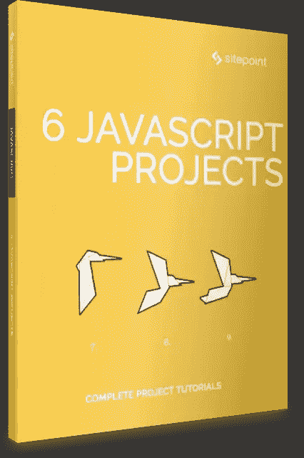

# 6 个 Javascript 项目–2018 年 6 月发布

> 原文：<https://www.sitepoint.com/6-javascript-projects-released-june-2018/>

## 

## 关于这本书

毫无疑问，JavaScript 生态系统变化很快。随着 ES2015(又名 ES6)的推出，不仅新工具和框架被快速引入和开发，语言本身也经历了巨大的变化。可以理解的是，现在已经有很多文章抱怨学习现代 JavaScript 开发有多么困难。我们的目标是通过这套现代 JavaScript 书籍将这种混淆最小化。

## 你会学到什么

这本书展示了六个完整的 JavaScript 项目；每一个都利用了现代 JavaScript 及其生态系统。您将学习构建几个不同的应用程序，在这个过程中，您将获得大量有用的建议、提示和技术。它包含:

*   由米凯拉·莱尔设计的 React VR 构建一个全球体 3D 图像库
*   用 SimpleWebRTC 构建 WebRTC 视频聊天应用程序
*   *构建一个没有框架的 JavaScript 单页应用*Michael Wanyoike
*   Darren Jones 的 1KB JS 微框架 Hyperapp 创建待办事项列表
*   *用包裹捆绑 Hyperapp 应用&部署到 GitHub 页面*作者达伦·琼斯
*   利用现代 JavaScript 和 D3 实现交互式数据可视化

本书面向所有希望提高 JavaScript 技能的前端开发人员。为了跟上讨论，您需要熟悉 HTML 和 CSS，并对 JavaScript 有一定的理解。

## **在哪里买**

成为 [SitePoint Premium](https://www.sitepoint.com/premium/books/6-javascript-projects?ref_source=sitepoint&ref_medium=article_copy&ref_campaign=6-javascript-projects) 的月会员——我们所有的书籍和课程每月只需**9 美元**！

现在就在[亚马逊](https://www.amazon.com/dp/B07DGKDV9C/ref=emc_b_5_i)或者通过 [Google Play](https://play.google.com/store/books/details/Michaela_Lehr_6_JavaScript_Projects?id=5CReDwAAQBAJ) 购买，或者作为[现代 Javascript 收藏](https://www.amazon.com/dp/B07DHYM4ZW/ref=emc_b_5_i)的一部分购买

## 分享这篇文章