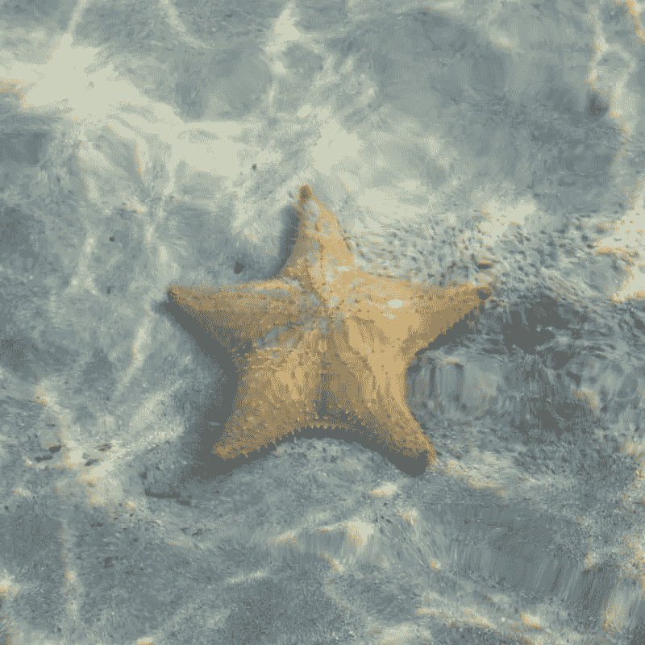

# 用智能手机拍照的 6 个摄影技巧

> 原文：<https://www.sitepoint.com/6-practical-hacks-for-taking-creative-photos-with-your-smartphone/>

现在是 2016 年，艺术摄影不再局限于高端、昂贵的 DSLR 相机。现在大多数智能手机都配备了高质量的相机，虽然在真正与专业相机竞争之前还有很长的路要走，但它们绝对可以完成任务。

你的智能手机通常是你所拥有的最方便的工具，在一些创新应用程序的帮助下，你可以将普通的智能手机快照变成更有创意的东西。

还有一些智能手机工具可以让你的智能手机照片达到一个全新的水平。

然而，如果你想走“老路”，在不使用应用程序或花钱购买昂贵的智能手机附件的情况下，让你的照片尽可能独特，下面是一些你可能想尝试的技巧:

## 1.用你的太阳镜作为偏光过滤器。

<small>[*照片*](https://www.flickr.com/photos/notarim/5565786744/)*BY*[*mark notari*](https://www.flickr.com/photos/notarim/)*/*[*CC BY-NC-ND 2.0*](https://creativecommons.org/licenses/by-nc-nd/2.0/)</small>

偏振滤光器安装在 DSLR 相机的镜头上，以帮助减少眩光，消除分散注意力的反射，并影响曝光。使用智能手机时，一个简单又便宜的方法是透过你的太阳镜拍照。这提供了与偏光滤镜相同的好处，并为您的图像带来美丽的彩色渐变效果(取决于您太阳镜的颜色)。

<small>[*照片*](https://www.flickr.com/photos/simplebitsdan/1381003930/)BY[*丹塞德霍尔姆*](https://www.flickr.com/photos/simplebitsdan/)/[*CC BY-NC-ND 2.0*](https://creativecommons.org/licenses/by-nc-nd/2.0/)</small>

## 2.把你的手机放在玻璃或玻璃瓶里，拍水下照片。

想用智能手机拍水下照片？当你可以从厨房随便拿些东西的时候，就没有必要花在昂贵的防水盒上了！

把你的手机放在水杯、广口瓶、玻璃水罐或任何深玻璃容器中，在不弄湿手机的情况下拍摄水下照片。确保容器的顶部露出水面，以免意外淹没你的手机。

<small>[*照片*](https://www.flickr.com/photos/jasonnunez/19699512038/) *by* [*杰森·努内斯*](https://www.flickr.com/photos/jasonnunez/)*/*[*CC BY-NC-ND 2.0*](https://creativecommons.org/licenses/by-nc-nd/2.0/)</small>

这种技术也非常适合拍摄上下(也称为分割拍摄)照片，这基本上是水下照片，也显示了水面上的一半。

## 3.在纸板上打一个洞，把它固定在你的相机镜头上

通过把你的手机变成一个临时的针孔摄像头来复古。只需拿一小块纸板，在上面打一个整齐的小洞；把它贴在你相机的背面(镜头正上方)。记住:为了利用这个效果，这个洞需要比你的智能手机相机的镜头小得多。

<small>[照片](https://www.flickr.com/photos/notoriousjes/5759430939/) by [杰西卡](https://www.flickr.com/photos/notoriousjes/)/[*CC BY-NC-ND 2.0*](https://creativecommons.org/licenses/by-nc-nd/2.0/)</small>

## 4.使用荧光棒获得酷炫多彩的效果。

<small>*照片* *by* [*大卫置顶*](https://www.flickr.com/photos/dstopping/)*/*[*CC BY-NC 2.0*](https://creativecommons.org/licenses/by-nc/2.0/)</small>

荧光棒是一种有趣又便宜的方式(100 根各种颜色的荧光棒只需 10 美元)来给你的照片增添一些趣味。对于这个技巧，你需要做的就是将荧光棒放在相机镜头前，将它们放在照片的前景中。这也将使他们的照片稍微模糊，发光的效果。

你也可以尝试光线绘画或捕捉随机的光线条纹，但这种技术需要更多的努力和实验。这涉及长时间曝光，这在智能手机上是不可能的，除非你使用一个应用程序(如慢速快门相机)和一个三脚架。

<small>[*照片*](https://www.flickr.com/photos/rachelpasch/3058400080/) *by* [*雷切尔*](https://www.flickr.com/photos/rachelpasch/)*/*[*CC BY-NC 2.0*](https://creativecommons.org/licenses/by-nc/2.0/)</small>

## 5.用放大镜作为临时的微距镜头。

诺基亚 N8 用临时制作的宏镜头。

普通智能手机因其糟糕的数码变焦能力而臭名昭著，这就是为什么大多数摄影爱好者建议只裁剪图像而不是放大。但是，如果你喜欢拍摄微距照片，这可能是一个问题。

你可能会发现一个有用的方法，就是用一个小放大镜作为智能手机的“微距镜头”。Dan Chiriac [在这个快速视频](https://www.youtube.com/watch?v=pG4sX9spxAw)中演示了这种技术。这是一种比购买专用智能手机微距镜头更便宜的选择，后者通常价格在 20 美元至 70 美元之间。

<small>[*照片*](https://www.flickr.com/photos/momentsforzen/8587623387)BY[*moments forzen*](https://www.flickr.com/photos/momentsforzen/)/[*CC BY-NC-ND 2.0*](https://creativecommons.org/licenses/by-nc-nd/2.0/)</small>

## 6.尝试用水晶棱镜创造抽象的构图。

<small>*照片* *by* [*麦克莫纳汉*](https://www.flickr.com/photos/mikey_blue_eyes/)*/*[*CC BY-NC-ND 2.0*](https://creativecommons.org/licenses/by-nc-nd/2.0/)</small>

还记得你的科学老师曾经教你光谱的那些水晶棱镜吗？显然，它们也是抽象摄影的绝佳工具。

无论你使用的是 DSLR 还是智能手机，这些方便的小玻璃仪器都可以将一张单调乏味的照片变成一件抽象的艺术品

<small>[*照片*](https://www.flickr.com/photos/kurosugarlolita/5247914832)*BY*[*KuroSugarLolita*](https://www.flickr.com/photos/kurosugarlolita/)/[*CC BY-NC-ND 2.0*](https://creativecommons.org/licenses/by-nc-nd/2.0/)</small>

你可以在网上购买棱镜(价格低至 6 美元),或者在你当地的爱好或科学商店购买。

## 分享这篇文章