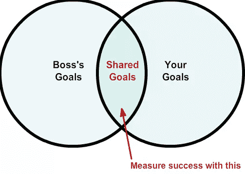
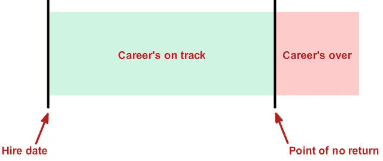

# 预示你职业生涯结束的 6 个危险信号

> 原文：<https://www.sitepoint.com/6-red-flags-that-signal-the-end-of-your-career/>

Bob 是工作中最好的开发人员。

他的代码很简单。写得很好，完成得很快——他的一致性令人难以置信。他是一名模范员工，经常被人力资源部称赞为“大楼里最好的开发人员”他安静而谦逊，被描述为“在电梯里你不会多看一眼的人。”

他就要被解雇了。

他的雇主被黑了，或者至少他们是这么认为的。他们看到来自中国的大量网络活动。由于担心发生最坏的情况，他们联系了威瑞森进行调查。

他们发现的东西让他们停下了脚步。

鲍勃是一名收入达六位数的高级开发人员，他正在外包工作。鲍勃对工作不是特别感兴趣。因此，他决定付给中国的开发者 5 万美元，让他们替他完成工作，剩下的时间就在 Reddit、易贝和 YouTube 上度过。

在工作日结束时，他会向管理层发送“一天结束时的更新”，然后回家。

## 鲍勃的职业生涯实际上已经结束了…

理应如此。他是通过中国分包商的发票和他的网络历史暴露的。他的习惯引发了严重的危险信号，因此，很自然地，他因为欺骗被解雇了。

大多数开发人员不会犯鲍勃犯过的同样的错误。大多数开发人员都是勤奋的专业人士，他们对自己的工作非常自豪。这是个好消息:开发者对自己和周围的人还是有一定程度的尊重的。

**坏消息？许多开发人员仍然在犯严重的错误。**

这些错误会产生危险信号；这种危险信号告诉你的雇主，你的同事，你的职业生涯结束了。这些错误不会立即终结你的职业生涯。他们慢慢制造灾难。忽视这些危险信号足够长的时间，它们会结束你的职业生涯。

## 职业生涯的结束很难预测…

因为末日随时可能到来；我不是在说那些会让你被解雇的严重错误。我是*而不是*在谈论裁员、内部政治或你无法控制的情况。

我说的是那些*慢慢*毁掉你事业的错误。

我所说的错误是建立在你做过的所有好事情的基础上的。你做了一些伟大的事情，但它变坏了；你创造了积极的东西，然后它就中毒了。

每一个危险信号令人沮丧的地方在于它们出乎意料，它们存在于我们的盲点中。

更糟糕的是，你职业生涯的结束可以由不同的事情引发。

1.  一个更好的员工出现了。如果你犯了错误，而一名全明星员工提出解决你造成的问题，你就触发了职业生涯的终结。
2.  你犯了一个更大的错误。一个把人引上毁灭和失落之路的错误。当人们失去金钱、影响力、朋友、安全感等。他们认为有人有责任。犯正确的错误，那个人就是你。
3.  人们不再关心。起初，犯了错误，人们会给你一个通行证。继续制造它们，它们会生气。如果时间太长，你就会制造冷漠。人们告诉自己*“我不干了，我要继续前进。”*

这些不是唯一的诱因。更糟糕的是，这些触发因素和危险信号的结合实际上会加速你职业生涯的结束。

我说的是哪些危险信号？

## 危险信号#1:相信掌握是可以转移的

名人出名是有原因的。他们能够在做他们最擅长的事情时获得成功。最优秀的人是出类拔萃的——他们能够获得他们想要的成功、尊重和金钱回报。但几乎不可避免的是，他们开始相信自己的宣传。

他们认为在一个领域的精通可以转移到另一个领域。

我哪里知道？

他们告诉我们。大卫·哈斯莱霍夫创立了一个时装品牌，不到一年就失败了。

林赛·罗韩、李尔·韦恩、麦莉·赛勒斯也是如此——你明白了。

这些名人不愿意为成功付出代价。但问题是。开发人员也在为这个问题苦苦挣扎。

“这太荒谬了，安德鲁。”

是吗？

你见过多少次精通一门语言(例如 Python)的优秀开发人员决定学习一门新的语言？然后，经过一两个月的工作，同一个开发人员认为他们突然成为了新语言的大师？

事实是这样的。

精通是不可转让的。

你可以大大缩短学习曲线。你可以很快学会任何东西，在许多行业你都可以进入前十名。但是能力和精通不是一回事，精通是不可转移的。

做出这样的假设会导致信徒们去冒不必要的风险。

*   相信您在一个 IDE 上的技能会自动转移到另一个 IDE 上
*   要求你的团队接受新的、昂贵的或不熟悉的东西，仅仅因为你觉得这很容易
*   告诉你的老板或客户你能胜任这份工作，因为你过去做过类似的事情
*   推荐 Nginx 是因为你熟悉 Apache，并且“这能有多难？”

还记得我之前提到的那些触发器吗？是的…犯了足够多的错误，按下正确的触发器，你的职业生涯就结束了。

## 危险信号 2:忽视成功的半衰期

成功是有保质期的。

与普遍的看法相反，成功不会永远持续。人们会忘记，失去兴趣，不再相信。但是为什么呢？

做伟大的工作会产生冲突。还记得我说过这些问题隐藏在你的盲点里吗？这就是我所说的。当你做任何好事时，任何有帮助的，积极的，好的，支持的，等等。这会产生冲突。

原因如下。

**接受者*贬值*，给予者*升值*。**

当人们给别人一些东西时，他们礼物的价值就会上升。当然不是在现实中*，而是在他们的头脑中*。当你听到人们说:

> “我给了你 X，你就这样回报我？”

或者

> “看看我为你做的一切！”

你知道你面对的是欣赏。他们的礼物或善行的价值上升了。他们希望你心存感激。不，不仅仅是感激。他们希望你感激他们。歌颂他们，承认他们的礼物。

另一方面，接收器向相反的方向移动。他们从你那里得到的礼物的价值*下降*。如果他们觉得亏欠你，人们通常会想要回报，以偿还他们的债务。如果债务太高，他们可能会变得怨恨、痛苦或愤怒。

做点好事，倒计时开始。

根据定义，开发者是给予者。如果你擅长你的工作，你就是一个给予者。这使得你的老板、经理、雇主成为一个接收者。在不久的将来，他们会忘记你所做的一切。

问题来了。

如果你没有意识到成功的半衰期，当你出色的工作被遗忘时，你会感到受伤。这也意味着你的老板更有可能忘记你的工作。对过去的成功视而不见，你们都会走向一个不快乐的地方，在那里你会感到不受重视和奖励，你的老板会感到被忽视，认为你是一个理所应当的混蛋。

看到这个盲点是如何毁掉职业生涯的了吗？

## 危险信号 3:用错误的方式衡量成功

你的工作成功吗？一些开发人员热情地回应道*是的*！这就是问题所在。你的老板会怎么说？他会同意你的评估吗？或者，他会觉得你不够努力吗？

分歧就是这样开始的。

你知道你做了一件了不起的工作。你可以列出你已经完成的所有事情。就员工而言，你是成功的。

你的老板知道吗？

他们雇你的时候在找什么？他们是否概述了决定聘用你背后的商业或政治原因？

没有吗？

如果你没有完成他们心中的目标，你成功了吗？看到问题了吗？

你定义成功的方式不一定是你老板定义的方式。事实是这样的:

你的老板、经理、客户——都有自己的高层次目标。你有自己的目标。你们都用自己的目标来衡量成功，但是，如果你和大多数人一样，你们都不会和对方分享这些细节。

长时间这样做，最终，你的职业生涯会走到尽头。

## 危险信号 4:用理想主义来抵制变革

这些开发人员是理想主义者，他们相信事情应该以某种方式完成。他们努力追求他们认为的理想。当这些开发者得到他们想要的东西时，他们就平静了。人生本来就该如此。

如果不是，他们会努力应对。如果他们最终无法应对，他们会抗议、抱怨并遭受痛苦。他们不是故意的，但是他们把他们的痛苦和沮丧传播给了周围的人。

这通常以两种方式之一发生:

1.  传统主义。如果你和这样的人打交道，你通常会听到这样的话:“在我以前的工作中，我们是这样做的”或者“我学会了这样做。”
2.  *乌托邦主义。*这些开发人员谈论事情应该是什么样子，应该是什么样子。他们给你的感觉是他们对现状不满意。

没有意识到他们的传统和乌托邦盲点的开发人员经常感到沮丧。为什么人们看不出这里出了什么问题？大家都疯了吗？当他们开始打架或使用武力从别人那里得到他们想要的东西时，事情就会失控。

这些开发者觉得强迫他人接受他们的理想是有道理的。这是一场灾难，因为它打击了士气，激怒了当权者；这种行为疏远了周围的人。然后，当他们失去盟友时，他们就到达了职业生涯的终点。

## 危险信号 5:功能失调的倦怠

不管喜欢与否，我们都有功能障碍。我们许多人都在努力进行适当的交流。有些人利用他们的自我来扼杀他们的事业。其他人在流言蜚语或操纵中挣扎。我们中的一些人反对拖延和不可靠。

如果你是人类，你可能没有按照自己的标准生活。

尽管这些功能障碍很糟糕，但它们并不是问题所在。问题是你在做什么。这是我们把自己分成三个不同阵营的部分。

1.  *不感兴趣。*这个阵营的开发者否认、辩驳、攻击。他们尽一切可能避免处理那些让他们周围的人职业生涯变得艰难的问题。他们不择手段地为他们不正常的、通常是有害的行为辩护。
2.  *借口。这些开发者拒绝承认他们的挣扎和错误。总是别人的错。有人或有东西挡了路。这种想法让他们陷入了一个破坏性的循环，将同事和盟友拒之门外。*
3.  *成长。*这些开发人员意识到总有工作要做。他们总是在寻求学习和成长。他们意识到自己所知甚少，所以他们总是寻求学习更多。他们竭尽所能继续个人和职业发展。

关系就像银行账户。健康的行为，做好事，善待他人，按照我们应该做的方式去做，会让我们的银行账户有更多的存款。不正常的行为会从你的账户中提款。

当你的关系银行账户空了，人们就不再关心了。当你的账户透支时，你的职业生涯就结束了，因为人们把你推出了他们的生活。

## 危险信号#6:知识回音室

擅长你所做的事情可能是一场灾难。当你的同事对你大加赞扬和关注时，这尤其危险。如果你没有一个计划来处理随后发生的事情，很容易相信你自己的宣传。

这非常容易做到。

假设你在工作中被视为全明星。你已经达到了很高的技能水平，突然之间，过去对你有用的东西被认为是完成事情的“最佳方式”。

就这样，你被抓进了回音室。

当这种情况发生时，你就停止学习。当你试图验证和强化你已经知道的东西时，你的职业生涯开始死亡。当你被困在回音室时，你会专注于错误的事情——证明别人错了，展示你有多聪明，等等。

以灾难告终。

想避免同样的职业结局错误？很简单。永远扮演学生的角色。在你的余生中，向*每个人*和*每件事*学习。

*向……学习*

*   超越你的开发者
*   比你捕捉到更多错误的调试器
*   和你想法完全不同的人
*   经历过上一轮低迷的资深开发人员

了解你的工作，你周围的人和你的老板。向你的朋友、你的敌人和那些不在乎的人学习。当你永久地扮演学生的角色时，你就避开了回音室。你会自动寻找挑战你世界观的新信息，创造一个鼓励成长的环境。

## 你发现避开这些危险信号的秘密了吗？

是你。

你在个人和职业成长上花的时间越多——性格塑造、职业技能、情绪健康、精神状态——你就离这些危险信号越远。当你把时间和注意力集中在成为一个更好的自己上时，你就保护了自己不犯这些致命的错误。

我知道，真是老生常谈。

但这是真的。这也是我见过的大多数开发人员所忽略的。这很讽刺，因为那些觉得自己“最了解”的开发人员正在向世界揭示他们已经被这些问题感染了。

这些问题并不是你职业生涯的终结。

“我已经犯了这些错误，我还在犯这些错误，我很好。”这是通常提出的反对意见。做出这样的假设，你就危险了。

这些错误是连续不断的。

当你犯这些错误时，你并没有被毁掉。你的职业生涯不会马上消失。这是有原因的。你还没有到达不归路。

还没有。

继续下去，事情会变得危险。在某个时候，人们会决定他们已经完成了。他们不愿意再忍受了。他们不会再往前走了。他们会散播消息，把你列入黑名单。一旦发生这种情况…

你的职业生涯结束了。

## 这些危险信号不一定是你的末日

鲍勃是个骗子，他的职业生涯实际上已经结束了。你不会傻到犯他的错误。我怎么知道？这篇文章你已经看完了。

你关心你的未来。

大多数开发人员不会犯鲍勃犯过的同样的错误。大多数开发人员都是勤奋的专业人士，每天都竭尽全力。也就是说，如果这些危险信号隐藏在你的盲点中，职业生涯结束的错误是不可避免的。

有一份自己的职业，事情会变得越来越好，这不是很好吗？如果你坚持清除盲点，它就是你的了。这样做，你会发现…

你的好日子就在前面。

## 分享这篇文章