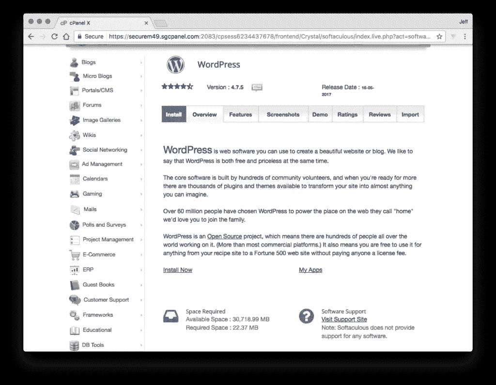
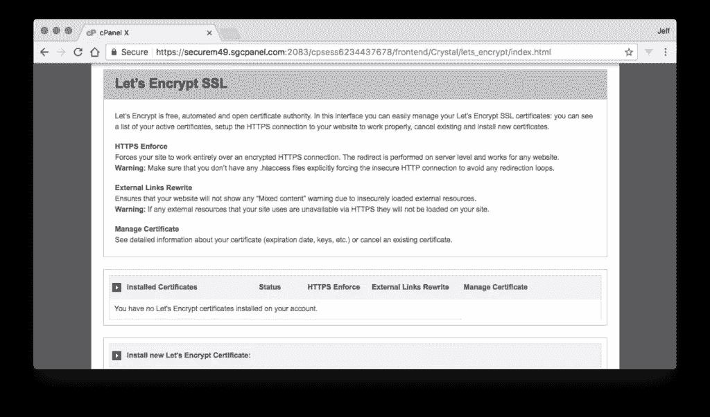

# 使用 cPanel 管理网站的 6 个技巧

> 原文：<https://www.sitepoint.com/6-tips-managing-site-cpanel/>

本文是与 SiteGround 合作创作的系列文章的一部分。感谢您对使 SitePoint 成为可能的合作伙伴的支持。

如果你的网站使用共享主机，很有可能你是在用 cPanel 管理你的网站。cPanel 软件是很多主机公司普遍使用的管理面板，但是很多使用它的人不会停下来看看它提供的功能。使用 cPanel，根据您的主机提供的内容和您的主机包包含的内容，您可以管理与您的帐户关联的域、电子邮件帐户、文件和数据库以及许多其他管理任务，所有这些都通过一个界面变得更加简单。

在这篇文章中，我们将介绍六个使用 cPanel 管理网站的技巧，这些技巧你可能在自己的托管冒险中见过，也可能没见过。有经验的用户可能已经知道这些项目，但是新用户，尤其是那些没有花时间真正浏览 cPanel 界面的用户，可能还没有看到这些选项。事实上，有时即使是有经验的用户也会陷入日常事务中，忘记一些可用的选项，所以值得一看！

*前两项并不是 cPanel 的默认功能，而是可用的“cPanel 应用”，也就是说有些主机可能有，有些可能没有，有些可能有不止一个类似的应用可用。这里仍然会提到它们，因为它们非常普遍，非常有用。*

## 自动安装程序

自动安装程序(如 [Softaculous 自动安装程序](https://applications.cpanel.com/listings/view/Softaculous-Auto-Installer))正如其名。它们提供了一种快速、轻松地安装平台的方法，您可能需要这些平台来构建一个新的网站，例如 WordPress、Joomla、Drupal、PrestaShop、forums 平台和各种其他内容管理系统、框架和脚本。只需点击一两下，您就可以将所需的平台安装到新的主机上，并准备就绪，而不是手动设置数据库、通过 FTP 上传文件、运行设置过程、在运行过程中排除故障。这是一个很好的特性，但有时会被忽视，节省时间是一件即使是经验丰富的站点管理员也做不到的事情！

## SSL 证书

你可能在 cPanel 中找到的另一个应用程序是一个让你能够为你的网站安装 SSL 证书的应用程序，例如 [LetsEncrypt cPanel 应用程序](https://applications.cpanel.com/listings/view/Lets-Encrypt-for-cPanel)。如果你对 SSL 证书不太熟悉，并且越来越需要[的每个站点都使用 HTTPS](https://www.sitepoint.com/why-every-website-needs-https/) ，你应该花时间了解一下。

许多主机，包括 SitePoint 的合作伙伴 SiteGround，都通过 cPanel 免费为所有或至少部分支付级别的客户提供这些证书。使用 SiteGround，所有域的这些证书的安装和更新都是自动进行的。如果你使用的是 WordPress 这样的 CMS，[这里有一些设置 SSL 证书](https://www.sitepoint.com/secure-wordpress-with-ssl/)的提示。

用 HTTPS 保护你的网站会让所有的访问者很容易看到安全对你的重要性，因为任何现代浏览器都会用绿色的锁来表示一个网站是 HTTPS 和安全的。来自谷歌和其他公司的越来越大的压力迫使所有的网站成为 HTTPS，这只会让事情变得更加紧急，而且你可以从你的 cPanel 设置一个更好的功能。

## 自定义错误页面

当你网站的访问者试图导航到一个不存在的页面时，他们会得到一个 stock 404 错误，除非你创建一个[自定义错误页面](https://documentation.cpanel.net/display/ALD/Error+Pages)。这当然可以在您的应用程序中完成，但是如果您不想花时间，或者没有这方面的知识，这是 cPanel 的一个非常宝贵的特性。您可以快速、轻松地定制自己的错误页面，这样您的访问者就会转而访问包含某种有价值信息的页面。

## 错误日志

在一些共享环境中，您的 web 服务器的日志可能很难获取。幸运的是，您可以直接从 cPanel 访问 [Apache 错误日志。这将让你在某些情况下看到一个坏网站的问题是什么。如果你是一个网站管理员，但不是开发人员，如果需要的话，它也会给你一些有价值的信息传递给开发人员。](https://documentation.cpanel.net/display/ALD/Errors)

## 备份

cPanel 的另一个伟大特性是能够从面板中[创建备份](https://documentation.cpanel.net/display/ALD/Backup+Wizard)。你可以在一个大文件中备份你的所有数据，或者你可以选择你的主目录(你的所有文件)，你的 MySQL 数据库(如果你的网站使用数据库)，或者你的电子邮件转发和过滤器(如果你使用你的托管公司的电子邮件)。您可以将这些内容下载到您的 web 服务器帐户的主目录中，如果您愿意，也可以下载到远程 FTP 服务器上。当然，如果你把它备份到你的主机服务器上，如果需要的话，你也可以稍后使用 FTP 下载那些备份文件。

恢复是一个类似的过程，只需选择三个可用备份项中您想要恢复的项，然后按照提示进行操作。一个好的备份系统从来都不是一件坏事，如果你正在使用 WordPress 这样的 CMS，有[许多可用的备份插件](https://www.sitepoint.com/5-wordpress-plugins-backups-migrations/)，但是有时需要[手动备份](https://www.sitepoint.com/premium/screencasts/backup-your-wordpress-sites-manually-and-easily)，或者这甚至是你唯一的选择，所以从你的 cPanel 按下按钮，这个功能就在这里是很好的。

## 克朗·乔布斯

Cron 作业也可以从面板中创建。Cron 作业是新手用户可能不太熟悉的东西，但如果他们习惯于使用自己的服务器，然后不得不在没有命令行访问的情况下使用共享托管服务，那么许多开发人员可能真的会错过它。

Cron 作业是在服务器上调度任务的一种方式。您可以选择某一天、日期、时间和频率来执行操作，通常是运行脚本或其他任务。如果你对这个特性感兴趣，你可能已经知道了所有关于 cron 作业的用法，但是如果你不知道，这里有一个全面的 cron 作业指南,可能会提供更多的见解。

## 探索 cPanel

最后，一旦你购买了虚拟主机，你要做的最好的事情就是探索你的 cPanel。实际上有数百个 cPanel 应用程序，您的主机可能已经选择在它们的 cPanel 中安装和启用，因此还有许多其他功能等待您去发现和使用。cPanel 的本地功能和附加项目通常都没有得到很好的解释或营销，人们很少访问 cPanel 来访问他们的网站，除了可能建立一个新的 FTP 用户或电子邮件帐户。请记住，还有更多可以发现和使用的东西！

## 分享这篇文章