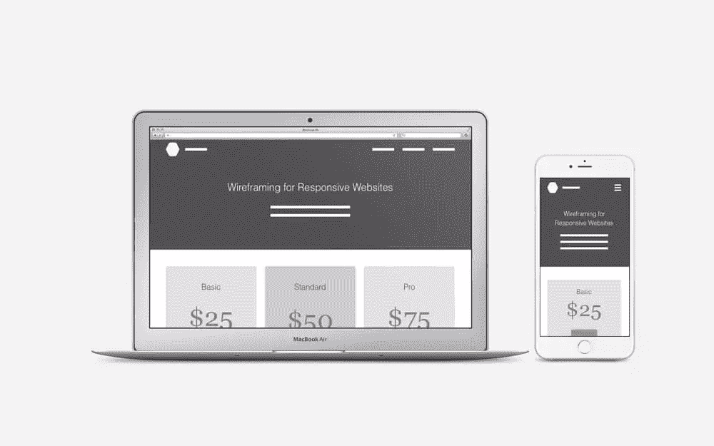
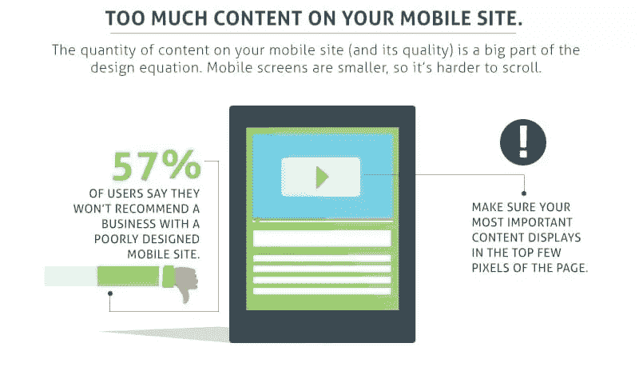
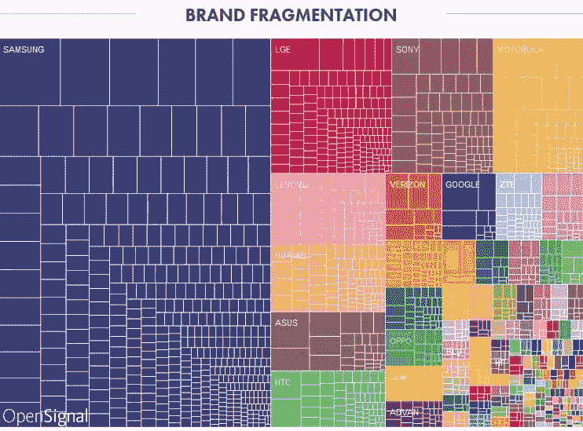
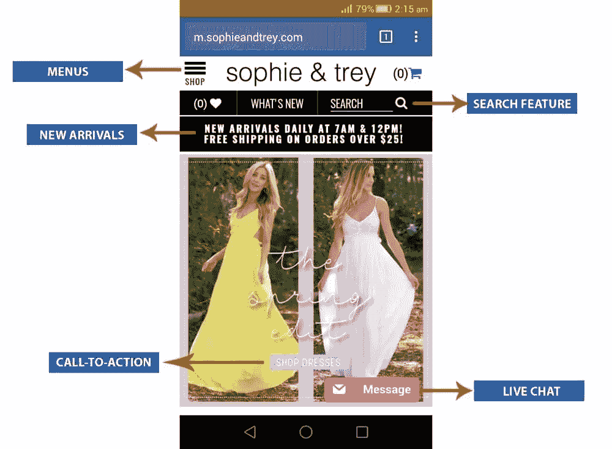
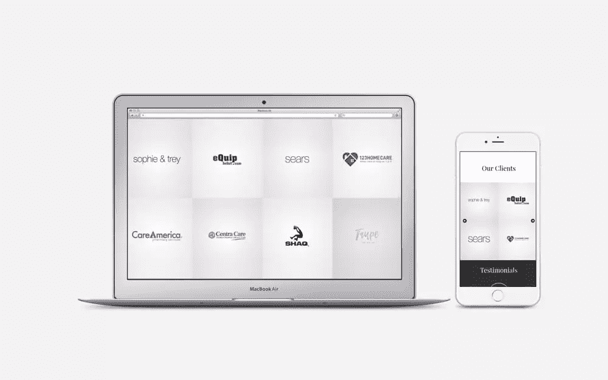

# 改进长滚动手机网站的 6 种方法

> 原文：<https://www.sitepoint.com/6-ways-to-improve-long-scroll-mobile-websites/>

在这个快速发展的数字世界中，设计师的目标是通过简化用户体验来帮助用户节省宝贵的时间。你的设计越简单，你能期待的转换就越多，因为我们现在生活在一个时代，移动设备占据了大部分市场份额，这有时会很棘手。

此外，手持设备越来越多地被用于网上购物，因此网站在移动设备上的可用性满足用户的期望是非常重要的。一个容易让用户失望的因素是**长滚动网站**。

## 为什么长滚动页面会有问题？

移动设备上的长滚动网站通常不受欢迎；在移动设备上，网站的整体高度自然会增加，因为在大多数情况下，水平元素会堆叠起来，如下图所示。这是不好的，因为长滚动网站打破了用户的兴趣，导致他们跳转到另一个网站。

下面重点介绍一下长卷网站的弊端。

### 滚动很快就会变得缓慢和无聊

当你为移动设备调整桌面布局时，内容通常会垂直堆叠，网页的整体高度会增加⏤，这会分散用户的注意力。重复滚动会很快惹恼用户，但是你可以通过在网站设计中采用移动优先的方法来避免这种情况。

### 导航可能不友好

你网站的导航结构很重要，无论是桌面*还是移动*网站。当你在一个网页上包含大量信息时，它会变得混乱(尤其是在移动设备上)，结果，用户很难到达他们想要的目的地。

### 页脚元素的障碍

页脚导航被认为是重要的，因为用户经常向下滚动到页脚来找到他们的下一个网页。如果你的移动设计太长，用户可能会发现很难导航到其他网页，这将增加跳出率(跳出率:在会话中只访问了一个网页的访问者的百分比)。

## 为什么要优化长滚动页面？

[根据 Smart Insights](http://www.smartinsights.com/mobile-marketing/mobile-marketing-analytics/mobile-marketing-statistics/) 的数据，48%的消费者使用搜索引擎进行移动研究。⏤的有机流量被认为是流量和转化率的主要来源。忽略长滚动页面的后果会给你的企业带来巨大的损失。

*来源:[表单堆栈](https://www.formstack.com/infographics/mobile-marketing-mistakes)。*

根据 Salesforce 的一份 [2016 年营销报告，68%的营销机构已经将移动营销战略整合到其整体营销战略中。仅仅这些事实就强调了采用适当的移动战略的重要性。](https://secure2.sfdcstatic.com/assets/pdf/misc/state-of-marketing-report-2016.pdf)

但是现在对于百万美元的问题:当你有如此多的内容要显示时，你如何优化移动网站的压倒性滚动结构？

让我们来看看。

## 1.遵循流行移动设备的标准尺寸

对于手机网站来说，没有一个需要遵循的标准高度。这最终取决于对你的访问者如何浏览移动网站的分析，但是建议一个移动网站应该在大约三到五个滚动条上可读。

我们还需要考虑当今各种移动设备的*视口*高度。默认情况下，所有最近的 iPhone(iPhone 6 和 iPhone 7 系列)都应该包括在内，但是，当涉及到 Android 时，很难确定应该考虑哪些品牌和哪些型号。看看 OpenSIgnal ⏤的这个[品牌细分分析，这肯定会让你知道哪些 Android 设备最受欢迎。](https://opensignal.com/reports/2015/08/android-fragmentation/)

根据上面的品牌碎片化分析，三星显然统治着 Android 设备市场。通过在最常用的设备上测试您的移动设计，您可以确保您的布局和内容针对大多数用户进行了优化。

另一个应该考虑的 Android 设备是谷歌 Nexus，因为它的[材料设计](https://www.sitepoint.com/practical-introduction-material-design-lite-google/)元素。设计师在这款设备上测试他们的设计是很常见的。

*来源:[AppBrain](https://www.appbrain.com/stats/top-android-phones)T3。*

## 2.定位 CTA 以充分利用第一卷

这里套用一句名言，*“你的第一印象可以是最后一个”*。第一次滚动实际上决定了用户是否应该点击后退按钮。核心信息和行动号召应该在第一个卷轴中就能看到，这样访问者就能很容易地找到他们想要的东西。

因此，我们的想法是在适当的时候插入 CTA，重要的信息(包括链接)应该方便地放在第一个滚动中，但是，不应该把这个*放得太远。你不应该用一堆行动号召来填充你的内容。*

我真的很喜欢 Sophie 和 Trey 的用户体验，无论是在桌面还是移动设备上。这是一个女性服装品牌，它成功地实现了一个非常平衡的移动网站设计。正如你在下面的截图中看到的，所有重要的元素都被完美的布局了。

## 3.避免花哨的滚动

视差滚动网站是创意网页设计行业的一个普遍趋势。这被认为是最好的讲故事技巧之一。尽管如此，T2 也有一些不能忽视的缺点。

*   视差滚动通常会增加网页加载的时间(尤其是在移动设备上)，这对用户体验和搜索引擎优化排名都是不利的
*   视差布局很难转化为移动设计，因为它使响应式设计难以实现。

## 4.隐藏手机上不必要的桌面元素

“简化的能力意味着消除不必要的东西，让必要的东西说话。”~汉斯·霍夫曼。

说到移动设计，你必须充分利用有限的空间。要非常具体、非常直接，只展示最关键的元素。

亚马逊在这方面做得非常出色。比较他们的桌面和移动布局，看看他们如何在移动设备上排除不必要的东西！

## 5.将产品和图像移至画廊

B2C 网站有时需要展示多种产品，*和*展示每种产品的多张图片。不幸的是，这自然增加了移动布局的整体页面高度。画廊(也称为滑块)可以解决这个问题。

画廊可以通过多种方式在手机上实现(取决于你的观众对技术的了解程度)。一种方法是引入水平滚动元素，这样，如果用户想滚动一个其他用户可能不想滚动的部分，他们不会被强迫这样做。

我们最近在新设计的网站上实现了这个功能，我们将客户列表转换成一个图库，用户可以随意滚动**和**。

## 6.消除重复元素

在桌面网站上，导航元素通常在页脚重复出现(以避免用户不得不向上滚动)。在移动设备上，为了让导航始终可用，你可以将它固定在网页的顶部(或者底部，这样更容易被拇指看到),并消除导航⏤的任何其他实例。这是一个例子，说明我们如何在移动布局中最小化不必要的对象，缩短它们的长度，并最终减少用户的滚动需求。

## 简单地

提升用户体验一直是全球品牌最关心的问题之一。用户总是对给他们提供价值的品牌感兴趣，不仅是他们的产品，还有他们提供的用户体验。当前这一代人正朝着移动优先的设计前进，为了在市场上与尖端竞争对手竞争，重要的是利用您的创造力，建立令人惊叹的用户体验，使其脱颖而出，成为您品牌的一部分。

## 分享这篇文章