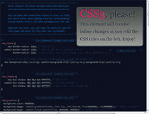
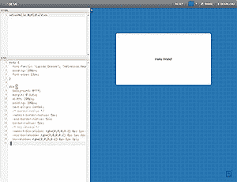
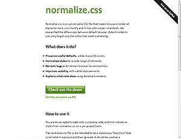
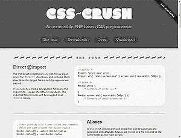
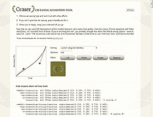
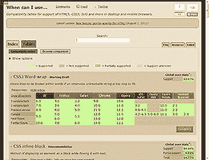

# 7 个最好的 CSS3 实用程序

> 原文：<https://www.sitepoint.com/7-best-css3-utilities/>

在搜索 CSS3 工具时，我发现了几个免费的工具，它们不是典型的[代码生成器](https://www.sitepoint.com/10-best-css3-code-generators/)或[字体工具](https://www.sitepoint.com/5-of-the-best-css3-font-tools/)。我希望你和我一样觉得这些有用…

## [CSS3 请](http://css3please.com/)

在所有的工具、实用程序和生成器中，我最喜欢使用 CSS3。这个概念很简单——它显示了一个具有可编辑的 CSS3 属性的元素。这是一个语法的快速提醒，并允许您使用不同的设置。强烈推荐。

## [CSSDesk ](http://cssdesk.com/)

CSSDesk 是由 pixelmatrixdesign.com 的乔希·派尔斯开发的工具。请类似 CSS3 有更少的开始样式，但界面更干净，你可以编辑 HTML。

## CSSPrefixer】

我承认供应商前缀是必要的，但它们仍然是一个痛苦。CSSPrefixer 可以让您的生活变得更简单——在框中粘贴一些无前缀的代码，它会返回所有需要的供应商前缀的替代代码。

或者，您可以安装一个 Python 应用程序来添加前缀并缩小您的 CSS 文件。

## normalize.css 

乍一看，normalize.css 似乎是另一个 css 重置。但它不是重置样式，而是将它们规范化，使它们在所有浏览器中保持一致。有用的默认值被保留，例如标题或输入边框的边距。

normalize.css 是一个很好的 css 起点，所有代码都有注释，因此您可以删除不必要的功能。

## [CSS 粉碎](http://the-echoplex.net/csscrush/)

像许多其他 CSS minifiers 一样，CSS-Crush 是一个 PHP 应用程序，它可以减小文件大小以加快页面加载速度。然而，它还有其他一些锦囊妙计:

*   变量—定义常用的字体、颜色或其他属性
*   自动@import 解析—所有 CSS 文件合并成一个文件
*   别名 CSS3 厂商前缀属性可以自动生成
*   宏—将代码片段转换成更长的代码
*   函数-在表达式中使用数学公式，例如宽度:百分比(480，960)；转换为宽度:50%；
*   图像可以导入并转换为数据 URIs。

## [CSS 缓和动画工具](http://matthewlein.com/ceaser/)

CSS3 的过渡是惊人的，但我们很少有人深入研究超越容易或线性选项。Ceaser 是一个易于使用的工具，提供了一系列的动画机会。选择标准或预设缓动类型，调整曲线并复制代码。

## [我什么时候可以使用… ](http://caniuse.com/)

caniuse.com 是网上最有用的 HTML5 和 CSS3 资源之一。搜索任何属性或 API 名称，以发现哪些桌面和移动浏览器支持该特性。该工具还提供了相关网站工具和教程的链接。现在就加入书签吧！

我错过了你最喜欢的 CSS3 工具吗？

## 分享这篇文章