# 你可以从《星球大战》中窃取的 7 个著名设计技巧

> 原文：<https://www.sitepoint.com/7-famous-design-hacks-you-can-steal-from-star-wars/>

《星球大战:新的希望》是《星球大战》系列的第一部电影，也是电影史上最成功的故事之一。这部电影的制作预算为[1100 万美元](https://www.geek.com/geek-cetera/star-wars-a-new-hope-would-have-cost-40-million-to-make-today-1458987/)，但在全球范围内却取得了超过 7 亿美元的票房。

正如那个时代的任何电影一样，乔治·卢卡斯的团队无法获得我们今天视为理所当然的令人瞠目结舌的数字动画能力。想象一下，在没有最基本的 CGI 帮助的情况下，必须在很远很远的地方创建一个全新的星系？

相反，他们完全使用传统的实际效果——混合使用[定格摄影、比例模型、哑光绘画和木偶戏技术](http://www.starwars.com/news/the-5-most-grueling-star-wars-visual-effects),让乔治·卢卡斯的宇宙栩栩如生。

2000 年，大型电影制作人成功地运用一些非常普通的设计手法制作了一系列革命性的电影，这些电影被一代又一代人引用。

最近重新看电影时，一些经典的设计技巧引起了我的注意，你可以在创建自己的信息图、网站和用户界面时应用它们。

## 黑客#1:深度

《星球大战》系列中使用得非常好的设计策略之一是深度。深度是通过在背景、中景和前景之间创造一种空间感来实现的。

### 《星球大战》中深度的运用:

许多《星球大战》电影都是由多个画面组成的，描绘了广阔的空间和广阔的风景。在这张 C-3PO 和 R2-D2 一起站在沙漠中的照片中，你可以看到深度的使用是如何创造出一种孤立感和距离感的。

沙漠似乎永无止境，与远处废弃的船只残骸相比，这两个角色看起来更近、更清晰。这是通过将场景分成三个部分[来添加纹理](https://www.sitepoint.com/texture-makes-it-better-use-texture-to-add-depth-to-your-illustrations/)来完成的，两个角色放在中间。

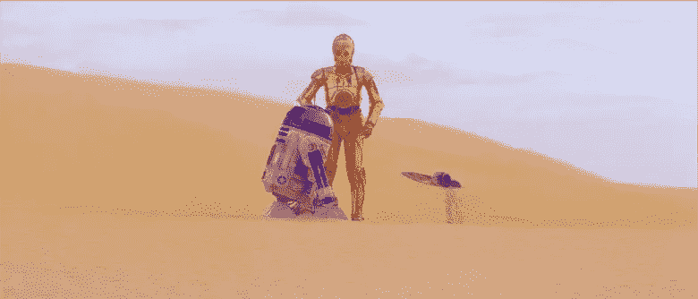

这让我们看到了距离的错觉。光影的使用让他们的身体看起来更加圆润，而背景中的船看起来更加扁平和模糊。

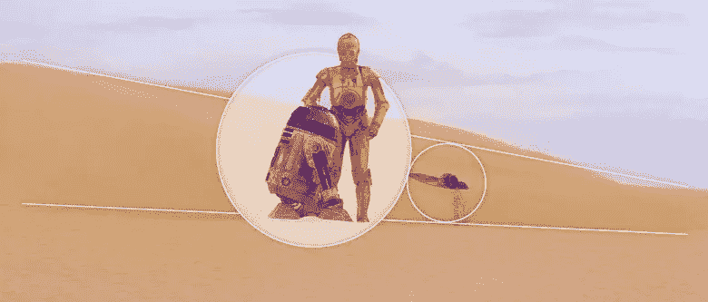

### 如何将深度应用到您自己的设计中:

当把这个原则应用到你自己的设计中时，试着把不同的元素重叠在前景、中间地带和背景上。这样做，你就能创造出直接看着焦点图像或设计的效果，而远处的其他形状看起来更远。

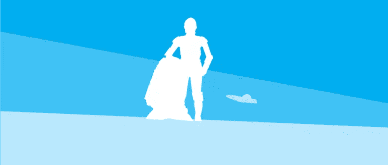

## 诀窍 2:使用对比

下一个设计技巧是创造对比。这是通过并排放置相对的视觉元素来实现的。这样做，你可以创造一个戏剧性的效果，尤其是当使用不同大小的对象。

### 《星球大战》中对比度的运用:

在这个《绝地归来》的例子中，我们可以看到故事中的主要英雄被展示在赫特人贾巴的大船旁边，在一个小得多的运输装置中。

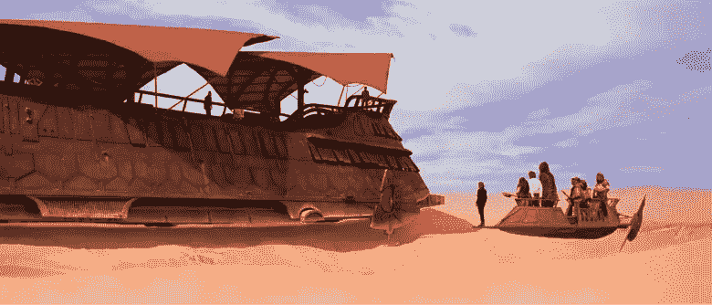

这尖锐地强调了赫特人贾巴船只的绝对优势和力量。通过对比这两艘船，我们的视线被吸引到小得多的运输船上。这就产生了紧张感，因为它离大船很近。

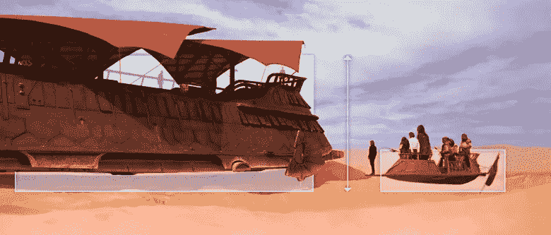

### 如何在自己的设计中运用对比:

当你试图在自己的工作中使用对比时，试着用尽可能多的物理对比来描述特定数据或信息的影响或重要性。这在许多需要一个数据集从另一个数据集中脱颖而出的信息图设计中很常见。

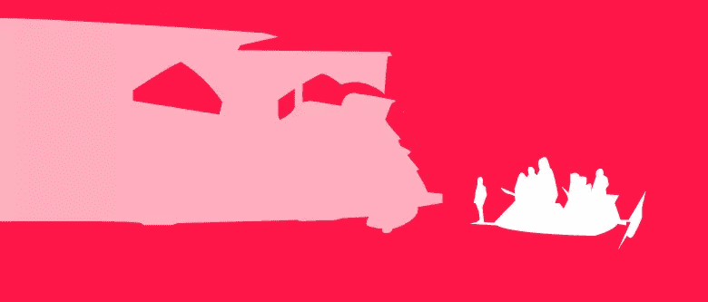

辉瑞的这个[信息图表示例说明了他们需要支付多少罚金，因为他们的利润:](https://venngage.com/blog/how-to-choose-the-best-charts-for-your-infographic/)

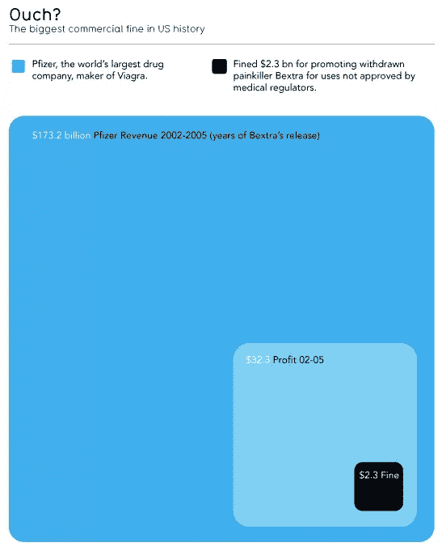

通过以这种方式展示数据，对比的使用告诉我们一个比单纯的数字更生动的故事。

## 黑客#3:利用负面空间

另一个使用的技巧是创造负空间。这样做是为了定义一个对象，并通过用空白包围它来使它成为焦点。这样做的目的是将注意力吸引到焦点上。使用[负空间](https://www.sitepoint.com/negative-space/)也提供了不同元素之间的视觉停顿，使观众或读者更容易消化和处理重要信息。

### 《星球大战》中如何使用负空间:

这是《新希望》中的一个场景，C-3PO 独自站在塔图因。沙漠充当了 C-3PO 周围的负空间。通过把这个角色描绘成一个孤独的人物，他受到了更多的关注。

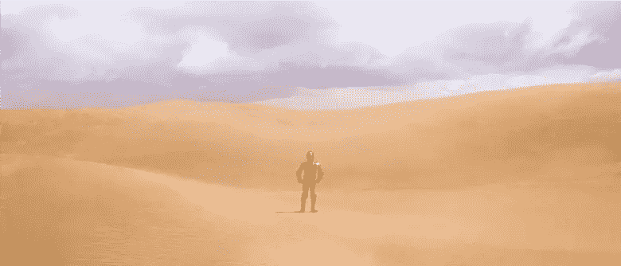

这也向观众传达了一个象征性的信息，帮助他们更好地理解角色的孤独感。

### 如何将负空间运用到你自己的设计中:

如果你想把你的观众的注意力集中在一个特定的物体上，避免把太多的物体聚集在一起。这使得人们很难区分不同的物品。你不想分散观众的注意力，你想把他们吸引到最重要的元素中。

假设你正在为一个网站设计一个定价页面。你可以在你想突出的一些主要特征周围使用负空间，或者在你想把人们推向的包装周围使用更多的负空间。

你也可以尝试将各种背景元素分层，以解决深度和负空间的问题。

这里有一个简单的例子，可以做到这一点:

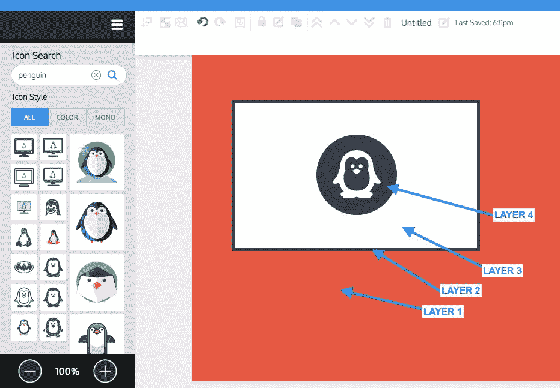

注意你的眼睛是如何完全被这张截图中的企鹅图标吸引的。

## 黑客#4:获得一些观点

透视用于创建动态合成。基于它们的位置，这让某些对象和图形看起来更突出。你可以用线条来引导视角，让你的观众感觉他们要么是角色，要么是场景本身。

### 《星球大战》中透视法的运用:

这是《绝地归来》的另一个镜头。这部电影以及整个《星球大战》系列之所以走在时代的前面，是因为从不同角度拍摄的各种飞船的内部和外部。

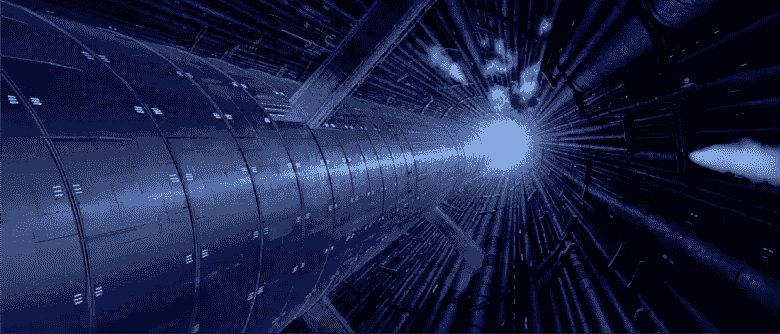

在早期电影中，船只的拍摄都是使用科林·坎特威尔创造的微型模型完成的。大型室内摄影经常将现场动作镜头与“玻璃哑光画”结合在一起—[精美的手绘玻璃框油画](https://www.youtube.com/watch?v=lQTdOcYK9Ds)。

为了传达广阔和细节的印象，电影制作人必须在他们组成每个场景的方式上非常有创造性。

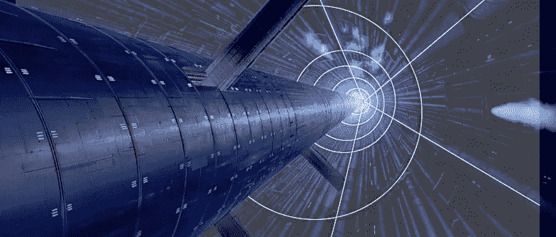

在这张图片中，你可以看到反应堆堆芯的直线是如何指向下方形成一个箭头形状的。这给人的感觉是我们在往下看。

底部光线的使用也增强了效果，将观众的目光吸引到核心的底部。你可能会意识到透视的使用与深度的使用有很多相似之处，这部分是因为两者都与背景、中间地带和前景中物体的位置和大小有很大关系。

### 如何将视角运用到自己的设计中:

当运用透视法时，从你想引导观众视线的焦点开始。从那个点向你画一些线，引导他们朝着你想让他们看的方向。

## 黑客#5:获得对称

现在我们进入第五步——在设计中使用**对称性**。[对称性](https://www.sitepoint.com/a-study-of-symmetry-when-where-and-why-to-use-it/)用于平衡设计，并且——你猜对了——突出其焦点物体。你可能会注意到这些设计技巧有一些共同点——它们都与将注意力集中到你整体创作的一个特定部分有关。

### 对称性在《星球大战》中的应用:

在《新希望》的这个场景中，你可以看到整齐划一的秩序。物体不平衡的镜头有时会让观众困惑，给人一种混乱的印象。有时这是一个有意识的决定，然而，如果你试图在一个特定的图像中提供平衡，对称是实现这一点的方法。

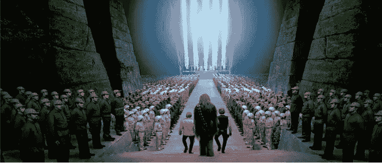

如你所见，卢克、汉·索洛和丘巴卡的两侧是一排排看上去一模一样的士兵。事实上，仔细看，你会看到大多数绿色前景的家伙是 4 或 5 名士兵的副本。很棘手，是吧？

当他们沿着一条笔直的道路前行时，你可以清楚地看到这些线条指向背景中的舞台。

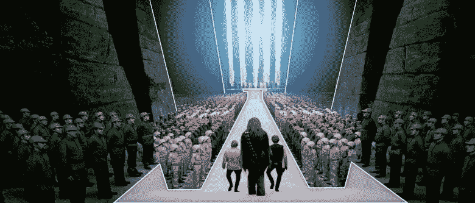

### 如何在自己的设计中运用对称性:

为了达到类似的效果，您可以通过在画布的每一侧镜像不同的设计组件，并将焦点对象放在构图的中间来创建对称。这里有一个大纲，这是如何在上面的镜头。

你能看到道路、舞台和人们是如何互为镜像的吗？

## 黑客#6:方向提示

接下来我们使用方向提示。与透视的使用类似，方向提示与帮助引导观众目光的视觉元素有关。它们帮助眼睛在不同的元素中导航，找到你想要人们注意的那个物体。

### 《星球大战》中如何使用方向提示:

现在，在《帝国反击战》的这个场景中，你能看到飞船走廊上的线条和灯光是如何将视线引向背景中的卢克·天行者的吗？我们现在知道卢克是这个场景的主要焦点，尽管事实上他不在前景中。

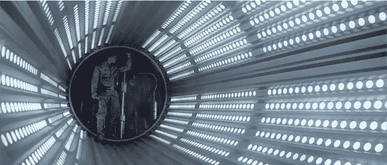

### 如何在自己的设计中应用方向提示:

从你希望观众看的地方开始。不像透视法的使用经常会给你的观众一种他们就在镜头中的印象，方向提示的使用主要是告诉你的观众确切地看哪里。

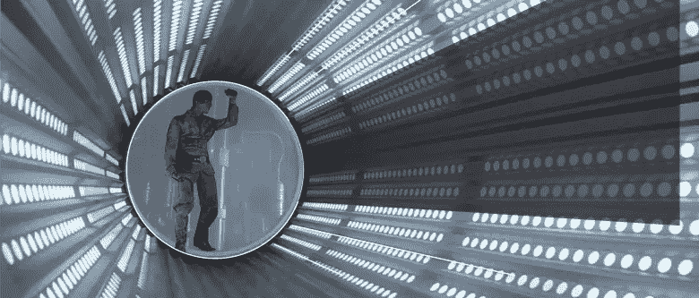

你可以突出一个要点或图像，方法是把它放在画布上，然后离开那个点，就像创建透视图一样。

## 第七招:重复

最后，我们有重复。这种设计手法通过使用重复的视觉元素来强调一个想法。因此，这可以在这些不同的元素之间产生一种统一感和力量感。

### 《星球大战》中如何使用重复:

《绝地归来》中的另一个空中场景显示帝国冲锋队人排成了队形。

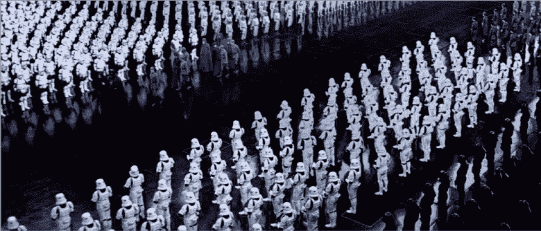

无休止的争吵创造了一个可怕的、统一的实体的感觉，强调了他们巨大的数量和力量。在这个镜头中，重复的使用也与沿着道路移动的人物形成了对比。相比之下，他们显得微不足道，孤立无援。

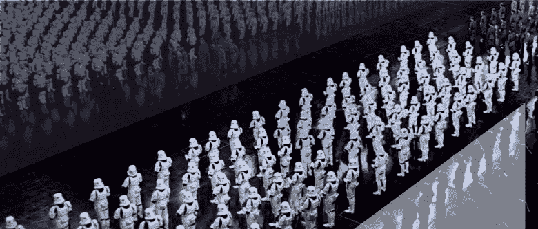

### 如何将重复运用到你自己的设计中:

这几乎是不言而喻的，但是为了在你自己的作品中实现这种设计技巧，在彼此接近的地方重复使用不同的图案、线条和颜色。这是为了让他们看起来都属于同一个组。

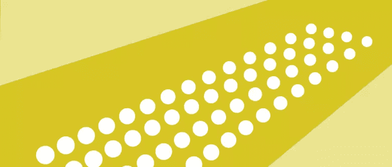

[象形图](https://venngage.com/blog/pictogram/)是一个用重复来表示数据的视觉手段的例子。您还可以使用象形图来引起对数据中异常值的注意或提供影响。

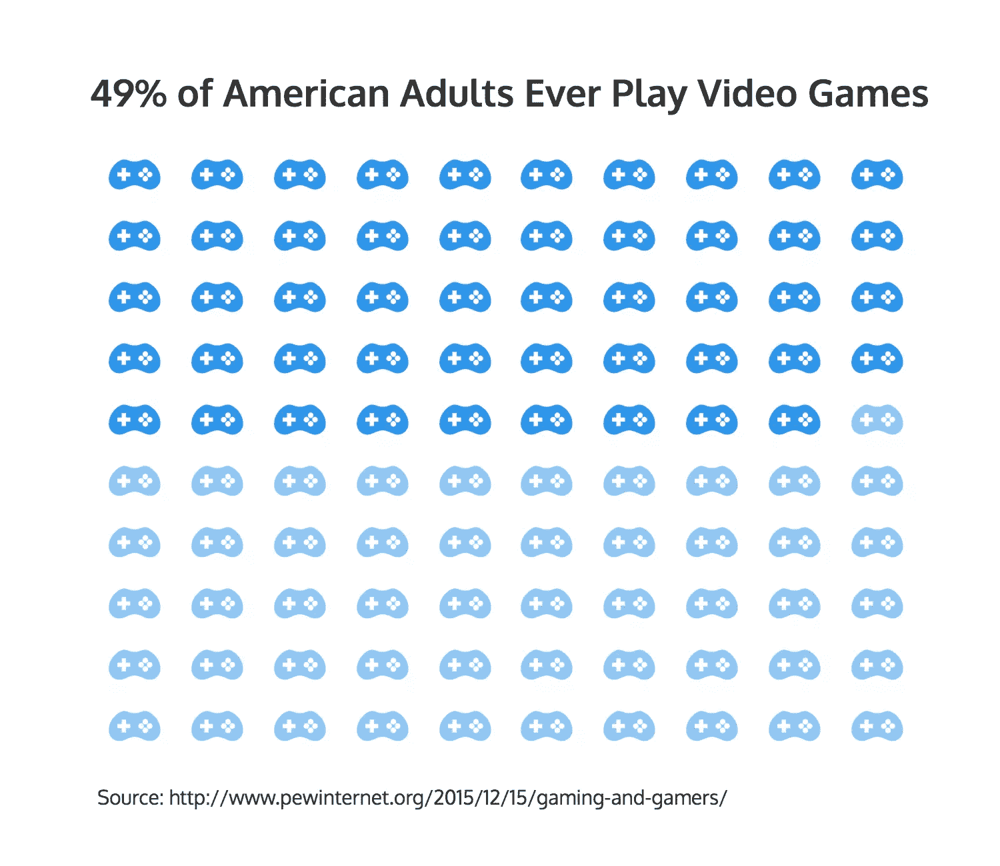

## “你全清楚了，孩子！现在让我们炸掉这个东西回家吧！”

《星球大战》如何以如此有创意的方式设法使用相对简单的设计和定位选择，从而能够创造一个丰富、可信的宇宙，而无需使用计算机化的特效，这真的令人难以置信。

结果，他们成功地使自己的风格与众不同，脱颖而出，最终成为有史以来一些更具革命性的电影。

通常不是技术、金钱或工具让我们的设计变得不同凡响。有时候，我们需要的只是正确的方法来吸引人们对最重要元素的注意。

## 分享这篇文章