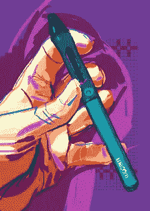
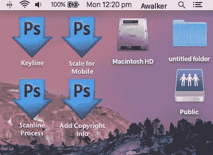
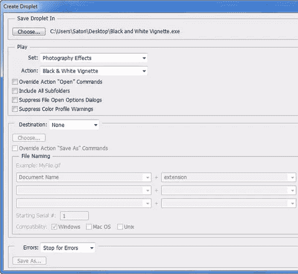
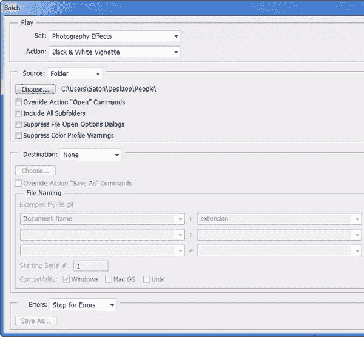
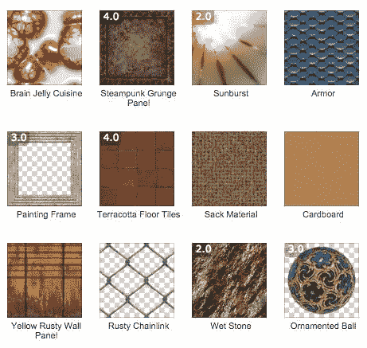
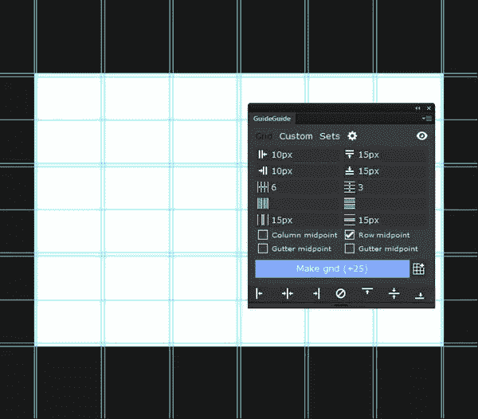
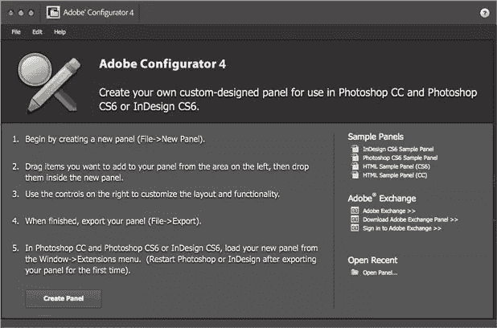
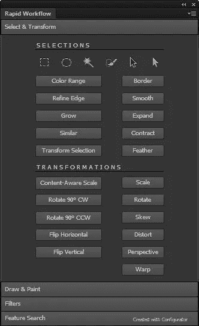

# 加快工作流程的 7 个 Photoshop Master 技巧

> 原文：<https://www.sitepoint.com/7-more-photoshop-master-tips-to-speed-up-your-workflow/>

速度和质量。

这是每个人在使用 Photoshop 时都在寻找的两种品质。这就是为什么知道如何完全自动化和优化您的工作流程是如此重要。

在[上一篇文章](https://www.sitepoint.com/7-photoshop-masters-tips-boost-productivity/)中，我们探索了一些可以帮助你提高工作效率的最佳技巧。现在，我们将检查另外七个技巧，重点是简化您使用 Photoshop 的工作方式。

同样，为了简洁起见，我们将主要讨论需要做什么，而不是本质细节。要获得更细致的指导，请深入研究 Photoshop 的文档，或者你可以在网上搜索实用的解决方案和教程。

### 1.学习和练习键盘快捷键

照片:塞布先生

当初学者开始使用 Photoshop 时，他们通常会通过遵循一组逻辑步骤来学习执行特定的任务。在他们从 A 点到 B 点的运动过程中，他们就像一列旅游列车，需要在沿途的每个小站停下来。

这没有错——我们都是这样开始的——但在某些时候，你必须加快步伐。一旦我们知道如何执行一个特定的任务，我们需要赶上那趟跳过中途站的快车。那个快车就是键盘快捷键！

这里有一个 [Photoshop 的默认键盘快捷键列表](https://helpx.adobe.com/photoshop/using/default-keyboard-shortcuts.html)。如果您喜欢其他快捷方式，您可以编辑现有的快捷方式，甚至为没有分配快捷方式的任务创建自己的快捷方式。只需进入**编辑>键盘快捷键**并进行必要的修改。

### 2.用图形输入板替换您的计算机鼠标

让我们面对现实吧:用鼠标画画是不自然的。铅笔的形状不像土豆是有原因的。

作品:[苏珊·墨陶](https://www.flickr.com/photos/suzi54241/10887952833)

第一次使用平板电脑可能会感觉有点奇怪，但一旦你习惯了使用它工作，你就会想知道没有它你是如何应付的。

一只手放在键盘上(记住那些键盘快捷键)，另一只手放在笔上，你的速度真的会在遮罩、润饰和矢量线条等任务上大幅提升。

购买绘图板时需要考虑的关键因素有:

*   #### Size

*   #### Sound pressure sensitivity

*   #### tilt sensitivity

*   #### Price

你不需要花很多钱，但如果你用 Photoshop 画画，你可能会发现一个具有倾斜敏感度的平板电脑很有用。

还有一些其他方便的功能，如触摸支持和快捷键，可以为您的工作流程增加一层额外的快速和舒适，但取决于您的预算。

照片:[【精细转向架】](https://www.flickr.com/photos/39224792@N07/5509439264/)

与其在这里讨论平板电脑的细节，我建议你去看看 [Parka 博客《2015 年优秀平板电脑买家指南》](http://www.parkablogs.com/content/which-graphics-drawing-tablet-buy-2015-non-display-types),里面有一份关于你需要什么样的平板电脑的总结。

就我个人而言，我使用一个旧的竹笔，没有倾斜敏感度，没有触摸支持，也没有快捷键，因为我一般不使用 Photoshop 来绘画或绘图。平板电脑非常适合进行选择，使用减淡和加深等工具。–我当前 Photoshop 工作所需的所有功能。

### 3.使用 Photoshop 的动作、Droplets 和脚本自动化您的工作流程

Photoshop 的操作可以成为你自动化武器库中最强大的武器之一。由多个步骤组成的任务可以通过一次单击自动执行。第一次记录一个动作需要时间，但是以后每次重复这个动作都可以节省时间。

假设您有一打想要转换成特定大小和分辨率的图像。您可以执行一次该任务，并将其保存为一个动作，而不是对每个图像重复转换。

在 Photoshop 中应用动作需要您:

*   打开动作面板
*   找到想要的动作
*   单击播放按钮

如果我们能以更快、更简单的方式进行这种手术，那不是很好吗？嗯……有这么一种方式，叫水滴。

### 利用水滴

droplet 是一种特殊的文件，由您创建并保存在硬盘上，包含您定义的特定操作。要应用该操作，您只需将图像拖到 droplet 上，然后..良好的..放下它。瞧！。

将图像拖放到一个液滴上。

最酷的是你甚至不用打开 Photoshop！

除了操作之外，还有一种类似的方法来自动化您的工作流。Photoshop 允许您使用内置或用户创建的脚本。脚本比标准动作更灵活、更强大，因为它可以根据特定条件改变自己的行为——但要编写它，你至少需要掌握相当不错的 JavaScript 工作知识。

用 Photoshop 创建水滴

这不是什么大问题。有很多其他人构建的脚本可供您下载和使用。另一方面，如果你懂 JavaScript，你肯定可以利用编写自己的定制脚本的优势。

### 4.全部处理

问题是这样的:你有一堆图像，你需要把它们裁剪成一定的大小，把它们变成黑白的，并给每一张图像添加一个晕影效果(也许用不同的格式保存它们)。

听起来像一个很好的行动候选人，对不对？

当然，您*可以*创建这样一个动作，但是要对成百上千的图像运行它，您仍然需要打开每张图像并单独对一张图像应用该动作。这听起来绝对不是一次令人兴奋的经历。

那么，我们能做什么呢？

解决方案是利用 Photoshop 的功能对多个文件执行操作。

*   **使用批处理命令。**批处理命令对整个图像文件夹执行操作。因此，您可以将图像放在一个文件夹中，并使用批处理命令将所选操作应用到所有图像。
*   **用一滴。**一个 droplet 可以用于多个图像文件。创建一个液滴非常类似于批处理。但在这种情况下，批处理会存储为包含所有预置的文件。要在多个文件上使用 droplet，您需要选择要应用 droplet 的所有图像文件，然后将它们拖放到 droplet 上。
*   **使用图像处理器脚本。**图像处理器脚本允许您在不需要操作的情况下转换多个图像并调整其大小，就像批处理命令一样。但是如果你需要，你也可以使用动作。

### 5.使用滤镜和插件扩展 Photoshop 的功能

如果你的目标是速度和效率，那就不应该重新发明轮子。有很多插件可以帮你完成这项艰巨的工作。

过滤器锻造

虽然默认的 Photoshop 的滤镜组很有表现力，但是还有更多可以帮助你的工作流程。虽然我避免让 Photoshop 过载第三方滤镜，但我的系统中有一些“必备”滤镜。它们包括:

*   免费的完美效果 9 这个免费的套装给你提供了各种各样的照片效果和滤镜供你尝试。
*   这个付费的软件包为你提供了一个巨大的现实效果集，在 Photoshop 中从头开始创建将是困难和耗时的。
*   这个插件不仅可以让你访问成千上万的过滤器，还可以让你创建自己的过滤器。

### 6.用额外的扩展来填补 Photoshop“缺失”的功能

世界上没有任何应用程序能够提供真正的一体化功能集。虽然 Photoshop 是有史以来功能最丰富的应用程序之一，但偶尔你会发现特定任务的“功能漏洞”。

但是，不要害怕！就像吃了一颗神奇的药丸，你可以用扩展的形式‘回填’功能。我给你举个例子。

到目前为止，在 Photoshop 中使用参考线和网格是一项相对乏味的任务，这使得使用网站模板、技术绘图和哑光绘画变得更加困难。值得庆幸的是，创建快速灵活的网格的能力在最新版本的 Photoshop CC 中得到了极大的提高。

但是 Photoshop CS6 或者 CS5 的用户呢？

没必要担心。Photoshop CS6 可以使用扩展功能，通过安装 [GuideGuide](http://guideguide.me/) 扩展来添加“缺失”的功能，在某些方面，它甚至比最新的 Photoshop 提供的功能更好。

导游导游

扩展通常是免费的，这使得它们成为完全软件升级的一个非常可行的替代方案。

### 7.创建您自己的自定义 Photoshop 面板

最后，这里有一个鲜为人知的事实。即使是最有经验的 Photoshop 老用户也不知道 Adobe 提供了一个为 Photoshop(和 InDesign)创建定制面板的工具，叫做[配置器](http://labs.adobe.com/technologies/configurator/)。

Adobe Configurator:创建您自己的面板和调色板。

这个工具是免费的，可以帮助你不用写一行代码就可以定制 Photoshop 的界面。你只需要在一个所见即所得的界面中设计你想要的面板，导出它并使用它。

很简单，很好玩，也很有用。在几个小时内，您可以创建一个有用的自定义面板，它可以为您服务，只要您愿意，并节省您大量的时间。

要了解过程和最终结果，请参见本 [Adobe Configurator 教程](http://design.tutsplus.com/tutorials/speed-up-your-photoshop-cs5-workflow-by-making-your-own-custom-panels--psd-11023)。这有点过时，但仍然是配置器功能的一个很好的例子。

## 摘要

用 Photoshop 工作主要有两个原则:[吻](https://en.wikipedia.org/wiki/KISS_principle)和[干](https://en.wikipedia.org/wiki/Don%27t_repeat_yourself)。在 Photoshop 中，总是试图找到最短、最快、最简单和最有效的方法来完成特定的任务。

无论你是摄影师、画家还是设计师；遵循上面的建议应该会极大地改善你的工作流程，帮助你事半功倍。

## 分享这篇文章