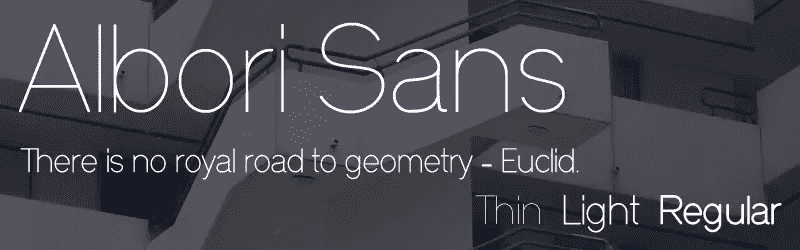
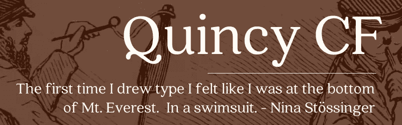
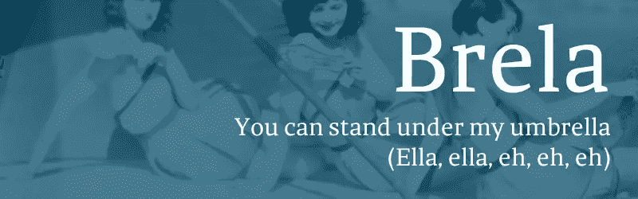
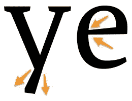
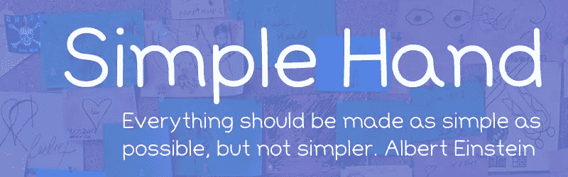
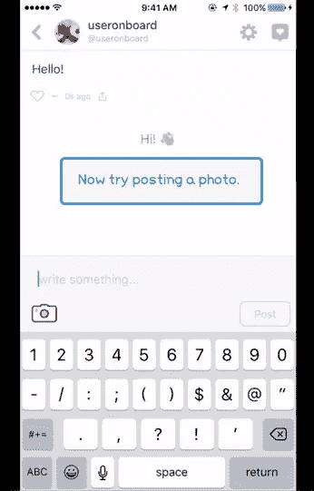
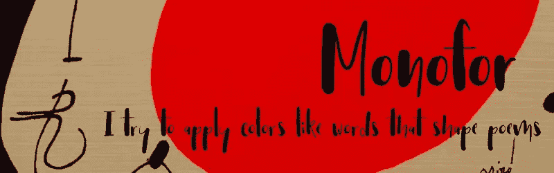
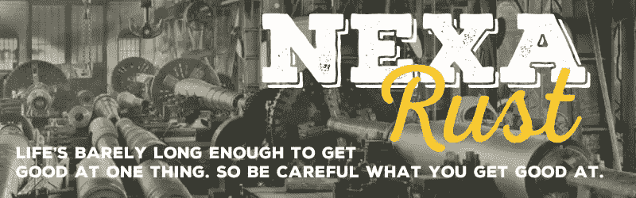

# 7 种你可能没有考虑过使用的新字体(…但是应该使用)

> 原文：<https://www.sitepoint.com/7-new-fonts-you-probably-havent-considered-using-but-should/>

*本文由 [The Hungry JPEG](https://thehungryjpeg.com/) 赞助。感谢您对使 SitePoint 成为可能的赞助商的支持。*

除了几个明显的例外，伟大的字体不像流行唱片那样。它们不会像燃烧的彗星一样到来，明亮地燃烧，然后很快消失在夜色中。

印刷术更像是一种缓慢的燃烧——就像一场伟大的非百老汇舞台剧。在一年的过程中，你可能会听到窃窃私语，逐渐升温的评论和慢慢增加的嗡嗡声。你应该买张票，对吧？

但是然后砰！该节目在百老汇热播，现在是城里最热门的节目。你错过了机会。

今天，我想聚焦 7 种字体，我希望它们正走向百老汇。每一个都经过精心设计，独一无二，价格不到 20 美元。

## 1.阿尔博里桑斯

让我们从 [Albori Sans](https://thehungryjpeg.com/product/1822-albori-sans-serif/) 开始——一种激光般锐利的几何包豪斯更新。这是一种字体，看起来好像是在自行车车间制作的。我很想看到它用在霓虹灯招牌上。

它有薄、轻、普通的重量，但在较大的尺寸中，我认为它在激光薄的种类中看起来最好。

**可能用途**:高端设计、科学、工程、建筑、高等教育、工业设计、航空航天。

*   曼科夫
*   链接:[饥饿 JPEG](https://thehungryjpeg.com/product/1822-albori-sans-serif/)
*   价格:10 美元

## 2.昆西 CF

Quincy 有一个特别可爱的大写字母“Q ”,我怀疑这解释了为什么选择这个名字——一个炫耀 Q 的机会。这是一种圆形的，书卷气的衬线字体，适合在正文和标题中使用。它有 10 种重量可供选择。

我喜欢昆西，因为它融合了其他大牌衬线字体的一些优点。它有着卡斯龙的老派优雅，却没有沉闷。它有一些 T2·库珀的魅力，但没有笨拙，同时带来了佐治亚州的明智的体面。

低 x 高度意味着这是一种从不大喊大叫的字体，但总是以令人信服、深思的语气说话。我可以看到昆西在食品、古典音乐或时尚博客方面表现出色。

**可能用途**:烹饪、创意写作、时尚、音乐、手工艺、杂志版面。

*   由康纳利·法詹
*   链接:[饥饿 JPEG](https://thehungryjpeg.com/product/288-quincy-cf-font-family/)
*   价格:15 美元

## 3\. Brela

布雷拉是一个尖锐的衬线与金属切割冲压它。尽管大多数象形文字保持着对称和平衡感，但一些字符有一种活泼的边缘，给了布雷拉额外的生命。例如:

*   小写的“y”有一个略呈楔形的尾巴
*   小写字母 e 有一个逐渐变细的横杠

布雷拉只有一个重量，但嘿，这是免费的。你不劳而获想要什么？

重量缺乏多样性可能会阻止你在任何需要多样性的角色中使用它——例如杂志版面。然而，这种略带不敬的优势使 Brela 非常适合任何需要新贵品质的品牌——这可能意味着从金融服务初创公司到市中心咖啡馆的任何东西。

**可能用途**:创业公司，数字出版，文案。

*   由[马卡斯卡工作室](http://makarskaestudio.com/)
*   [链接](http://makarskaestudio.com/Brela-Free-Download)
*   价格:免费

## 4.马德拉斯

Madras 是一种抛光精美的无衬线字体，非常清晰，如果需要，可以用于街道标志。布里斯班的设计师 Thomas Gillett 创造了一个拥有 7 种重量和匹配斜体的系列，你可以免费试用其中的两种(额外的轻斜体和额外的粗斜体)。

这是一个非常令人印象深刻和全面的包，包括所有的数字，标点符号，连字，拉丁文支持，特殊字符和箭头。

就用法而言，Madras 非常灵活，它可能会更快地列出它不适合的应用程序。

*   作者托马斯·吉列
*   [链接](http://www.fontfabric.com/madras-free-font/)
*   价格:10 美元起(两个砝码免费)

## 5.简单的手

我知道你在想什么:“*说真的！手写字体？…这是什么？漫画无欣赏日？“但是请原谅我——我有我的理由。

'[简单手【T1]'可爱吗？](https://thehungryjpeg.com/product/1706-simple-hand-handwritten-font/)

它是圆滑的还是专业的？

大概不会。然而，我认为在当前的设计环境下,是否有理想的用例。

*图片来源:[https://www.useronboard.com/](https://www.useronboard.com/)T3*

对于应用程序和网络来说,“用户加入”的过程现在被认为是保持你所吸引的用户的绝对关键的一部分。这就像第一次有导游带你浏览应用程序一样。

大多数入职流程都建立在你的应用之上，所以能够从实际应用中识别出这个临时指南通常是很重要的。手写字体是保持清晰分隔的好方法。

[简单的手](https://thehungryjpeg.com/product/1706-simple-hand-handwritten-font/)非常清晰、友好、平易近人。换句话说，非常适合入职所需的对话式指导。

**可能的用途**:入职、学校、社区服务。

*   由[方项目](https://thehungryjpeg.com/side-project/)
*   链接:[饥饿 JPEG](https://thehungryjpeg.com/product/1706-simple-hand-handwritten-font/)
*   价格:10 美元

## 6.Monofor

Monofor 是一种让我想起西班牙画家[胡安·米罗](https://en.wikipedia.org/wiki/Joan_Mir%C3%B3)的字体。喜欢他，活泼泼辣却不咄咄逼人。既松散又直接。

就个人而言，我认为目前有太多的书法“潦草”字体，但 Monofor 指出了一些新鲜、原创的领域。

Monofor 给我的印象是一种很好的品牌字体，可以用于菜单标题、节日节目指南或电影海报等任何东西。请注意，它包括一个替代字母版本，以增加额外的变化。

**可能用途**:美食、艺术、节日、旅游、葡萄酒、爵士乐、戏剧。

*   由 Vuuuds
*   链接:HungryJPEG
*   价格:10 美元

## 7.Nexa 锈病

两年多来，质朴的“作坊制作”外观一直是标志设计中的亮点。虽然它有时可能有点过于可爱，但我认为 Nexa Rust 设法找到了正确的平衡，并提供了大量的多样性。

Nexa 包装有五种型号:

*   **石板**:有阴影的仿旧石板
*   **无**:无衬线的所有上勾
*   **手写体**:草书脸
*   手工制作的(我不太喜欢这个)
*   额外物品:手工切割的乡村主题装饰品(锤子、农具、辣椒)

**可能用途**:男性理发师、服装品牌、皮革制品、历史出版物、汽车出版物、有机农产品。

*   按字体结构
*   链接:[字体工厂](http://www.fontfabric.com/nexa-rust-free-font/)
*   价格:全套 17 美元(或免费 5 美元)

## 抓住他们

这就是了。七种精心制作的原创字体，让您的设计充满乐趣。也许这不是一个辉煌的七，但每张不到 20 美元，我认为你可以说它们是幸运的七。

Hungry JPEG 仅在三月份推出，它提供了一个包，其中包括本文中提到的几种字体。总共包括超过 38 种字体和 9 个图形包。你只需花 29 美元就能买到它。

## 分享这篇文章