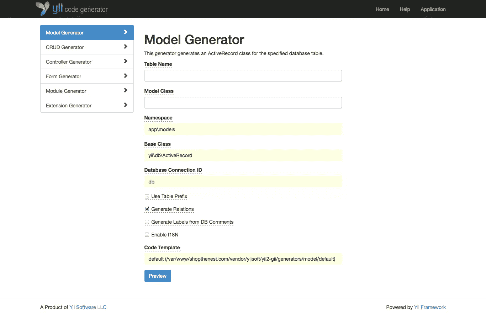

# 选择 Yii 2 框架的 7 个理由

> 原文：<https://www.sitepoint.com/7-reasons-choose-yii-2-framework/>

去年晚些时候，SitePoint 发表了一篇文章,重点介绍了顶级 PHP 框架。并列第四的是 Yii(发音为*)框架。当时，可用的框架的最新版本是 1.1.14。最近，Yii 2.0 发布了，所以您可以开始在生产中使用它。*

 *虽然我们最近[在它还处于 RC 状态时](https://www.sitepoint.com/expect-yii-2-0/)报道了它，但它刚刚达到完全发布状态，我们觉得是时候重新讨论这个话题了，并给出一些选择它而不是替代方案的理由。

## 1.易于安装

对于 web 开发人员来说，时间就是金钱，没有人愿意把宝贵的时间花在复杂的安装和配置过程上。

使用 [Composer](http://getcomposer.org) 处理安装。如果你想要安装过程的描述，Sitepoint 最近发表了一篇很棒的文章[在这里](https://www.sitepoint.com/expect-yii-2-0/)。我倾向于使用基本的应用程序模板，即使我的站点有独立的前端和后端组件。相反，我选择使用一个[模块](http://www.yiiframework.com/doc-2.0/guide-structure-modules.html)作为我网站的后端部分。(Yii 模块最好被描述为驻留在主应用程序中的迷你应用程序)。

*注意*:后面例子中的许多目录引用使用简单模板中的目录结构。

## 2.利用现代技术

Yii 是一个纯粹的 OOP 框架，利用了 PHP 的一些更高级的特性，包括[后期静态绑定](http://php.net/manual/en/language.oop5.late-static-bindings.php)、 [SPL 类和接口](http://php.net/manual/en/book.spl.php)和[匿名函数](http://php.net/manual/en/functions.anonymous.php)。

所有的类都有命名空间，这允许你利用他们的 PSR-4 兼容的自动加载器。这意味着包含 Yii 的 [HTML](http://www.yiiframework.com/doc-2.0/yii-helpers-basehtml.html) 助手类就像:

```
use yii\helpers\Html;
```

Yii 还允许您定义别名来帮助简化名称空间。在上面的例子中，`use`语句将加载一个类定义，默认情况下它位于目录`/vendor/yiisoft/yii2/helpers`中。这个别名在第 79 行的 [BaseYii](http://www.yiiframework.com/doc-2.0/yii-baseyii.html) 类中定义:

```
public static $aliases = ['@yii' => __DIR__];
```

框架本身是使用 Composer 安装的，其扩展也是如此。甚至发布扩展的过程也像创建自己的`composer.json`，在 Github 上托管代码，在 Packagist 上列出您的扩展一样简单。

## 3.高度可扩展

Yii 就像一套现成的西装，看起来很棒，但也很容易根据您的需求量身定制。几乎框架的每个组件都是可扩展的。一个简单的例子是向视图添加一个惟一的 body ID。(如果你有兴趣知道你为什么想这么做，看看这篇[文章](http://css-tricks.com/id-your-body-for-greater-css-control-and-specificity/))。

首先，我将在我的`app\components`目录中创建一个名为`View.php`的文件，并添加以下内容:

```
namespace app\components;

class View extends yii\web\View {

    public $bodyId;

    /* Yii allows you to add magic getter methods by prefacing method names with "get" */

    public function getBodyIdAttribute() {
        return ($this->bodyId != '') ? 'id="' . $this->bodyId . '"' : '';
    }

}
```

然后，在我的主布局文件(`app\views\layouts\main.php`)中，我将以下内容添加到我的 HTML 的 body 标签中:

```
<body <?=$this->BodyIdAttribute?>>
```

最后，我将把下面的内容添加到我的主配置文件中，让 Yii 知道使用我的扩展的`View`类，而不是它自己的默认类:

```
return [
    // ...
    'components' => [
        // ...
        'view' => [
            'class' => 'app\components\View'
        ]   
    ]
];
```

## 4.鼓励测试

Yii 与[共知](https://www.sitepoint.com/ruling-the-swarm-of-tests-with-codeception/)紧密集成。Codeception 是一个很棒的 PHP 测试框架，它有助于简化为您的应用程序创建单元、功能和验收测试的过程。因为你正在为你所有的应用程序编写自动化测试，对吗？

Codeception 扩展使得在测试过程中配置应用程序变得简单。只需编辑提供的`/tests/_config.php`文件来配置您的测试应用程序。例如:

```
return [
    'components' => [
        'mail' => [
            'useFileTransport' => true,
        ],
        'urlManager' => [
            'showScriptName' => true,
        ],
        'db' => [
                'dsn' => 'mysql:host=localhost;dbname=mysqldb_test',
        ],
    ],
];
```

使用这种配置，会发生以下情况:

1.  在您的功能和验收测试期间发送的任何电子邮件将被写入一个文件，而不是被发送。
2.  测试中的 URL 将采用格式`index.php/controller/action`而不是`/controller/action`
3.  您的测试将使用您的测试数据库，而不是您的生产数据库。

Codeception 中还存在 Yii 框架的一个特殊模块。它向`TestGuy`类添加了几个方法，帮助你在功能测试中使用[活动记录](http://www.yiiframework.com/doc-2.0/guide-db-active-record.html) (Yii 的 ORM)。例如，如果您想查看您的注册表单是否成功地创建了一个用户名为“testuser”的新的`User`，您可以执行以下操作:

```
$I->amOnPage('register');
$I->fillField('username', 'testuser');
$I->fillField('password', 'qwerty');
$I->click('Register');
$I->seeRecord('app\models\User', array('name' => 'testuser'));
```

## 5.简化安全性

安全性对于任何 web 应用程序来说都是至关重要的，幸运的是 Yii 有一些很棒的特性可以帮助您放松。

Yii 附带了一个[安全](http://www.yiiframework.com/doc-2.0/yii-base-security.html)应用程序组件，它公开了几种方法来帮助创建一个更安全的应用程序。一些更有用的方法是:

*   [generatePasswordHash](http://www.yiiframework.com/doc-2.0/yii-base-security.html#generatePasswordHash%28%29-detail) :从密码和随机盐生成一个安全哈希。这个方法为您随机生成一个 salt，然后使用 PHP 的 [crypt](http://php.net/manual/en/function.crypt.php "PHP Crypt Function") 函数从提供的字符串创建一个 hash。
*   [validatePassword](http://www.yiiframework.com/doc-2.0/yii-base-security.html#validatePassword%28%29-detail) :这是`generatePasswordHash`的配套功能，允许您检查用户提供的密码是否与您存储的哈希匹配。
*   [generateRandomKey](http://www.yiiframework.com/doc-2.0/yii-base-security.html#generateRandomKey%28%29-detail) :允许你创建任意长度的随机字符串

Yii 会自动检查所有不安全的 HTTP 请求方法(PUT、POST、DELETE)上的有效 CSRF 令牌，并且会在您使用 [ActiveForm::begin()](http://www.yiiframework.com/doc-2.0/yii-base-widget.html#begin%28%29-detail) 方法创建开始表单标记时生成并输出一个令牌。可以通过编辑主配置文件来禁用此功能，使其包含以下内容:

```
return [
        'components' => [
            'request' => [
                'enableCsrfValidation' => false,
            ]
    ];
```

为了防范 XSS，Yii 提供了另一个名为 [HtmlPurifier](http://www.yiiframework.com/doc-2.0/yii-helpers-basehtmlpurifier.html) 的助手类。这个类有一个名为[进程](http://www.yiiframework.com/doc-2.0/yii-helpers-basehtmlpurifier.html#process%28%29-detail)的静态方法，将使用同名的[流行过滤器库](http://htmlpurifier.org/)过滤你的输出。

Yii 还包括用于用户认证和授权的现成类。授权分为两种类型:ACF(访问控制过滤器)和 RBAC(基于角色的访问控制)。

两者中较简单的是 ACF，它是通过向控制器的[行为](http://www.yiiframework.com/doc-2.0/yii-base-component.html#behaviors%28%29-detail)方法添加以下内容来实现的:

```
use yii\filters\AccessControl;

class DefaultController extends Controller {
    // ...
    public function behaviors() {
        return [
            // ...
            'class' => AccessControl::className(),
            'only' => ['create', 'login', 'view'],
                'rules' => [
                [
                    'allow' => true,
                    'actions' => ['login', 'view'],
                    'roles' => ['?']
                ],
                [
                    'allow' => true,
                    'actions' => ['create'],
                    'roles' => ['@']
                ]
            ]
        ];
    }
    // ...
}
```

前面的代码告诉`DefaultController`允许访客用户访问`login`和`view`动作，但不允许访问`create`动作。(`?`是匿名用户的别名，`@`是指认证用户)。

RBAC 是指定哪些用户可以在整个应用程序中执行特定操作的更强大的方法。它包括为您的用户创建角色，为您的应用程序定义权限，然后为他们的预期角色启用这些权限。如果您想要创建一个`Moderator`角色，并允许分配给该角色的所有用户批准文章，您可以使用这种方法。

您还可以使用 RBAC 定义规则，它允许您在特定条件下授予对应用程序某些方面的访问权限。例如，您可以创建一个规则，允许用户编辑他们自己的文章，但不允许编辑其他人创建的文章。

## 6.缩短开发时间

大多数项目都包含一定量的重复任务，没有人愿意浪费时间。Yii 给了我们一些工具来帮助你花更少的时间在这些任务上，而花更多的时间来定制你的应用来满足你的客户的需求。

这些工具中最强大的一个被称为“Gii”。Gii 是一个基于 web 的代码搭建工具，它允许您为以下各项快速创建代码模板:

*   模型
*   控制器
*   形式
*   模块
*   扩展ˌ扩张
*   CRUD 控制器动作和视图

Gii 是高度可配置的。您可以将其设置为仅在特定环境下加载。只需编辑您的 web 配置文件，如下所示:

```
if (YII_ENV_DEV) {
    // ...
    $config['modules']['gii'] = [
        'class' => 'yii\gii\Module',
        'allowedIPs' => ['127.0.0.1', '::1']
    ]
}
```

这确保了 Gii 仅在 Yii 环境变量设置为 *development* 时加载，并且仅在通过 localhost 访问时加载。

现在让我们来看看模型生成器:



表名使用一个 typeahead 小部件来尝试猜测您的模型与哪个表相关联，并且所有字段都有一个滚动工具提示来提醒您如何填写它们。您可以在请求 Gii 生成代码之前预览代码，并且所有的代码模板都是完全可定制的。

还有几个命令行工具可以帮助为数据库迁移、消息翻译(I18N)和自动化测试的数据库设备创建代码模板。例如，您可以使用以下命令创建一个新的[数据库迁移](http://www.yiiframework.com/doc-2.0/guide-db-migrations.html)文件:

```
yii migrate/create create_user_table
```

这将在{appdir}/migrations 中创建新的迁移模板，如下所示:

```
<?php

    use yii\db\Schema;

    class m140924_153425_create_user_table extends \yii\db\Migration
    {
        public function up()
        {

        }

        public function down()
        {
            echo "m140924_153425_create_user_table cannot be reverted.\n";

            return false;
        }
}
```

假设我想在这个表中添加几列。我将简单地在`up`方法中添加以下内容:

```
public function up()
{
    $this->createTable('user', [
        'id' => Schema::TYPE_PK,
        'username' => Schema::TYPE_STRING . ' NOT NULL',
        'password_hash' => Schema:: TYPE_STRING . ' NOT NULL'
    ], null);
}
```

然后，为了确保我可以反向迁移，我将编辑`down`方法:

```
public function down()
{
    $this->dropTable('user');
}
```

创建表只需要在命令行上运行一个命令:

```
./yii migrate
```

要移除表格:

```
./yii migrate/down
```

## 7.易于调整以获得更好的性能

众所周知，速度慢的网站会让用户不满，所以 Yii 提供了一些工具来帮助你提高应用程序的速度。

所有 Yii 的缓存组件都从 [yii/caching/Cache](http://www.yiiframework.com/doc-2.0/yii-caching-cache.html) 扩展而来，这允许您在使用一个通用 API 的同时选择您想要的任何缓存系统。您甚至可以同时注册多个缓存组件。Yii 目前支持数据库和文件系统缓存，以及 APC、Memcache、Redis、WinCache、XCache 和 Zend 数据缓存。

默认情况下，如果您使用活动记录，那么 Yii 会运行一个额外的查询来确定生成模型所涉及的表的模式。您可以通过编辑主配置文件，将应用程序设置为缓存这些模式，如下所示:

```
return [
    // ...
    'components' => [
        // ...
        'db' => [
            // ...
            'enableSchemaCache' => true,
            'schemaCacheDuration' => 3600,
            'schemaCache' => 'cache',
        ],
        'cache' => [
            'class' => 'yii\caching\FileCache',
        ],
    ],
];
```

最后，Yii 有一个命令行工具来简化前端资产。只需运行以下命令来生成配置模板:

```
./yii asset/template config.php
```

然后编辑配置，指定您希望使用哪些工具来执行缩小操作(例如闭包编译器、YUI 压缩器或 UglifyJS)。生成的配置模板将如下所示:

```
<?php
    return [
        'jsCompressor' => 'java -jar compiler.jar --js {from} --js_output_file {to}',
        'cssCompressor' => 'java -jar yuicompressor.jar --type css {from} -o {to}',
        'bundles' => [
            // 'yii\web\YiiAsset',
            // 'yii\web\JqueryAsset',
        ],
        'targets' => [
            'app\config\AllAsset' => [
                'basePath' => 'path/to/web',
                'baseUrl' => '',
                'js' => 'js/all-{hash}.js',
                'css' => 'css/all-{hash}.css',
            ],
        ],
        'assetManager' => [
            'basePath' => __DIR__,
            'baseUrl' => '',
        ],
    ];
```

接下来，运行此控制台命令来执行压缩。

```
yii asset config.php /app/assets_compressed.php
```

最后，编辑您的 web 应用程序配置文件以使用压缩的资产。

```
'components' => [
    // ...
    'assetManager' => [
        'bundles' => require '/app/assets_compressed.php'
    ]
]
```

*注意:*您必须手动下载并安装这些外部工具。

## 结论

像任何好的框架一样，Yii 帮助你快速创建现代 web 应用程序，并确保它们运行良好。它通过为你做许多繁重的工作来推动你创建安全的和可测试的站点。您可以完全按照提供的方式轻松使用它的大部分功能，也可以根据自己的需要修改每一项功能。我真的鼓励你为你的下一个网络项目检查它！

你试过 Yii 2 吗？你会吗？让我们知道！

## 分享这篇文章*