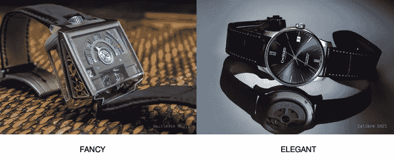
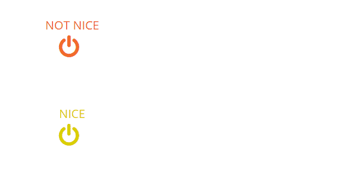
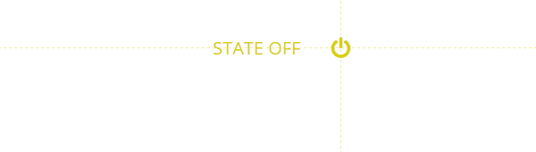
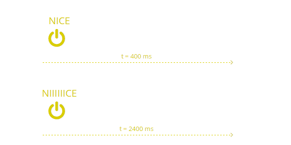
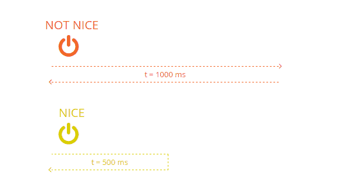

# 创建优雅 UI 交互的 7 个简单规则

> 原文：<https://www.sitepoint.com/7-rules-creating-elegant-ui-interactions/>

“交互设计”是已经与 UX 设计过程紧密联系在一起的新流行语之一。在 2015 年，界面元素不再能够在两种静态状态之间即时切换。今天，像“滑动”、“反弹”和“反弹”这样的词已经成为关于好的用户界面如何工作的话题。

然而，在互动的世界里——就像昂贵的手表一样——*花哨的*并不一定意味着*优雅的*。虽然我们可能对下面这款高档手表的复杂性感到好奇，但我怀疑我们中很少有人会真的想让*戴上它。在我们的界面设计中，自然的优雅几乎总是战胜装饰。*

如果你像我一样有创造力，你很容易被诱惑去创造花哨的互动，只是为了让你的网站看起来更现代、更吸引人。当然，在我们心里，我们知道这种方法可能是破坏整个用户体验的最可靠的方法之一。

因此，我发现把重点放在那些流畅且容易被用户注意到的动画上是很重要的。这就是我们的动画从聚光灯下走出来，转而支持我们的用户想要做的事情。

### 那么，这有什么关系呢？

为什么苹果在包装上花费如此多的时间和金钱，而这些包装通常很快就会被扔进回收站？为什么豪华车公司会调音关门的声音？

这是因为我们发现，微小的、看似不重要的细节可以对伟大的设计产生不成比例的影响，可以将 UX 从**“好”**提升到**“棒极了”**。

用设计精美的“微交互”来丰富你的网站，不仅使它更有用，还能在你的用户中引发积极的情绪感受(比如打开那个苹果盒子)。经历这样的情绪意味着消耗更多的多巴胺，这实际上帮助他们更加沉迷于你的网站/应用程序。

## 那么，什么定义了“微互动”？

当用户输入*(例如，点击、拖动、输入东西)*时，你的网站会做出反应——嗯，这就是互动。这是用户与你的网站交流的一种方式，所以它是对话的一部分。当设计用户在你的网站上的行为流程时，你总是有一些不同类型的交互可以使用:

1.  **导航交互**:这是用户最终进入一个全新的页面/状态。
2.  **模态交互**:这是当网站的当前状态被冻结，一些临时状态显示在它的上面(例如“灯箱”画廊或确认对话框)。)
3.  **微交互**:这是当你希望页面中只有一个元素*对用户输入做出反应的时候——例如，显示一个下拉菜单或者展示产品的更多细节。*

## 我们如何让这些微交互变得优雅？

一个网站应该像一场互动界面元素的音乐会，让你印象深刻。优雅是给人留下这样印象的关键标准。虽然很难用纯粹的技术术语来定义优雅，但是我们可以使用一些逻辑技巧来帮助我们创造优雅的交互。

### 关键规则# 1——不要传送

这个想法很简单——当你改变页面上的一个元素时，总是使用一个过渡。这意味着在你的 GUI 上不应该有任何即时截图。每一个出现、消失或变换的元素都应该用缓和或/和动画来实现。

这有助于用户将他们的视线集中在你希望他们看到的地方。当然，这创造了一种优雅和连贯的感觉。

### 规则 2:切换比按钮好

在家里，你通常会用同一个开关来开灯和关灯。同样的概念也适用于站点上的切换控件。如果一个控件触发了一个给定元素的新状态——那个*相同的*控件应该回滚到那个状态。

此外，根据[费茨定律](http://en.wikipedia.org/wiki/Fitts%27s_law)，这种控制应该几乎不需要任何努力就能在开和关状态之间快速切换。

### 规则 3:触发器应该在附近

过渡总是需要某种触发。在交互的时候，我们的用户通常关注触发元素。这意味着有必要在*或非常接近*触发点时开始转换。如果你开始的过渡离你的触发元素太远，用户很容易错过它，流程就会中断。

此外，过渡通常应该从触发器传播到您希望用户关注的位置。诀窍很简单——你把用户的视线从扳机引导到他应该采取下一步行动的地方。这样，用户就不会失去他们的焦点，并且会一直在你想要的轨道上。

### 规则 4:使用自然过渡时间

过渡时间定义了动画播放的时间。时间安排的主要问题是没有魔法棒可以让它正确。如果你把你的过渡做得太长，将会给经常或者快速重复同样交互的用户制造一个痛点。

另一方面，如果太短，会感觉不自然——或者用户可能完全看不到。不幸的是，你所能做的就是通过你的鹰眼和直觉来评估这个转变。我发现的最好的建议是不要给你所有的过渡相同的时间。只是玩一玩，找到正确的平衡。还要注意，即使是 0.05 秒的差异也很重要。

### 规则#5:过渡回滚不应该破坏用户的控制感

有时候，在产品化过程中，用户会很快改变主意。在这些情况下，过渡响应至关重要。如果用户取消上一次交互(例如，点击触发按钮两次),转换的动画应该立即**反转**。如果不是，我们的用户会立刻失去控制感。此外，你让你的用户认为他们做错了什么。

### 规则 6:总是自动聚焦于一系列动作中的下一个

这个技巧针对的是用户执行一系列动作的交互。当设计这样的序列时，您应该总是避免任何不必要的交互，并且总是将焦点设置在序列中的下一个控件上。这种交互最基本的例子是一个*【edit】*按钮，它打开一个表单并神奇地聚焦在第一个字段上，这样用户就不需要手动点击它了。

### 规则 7:当你完成时，一定要告诉用户

用户应该总是能够识别交互何时完成。如果你的交互在完成后没有明显的变化，你应该考虑实现某种视觉反馈，告诉用户“嘿，你，完成了！”。在你跳过这一步的情况下，用户往往会多次重复相同的动作，从而犯错误，甚至可能破坏一些珍贵的东西。

## 运用这些技巧

简而言之，你可以把这些技巧作为在你的网站上实现微交互的备忘单。它应该有助于你在实现之前设计交互的细节。

然而，很有可能你不会第一次就让它们变得完美。在这种情况下，你需要根据你自己的情况来调整它们——所以要准备好稍微调整一下。

Aaaaand 还有最后一个提示要给你。总的来说，你的互动越是遵从现实世界的物理法则，你就越会感到自然和优雅。

享受动画的乐趣！

## 分享这篇文章