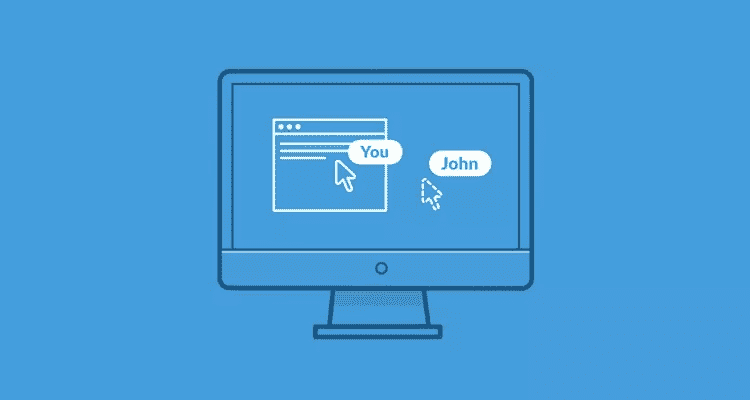
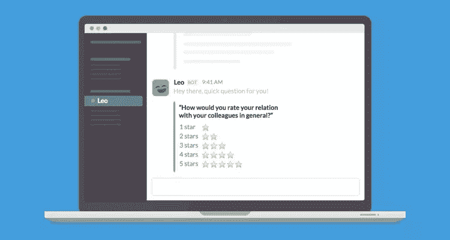

# 7 个松散集成，使协作更容易

> 原文：<https://www.sitepoint.com/7-slack-integrations-that-make-collaboration-easier/>

[上周](https://www.sitepoint.com/7-excellent-collaboration-tools-remote-teams/)我谈了一些非常适合远程协作的工具，其中之一是 [Slack](https://slack.com/) ，这是一款面向团队的著名消息应用，它让我们可以一劳永逸地将电子邮件抛在脑后。Slack 令人惊叹的用户界面和简单的入职体验让团队可以非常容易地投入其中，就像他们十年来每天都在做一样。但是这里有个问题:

有些人说 Slack 对于沟通来说太棒了，以至于团队发现他们整天都在聊天，由于无数消息的涌入而破坏了生产力。

但是我们可以通过使用集成来减少消息的数量，甚至是整个对话。Slack 可以与您的团队已经使用的应用和服务集成，将通知、任务管理和导入的媒体带入对话的上下文中。通过增加信息的价值，你可以更快地完成任务和解决问题。

## 1.用简单民意测验治愈优柔寡断

当团队中没有人在房间里时，可能很难读懂房间，但 [Simple Poll](https://simplepoll.rocks/) 通过治愈优柔寡断和消除对话中的“我不介意”回答来解决这个问题。

简单投票可以通过一个简单的斜线命令收集响应，而不是就一个问题进行激烈的辩论。只需输入 */poll“投票问题？”"选项 1 " "选项 2 " "选项 3* "加入对话。

[https://www.youtube.com/embed/G6C9v6gvCs4](https://www.youtube.com/embed/G6C9v6gvCs4)

## 2.使用 Screenhero 更好地解释自己

Screenhero 是一款屏幕共享应用，通过提供语音聊天和多个鼠标光标来帮助协作。你再也不需要担心如何解释自己了——而是展示给他们看！Screenhero 最初是一个独立的应用程序，但后来被 Slack 收购，允许你在 Windows *或* Mac 上的任何应用程序中一起编写电子邮件、编写代码、编辑视频或几乎所有工作。

只需在 Slack 中键入/ *hero @username* 即可开始会话！

## 3.搜索与 Kifi 共享的所有链接

Kifi 保留了 Slack 中所有共享链接的完整记录。只需输入 */kifi 搜索词*，即可立即找到您要找的网址；这对于恢复 Dropbox 或 Google Drive 文件的链接特别有用——不需要麻烦链接的原始分享者！

## 4.使用 Humblebot 加深与团队的联系

Humblebot 教你如何成为更好的队友——在懈怠状态下。它是一个友好的机器人(也被称为 Slackbot)，每天早上都会给你发信息，提醒你给别人发一封感谢信，或者询问他们的意见。

根据 Humblebot 的说法，你可以在短短一周内开始看到结果，并在这个过程中成为一个出色的人！

## 5.用 Officevibe 检查团队的快乐程度

Officevibe 的 Leo Bot 也能为协作和团队快乐创造奇迹，但方式略有不同。Leo 也是一个 Slackbot，但它会询问团队成员(私下)工作进展如何，并通过有趣的活动鼓励团队变得更亲密。

对狮子座问题的回答会被发送给人类办公室经理，他们可以解决你的问题和顾虑。从本质上讲，利奥就像一个非常有用的人力资源实习生——也是一个机器人。

## 6.使用 Wunderlist 管理任务

Wunderlist 是一个非常简单的协作任务管理应用，可以(可选地)与 Slack 集成。弄清楚需要做什么，并将团队成员分配到这些任务通常需要事先进行一些讨论，因此在对话中添加、删除和标记任务为“完成”的能力非常有用。这也意味着你不经常切换窗口，或者根本不切换——例如，如果你是一名经理，你可以从 Slack 内部控制你的整个团队。

下面是您需要的两个主要的正斜杠命令:

*   查看任务: */wunderlist 任务*
*   添加任务: */wunderlist 添加【您的任务】*
*   查看所有命令: */wunderlist 帮助*

## 7.使用画板在白板上协作

[Sketchboard](https://sketchboard.io/slack) 让您在协作白板上绘制图表——使用 */sketch【白板名称】*开始一个会话，这将在 Slack 中打开一个新的白板，您可以在那里实时看到您的队友正在绘制什么(如 Google Docs)。之后，您可以将草图作为图像附件传输回松弛通道。

这对于协作来说是很棒的，或者对于用语言以外的方式单独解释你的意思来说是很棒的，当你的团队成员在不同的大洲时，这有时是非常必要的！

## 结论

松弛集成无疑可以帮助您的团队更好地沟通和协作。事实上，这七个集成只是冰山一角，你甚至可以[构建自己的](https://api.slack.com/custom-integrations)集成，通过采用独特的工作流程将团队的生产力调整到最高。

定制集成的进一步阅读:

*   [传入 webhooks](https://api.slack.com/incoming-webhooks) (从外部应用程序向 Slack 发送数据)
*   [Outgoing webhooks](https://api.slack.com/outgoing-webhooks) (从 Slack 向外部应用发送数据)
*   [斜线命令](https://api.slack.com/slash-commands)(让 Slack 服从自定义的正斜线命令)
*   Slackbots(创造能够交流和服从命令的机器人)

## 分享这篇文章