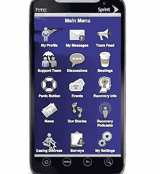
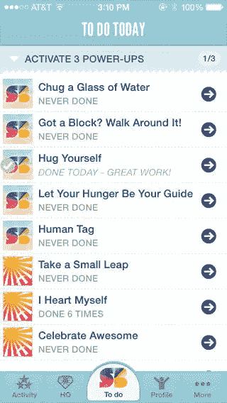
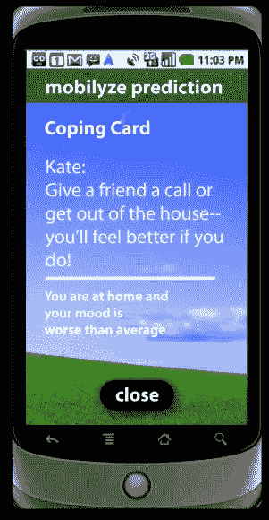

# 创建帮助精神疾病的应用程序的 7 个技巧

> 原文：<https://www.sitepoint.com/7-tips-creating-app-help-mental-illness/>

你有没有想过创建一个应用程序来帮助那些受精神疾病影响的人？手机应用在心理健康治疗中的作用是一个相对较新的工具。心理健康从业者、对心理健康感兴趣的个人、因成瘾而接受治疗的人以及患有慢性衰弱性精神疾病的人都可以使用这些应用程序。[各种研究表明](http://mental.jmir.org/2014/1/e5/)患有精神健康疾病的人对在治疗中使用应用程序感兴趣，因此增加了采用的可能性。

但是什么是好的精神健康应用程序，你如何确保你做的事情是有价值的？在这篇文章中，我将关注心理健康领域的细节，探索一些有趣的应用和创新，并讨论开发者面临的挑战。我们将介绍如何:

1.  定义并吸引你的目标受众
2.  互动，超越文本，让应用成为更大事物的一部分
3.  要可信
4.  永远不要低估耻辱的影响
5.  了解安全风险
6.  风险可能不是你想的那样
7.  进步

## 1.定义并吸引你的目标受众

在你对创建你的应用程序的技术方面感到兴奋之前，后退一步，想想你的受众是谁。这将帮助您确定应用程序所需的功能。想要减少幻觉的精神分裂症患者对心理健康专家有不同的需求。一旦你划定了健康专家和健康消费者之间的界限，就不要假设他们是同质的实体。

例如，“抑郁症”应用程序可能:

*   教育并告知那些认为自己可能患有抑郁症的人(最终结果是联系医疗专业人员)。
*   帮助抑郁症患者的朋友或家人。
*   与心理健康专家一起成为诊断工具的一部分。
*   成为治疗工具的一部分(例如整合治疗策略和心情日志)。
*   对于已经接受治疗或过去接受过治疗的人，成为复发为抑郁症的早期预测者。
*   提供在线谈话疗法作为面对面咨询的替代方案。

这些都不一样，需要不同的侧重点！

不同健康消费者的体验因一系列因素而异，包括年龄、症状和诊断。针对不列颠哥伦比亚省经历焦虑的年轻人的应用程序 [Mindshift](http://www.anxietybc.com/mobile-app) 的创建者发现，年轻人想要一个使用很少数据、包含最少文本并且设计谨慎的应用程序，以避免向好奇的同龄人透露使用情况。

这与老年痴呆症患者的经历不同，他们可能需要一个具有更大文本、提醒和位置跟踪的应用程序。精神分裂症患者会经历短期记忆丧失。因此，在一个页面上显示问题，在下一个页面上显示回答选项的应用程序可能是无效的，不改变屏幕或不需要滚动的应用程序可能是更好的选择。

短期记忆丧失也是精神分裂症的一个症状，[因此，即使应用程序在一页显示一个问题，在下一页显示回答选项，也可能带来额外的挑战](http://thedartmouth.com/2013/11/06/focus-app-helps-mentally-ill-patients/)。为了补救这一点，Ben-Zeev 开发了一款不改变屏幕或不需要滚动的应用程序，用户可以通过提示向前移动，减少了混淆选项。

了解这些不同要求的最佳方式是询问和学习。在互联网上阅读文章是不够的，去那些会使用你的应用的人所在的地方。在创造思维转变的过程中， [B'stro](http://bstro.com/) 组织了焦点小组，以发现经历焦虑的年轻人需要什么样的应用程序。

这项研究不仅应该包括与心理健康消费者的互动，还应该包括卫生保健行业。成瘾治疗领域通过为患者创建可定制的应用程序，包括本地化信息和个性化支持，在酒精恢复方面取得了成功。这方面的一个很好的例子是 [A-Chess](http://chess.wisc.edu/chess/projects/AddictionChess.aspx) ，这是一个预防复发的多功能应用程序，用于成瘾恢复。它的成功在于细节。健康专家可以对其进行定制，以确定客户的具体需求和触发因素。

[https://www.youtube.com/embed/c3NYShJNg24](https://www.youtube.com/embed/c3NYShJNg24)

上面的视频值得快速浏览一下，看看应用程序的运行情况，特别是预先确定的触发时间和位置的整合，情绪评估，后续应对策略的提供，随叫随到的顾问问题的视频通话，用户拒绝时播放的视频，然后是一个电话和一个电话。

要创建一个有意义的应用程序，与你的健康主题领域的专业临床医生和你的最终用户进行交流是至关重要的。这可能是与大学研究部门合作，与国家心理健康协会合作，联系心理健康消费者倡导者，经营焦点小组和研究其他人在做什么。

## 2.互动，让应用成为更大事物的一部分

对于那些寻求治疗教育资源的人来说，基于文本的应用程序是一个有用的工具。但是当一个应用程序的便携性、判断力和即时性有如此多的优势时，如果它做得比基于桌面的程序少，那就不令人兴奋了。

触感是一个应用程序可以发挥作用的例子。“让恐慌过去”是为经历恐慌发作的人设计的。当人们感到恐慌发作时，他们可以启动“让恐慌过去”，并在每次呼吸时同步点击屏幕，以确定他们的呼吸速度。对于一些人来说，这种重复的动作足以减缓他们的呼吸频率。如果不是，应用程序会建议用户尝试匹配一个较慢的速度。一旦呼吸得到控制，该应用程序会提供其他帮助，以帮助用户度过攻击。

跟踪是另一个例子。在 A-Chess 应用程序中，用户可以输入与以前吸毒相关的地点地图，当他们在这些地点附近旅行时，手机会触发一系列互动。许多心理健康应用程序包含了专业人士的咨询会议。这些方式各不相同，可能包括私人聊天室和面对面治疗。其他人提供了一个包括私人信息、[在线会议、](https://play.google.com/store/apps/details?id=com.blazingraptor.recovery)和讨论组在内的[同辈网络](https://play.google.com/store/apps/details?id=com.bearpty.talklife)来寻求支持。

你们中的任何一个游戏玩家可能已经知道游戏作为一种精神健康工具的好处。 [Super Better](https://play.google.com/store/apps/details?id=com.blazingraptor.recovery) 是一款基于应用程序的游戏，帮助用户在面对任何疾病、伤害或健康目标时建立社交、心理和情绪上的弹性。用户需要完成一些日常任务或游戏来建立他们的自尊和情感健康。

应用程序中监控传感器的使用正在影响精神健康状况治疗的研究。特别是那些需要持续监测症状和治疗以避免复发的疾病。这方面的一个有趣的例子是 [FOCUS](http://thedartmouth.com/2013/11/06/focus-app-helps-mentally-ill-patients/) ，它目前正在达特茅斯大学作为精神分裂症管理工具进行开发。该应用程序通过测量设备锁定时间、环境照明和环境音频来预测睡眠时间，从而在复发预测中使用睡眠建模和预测性感官数据等技术。传感器可以测量睡眠模式的变化和隔离程度的增加。这可以用于创建患者独有的“失效签名”，有助于临床治疗和干预。

[MOBILYZE](http://www.imedicalapps.com/2012/05/mobilyze-therapist-pocket/2/) 利用 GPS、环境光和最近通话等手机传感器值来测量用户的情绪并监控他们的健康状况。然后为积极的活动提供积极的激励。

[先验](http://www.eecs.umich.edu/eecs/about/articles/2014/app_for_mood_swings.html)测量用户语音模式的变化，以预测双相患者的躁狂和抑郁状态。

如果你使用基于文本的资源，让它们有用。心理健康专家(可能每月看一次病人)实时打印或阅读的睡眠或情绪日志比一系列积极的肯定要有意义得多。

## 3.要可信

可信度很难定义。如果所有精神健康应用程序都是与精神健康专家合作设计的，并在基于研究的试验后推出，那将是理想的。现实是，如果这种情况发生，这些应用程序将远远落后于技术，研究人员正在努力确定最佳实践精神健康应用程序的明确指南。

例如，今年发布的一项[研究分析了 2013 年期间可用的 243 款抑郁症应用，发现许多应用未能将循证实践、健康行为理论或临床专业知识融入其设计中。由于缺乏对组织关系和内容来源的报告，该研究再次排除了几乎这么多。](http://www.ncbi.nlm.nih.gov/pmc/articles/PMC4376135/#ref68)

[其他研究重点](http://www.psychology.org.au/Content.aspx?ID=5850)由于使用的搜索词/程序、搜索的零售店/研究数据库以及用于确定应用质量的标准，应用的临床评估存在问题

在英国，国民医疗服务体系(NHS)希望引入一个新的应用程序 kite mark。在这种情况下，应用程序将获得 NHS 标志的认可，而在美国，这一点通过 [iPrescribeApps](http://iprescribeapps.com/) 更进一步，这是一个平台，使医生能够访问由 iMedicalApps 的医生使用循证标准和专家意见策划的应用程序。

应用程序应该更加透明。我喜欢[超级棒](https://itunes.apple.com/us/app/superbetter/id536634968?mt=8)将科学融入他们游戏风格应用的方式。当玩家玩游戏时，他们会发现科学图标隐藏在整个任务中。点击这些图标会显示超级好的科学，包括游戏所基于的研究文章的链接。

## 4.永远不要低估耻辱的影响

尽管取得了进展，患有精神健康疾病的人仍然面临着同龄人、卫生专业人员、保险公司和潜在雇主的羞辱。考虑如何在公共场所单独使用你的应用程序，并选择无声使用。应用程序的品牌应该足够清晰，以向有需要的人阐明徽标的用途，但对其他可能看到手机的人来说却是难以理解的。这可能是少数几个你需要保守设计的时候之一。

也许是最“他们怎么能这样？”例子是撒马利亚人雷达，一个由英国心理健康慈善机构在 2014 年推出的应用程序。Radar 是一个免费的网络应用程序，它使用一种算法来寻找推文中可能与自杀意图有关的特定关键词和短语。一旦用户注册，当他们关注的人在推特上发布某些触发词时，他们就会收到提醒。这是在最初写推文的人不知情或不同意的情况下发生的。有人称之为“给恶霸和巨魔的礼物”。专家们还对允许未经培训的公众使用可能有效也可能无效的算法来监控社交媒体账户表示担忧。这可能会不知不觉地、不准确地给数百万人贴上精神健康障碍的标签。因为它使用 Oauth 作为应用程序用户而不是普通的“@ samaritans”用户工作，所以它能够访问受保护的帐户。在该应用被撤下之前，[超过 3000 人激活了撒马利亚人雷达，超过 164 万推特账户被追踪](http://www.bbc.co.uk/news/blogs-trending-29881099)。

## 5.清楚安全风险

心理健康是一个隐私和保密至关重要的领域。如果移动应用程序使用不当或不安全，用户信息就会面临风险。用户需要清楚准确地了解他们提交的信息与谁共享。这可能是与他们的主要心理健康专家，但他们的医学杂志是与制药公司共享的吗？他们的健康保险呢？有未来的后果吗？我可以想象一个场景，一个人在工作场所提出抑郁症索赔，工作场所保险公司能够显示他们下载了该应用程序。考虑到员工休病假时工作场所监控社交媒体的事件[并不像听起来那么不可能](http://psychcentral.com/blog/archives/2009/11/20/woman-loses-sick-leave-benefits-for-depression-thanks-to-facebook-pics/)。隐私和保密法因国家和州的不同而不同，因此请注意您工作地点的要求。

有人认为，缺乏与应用程序的连接会使保护安全性变得困难。解决这个问题的一个例子是在你的应用中使用基于标准的编码和术语，例如 [DICOM、HL7、SNOMED 和 ICD-10](http://www.mhealthnews.com/news/10-steps-creating-safe-secure-healthcare-app?page=0) 来增加共享信息的安全性。对铭文的理解是必要的。例如，当数据进入应用程序、存储在应用程序中和/或从应用程序发送时。

## 6.风险可能不是你想的那样

也许进步的最大风险是时间和努力。心理健康专家没有真正的激励或补偿来鼓励患者使用心理健康应用程序，除非他们是受资助研究项目的一部分。我不禁在想，看心情日记和睡眠日记需要多少额外的时间。一个风险是[如果没有理想的灵敏度和特异性](http://www.psychiatrictimes.com/cultural-psychiatry/harnessing-social-media-and-mobile-apps-mental-health/page/0/2)，通知心理健康专家的算法可能会导致假阳性通知增加，从而导致工作量和成本增加。卫生专业人员很忙。我敢肯定，我不是唯一一个去看医生的人，一个忙碌的专业人士使用谷歌搜索而不是医疗资源。医生开的健康应用程序可能被归类为[健康设备](https://alexwyke.files.wordpress.com/2014/05/master-a4-white-paper-pdf.pdf)，需要符合监管规定。这可能需要很长时间，监管成本可能会抑制开发商和消费者的积极性，而他们可能会承担这一成本。

## 7.进步

精神健康应用程序需要在可用时保持其相关性。在构建一个心理健康应用程序时，你需要考虑它在整个使用过程中的进展。该应用程序有什么样的轨迹，可以定制吗？当用户康复时，它如何保持相关性？它是如何在用户进步一段时间后保持良好的心理健康的？我不认为商业市场上有任何关于精神健康应用的长期效果的研究。开发者知道这一点肯定会很有趣。

这篇文章旨在给你关于精神健康应用的“思考的食粮”。心理健康应用前景广阔，尤其是每 4 个人中就有 1 人被诊断患有精神疾病，而费用和缺乏当地心理健康专业人员是许多人接受心理健康治疗的一个重大障碍。