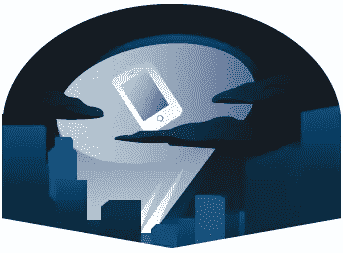
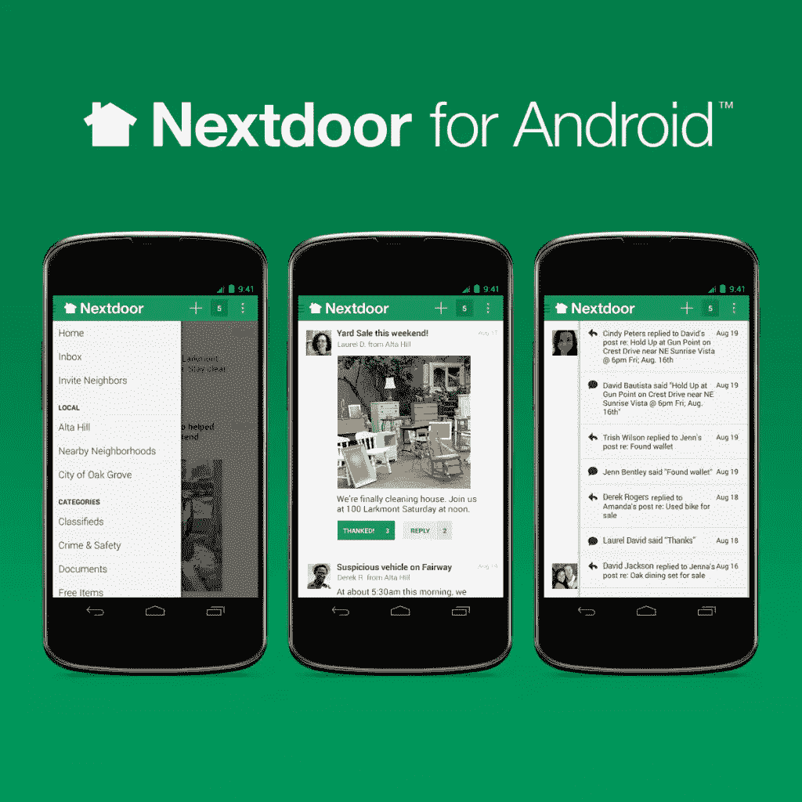
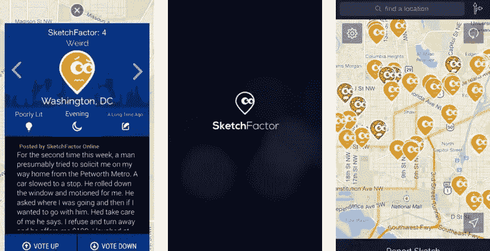

# 创建社交行动应用时需要考虑的 7 个技巧

> 原文：<https://www.sitepoint.com/7-tips-to-consider-when-creating-a-social-action-app/>

当我开始撰写这篇文章时，我打算把重点放在犯罪报告应用程序上。但是我发现不可能将犯罪从它所在的社会中清除。我决定着眼于更广泛的范围，包括警察监控、邻里监督、侵犯人权、儿童性交易以及手机应用程序如何记录和报告这些犯罪。

琼斯妈妈做了一份由摄像机拍摄的 13 起警察杀人事件的报告，其中包括旁观者用手机拍摄的 6 起致命枪击事件。正如这篇文章所展示的，这些应用可能比第一次出现时更有争议。这里有一些开发基于社交的应用程序时需要考虑的技巧。

## 1.你的应用旨在解决什么社会问题？

如果你专注于特定的目标和受众，而不是试图满足所有人的所有要求，那么创建一个解决问题的应用程序会更容易。

例如，[拦截搜身手表应用](https://itunes.apple.com/us/app/stop-frisk-watch/id583006596?ls=1&mt=8)是对非法“拦截搜身”搜查的回应，警察拦截并询问行人，然后搜查他们是否携带武器和其他违禁品。由于发现[10 个被拦截搜身的纽约人中有近 9 个是无辜的(黑人和拉丁裔男子是最有可能的目标)](http://www.nyclu.org/content/stop-and-frisk-data)，纽约公民自由联盟(NYCLU)开发了一个应用程序，使旁观者能够记录拦截搜身事件，并在街头拦截发生时提醒社区成员。

按下手机上的触发按钮就可以记录事件。摇手机停止拍摄。当拍摄停止时，用户会收到一份简短的调查，允许他们提供事件的详细信息。视频和调查被发送给纽约市人权联盟，他们在宣传活动中使用这些证据。当附近的人被警察拦下时，该应用程序会提醒用户，这对监控警察活动的社区团体很有用。

有太多的基于社区的应用程序专注于在当地社区的居民之间建立沟通。这些问题从事件、丢失的物品和车库销售到当地的犯罪侦察。一个例子是隔壁的，它将地理上相邻的人们围绕当地问题联系起来。

[Sketch factor](https://play.google.com/store/apps/details?id=com.sketchfactor.sketchfactorandroid) 是一个社区驱动的导航应用，显示一个地区的相对“粗略”(安全)。该应用程序使用来自用户的众包数据来确定“粗略”的区域，并提供安全的行走方向。

像英国的[自明](https://play.google.com/store/apps/details?id=org.witnessconfident.app&feature=search_result#?t=W251bGwsMSwyLDEsIm9yZy53aXRuZXNzY29uZmlkZW50LmFwcCJd)这样的应用程序旨在当犯罪发生时，在平民和警察之间提供一个渠道。Self evident 与英国各地的当地警方合作，可以记录声明，验证保险或赔偿索赔的证据，并通过用户的智能手机向警方提交犯罪报告。

[自由应用](https://play.google.com/store/apps/details?id=com.orphansecure.freedom)是一款人口贩运应用，旨在识别和解救国际性交易中的人。它鼓励人们报告可疑的贩运事件和他们可能掌握的任何信息。

这款名为[witness](http://eyewitnessproject.org/)的应用是国际人权活动人士工作的一部分，旨在将那些在叙利亚、乌克兰和刚果民主共和国等冲突中犯下战争罪、酷刑或种族灭绝罪的人绳之以法。该应用程序提供了一种通过添加时间戳和 GPS 固定位置来记录图像和视频的方法，并进一步提供了一个安全的存储材料的地方。然后，目击证人小组就成了镜头的持续倡导者，分析信息并与适当的法律当局合作，以促进对那些犯下最严重的国际罪行的人的问责。

## 2.你的应用是独立的还是更大的一部分？

任何专注于社区、犯罪检测和报告等问题的应用程序都不能被认为是可信的，除非它来自关键机构或与相关组织合作，为应用程序用户提供资源和信息。在自己的生活中好好想想。如果你看到警察犯罪，你知道在哪里和如何报告吗？对大多数人来说不太可能，这使得像 NYCLU 这样的组织的工作更加相关。他们的应用程序包括一个“了解你的权利”部分，指导人们在面对警察时的权利以及在公共场合拍摄警察活动的权利。同样，Self evidence 直接与当地警方合作，而 Freedom 应用程序的开发者 Orphan secure 则与可信的执法机构和其他非政府组织合作。

## 3.技术可信吗？

你的应用程序会离线工作还是在中央服务器过载的情况下工作？如果你的应用程序的目的是在犯罪发生时记录犯罪，那么从你的应用程序中获得的镜头/对话会在法庭上被采纳吗？

如果它不包含日期、时间或地理坐标，则很难(如果不是不可能的话)验证该镜头是原始的并且没有被修改。如果拍摄视频的人希望保持匿名，那么核实就很困难。在反索赔的情况下，证据已被伪造或数字更改，例如，目击者纳入了一个计数器，记录像素数量，以证明图像没有被数字处理。

## 4.使用 App 的后果是什么？

如果一个应用程序被用来记录犯罪现场的证人陈述，谁会向证人提问？像新闻频道一样采访旁观者可能很有诱惑力，但如果证人陈述后来发生变化，可能会影响任何法律程序。你的应用程序将提供多少法律信息？

此外，如果一个人被抓到记录犯罪会发生什么？凯文·摩尔，这个拍摄了臭名昭著的弗雷迪·格雷被捕事件的人，就在警察显然在一辆警车后座杀死了这位巴尔的摩的居民之前，在他拍摄了警察之后，不断地被骚扰。在那次骚扰之后，他被逮捕并被指控犯有包括“恐怖主义”、“煽动暴乱”和“逃避警察”在内的罪行。这些罪行一天后被撤销。

NYCLU 指出，他们的应用程序应该谨慎使用，但奇怪的是，该应用程序没有办法在记录的同时上传数据，以防警察拿走手机并删除视频。相比之下，目击者的影片可以在发送后删除，并且有一个“紧急按钮”，允许用户删除所有记录的信息以及应用程序本身。

## 5.你预料到意想不到的后果了吗？

一些应用程序被指控煽动种族主义和刻板印象。例如，一位邻居在 Nextdoor 上发布了关于在她家门口“逗留”的两个“粗略”男子的种族和服装的详细信息。他们原来是隔壁另一个邻居的朋友，被邀请去她家参加聚会。

奇怪的是，居民们组织了一个“仅限白人”的会议，以解决如何正确报告和描述可疑人员的问题。Nextdoor 可能成为偏执种族主义的论坛，相当于一个封闭社区中爱管闲事的邻里监督组织。

Sketch Factor 受到了类似的种族主义指控，特别是因为给黑人社区贴上了“Sketch”的标签，并被一些批评者称为“白人避免有色社区的应用程序”。除了评论和评论审核不力，Sketch Factor fairs 在提供当前信息方面表现不佳，因为区域报告在应用程序上停留了 1 年。

并非所有意想不到的后果都是不好的。开发者 Pham 在离家六个街区的时候使用了隔壁应用来应对一起仇恨犯罪。他组织了一次有 500 人参加的周末烛光守夜活动，并从 268 名个人捐助者那里筹集了 27，000 美元，作为抓捕罪犯的奖励。

## 6.不要忘记考虑已经失败的前辈

[群众解决](http://unbouncepages.com/-1245012454124881272653/)解决因错误定罪而入狱的人的问题。有了《T2》系列和[清白计划](http://www.innocenceproject.org/)的粉丝们所熟悉的前提，争论的焦点是集体的智慧将通过互联网(和可视化工具，访问原始案件数据和文件，以及“强大的证据索引”)一起解决错误的人被指控而真正的罪犯却逍遥法外的犯罪。

Crowdsolve 在 Indiegogo 上失败了，可能是因为奇怪的附带视频表明人们可以在锻炼后或假装在白天工作时在更衣室解决犯罪问题。还有更大的问题，业余侦探打开封闭的犯罪的影响，以及暴民心态出错的倾向。我想起了 Reddit 的投稿人承诺要找出波士顿马拉松爆炸案的凶手，结果不准确地将已故学生 Sunil Tripathi 确定为爆炸案的凶手。[就连 Reddit 的总经理也承认这是一场灾难。](http://www.thewire.com/national/2013/04/reddit-find-boston-bombers-founder-interview/64455/)

## 7.少了什么？

我一直找不到任何解决网络犯罪或白领/企业犯罪问题的应用程序。无论是为记录、报告和教育提供而创建，它们都可能是这种应用类型的有益补充。

## 结论

这篇文章简要分析了一系列旨在应对社会问题和特定犯罪的应用程序。基于邻里的应用程序已经取代了邻里社交聚会点。犯罪应用程序被世界各地的警察和平民广泛用于预防和应对不同类型的活动。

他们有机会提供一种简明、方便和直接的手段来应对犯罪活动。但它们也可能被证明是不充分的，令人不快的，甚至将个人置于危险之中。你对这类应用有什么体验？我很想听听你的想法。

## 分享这篇文章