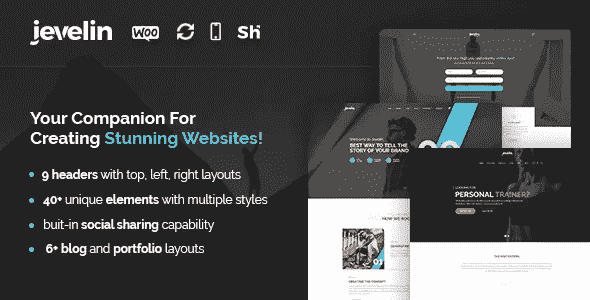
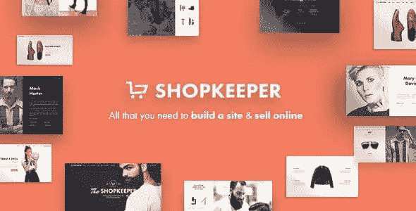
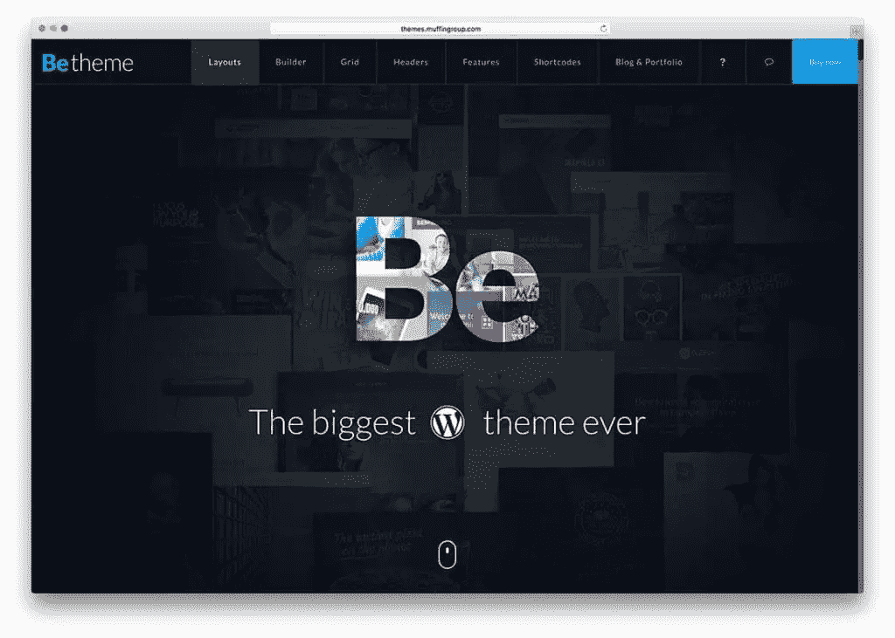
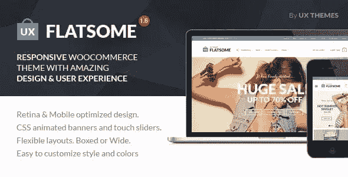
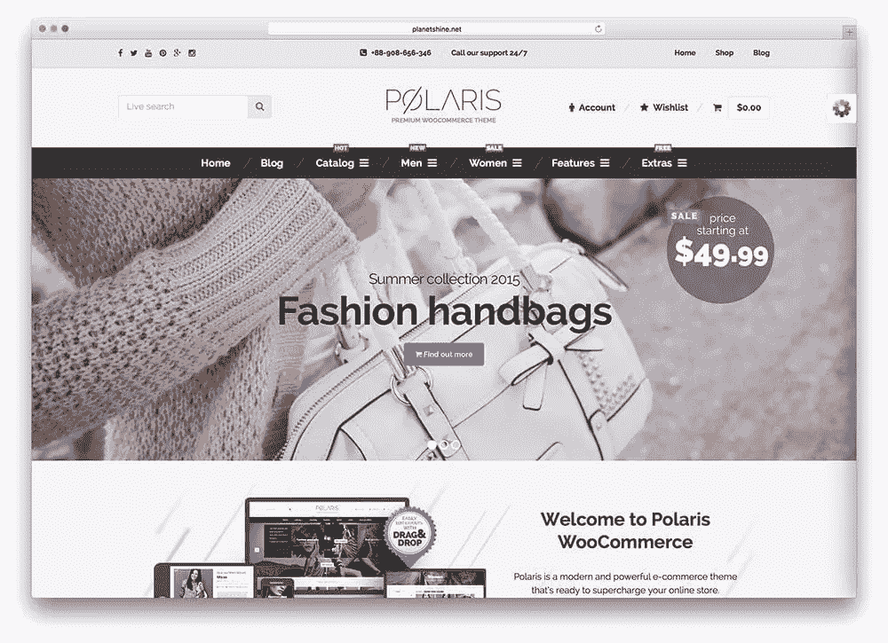

# 2017 年 7 大趋势 WordPress 电子商务主题

> 原文：<https://www.sitepoint.com/7-trending-wordpress-ecommerce-themes-2017/>

## 寻找电子商务主题

随着互联网和互联网上商业运作数量的增长，WordPress 也在增长。一个易于使用的工具来创建您的网站，无论是政治博客还是在线蜡烛店，它提供了一系列的选择。

定制是 WordPress 的一个定义性特征，它让你有可能自己设计网站的界面，或者从大量免费或付费的电子商务主题中进行选择，也许还可以使用子主题做一些你自己的设计调整[。这些电子商务主题可用于多种用途，是无数成功的在线企业的基础。](https://www.sitepoint.com/premium/screencasts/developing-a-child-theme-from-a-parent-theme)

当大多数顾客想要购买一件产品时，他们做的第一件事就是在网上搜索它(或寻找销售它的商店)。一个用户友好的网站可能会说服他们停留在页面上并购买更多，而一个缓慢而混乱的网站会让他们远离你的业务。因此，页面上的用户体验意味着盈利和破产的区别。

因此，选择一个适合你的在线业务的有吸引力的电子商务主题是至关重要的。以下是 2017 年流行的七个优秀的电子商务主题。

## 杰韦林

对于 WordPress 主题市场来说， [Jevelin](https://themeforest.net/item/jevelin-multipurpose-premium-responsive-wordpress-theme/14728833) 仍然是新的，它是专门为电子商务主题设计的。兼容 WooCommerce 插件，可以让你把自己的网站变成专业的在线商店。虽然它已经提供了一个标准版本，但 Jevelin 也允许定制。这样，当你专注于主要功能的设计时，你可以把小事情留给插件。

Jevelin 拥有丰富的商店布局和吸引人的产品展示，是设计电子商务页面的显而易见的选择。易于修改为了适应卖家的偏好和产品类型，这个 WordPress 主题肯定会对寻求专业外观的公司客户更有吸引力。

## 工作室

顾客和在线卖家都可以证明，[工作室](https://themeforest.net/item/atelier-creative-multipurpose-ecommerce-theme/11118909)主题的优势在于其出色的客户支持功能。通过整合的用户论坛，你可以轻松直接地从浏览你网站的访问者那里获得反馈。再加上一些热心帮助的友好的技术人员，这个系统确保客户会再次访问你的网站，并对它保持一个整体的良好印象。

此外，Atelier 还提供了无尽的定制选项，让顾客可以非常灵活地浏览你的店铺。设计直观简单，这个 WordPress 电子商务主题可以让你立即掌握它的可能性，并在你遇到麻烦时寻求专家的帮助。很少有主题像 Atelier 这样有效实用。

## 斯卡利亚

Scalia 是一个多用途、多概念的 WordPress 主题。这种时尚、鲜明的外观非常适合企业、个人作品集甚至博客。

Scalia 有点浮华，但它专注于视觉呈现。引人注目且富有光泽，它像飞蛾扑火一样吸引着顾客。它包括令人印象深刻的幻灯片，画廊，新闻，公司简介和产品展示。
在 SEO 方面，Scalia 很容易设置，并且可以随时进行优化。通过这种方式，它将一个有吸引力的包装与增强的用户体验和高有机流量相结合，使其成为电子商务主题的绝佳选择。如果客户使用 Scalia 访问一个网站，他们很可能会记得它使用的令人愉快的形状和轻松的颜色，以提高可访问性和页面上花费的时间。

## 店主

在与 WooCommerce 3.0 插件兼容的 2.0 版本中，[店主](https://themeforest.net/item/shopkeeper-ecommerce-wp-theme-for-woocommerce/9553045)主题有各种各样的布局和功能。此外，它能够支持画廊中的 YouTube 视频项目，并借助缩放和灯箱技术来显示产品。

由顶级主题森林卖家之一出售，为了确保效率和简单性，掌柜定期更新和记录。快速设置，易于维护，无需编码也易于定制，这个 WordPress 主题正在成为用户的最爱之一。

由于使用了用户熟悉的拖放方法，丰富的标题和易于拾取和学习，店主是用户友好主题的定义。它超越了典型的电子商务主题的基本需求，将功能与博客的古怪风格和投资组合的专业感觉结合起来。任何想要出名的大胆的创业公司或小企业都应该考虑建立自己的网上店面。

## 贝瑟姆

功能和随时可用的特性构成了 [BeTheme](https://themeforest.net/item/betheme-responsive-multipurpose-wordpress-theme/7758048) 的面包和黄油。有超过 250 个预建的网站布局可供选择，这个 WordPress 主题已经成为世界各地许多企业的选择。当谈到在线存在，BeTheme 有一个无与伦比的功能可用性。

此外，这种多站点主题允许您使用相同的主题创建不同的站点，只需点击几下鼠标，就可以实现彼此完全不同的目的。除了现成的布局，BeTheme 是完全可定制的，有一个短代码生成器和一个强大的管理面板，可以帮助你根据自己的需要和偏好组织你的页面。

BeTheme 中包含的其他功能有:

*   用于浏览网站的强大搜索工具
*   优化加载速度和搜索引擎
*   兼容 WooCommerce、bbPress、Yoast 等插件
*   一种维护模式，可以一直使用到站点准备就绪。

## 扁平的

Flatsome 是另一个 WordPress 主题，它不需要任何编码就能提供惊人的用户体验。简单而优雅，它很快就进入了 WordPress 主题市场的顶级行列。

有了 Flatsome 的 Live 页面生成器和令人印象深刻的元素库，构建页面变得很容易，即使对于初学者也是如此。无需进入维护模式，即可轻松设置和更改布局和幻灯片效果、横幅和背景。感谢 Live 主题选项面板，这同样适用于您可能希望在页面中引入的任何定制。

Flatsome 的优质设计使其成为 WooCommerce 最畅销的主题之一。它是搜索引擎优化友好的，响应对 Flatsome 来说不是问题，因为它完全是桌面和移动友好的，并不断更新所需的任何软件改进。凭借其快速加载和令人印象深刻的功能质量，Flatsome 绝对应该在任何人的最佳 WordPress 电子商务主题列表中。

## 北极星

北极星主题非常适合高端商店，因为它散发着专业精神，并具有适合顶级零售商的严肃外观。能够支持各种各样的内容，但这个主题是专为电子商务。

在线商店、店面和旨在在线环境中吸引买家的网站因此在 Polaris WordPress 主题中找到了他们的完美工具。简单而丰富的功能，北极星配备了一个反应灵敏的滑块，用于定制销售标签，可切换收藏，悬停效果，快速购物功能，谷歌地图指引你的商店，直观的产品过滤器和巧妙的时事通讯弹出窗口。

北极星主题由 jQuery 框架提供支持，并通过 CSS3 效果和动画进行了增强，为您的在线展示增加了质量，并以合理的价格为您的商店提供了品牌外观。它提供的回报非常值得最初的投资。

## 结论

今天，电子商务已经成为经营企业的重要组成部分。这七个趋势 WordPress 电子商务主题都提供了独特的功能，适合构建你的网上店面。它们是你的产品在不断增长的电子商务行业的竞争海洋中航行的船只。船的性能越好，你的生意就越成功和有利可图。

## 分享这篇文章