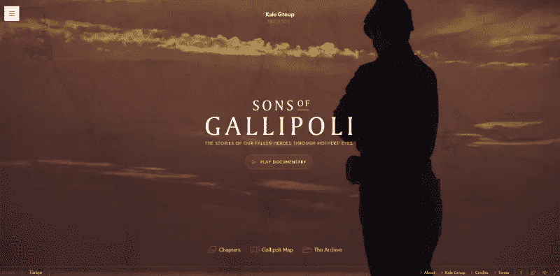
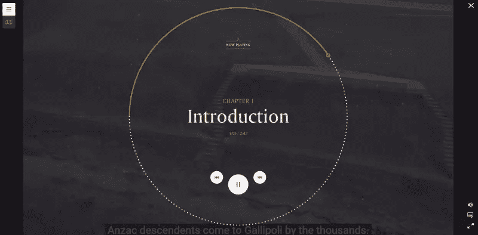
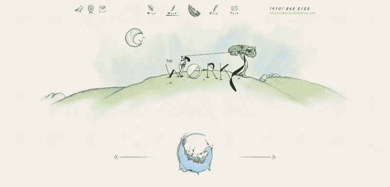
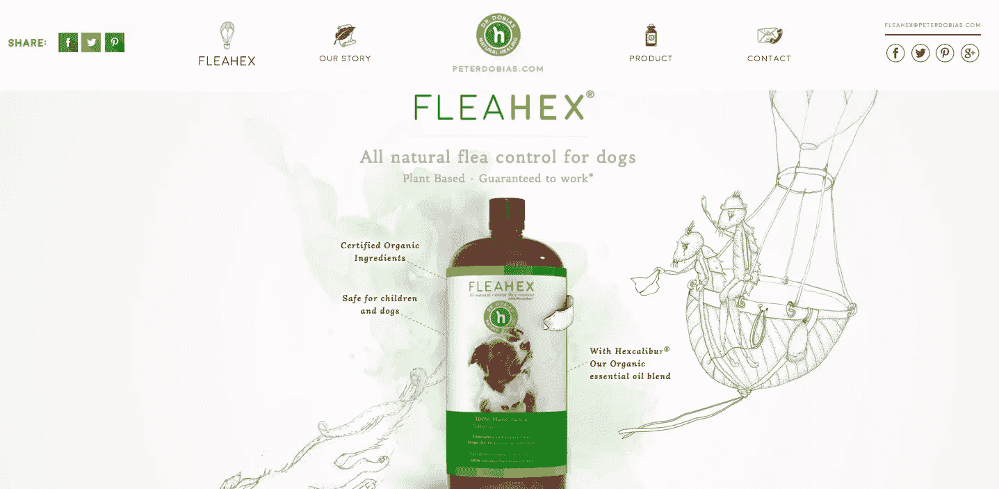
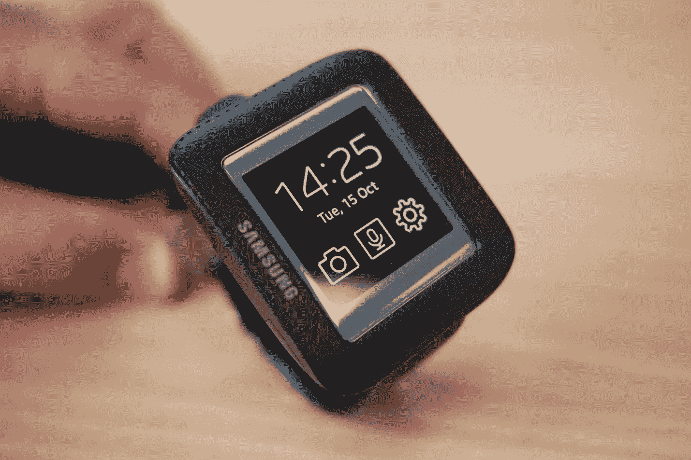
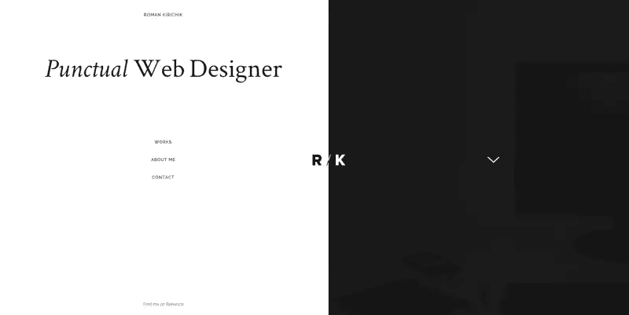
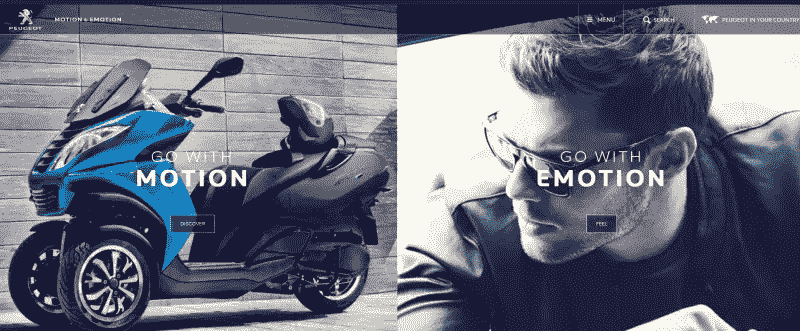
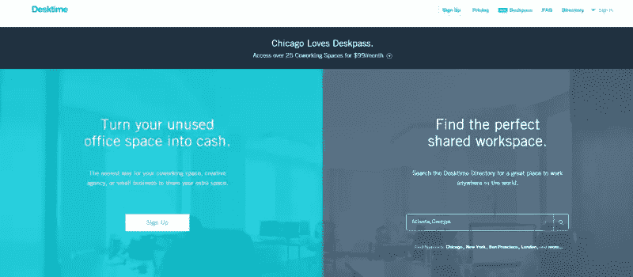
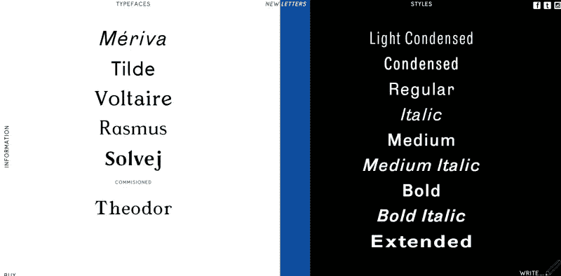
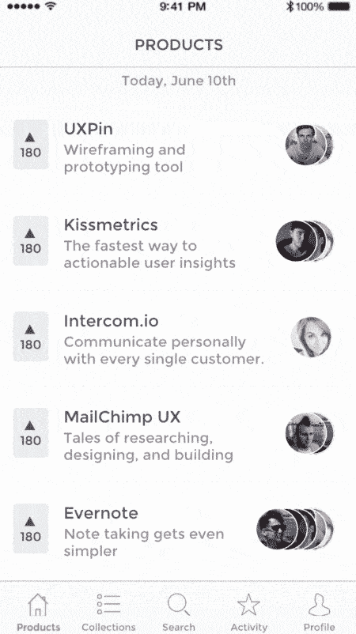

# 定义 2016 年网页设计的 7 大趋势

> 原文：<https://www.sitepoint.com/7-trends-that-will-define-web-design-in-2016/>

网页设计的繁荣同样依赖于两个部分:创新和模仿。

换句话说，我们都喜欢抓住最新最棒的趋势和技术，使用它们直到它们无处不在，并开始寻找下一个大东西。今年上半年是开始搜索此类附录的最佳时机，所以让我们探索一下将在这十年的后五年引起巨大轰动的技术。

基于在 [UXPin](https://www.uxpin.com/) 与设计团队的讨论，以下是我们认为将定义 2016 年的 7 大趋势。

## 多样性

对网页设计世界的一个相当一致的抱怨是，我们可以说，它很少参与原创实践。

WordPress 模板、响应式框架的倾向，以及实现某种外观(公司、个人、作品集等)的愿望。)导致了设计上很大程度的一致性。

正如我们在电子书[网页设计趋势 2016](https://studio.uxpin.com/ebooks/web-ui-design-trends-2015-2016/) 中提到的，这只能持续这么久。

网站不一定要符合一个模子。当然，会有客户希望他们的网站与同行业的其他网站相匹配。但是总有人呼吁“新鲜”的拍摄，或者“感觉不同”的东西当然，这些要求很多只是为了表面的差异。然而，随着网页设计行业的成熟和发展，它应该真正的多样化是很自然的。

这并不意味着你需要为了新奇而开始把抽象和不熟悉的设计放在一起。相反，在保持效率和考虑用户体验的同时，你应该自由地突破界限，看看有什么不同。永远不要为了时髦而牺牲可用性。

这种趋势正在兴起的一个领域是戏剧表演。

例如，一部名为[加利波利之子](http://sonsofgallipoli.com/#!/)的纪录片的网站在导航和展示方面非常独特。

Sons of Gallipoli

当纪录片仍在播放时，视频控件在半透明的覆盖层中显示进度。

Image Credit: [SonsofGallipoli.com](http://sonsofgallipoli.com/#!/)

独特的布局、按需网格、CSS3 动画、更广泛的字体可用性以及许多其他因素使得比以往任何时候都更大程度的多样性成为可能。然而，你会注意到它并没有放弃可用性。该网站仍然是高度可导航的。

2016 年，设计师们将开始伸展四肢，用传统的获胜形式冒险，只是为了看看还有什么其他途径可用，而且确实是大众所希望的。

## 丰富的插图

Image Credit: Mint Design Company

2016 年，随着手工艺术品在网站上的出现，多样性将会抬头。尽管库存照片和高质量图像在过去占据了很大的主导地位，但在 2016 年，更多的网站将依赖手绘艺术而不是图形来获得视觉吸引力。

独特的手绘网站提供了令人惊叹的原创深度和温暖，这是平面设计无法比拟的，相比之下，平面设计似乎毫无生气。此外，它们为设计增添了独特的元素。很快，网站和它们的品牌将与它们所包含的艺术风格联系在一起。

例如，注意一下 [FleaHex](http://fleahex.com/) 网站的艺术风格(如下图)是如何与创建它的设计公司(如上图)相似的。想象一下，在一个世界里，毕加索的蓝色时期在数字空间中上演，供所有人观看和欣赏。在你的网页设计中融入手工作品可以成为设计师/艺术家的名片，并且保证这是这个项目中独一无二的。

Image Credit: [FleaHex](http://fleahex.com/)

## 人工智能的作用增加

如今，一切都取决于语境。也就是情境语境。

现在，互动发生的地点和时间与方式或原因一样重要。是在手机上吗？平板电脑？室内还是室外？那一刻他们在做什么？当用户与产品交互时，有各种各样的情况在起作用。

Image credit: [Microsoft](http://windows.microsoft.com/en-us/windows-10/getstarted-what-is-cortana)

世界上的 UI 设计师负责尽可能无缝和有帮助地做出响应。当然，它们不能即时实时地读取用户的上下文。但是复杂和紧急的人工智能引擎可以。比如:

*   [脸书米](http://www.wired.com/2015/08/facebook-launches-m-new-kind-virtual-assistant/)
*   【Gmail 智能回复
*   [网格](https://www.completewebresources.com/the-grid-ai-website-review/)

…许多其他不同形式的人工智能开始使网络自动化。

最终的结果似乎是更加依赖人工智能来分析和解释用户上下文，然后根据收集的数据协调最佳报价或解决方案。

一个有趣的例子是在线虚拟助手的开发。让语音翻译更流畅，对用户请求的即时响应是当前的焦点，结果令人印象深刻。

像 Cortana、Siri 和 GoButler 这样的程序正在进行一场完全抹杀人类和机器之间辨别能力的竞赛。诸如此类的虚拟助手将对用户与网络和移动应用的互动方式产生重大影响。

至于在你自己的工作中使用 AI insight，你至少可以通过使用各种 WordPress 插件开始，如[客户关系工厂](https://wordpress.org/plugins/tcrf/)，它实际上在你的网站上放置了一个动画和自主的客户服务代表。

## 移动/可穿戴第一

移动优先的设计将在 2016 年站稳脚跟，尤其是可穿戴设备变得越来越普遍。谷歌眼镜可能会有些平淡，但 HUD 显示屏不会完全消失。随着 Oculus Rift 和其他虚拟现实技术的出现，情况就不同了。

Image credit: [Wiki commons](https://en.wikipedia.org/wiki/Universal_Display_Corporation)

设计师们面临着一系列全新的挑战，要让应用程序甚至网站以这样的新格式访问。Mozilla 已经在开发一个兼容虚拟现实的网站，这种实验在未来几年只会越来越多。

然而，即使屏幕可能会更小，好的用户界面设计的原则仍然很重要。你仍然需要考虑颜色、版式，最重要的是屏幕尺寸。

## 分屏布局

打破传统布局的另一个例子是分屏。

对比鲜明的两个不同的内容部分。每一面都包含不同的意象、意图和 CTA。它已经变得相当受欢迎，我们可以指望在不久的将来看到这种流行继续下去。

看看一些更流畅的例子:

### 罗曼·克里希克罗马·克里希克罗马·克里希克罗马·克里希克罗马·克里希克罗马·克里希克罗马·克里希克罗马·克里希克罗马·克里希克罗马·克里希克罗马·克里希克

[Roman Kirichik’s site](http://kirichik.com/)

### [标致](http://www.peugeot.com/en)

[Peugeot – Go with motion/emotion](http://www.peugeot.com/en)

### 桌面时间

[Desktime](https://www.desktimeapp.com/)

### 新字母

[New Letters](http://www.new-letters.de/)

拆分布局的优点是为用户提供了清晰的二进制选项。

正如我们在上面几个例子中看到的，他们可以选择不同的路径。或者，这也可以是一种创新的方式，让页面上出现不止一个行动号召。或者只是一种更简单的导航方式，选择蓝色或红色药丸。当然，最大的好处是它为页面增加了视觉趣味的元素。

## 微交互

如免费的[2015-2016 年趋势网页设计书所述:](https://studio.uxpin.com/ebooks/web-ui-design-trends-2015-2016/)

> “……微互动是瞬间事件，所有这些瞬间事件加在一起创造了最终的体验。这些可以是主动的(输入密码或点击“喜欢”按钮)，也可以是被动的(听到新消息时发出“叮”的一声)。

微交互必须尽可能让人感觉不唐突。每一次交互都需要用户尽可能少的思考和/或努力。

在下面的 Producthunt 原型中(创建于 [UXPin](https://www.uxpin.com/) ，你可以看到多个微交互在起作用。

ProductHunt

这些可以通过几次点击或者更彻底的过程来实现。在任何一种情况下，微交互都应该包括 4 个步骤:

1.  引发
2.  规则
3.  反馈
4.  循环/模式

触发器是启动动作，例如“阅读更多”按钮或通知。规则是管理交互的预定义约束。这通常是直观的，就像无处不在的汉堡包图标。规则也可以是用户可能需要填写的表单。反馈是对用户动作的回应，循环是交互持续多长时间或者是否重复。模式是微观互动的必要中断。它们通常是不需要的，如果要用的话，应该尽量少用。

## 更丰富的动画

最后，我们得到了好东西。设计的全部目的就是为了好看。还有什么比酷炫的动画好看？更重要的是，网络从来没有像今天这样看起来更好或更有活力，这是一个持续的趋势。

动画创造了参与性，增强了讲故事的能力，并提高了互动性。比如:

*   视差滚动
*   鼠标悬停触发的动画
*   纺纱机
*   装载杆

这些都使网站看起来更像是一个互动的体验，而不是一个简单的寻找某个企业、产品、服务或个人信息的门户。为了在 2016 年充分利用动画，重要的是你不要走极端。虽然有些人猜测极简主义将很快结束，但这里不是放纵的地方。过多的移动会分散注意力，分散注意力，迷惑和激怒用户。

保持动画简单，不引人注目，主题一致。我说的“主题性”是指从讲故事的角度。你的网站应该像一个很好的故事一样展开，揭示重要的细节，引导用户沿着你选择的道路前进。有选择地使用动画来说明重点或指出需要采取的行动。

例如，网站[molamil.com](http://www.molamil.com/frontpage)使用动画来突出过渡。在他们的主页上，他们首先介绍他们的品牌，然后动画过渡到他们投资组合中的不同条目。

We are a Digital Partner.

## 结论

这就是今年即将到来的趋势。要记住的一件事是，作为设计师，手机将继续挑战我们。对于可穿戴设备，我们将不得不开始思考我们的设备如何连接，以及我们如何与不止一个设备进行交互。

如果你想了解更多 2016 年值得关注的趋势，请查看免费的 2016 年趋势[网页设计书籍。这本 186 页的电子书分析了 165 个网页设计最佳实践的例子。](http://studio.uxpin.com/ebooks/web-ui-design-trends-2015-2016/)

## 分享这篇文章