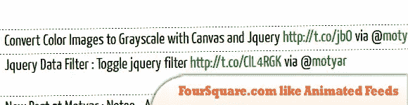
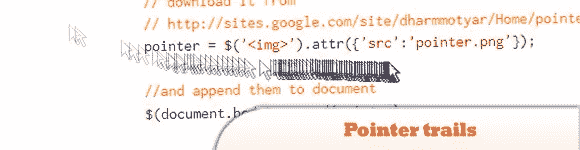
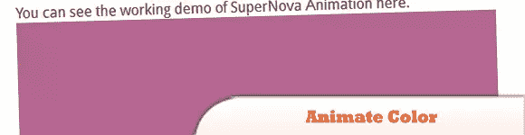
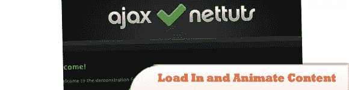
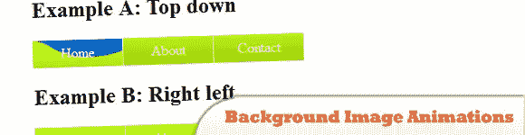

# 8 个很酷的 jQuery 动画效果教程

> 原文：<https://www.sitepoint.com/8-cool-jquery-animation-effects/>

过去，如果你在网站上看到动画，它会自动被认为是 Flash。但现在不是了，有了 jQuery，你可能会对创建动画效果感兴趣，所以这里有一些 **jQuery 动画效果**教程来帮助你。玩得开心！

**相关帖子:**

*   [**10 CSS3 和 jQuery 加载动画解决方案**](http://www.jquery4u.com/animation/10-css3-jquery-loading-animations-solutions/)
*   [**3D JavaScript 动画–three . js**](http://www.jquery4u.com/animation/3d-javascript-animations-three-js/)

## 1.FourSquare.com 喜欢用 Jquery 显示动画提要

在本教程中，您将学习一种使用 jQuery 创建相同 RSS 滚动滚动条的简单方法。

 [来源](http://motyar.blogspot.com/2010/09/foursquarecom-like-animated-feeds.html)
[演示](http://jsbin.com/ilikuh)

## 2.jQuery 的指针轨迹

了解如何借助 jQuery 在网页上创建指针轨迹。

  
[源+演示](http://motyar.blogspot.com/2009/12/create-pointer-trails-with-jquery.html)

## 3.jQuery 在圆形路径中动画

了解如何使用 jQuery 在圆形路径或圆形上制作元素动画。

  
[来源](http://motyar.blogspot.com/2010/08/jquery-animate-in-circular-path.html)
[演示](https://jsfiddle.net/motyar/WcyyF/)

## 4.使用 jQuery 制作颜色动画

使用 jQuery 动画显示背景颜色的变化。

  
[源+演示](http://motyar.blogspot.com/2010/07/animate-color-using-jquery.html)

## 5.用 jQuery 制作梦幻之夜动画

梦之夜是我朋友手机上的一个屏幕保护程序，我尝试用 jQuery 和 CSS 在 web 上实现它。

  
[来源](http://motyar.blogspot.com/2010/03/dream-night-animation-with-jquery.html)
[演示](http://jsbin.com/utibiq)

## 6.令人难以置信的 jQuery 登录表单

在本教程中，我们将创建一个滑动面板，滑入显示更多内容，使用 JQuery 动画显示面板的高度。

  
[来源](http://net.tutsplus.com/tutorials/javascript-ajax/build-a-top-panel-with-jquery/)
[演示](http://d2o0t5hpnwv4c1.cloudfront.net/041_TopPanelWithJquery/demo/index.html)

## 7.用 jQuery 加载内容并制作动画

在本教程中，我们将采用你的日常网站，并用 jQuery 来增强它。我们将添加 ajax 功能，以便内容加载到相关的容器中，而不是用户必须导航到另一个页面。

  
[来源](http://net.tutsplus.com/tutorials/javascript-ajax/how-to-load-in-and-animate-content-with-jquery/)
[演示](http://d2o0t5hpnwv4c1.cloudfront.net/011_jQuerySite/sample/index.html)

## 8.将 jQuery 用于背景图像动画

jQuery 对于这种类型的任务来说是一个很好的库，但是开箱即用，它不能正确地动画化背景位置，因为需要动画化两个值而不是一个。

  
[来源](http://snook.ca/archives/javascript/jquery-bg-image-animations/)
[演示](http://snook.ca/technical/jquery-bg/)

## 分享这篇文章