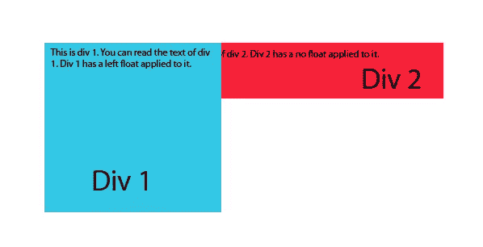
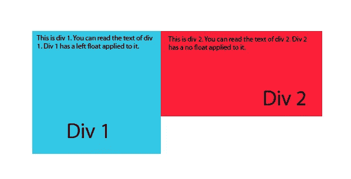
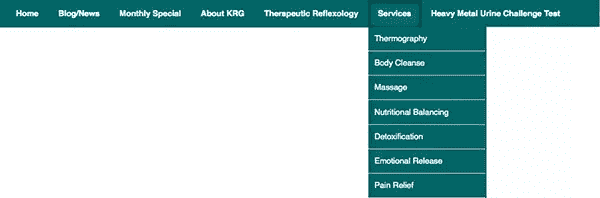
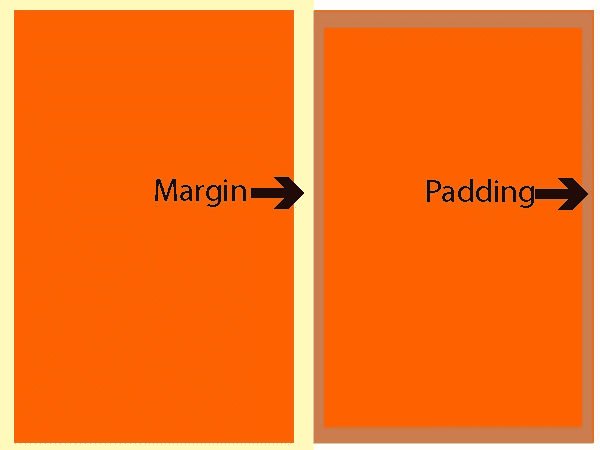
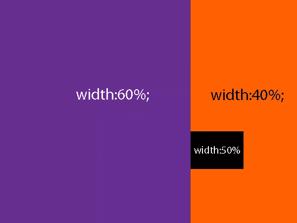
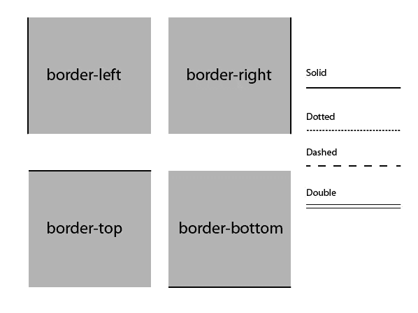

# 8 CSS 属性设计者离不开

> 原文：<https://www.sitepoint.com/8-css-properties-designers-cant-live-without/>

想象一个没有 CSS 的世界，在那里你不能真正控制任何东西在浏览器中的外观和行为。想象一下，在设计中必须使用嵌套表格来分割图像。我们中的一些人已经有足够长的时间来记住表格是一个典型的，完全可以接受的网站设计方式。对我们来说幸运的是，我们已经习惯了这样一个网络，在这个网络中，我们可以用像素精度控制几乎每一个方面。有一些 CSS 属性是我们今天离不开的。他们节省了我们很多时间和挫折，使事情变得如此简单。这些 CSS 属性非常有用，我们每天都在使用它们，如果它们被拿走，我们的工作将是一场噩梦。

### 将样式声明为“！重要"

有时，我们正在推进我们的项目，尽管经过了精心的规划，我们还是需要将 CSS 注入到某个 web 元素中。我们不希望不得不重新安排事情，重命名 div，或者经历一些其他密集的修复，但是我们只需要覆盖对我们的设计很重要的小细节。能够将样式声明为“！重要，”(意味着它覆盖了该元素的任何其他样式)可能不是最佳实践，但当面临时间限制或紧张的截止日期时，它肯定是救命稻草。我无法告诉你有多少次这让我摆脱了困境，而网站的其他部分却完好无损。下面是一个将标题的文本颜色设为红色并声明为“！重要。”稍后在样式表中，如果我们不小心将 h2 标记设计成另一种颜色，它将保持红色，因为！重要属性应用于它。

h2{
color:#f00！重要；
}

### 位置:绝对

这是一个奇妙的 CSS 功能，我在设计不同的网站时多次使用过。这使您能够将元素准确地放置在页面上您想要的位置。您可以指定底部、顶部、左侧或右侧。这个属性非常好，因为你可以告诉一个元素总是贴在最左边，或者你可以控制你的元素，让它离浏览器的上边缘 2em。当你想让某样东西无论如何都在一个特定的空间时，这就很方便了。下面显示了当您将位置设置为绝对位置，并将顶部设置为零，将左侧设置为零时会发生什么。

### 溢出:隐藏

我真的很喜欢这个功能，因为你可以防止内容溢出到其他区域，并保持一个整洁的布局。本质上，这个属性告诉内容，如果它超出了 div 的边界，那么浏览器应该隐藏该区域的可见性。此外，当一个元素向左浮动，另一个元素位于它的后面时，我们可以将隐藏 div 的 CSS 设置为 overflow:hidden，它将不再位于另一个元素的后面。

溢出前:隐藏应用于 Div 2:

溢出后:隐藏应用于 Div 2:

这使得 div 2 可以很好地与 div 1 配合，并防止它消失在 div 1 后面，解决了各种令人头痛的问题。

### Clearfix

这是任何使用 CSS 的设计者的主要特点。我在我所有的网站上都用这个。事实上，我用得太多了，甚至想都没想过。这只是用来治疗严重头痛的一种反射。Clearfix 解决了父容器由于 float 属性而消失的问题。当你有一个浮动的元素时，容器不再将它的高度赋予这个元素。因此，它不是和被浮动的元素一样高，而是更小或者在视觉上完全消失。

### 显示

display 属性允许您只用几个简短的单词就完成这么多工作。它很容易记住，并且是一个多功能的 CSS 命令。您可以指定内联、内联块、块、无等等。我个人最喜欢的是“无”，因为你可以用一小段 CSS 隐藏整个部分。这非常有用，而且非常强大。Display 允许你安排多个元素的方向，这是 CSS 下拉菜单的基础。有了 display，子菜单不会在悬停时消失和出现。在下面的菜单示例中，下拉菜单在没有 display 属性的情况下始终可见。

### 边距和填充

我们都在每个网站的多个元素上使用这些属性。您能想象不能指定边距或填充吗？你不能光学地调整间距，你的文本将骑在所有 div 的边缘，每个元素将被粉碎在一起，由此产生的每个网站看起来都像一个噩梦。边距和填充都很棒，因为它们给你的网站增加了适当的间距和负空间，使其易于阅读，并且空间将每一大块内容分开。如果没有将 margin 属性指定为“auto”，您也无法将网站居中。

### 宽度百分比

能够以百分比的形式指定一个容器或一个元素的宽度允许我们创建随屏幕大小而变化的站点。这一点尤其重要，因为响应式网站设计已经成为标准。如果不能通过媒体查询或使用 CSS 网格系统将宽度指定为百分比，我们知道响应式网页设计是不可能的。能够设置一个元素在页面上占据多大的空间确实给了你很强的控制感。

### 边界

border 属性的使用频率比您想象的要高。您可以使用图像来创建边框，但是如果没有 CSS border 属性，您根本无法指定边框。您可以指定在顶部或底部有边框，这对于在两个垂直堆叠的元素之间创建分隔线非常有用。使用边框-右侧或边框-左侧也是一种很好的方式，可以直观地划分两列文本，使它们更容易阅读。

CSS 中边框的另一个方面是拥有不同类型的边框、边框样式和宽度的能力。这个简单的元素是如此的多才多艺，真的可以美化一个网站。您选择的边框样式会影响整个网站的布局、外观和感觉。将右边框颜色与框阴影和嵌入框阴影结合起来，也可以在不使用图像的情况下为网站增加大量的维度。边框是我们生活中不可或缺的 CSS 属性。

### 结论

如果没有这些 CSS 属性，每个网页设计项目都会充满混乱和不一致。能够控制每个元素在每个网页上的行为意味着我们可以创建一致的布局，这些布局看起来很棒，并且在不同的浏览器上是一致的。

有你每天都要用到的 CSS 属性吗？几年前基于表格的设计工作中，有什么是你怀念的吗？今天，现代的响应式设计中还有什么让你感到沮丧的吗？

## 分享这篇文章