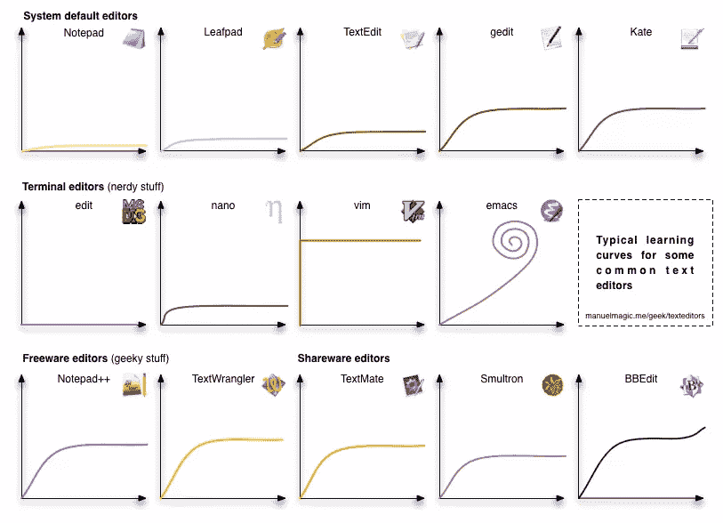
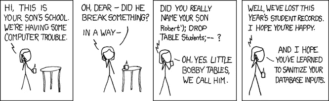
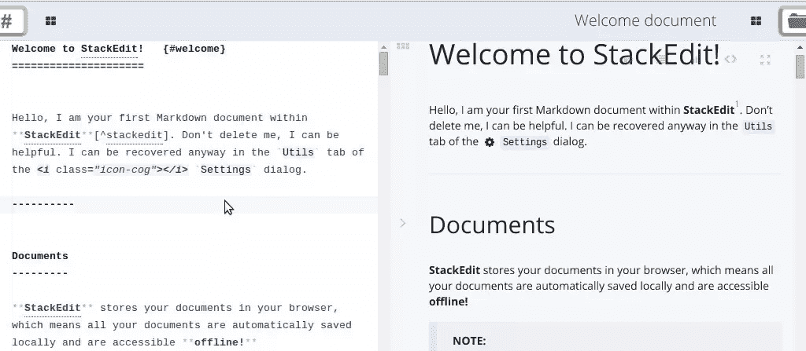

# 开发人员可以在一个周末学会的 8 项基本技能

> 原文：<https://www.sitepoint.com/8-essential-skills-developers-can-learn-in-a-weekend/>

无论您是最终习惯于用特定语言开发项目的初学者，还是希望扩展技能的有经验的开发人员，都不缺少新的东西要学习。从新技术到新技术，大多数都会在你的 web 开发生涯中给你巨大的帮助。这些技能的好处在于，它们都可以在一个周末掌握。这是一个基本的清单，下次你有几天空闲的时候可以处理一下。

## 1.版本控制的魔力

来源:[版本控制教程](http://smutch.github.io/VersionControlTutorial/)

如果您过去没有使用过版本控制，那么您很可能遇到过代码无法正常工作的情况，您会不惜一切代价恢复到以前的正常工作状态。或者，如果您自己通过在文件名后添加后缀来维护备份，您会得到像`index_17.html`这样的文件。

版本控制意味着您可以返回到代码的任何版本——从过去的几个小时到几个月。如果你使用过 Google Drive，你可能已经使用过返回文件旧版本的功能——这是基本的版本控制。

如果你是你应该学习的软件，这里有一篇文章概述了[2014 年版本控制软件的状态](https://www.sitepoint.com/version-control-software-2014-what-options/)——就个人而言，我更喜欢像 Git 或 Mercurial 这样的分布式 VCS，因为我为开源软件做出了贡献。这里有[的 Git 入门指南](https://www.sitepoint.com/git-for-beginners/)，还有[的在开源项目中使用 Git 的指南](https://www.sitepoint.com/using-git-open-source-projects/)。

## 2.文本编辑器的秘密

开发人员一天中很大一部分时间是在电脑前盯着文本编辑器度过的。根据您的需求和您的开发环境，您应该掌握一个文本编辑器，并彻底了解它的技巧和诀窍，以便快速完成某些工作。

来源:曼纽尔的网页

如果你更喜欢在终端工作，你可以试试 [VIM](http://www.vim.org/) 或者 [Emacs](http://www.gnu.org/software/emacs/) 。如果你喜欢使用本地文本编辑器，你可以尝试一下 [Sublime Text](http://sublimetext.com) 。如果你在苹果电脑上工作，你可以试试类似于 [TextMate](http://macromates.com/) 的东西。

仅仅在文本编辑器上工作是不够的——你应该通过安装插件和扩展来尝试探索它的边缘。这里有一个 Sublime Text 的插件列表，面向全栈开发者。

## 3.SQL 的力量…

来源: [XKCD](http://xkcd.com/327/)

应用程序需要文件或数据库来存储用户数据。由于数据库使用起来更快，并且提供了查询数据的选项，web 应用程序更喜欢使用数据库。

SQL(结构化查询语言)是一种帮助我们从数据库中查询数据的语言。然而，当您在开发使用多个表的复杂 web 应用程序时(如果不是在不同的服务器上有多个数据库)，仅仅学习 SQL 的基础知识是不够的。

对于学习 SQL，我建议你去看看鲁迪·利默贝克的书[简单 SQL](https://www.sitepoint.com/premium/library)。如果你仍然被一些 SQL 查询困扰，在 [SitePoint 论坛](https://www.sitepoint.com/forums/)发帖，有人会很快回复你！

## 4.…还有 NoSQL 的神秘

NoSQL(不仅仅是 SQL)是以不同于 SQL 数据库中传统表格形式的形式来组织数据的数据库。NoSQL 数据库在构建时考虑了高可用性和水平伸缩性。他们也可能有类似 SQL 的语言来查询数据。

NoSQL 数据库[有不同的分类](http://en.wikipedia.org/wiki/NoSQL#Classification)，这取决于它们如何组织数据。虽然像 Quora [这样的大公司不使用 NoSQL](https://www.quora.com/Quora-Infrastructure/Why-does-Quora-use-MySQL-as-the-data-store-instead-of-NoSQLs-such-as-Cassandra-MongoDB-or-CouchDB/answer/Adam-DAngelo) ，但是 NoSQL 是初创公司的最爱——尤其是如果他们处理大量数据的话。这使得 NoSQL 成为一项必备技能！

在更高的层面上，当您有非常高的流量时，您可能需要通过复制和分片来扩展您的数据库。

## 5.熟悉终端

与使用 GUI 相比，在终端上执行某些任务会更快。例如，您想在数千个文件中搜索一个字符串的出现，并用其他内容替换它——想象一下，只需几秒钟就可以完成(我将给出一些关于如何完成的提示)。关于终端在基于 unix 的系统中如此强大的一系列原因，我建议你浏览一下[这个线程](http://askubuntu.com/questions/106039/so-what-is-the-advantage-of-using-the-terminal)。

如果您在远程服务器上工作，您将需要终端方面的专业知识。false 您可以使用 GUI 登录并在远程服务器上工作，使用终端总是更快。还有呢？它只占用很少的带宽——毕竟，在终端上工作只是通过网络交换一些文本！

要开始您的旅程，请尝试导航和执行常规任务，如通过终端复制文件。随着时间的推移，您会注意到，通过终端完成某些事情比在 GUI 中点击鼠标更快。

要使用终端的全部功能，您需要了解不同的终端命令并理解它们的用法。举几个显而易见的例子，你应该知道,`sed`用于替换文件中的文本,`grep`用于在文件中搜索,`awk`让你对结构化文件的操作更进一步。这里是给系统管理员的 25 个命令。你也应该看看 [15 个鲜为人知的 unix 命令](https://www.sitepoint.com/15-little-known-unix-commands/)。

## 6.控制远程服务器

作为一名开发人员，您可能不会将代码保存在本地。如果你开发了一个产品，你需要向世界展示它。这时，您需要登录到远程服务器并对其进行配置。

既然您已经使用了终端命令，那么您应该在远程服务器上测试您的技能。如果您可以访问局域网，您可以尝试使用`ssh`命令远程登录到一台 PC。

否则，您可以在云上启动一个实例。亚马逊网络服务(AWS)免费提供一个为期一年的微实例(你只需要一张有效的信用卡)。微软 Azure 也提供类似的服务。这里有一个由 Amazon 提供的关于如何启动实例、连接到实例以及管理实例上的卷的详细教程。登录到服务器后，您就可以像在本地机器上一样使用终端了。

不过还是要提醒一句——亚马逊会保存你的信用卡信息，所以如果你越过了免费层，它会自动扣款。因此，如果你不想赔钱的话，持续监控你的使用情况，关闭不必要的实例。

登录到远程服务器后，检查是否可以安装开发环境。还要在服务器上设置您的 web 应用程序，并借助服务器的 IP 地址在您的本地机器上运行它。

## 7.用单元测试完善你的代码

编程的另一个重要方面是单元测试。当你在做一个大项目时，一次写完所有的代码然后检查它是否工作是不可行的。建议将您的代码分成几个部分，然后为这些部分编写测试。

方法取决于编程语言，但基本思想是相同的——编写部分代码并测试它们。这里有[单元测试入门指南](https://www.sitepoint.com/preventing-code-rot-101-unit-testing/)，还有[最近的单元测试指南](https://www.sitepoint.com/unit-testing-guzzlephp/)

单元测试似乎是一项单调乏味的任务，但在解决 bug 时非常有用。

## 8.学习如何使用 Markdown 写作

我最后提到 Markdown，因为它不影响你的编码方式。然而，对于任何在网络上工作和发布的人来说，这是一个很好的学习技巧。一个用例是编写`README`文件，这些文件显示在 GitHub 和 BitBucket 的项目页面上。此外，如果你保持一个博客来解释你的工作，你迟早会想转向以降价的形式写文章。

Markdown 是一个文本到 HTML 的转换工具，被那些为网络写作的人所使用。这是一个纯文本格式系统，让你专注于写作而不是语法。

有许多在线 Markdown 编辑器，如 [Markable](http://markable.in) 或 [StackEdit](https://stackedit.io/) ，它们与 Google Drive 和 Dropbox 集成在一起。

你还在等什么？前往[此链接](http://daringfireball.net/projects/markdown/basics)学习基础知识。几分钟内就能上手！

## 开始吧

这些是我挑选的你可以在一个周末学到的东西。我错过了什么吗？请在下面的评论中告诉我！

## 分享这篇文章