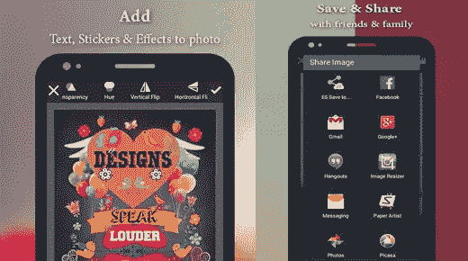
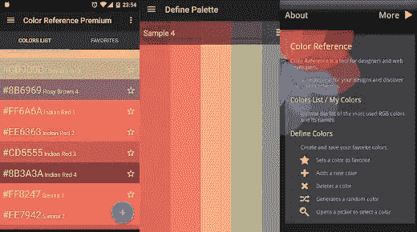
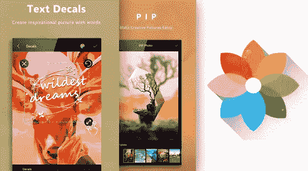
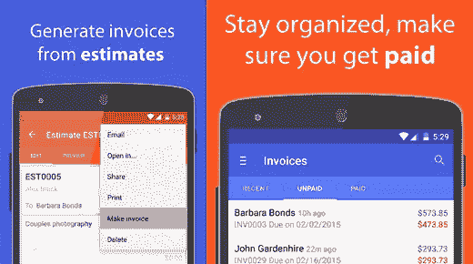
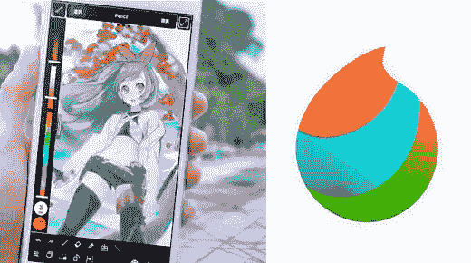
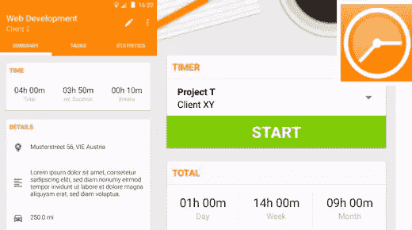
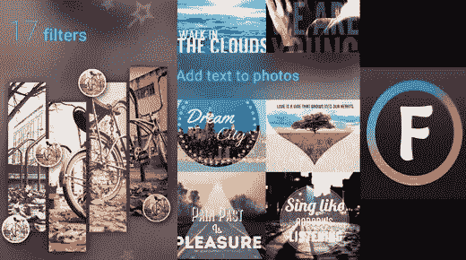

# 面向设计师的 8 款免费便捷的 Android 应用

> 原文：<https://www.sitepoint.com/8-free-and-handy-android-apps-for-designers/>

并非所有的应用程序都是平等的，不幸的是，这意味着当一个新的应用程序发布时，我们这些使用 Android 设备的人有时会受到冷落。这就像当你拥有一台 PS4 时，发现你读到的热门新游戏是 Xbox One 独占的(反之亦然)。

谢天谢地，有很多勤奋的开发者在努力缩小苹果和安卓之间的差距。这意味着，如果你是一个想要尝试苹果专用应用的安卓用户，安卓开发者提供替代产品通常只是时间问题。

今天，我们通过向设计师展示八款便捷的 Android 应用来庆祝 Android 生态系统。最重要的是，它们都是免费的(请注意，一些免费应用程序确实有应用内购买的附加功能)。

## 1.专业设计:照相馆免费

毫无疑问，你的 Android 设备自带了一个图片编辑器，但是 [Designs Pro](https://play.google.com/store/apps/details?id=com.smartapps.photoeditorpro.photoeffectspro.freeappsforandroid) 比普通的编辑器要好得多，你可以在编辑器中裁剪你的图片并添加滤镜。Designs Pro 旨在为您的照片提供尽可能多的创作自由，同时保持用户友好和简单易用，即使对于最年轻的用户也是如此。

随着数以千计的资源文件提供，你可以添加一切从过滤器到贴纸到框架，甚至覆盖文本到您的最终图像。

当然，没有简单的社交分享选项，照片编辑器是不完整的，你不会失望的。将你的作品上传到你的社交媒体，包括脸书、Instagram、WhatsApp、Hangout、Tango 和 Line。

*   **[下载](https://play.google.com/store/apps/details?id=com.smartapps.photoeditorpro.photoeffectspro.freeappsforandroid)**
*   **类别**:摄影
*   **价格**:免费

## 2.颜色参考

如果你熟悉 Kuler 应用程序，你肯定会是 D9d9 的[颜色参考](https://play.google.com/store/apps/details?id=com.dmena.colorreference)的粉丝，这是一个移动调色板创建者。CR 的目标是通过提供灵感和允许您发现新的配色方案来帮助您充分利用您的设计，从而改进您的 CSS 设计。

虽然与其他一些调色板创建器相比，CR 是相当新的，但它现在具有一些其他调色板创建器可能没有的功能，包括一个有吸引力的材质设计 UI。

当然，它展示了您对色彩管理器的期望，包括从现有图像中选择颜色的能力，自动调色板生成，当然还有共享的能力。颜色参考绝对是你应该尝试的一个工具。

*   [**下载**](https://play.google.com/store/apps/details?id=com.dmena.colorreference)
*   **类别**:色彩管理
*   **价格**:免费

## 3.Toolwiz 照片〔t0〕

尽管 Designs Pro 很好，但很少一个工具能涵盖你需要的一切——有时你需要一个后备。进入 [Toolwiz Photos](https://play.google.com/store/apps/details?id=com.btows.photo) ，这款应用试图提供 Photoshop 工具包的免费版本，具有一系列快速设计的一键效果。

从图像处理，多重滤镜，特效，绘画和涂鸦的能力，Toolwiz 是完全免费的，没有广告或应用内购买，这令人惊讶。无论如何，它在快速浏览、社交分享、智能存储节省等方面都是一流的。这个专业工具当然值得在你的 android 设备上占有一席之地，即使它只是用于测试运行。

*   [**下载**](https://play.google.com/store/apps/details?id=com.btows.photo)
*   **类别**:摄影
*   **价格**:免费

## 4.移动中的发票和评估

任何一个在职的设计师都需要能够管理他们的发票，给他们的客户开账单，当然，还要能估计出这项工作的成本。谢天谢地， [Invoice Simple](https://play.google.com/store/apps/details?id=com.aadhk.woinvoice) 通过免费提供他们的 invoice and estimates 应用程序，让自由职业者的设计变得简单。

尽管该应用程序是免费的，但在升级应用程序之前，你可以发送的发票数量会受到限制。然而，如果你不需要发送大量发票或者不介意支付少量费用，这可能不是一个交易破坏者。

*   [**下载**](https://play.google.com/store/apps/details?id=com.aadhk.woinvoice)
*   **类别**:商业管理
*   **价格**:免费

## 5.美迪邦涂料

曾经需要快速绘制草图或涂鸦，但手边没有速写板吗？多亏了免费的轻量级绘图应用程序 MediBang Paint，你再也不用在沾有咖啡的餐巾纸上乱涂乱画了，这款应用程序允许你在任何地方绘图、绘画和创作，同时仍然可以访问桌面版本的所有功能。

手头上有许多不同的创作工具，这是一个普通插画师或有抱负的漫画艺术家的伟大应用程序。预装了 60 个免费画笔、免费漫画字体、预先制作的背景、纹理和色调，使用 MediBang 很容易创建一些值得惊叹的东西。

借助共享工具，您甚至可以在不同设备之间与同行艺术家进行协作。此外，您不仅可以与您的社交媒体渠道分享，还可以与 MediBang 社区分享。

*   [**下载**](https://play.google.com/store/apps/details?id=com.medibang.android.paint.tablet)
*   **类别**:花色
*   **价格**:免费

## 6.时间表

虽然这可能不是我们工作中最喜欢的部分，但每个设计师都需要一种简单的方法来跟踪他们在给定项目上花费的时间。有了[时间表](https://play.google.com/store/apps/details?id=com.rauscha.apps.timesheet),你不仅可以记录你花费的时间，还可以记录你休息的时间，记录你在这段时间的花费，你甚至可以添加笔记。

时间表真正酷的地方是，你可以为你的项目分配一个特定的 Wi-Fi 点，这样当你离开或进入接入点时，时间表会自动停止或开始，无需你做任何事情。

因为您可以创建和管理项目，所以您也可以将您的时间表导出到 XLS 或 CVS，以便导入 Excel。不仅如此，时间表允许轻松备份到 SD 卡或你的 Dropbox，这真的让这个应用程序方便

*   [**下载**](https://play.google.com/store/apps/details?id=com.rauscha.apps.timesheet)
*   **类别**:生产力管理
*   **价格**:免费

## 7.字体工作室

你可以用图片上的文字完成大量的工作——许多伟大的专辑封面证明了这一点。RC PLATFORM 的人知道这一点，这就是为什么他们创建了 Font Studio，这是一个字体编辑器，允许您为您的照片添加香料，提供超过 120 种可用的漂亮的精选字体。

Font Studio 也不仅仅是为了漂亮的排版。您可以添加插图、贴纸、框架和滤镜来搭配您选择的字体，还可以对文字进行一些基本的编辑。因为 Font Studio 是为了让你的照片更漂亮，你也可以通过调整亮度、对比度、饱和度模糊以及添加滤镜来调整你的图像。

*   [**下载**](https://play.google.com/store/apps/details?id=com.rcplatform.fontphoto)
*   **类别**:字体/排版
*   **价格**:免费

## 8.草图

索尼的官方绘图应用 Sketch 是移动插画师的梦想，让他们离开桌面，同时将一个全功能的工具包放在他们的指尖——包括独特的铅笔、画笔和记号笔。

Sketch 还提供与你的朋友和同事的协作，以及一个你可以浏览其他用户的作品，甚至张贴你自己的新作品的草图社区。

*   [**下载**](https://play.google.com/store/apps/details?id=com.sonymobile.sketch)
*   **类别**:绘画和颜色
*   **价格**:免费

那对我来说结束事情。我希望你能找到一些东西来增加你的手机设计技能。如果我错过了某个以设计为导向的 android 应用，请告诉我。

## 分享这篇文章