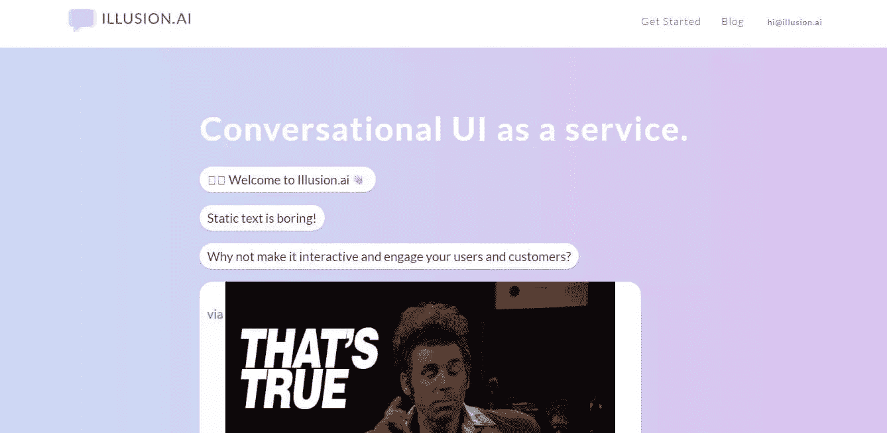
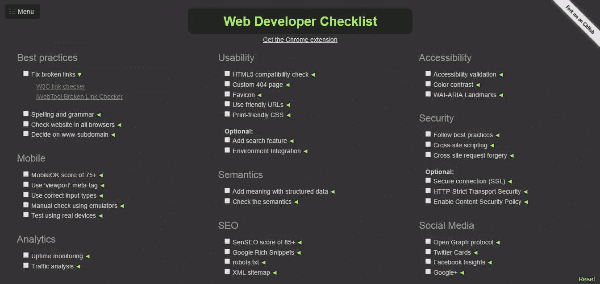
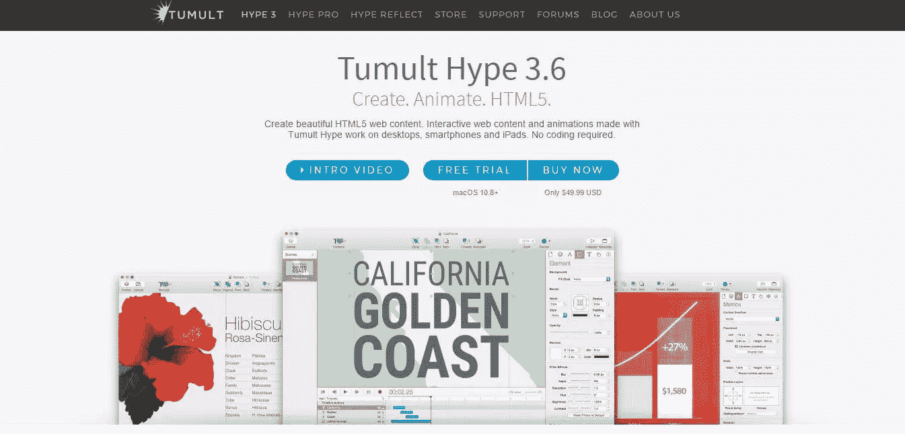
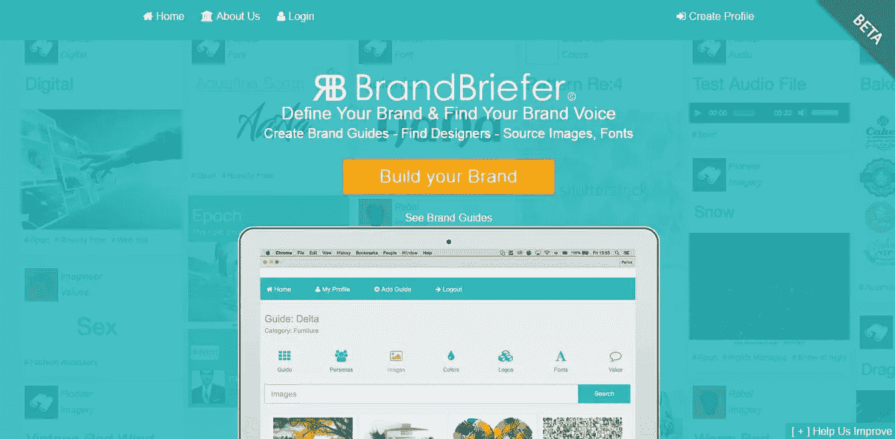
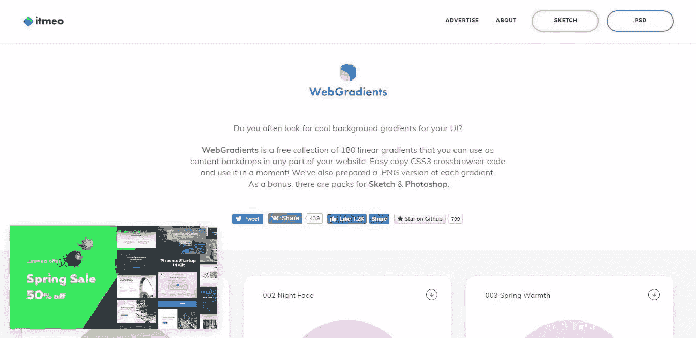
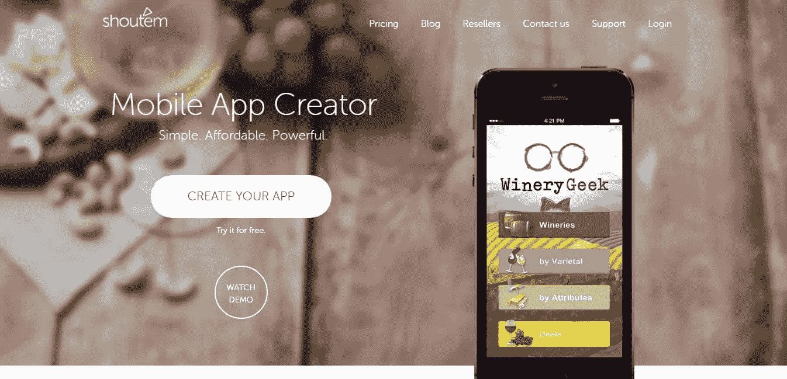

# 为您的 2017 年工具箱提供 8 种全新设计工具和资源

> 原文：<https://www.sitepoint.com/8-fresh-design-tools-and-resources-for-2017/>

这是一把锤子。更准确地说，这是一把 20 世纪 60 年代晚期的老式 *Estwing 羊角锤*。这是一件制作精美、坚固的作品，但也与今天 [Estwing 生产的锤子](http://www.estwing.com/about_us.php)没有太大区别。锤子——以及它们的使用方式——50 年来没有太大变化。然而，我们使用的**网页设计工具和资源*与*不同**。

看看你今天使用的工具，并与你 5 年前使用的工具进行比较。在 2012 年，你可能使用 png 作为图标。Photoshop 无处不在。Sketch 是一个边缘设计应用，SVG 是一种奇怪的 Inkscape 格式。事情已经发生了变化，而且很可能会继续下去。很有可能，你的下一个工具已经存在了。

### 那么，你 2017 年的工具箱里会有哪些设计工具和资源呢？

这就是我们今天要帮助你的。我向我认识的每一个设计师和开发人员询问、询问、督促他们最近使用的工具。这是我想出来的候选名单。有应用程序、扩展、在线工具等等，**看看它们，让我们知道它们是否适合您的工作流程！**

## Illusion.ai

随着 2017 年对话式用户界面的新兴趋势， [Illusion.ai](http://Illusion.ai) 背后的旧金山团队开始创建一种服务，允许你设计和应用对话式界面到你的网站和移动网站。这个想法有助于吸引你的访客和客户谈论你的产品或服务。通过集合中的各种模板，您可以创建高度可定制的体验和界面。

**网站**:【https://illusion.ai/ 

**类别** : UI 设计

**价格**:免费(目前为 Alpha)

**底线** : [Illusion.ai](http://Illusion.ai) 使可定制的、引人入胜的对话界面不仅容易创建，而且可以嵌入到你的网站中。

## Web 开发人员清单

网络开发者清单是 Chrome 的扩展，而不是网络应用。该扩展是专门为 web 开发人员设计的，因为它允许他们检查自己的 web 页面是否有任何错误或违反常规的行为。

虽然清单已经非常广泛，但仍有计划在未来加入 Rails 和 Python checkers。目前，这一扩展让开发者能够发现他们网站的任何潜在问题，并纠正这些问题。

**网站**:【http://webdevchecklist.com/ 

**类别**:公用事业

**价格**:免费

**底线**:网页开发者实时捕捉潜在问题的综合清单。

## 免费昆虫

Freebiesbug 由 Pasquale Vitiello 创建，是一个网页设计博客，将自己定位为网页和平面设计师的一站式商店，他们正在寻找最新的免费资源。Freebiesbug 的目标是通过提供大量免费资源，包括 PSD、Illustrator 和草图文件以及字体、代码和库存照片，让设计师轻松快速地进行创作。

**网站**:【https://freebiesbug.com 

**类别**:资源

**价格**:免费

**底线**:freebiebug 是为设计者和开发者提供的一个免费的高质量资源集合。

## 炒作 3

Tumult 的 Hype 3 是 Mac 独有的工具，由两名前苹果工程师创建，唯一的目的是帮助你为你的网站创建交互式 HTML5 内容并制作动画。有了 Hype Reflect 和 HyperEdit，Mac 用户能够使用响应式布局来设计从电子贺卡到信息图表和动画网站元素的一切内容，而无需学习代码。

**网站**:【http://tumult.com/hype/ 

**类别**:设计

**价格**:14 天免费试用或 49.99 美元

**底线** : Tumult 的大肆宣传让 Mac 网页和图形设计师在不知道代码的情况下创建 HTML5 内容。

## 品牌简介

BrandBriefer 是一个专门为设计师和企业设计的在线平台，是一个致力于品牌创建的网络应用程序。BrandBriefer 不仅像一个资源中心，你可以在那里找到品牌资产，还可以让你找到设计师来帮助你。从创建品牌指南到让利益相关者真正成为设计过程的一部分，BrandBriefer 致力于成为一个全方位的品牌设计中心。

**网站**:【http://brandbriefer.com 

**类别**:生产力和商业

**价格**:免费测试版

**底线** : BrandBriefer 是一个在线平台，可以帮助你快速启动你的品牌推广过程。

## Itmeo 的 web 渐变

Itmeo 是一个来自俄罗斯圣彼得堡的小团队，他们以为网页设计者和开发者创造包括 WebGradients 在内的产品而自豪。这是一个免费的线性渐变源，目前总共有 180 种，Itmeo 的精选收藏有 Sketch、Photoshop、CSS 和 PNG 格式，所有设计师都可以使用。有了一个简单的实现系统，你可以随时在你的用户界面上添加任何渐变。

**网站**:【https://webgradients.com/ 

**类别**:资源

**价格**:免费

**底线**:网页设计者的一站式商店，为他们的 UI 内容寻找容易实现的渐变。

## 精神失常

Sketch 对前端设计产生了相当大的影响，但也给 Windows 用户带来了新的难题。Lunacy 是一个 Windows 专用的草图浏览器，Icons8 推出了同步和插件，让 Windows 用户可以轻松访问草图文件。

目前，Lunacy 处于测试阶段，Icons8 团队正在增加更多功能。现在，Windows 用户可以复制 CSS 和导出资源，就像通过 Avocode 和 Zeplin 一样。除了免费下载到你的桌面上，还有一个 Lunacy 的便携下载。

**网站**:【https://icons8.com/lunacy 

**类别**:公用事业

**价格**:免费

**底线** : Lunacy 为 Windows 用户提供了一种免费访问草图文件的方式。

## Shoutem

Shoutem 就像移动应用程序的 WordPress，你可以在那里构建、发布和管理你的应用程序。借助 app builder 和 CMS 工具，任何人都可以通过其开源扩展创建新的或定制当前的应用功能。Shoutem 拥有超过 200 个使用 React Native 编写的可定制布局，以及 40 多个内置屏幕和大量预建扩展，为不需要编码技能的移动应用程序开发人员提供了无限可能。

**网站**:【http://www.shoutem.com/?utm_expid=.H5EqvYGARkmHbMn-woGSzA.0】T2&UTM _ referrer =

**类别**:生产力

**价格**:前 3 个计划的免费试用，基本-每月 19.90 美元，高级-每月 49 美元，无限-每月 119.90 美元，企业-联系 Shoutem

**底线** : Shoutem 是一个拖放式应用构建器，允许你轻松快速地创建跨平台的移动应用。

*你知道吗，Gabrielle 还教授一门很棒的设计课程——[开发者设计原则](https://www.sitepoint.com/premium/courses/principles-of-design-for-developers-2871)* ？

## 分享这篇文章