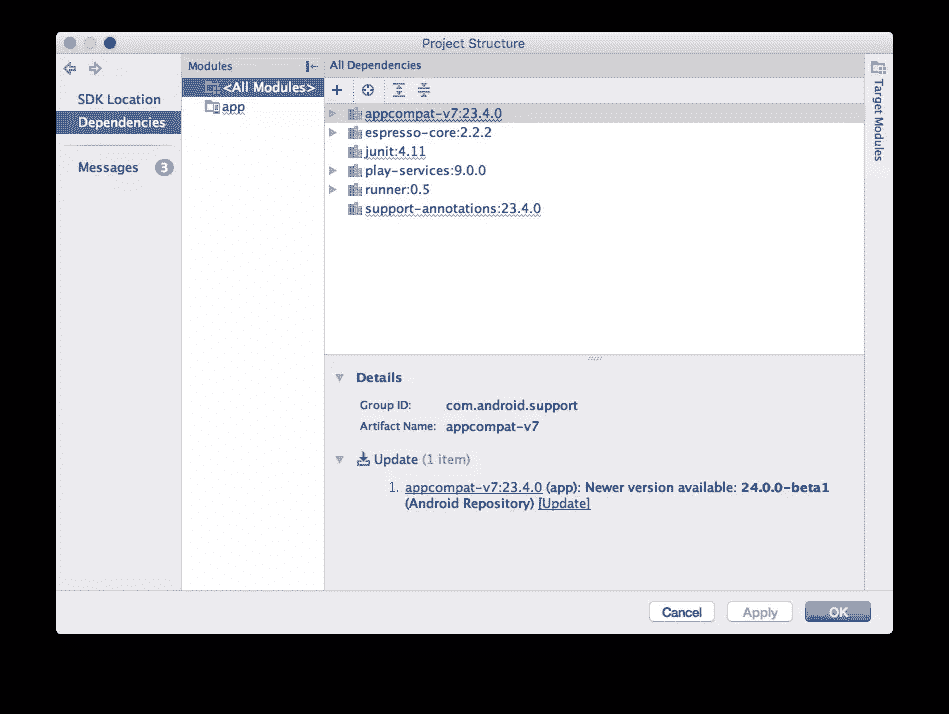
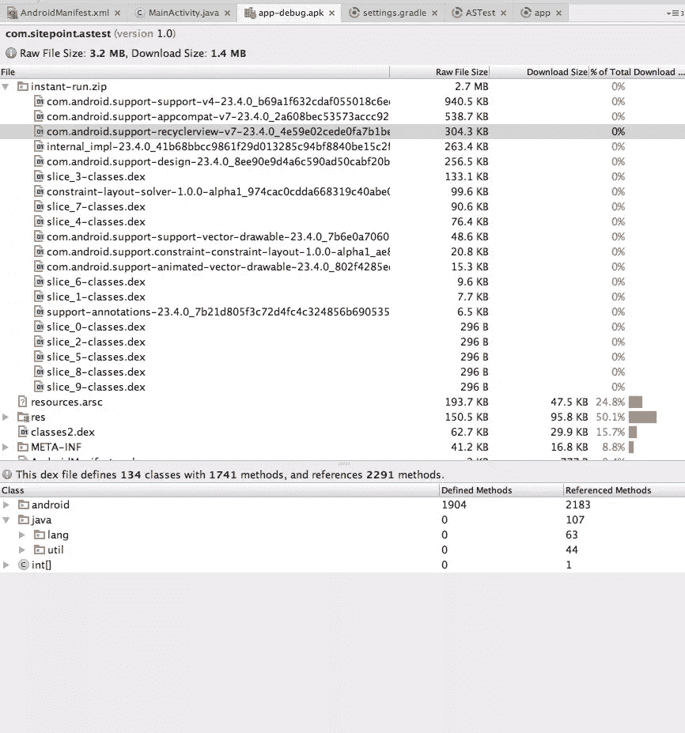
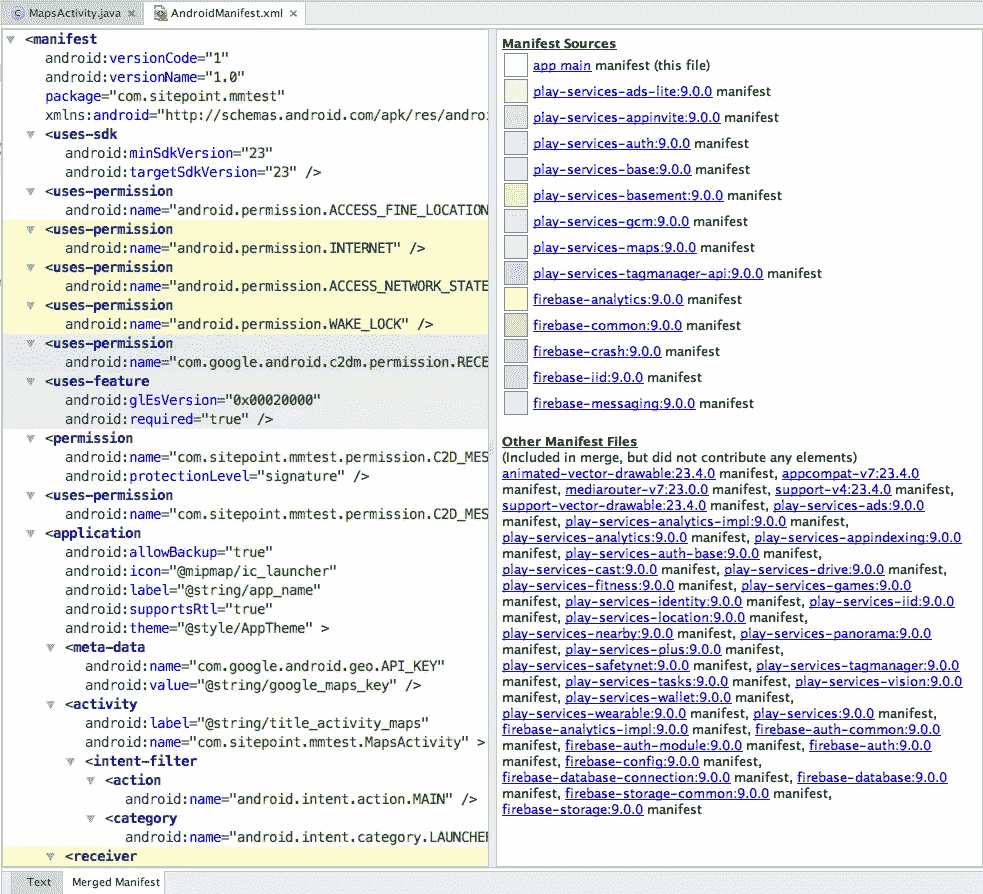
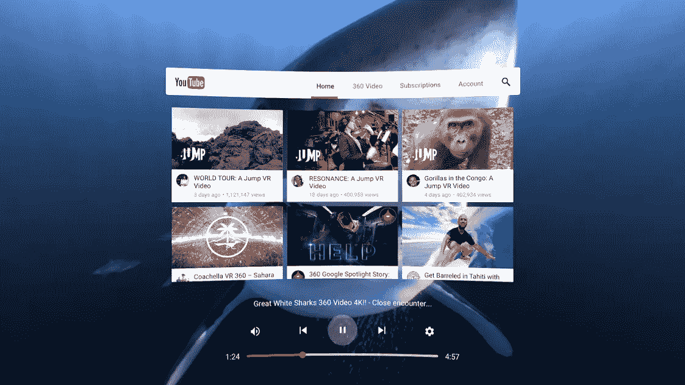
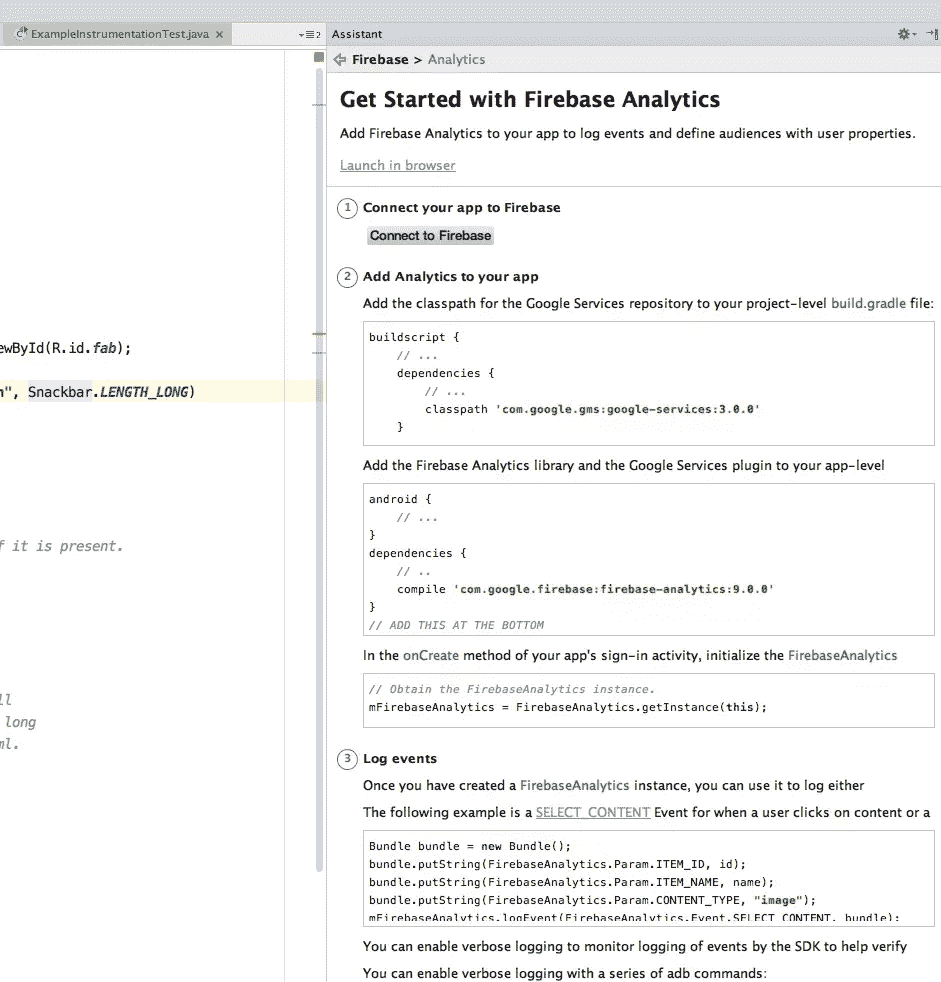

# Google IO 上面向 Android 开发者的 8 个重要公告

> 原文：<https://www.sitepoint.com/8-key-announcements-for-android-developers-at-google-io/>

又是一年，又是一次木卫一。谷歌发布了一系列公告，从他们自己进军助手领域，到几个奇怪的设备和应用程序。其中很少有细节或任何可供开发者访问的 API，所以 SitePoint 将在以后讨论这些内容。如果你有兴趣阅读更多内容，我推荐[谷歌官方 IO 博文](https://googleblog.blogspot.de/2016/05/io-building-next-evolution-of-google.html)。

[SitePoint 已经涵盖了开发者在 Android N](https://www.sitepoint.com/what-can-developers-expect-in-android-n/) 中可以期待的内容，并且已经进行了更新，包括了新的公告。

Android N 中一些我最喜欢的(以用户为中心的)功能包括[无缝更新](http://www.xda-developers.com/current-android-devices-are-unlikely-to-receive-android-ns-seamless-update-feature/)(从 ChromeOS 借来的)[即时编译](http://www.androidpolice.com/2016/03/09/android-n-feature-spotlight-updated-art-compiler-means-no-more-optimizing-apps-step/)(再见“Android 正在更新”)

但是在这篇文章中，我将关注你现在可以做什么以及如何开始做。

有很多内容要介绍，所以是时候潜入机器人大小的游泳池了。

## 1.Android Studio 2.2

我喜欢 Android Studio，即将推出的版本带来了许多新功能，可以改善 Android 开发者的体验。哦，当你下载所有这些新的 SDK 时，请注意 Android Studio 最终允许它们在后台下载。

### 速度

Instant run 在最近的 Android Studio 版本中得到了改进，2.2 版本声称进一步提高了 10 倍。仿真器也更快，据称仿真器现在可能比一些真实设备更快。

### 测试记录器

这个功能太赞了。它使您能够在调试模式下运行应用程序，并自动编写 Espresso 测试，以便在本地或远程测试实验室运行 UI 事件。

我希望能录制一段演示，但是在我下载的预览中我看不到菜单选项。这是令人失望的，我不知道我是否错过了什么。

### 建造得更好

Android Studio 为您的应用打开了一个充满可能性的世界，现在包括对 CMake 和 NDK 构建工具的支持，并增加了对 Java 8 的支持。这也意味着用 C++编码将不再需要 [NDK 库](https://developer.android.com/ndk/index.html)，并将允许更好地混合 C++和 Java 代码。这都要归功于从 [CLion IDE](https://www.jetbrains.com/clion/) 中提取的功能，同样来自 JetBrains。

如果你坚持使用 Gradle，有一个新的*文件- >项目结构*菜单项(在首选项的*实验*窗格中启用它的需求)将提醒你过时的依赖项，允许你更新和安装它们，并为你写入 Gradle 文件。

对于那些正在努力将应用程序权限迁移到新的 M 和 N 模型的人来说，突出显示一个旧式权限并选择*重构- >转换到 Android 系统权限*菜单项应该可以帮助你。

### 布局

Android Studio 的界面设计工具仍然落后于 XCode，但 2.2 版本通过更好的拖放布局(尤其是菜单)、用于检查排列的新蓝图模式、用于跨多种设备设计界面的约束布局(如 iOS 中的 AutoLayout)以及新的组件检查器(显示额外计算的运行时细节)进行了改进。

### 编码更好

为了帮助您更好地编码，2.2 版增加了新的 API 版本检查、线程处理和其他用途的注释。它添加了一个示例浏览器来帮助查找方法的特定符号的代码示例。它还提供了一个 APK 分析器来跟踪内存问题，并建议减少最终编译的应用程序的文件大小。您可以在*构建- >分析 APK* 菜单项下找到分析器。

你也可以在 APK 看到瞬间奔跑的证据。

新的合并清单视图帮助您查看从其他来源添加到清单文件中的其他项目。例如，在这个演示 Google Maps 应用程序中，您可以看到从 play services 和 firebase 添加到清单中的条目:

## 2.即时应用

引起最大兴奋/阴谋/困惑的声明是，在未来的某个时候，Android 用户将能够[打开应用程序而无需安装它们](http://android-developers.blogspot.de/2016/05/android-instant-apps-evolving-apps.html)。当用户点击相关应用程序的链接时，Play store 将下载执行该操作所需的应用程序代码部分。这利用了 Android 的`Activity`概念，并将在所有版本的 Android 上工作。有趣的东西，我想知道这将如何影响安装或尊重用户可能设置的数据限制。

## 3.玩 ChromeOS

对你来说，潜在的数亿台正在使用的 Android 设备还不够多吗？谷歌声称(经 IDC 证实)在 2016 年第一季度销售了超过 200 万台基于 Chrome 的设备，超过了苹果的 Mac 销售数据，现在，Play store 可以在该平台上使用。

为了实现这一点，谷歌正在使用 Linux 名称空间的组合来隔离 Android 和 ChromeOS，但共享一些基本资源和合成。没有仿真或虚拟化，但 ChromeOS 中有一个完整的 Android 操作系统。

大多数功能应该可以在 ChromeOS 上运行，无需太多工作，但请记住，许多功能没有意义，也就是说，你不会带着 ChromeBook 去跑步。

[点击此处了解更多详情和建议](https://developer.chrome.com/apps/getstarted_arc)。

## 4.虚拟现实白日梦

由于其简单性，Cardboard 是谷歌进军虚拟现实(VR)的一个半成功的尝试。但我们都知道，要让 Android 上的虚拟现实成为一个更大的问题，还需要更多的东西。

' Daydream '将是 Android N 的一部分(不要与' [daydream mode](https://support.google.com/nexus/answer/2818748?hl=en) '混淆)，辅以 daydream-ready 设备，这限制了用户群，但谷歌声称“数亿”用户应该能够使用该平台。还建议您使用新的耳机和控制器，这目前只是一个概念设计，但纸板也可能仍然可用。

Daydream 主屏幕很有趣，为导航内容和媒体服务提供了一个未来派的沉浸式界面。其中包括来自网飞、Hulu、YouTube 和(奇怪的是)纽约时报的专业应用。

我无法测试 Daydream 的开发过程，因为目前你需要一个 Nexus 6P。如果你有一台，那就沉浸在[这里的设置说明](https://developers.google.com/vr/concepts/dev-kit-setup#set_up_the_controller_phone)中吧。SDK 也适用于 [Unity](https://developers.google.com/vr/unity/) 和 [iOS](https://developers.google.com/vr/ios/) 。

## 5.Android Wear 2.0

Android 可穿戴扩展的下一个版本将于今年晚些时候发布，并将引入许多新功能，以下是我最喜欢的一些功能:

*   [手表表面完全可定制](https://developer.android.com/wear/preview/features/complications.html)，能够显示来自任何其他应用程序的数据。
*   奇怪的是，该操作系统将提供手写识别和键盘，使用[输入法框架](https://developer.android.com/wear/preview/features/ime.html)。
*   在支持的设备上，独立模式，因此应用程序可以在可穿戴设备上单独运行，而不需要配对的设备。
*   Android Wear 现在已经有官方的[材质设计指南。](https://www.google.com/design/spec-wear/material-design-for-wearables/introduction.html)

在这里找到更多细节[，如果你热衷于开发 Wear 2.0，在这里](https://developer.android.com/wear/preview/index.html)找到预览[的细节。](https://developer.android.com/wear/preview/start.html)

## 6.安卓汽车

将你的汽车作为安卓设备的伴侣正成为一个更可行的选择。虽然它没有收到很多头条新闻，但有一些小的更新可能会引起开发者的兴趣。如果你还没有尝试过为 Android Auto 开发， [SitePoint 最近发表了一篇关于入门的文章](https://www.sitepoint.com/taking-a-ride-with-android-auto/)。

*   **Waze 内置于**:开发人员对这套新的地图数据无能为力，但是如果你熟悉(并且正在使用)Waze API，它将是你工作的另一个平台。
*   **你不需要兼容的汽车**:在花了这么多时间让汽车仪表盘与手机相得益彰之后，从今年晚些时候开始更新，你甚至不再需要汽车了。相反，你可以将手机切换到“汽车模式”,在一个设备上拥有一个大而易操作的界面(现在是语音操作的)。

## 7.火焰基地加入了母舰

谷歌在 2014 年收购了 Firebase，它很好地补充了谷歌的核心业务，两家公司都受益于彼此的经验和产品阵容。随着[脸书宣布关闭 Parse](https://www.sitepoint.com/migrating-your-android-or-ios-app-from-parse/) ，Firebase 有了一个绝佳的机会来填补这个空白，谷歌似乎也渴望这样做。

大部分改进包括更好地集成单个 Firebase 工具，以及将它们更好地集成到 Google 生态系统的其余部分。

这些工具和改进包括应用分析、崩溃报告、消息框架、用户增长工具等。最重要的是，这些工具在 Android Studio 2.2 中默认启用，带有一个易于使用的插件，可以为您配置应用程序和代码。或者您可以将代码片段拖到您的代码中。

现有谷歌服务的一些最有用的改进是与 [AdMob](https://www.google.com/admob/) 平台，将 Firebase 数据导出到 [BigQuery](https://cloud.google.com/bigquery/) 进行分析的能力，以及将计费转移到谷歌的中央云计费平台以简化计费。我希望这能为 Firebase 和 Google 未来更好的合作打下基础。

## 8.自己取名字

谷歌声称他们正在努力为他们的 N 版本确定一个名字，并且已经向公众开放了这个过程。我认为人们认为这是蹩脚的宣传噱头，大多数提交的作品可能会被忽略，但我相信有人会从默默无闻中脱颖而出，成为谷歌批准的名称的获胜者。

## 谷歌的挑战

唷！多么重大的事件。我对许多新功能的发布感到兴奋，但更兴奋的是实现它们的改进工具，以及 Android/Google 生态系统的成熟和整合。

距离 WWDC 还有不到一个月的时间，苹果要向开发者和消费者传递很多压力，我怀疑他们会不会这样做。

## 分享这篇文章