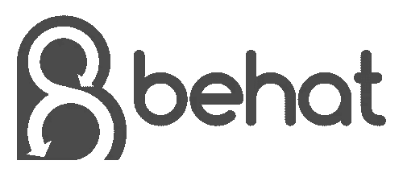
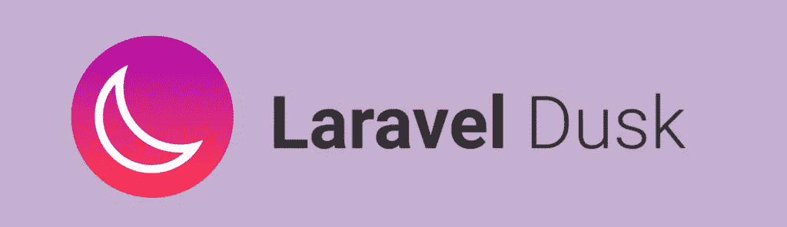

# 8 必须有 PHP 质量保证工具

> 原文：<https://www.sitepoint.com/8-must-have-php-quality-assurance-tools/>

*这篇广受欢迎的文章于 2017 年 6 月 30 日更新，包含了最新的技术和工具。*

* * *

对于交付质量代码，我们必须在编码时考虑测试(如果不做 TDD 的话)。然而，由于 PHP 测试工具种类繁多，很难做出选择！探索 PHP 是一次有趣的冒险(这里是高级课程！)但是很难组装出一个不太重的工具带，可以戴着上班！

这篇受欢迎的文章将重点介绍最受欢迎的测试工具，并已更新以反映 2017 年 QA 工具的状态。

> 未经测试的代码是破损的代码。


## PHPUnit

PHPUnit 是 PHP 测试框架。它是由塞巴斯蒂安·博格曼于 2004 年创建的，目前版本 6 需要 PHP 7。

我们有很多关于它的教程。

## 黄瓜

Cucumber 是一个根据规范创建验收测试的框架。它以描述性生成的文本而闻名，可以像普通英语一样阅读。Cucumber 的官方 PHP 实现是 [Behat](http://behat.org) 。



我们在 SitePoint 上有一个关于它的入门教程。下面这个来自文档的例子是一个很好的例子，说明了这些期望是如何表达的。

```
Feature: Listing command
  In order to change the structure of the folder I am currently in
  As a UNIX user
  I need to be able see the currently available files and folders there

  Scenario: Listing two files in a directory
    Given I am in a directory "test"
    And I have a file named "foo"
    And I have a file named "bar"
    When I run "ls"
    Then I should get:
      """
      bar
      foo
      """ 
```

## 阿图姆


Atoum 是 PHP 的另一个单元测试框架。这是一个独立的软件包，你可以通过 GitHub、Composer 或 PHAR 的可执行文件来安装。

Atoum 测试具有表达性的方法名和链接，可读性很强。

```
$this->integer($classInstance->myMethod())
        ->isEqualTo(10);

$this->string($classInstance->myMethod())
        ->contains("Something heppened"); 
```

你想了解更多关于用 Atoum 进行 PHP 单元测试的知识，可以关注这个[教程](https://www.sitepoint.com/testing-php-code-with-atoum-an-alternative-to-phpunit/)。

## 硒

[Selenium](http://docs.seleniumhq.org/) 是一个自动化浏览器测试(集成和验收测试)的工具。它将测试转换为浏览器 API 命令，并断言预期的结果。它支持大多数可用的浏览器。

我们可以通过扩展将 Selenium 与 PHPUnit 一起使用。

```
composer require --dev phpunit/phpunit
composer require --dev phpunit/phpunit-selenium 
```

这里有一个简单的例子:

```
class UserSubscriptionTest extends PHPUnit_Extensions_Selenium2TestCase
{
    public function testFormSubmissionWithUsername()
    {
        $this->byName('username')->value('name');
        $this->byId('subscriptionForm')->submit();
    }
} 
```

如果您想了解更多关于使用 PHPUnit 和 Selenium 进行[测试的内容，可以阅读本系列文章。](https://www.sitepoint.com/using-selenium-with-phpunit/)

## 黄昏



Laravel 的 Dusk 是另一个浏览器自动化工具。它可以单独使用(与 [chromedriver](https://sites.google.com/a/chromium.org/chromedriver/home) 一起使用)或者与 Selenium 一起使用。它有一个易于使用的 API，并涵盖了所有的测试可能性，如等待元素，文件上传，鼠标控制等。这里有一个简单的例子:

```
class LanguagesControllerTest extends DuskTestCase
{
    public function testCreate()
    {
        $this->browse(function (Browser $browser) {
            $user = $this->getAdminUser();

            $browser->loginAs($user)
                ->visit('/panel/core/languages')
                ->click('#add')
                ->assertPathIs('/panel/core/languages/create')
                ->type('name', 'Arabic')
                ->select('direction', 'rtl')
                ->press('Submit')
                ->assertSee('Language: Arabic')
                ->assertSee('ar')
                ->assertSee('rtl')
                ->assertSee('Language created');
        });
    }
} 
```

你可以查看[这个教程](https://www.sitepoint.com/laravel-dusk-intuitive-and-easy-browser-testing-for-all/)来开始测试 Dusk。

## 卡兰


Kahlan 是一个全功能的单元& BDD 测试框架，它使用了 describe-it 语法。

```
describe("Positive Expectation", function() {
    it("expects that 5 > 4", function() {
        expect(5)->toBeGreaterThan(4);
    });
}); 
```

从上面的语法可以看出，它类似于 Behat 测试。Kahlan 支持开箱即用的存根和模仿，没有依赖、代码覆盖、报告等。

```
it("makes a instance double with a parent class", function() {
    $double = Double::instance(['extends' => 'Kahlan\Util\Text']);

    expect(is_object($double))->toBe(true);
    expect(get_parent_class($double))->toBe('Kahlan\Util\Text');
}); 
```

## php_testability

这里我要提到的最后一个包是 [PHP 可测试性](https://github.com/edsonmedina/php_testability)。它是一个静态分析工具，告诉你程序中的可测试性问题，并生成详细的报告。

该包目前没有您可以依赖的带标签的版本，但是您可以在开发中安全地使用它。您可以通过 Composer 安装它:

```
composer require edsonmedina/php_testability "dev-master" 
```

然后像这样运行它:

```
vendor/bin/testability . -x vendor 
```

## 持续集成(CI)服务

与团队一起工作时，交付代码的一个重要部分是在代码被合并到项目的正式回购之前自动检查代码的能力。大多数可用的 CI 服务/工具都提供了在不同平台和配置上测试代码的能力，以确保您的代码可以安全地合并。


有许多服务提供了不错的定价等级，但是您也可以使用开源工具:

*   [PHPCI](https://github.com/Block8/PHPCI) :(开源)[入门篇](https://www.sitepoint.com/continuous-integration-php-ci/)。
*   [TravisCI](http://travis-ci.org/) :(开源项目免费)[入门篇](https://www.sitepoint.com/php-continuous-integration-travis-ci/)。
*   [SemaphoreCI](https://semaphoreci.com/) :(开源项目免费)[入门篇](https://semaphoreci.com/blog/2014/05/29/introducing-continuous-integration-for-php-on-semaphore.html)。
*   [詹金斯](https://jenkins.io/) : [入门篇](https://www.sitepoint.com/re-introducing-jenkins-automated-testing-with-pipelines/)。

## 结论

采用测试文化是困难的，但是它会随着实践慢慢成长。如果你关心你的代码，你应该测试它！以上工具和资源将帮助您快速入门。

您对上述工具有什么体验？我们错过了什么吗？让我们知道，我们会尽最大努力用必要的工具来扩展列表！

## 分享这篇文章