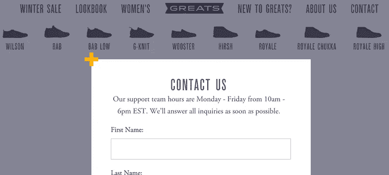
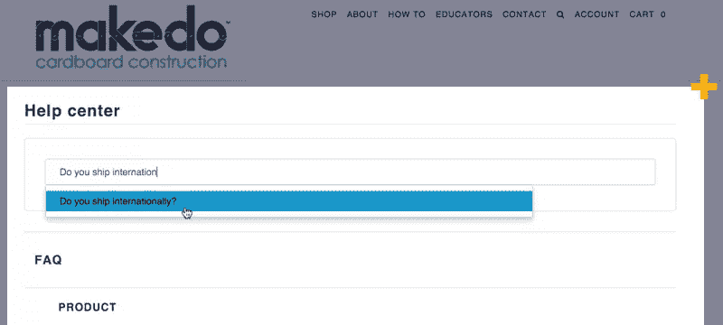
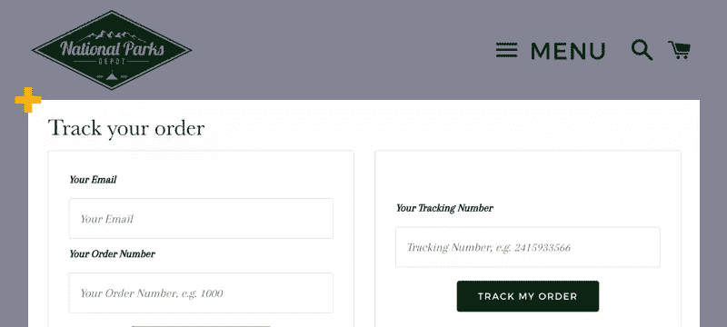
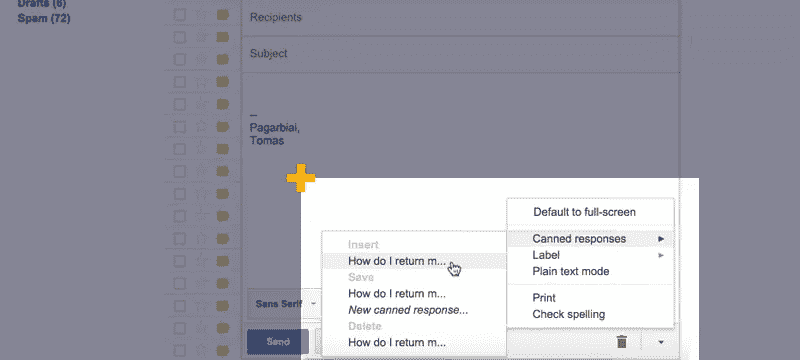
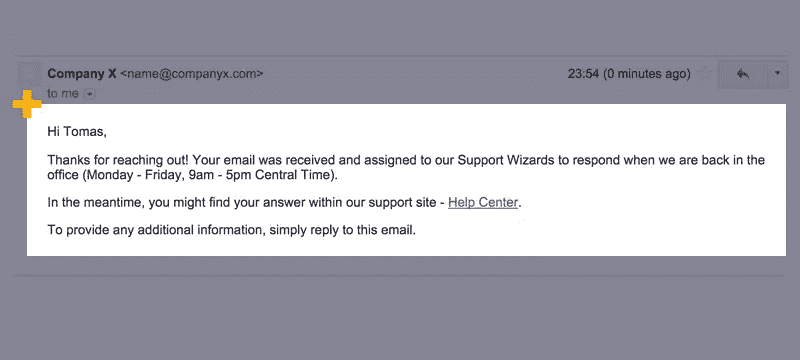

# 优化电子商务客户支持的 8 种方法

> 原文：<https://www.sitepoint.com/8-ways-to-optimize-your-ecommerce-customer-support/>

一开始，大量的客户问题是一个很好的问题。

很多客户问题≈很多销售。

但是，随着时间的推移，你开始一次又一次地收到同样的问题。这很快会变成一项耗时、乏味的日常任务，可能会阻碍公司的发展。

一个人的军队是一个可爱的概念，人们确实经营着 7 位数的个人企业。但是你很快就会意识到，你无法独自处理所有的事情。

将您的客户对话外包给虚拟助理不是一个好的解决方案，但支持优化是，这是成功企业所做的。

你不仅会有更多的时间处理业务，而且你的客户也会更开心。

以下是 8 种在不影响客户服务质量的情况下减少客户支持邮件数量的方法。

## 1.设定明确的期望

没有什么比被忽视更糟糕的了。

我们都有过这样的顾客，如果他们被忽视了，他们会发疯的。他们成倍增加他们的 ASAP 邮件，并在互联网上写评论，说你有多粗心。

这会导致失去客户和潜在客户，并损害你的商业形象。

如果你让人们知道他们什么时候应该期待你的回答，这会让他们更容易等待。

注意:如果你不能在当天回复邮件，让他们知道所有的邮件都会在 48 小时内回复。最好留出更多不必要的时间，如果你回答得更快，只会让你的公司看起来非常有效率。

## 2.不要隐瞒相关信息

这尤其与直运业务有关。

商店老板想把自己定位成一家传统企业或受欢迎的超市，并说几十个善意的谎言。

当从中国直接发货时，人们隐藏他们的包裹是从亚洲发货的；他们产品的原产地是中国；或者运输条款比通常的要长。

不要那样做。在客户可能会阅读的地方多次显示相关信息。

要透明。信任需要诚实。

## 3.创建常见问题页面

顾客想要自助。多达 91% 的人表示，如果 FAQ 页面能满足他们的需求，他们会在里面寻找答案。

让你的客户自己寻找问题的答案。创建[一个信息丰富且可搜索的](http://www.socialmediatoday.com/content/10-tips-creating-killer-faq-page)FAQ 页面。投资它。

它提供即时回答，并大大改善您的收件箱健康。

*注意:它不仅仅是一个客户服务工具。这是人们对你的产品或服务表现出浓厚兴趣的地方。让它卖出去！*

用于简单 FAQ 页面管理的工具包括 [Shopify](https://apps.shopify.com/helpcenter) 、 [WordPress](https://wordpress.org/plugins/ultimate-faqs/) 或[HelpScout](https://www.helpscout.net/knowledge-base/)/[GrooveHQ](https://www.groovehq.com/apps/knowledge-base)用于每个平台。

## 5.在交易邮件中包含常见问题

交易邮件的打开率通常比商业邮件的打开率高出三倍(T2)。尽管如此，企业仍然使用标准而枯燥的电子邮件通知。

首先，每个标准信函都会提示一个问题，例如:

*   **客户账户欢迎**:发货需要多长时间？/一般问题
*   订单确认:我的订单什么时候发货？
*   发货确认:我的订单在哪里？
*   **发货确认**:如何退货？

提前回答那些问题。利用这些巨大的开放率来为自己谋利。交叉销售、追加销售或包括社交媒体按钮。

如何编辑你的交易邮件活动: [Shopify](https://docs.shopify.com/manual/sell-online/notifications/edit-template) ， [BigCommerce](https://support.bigcommerce.com/articles/Public/Customizing-Email-Templates) ， [WordPress](http://needmoredesigns.com/assets/woocommerce-transactional-email-guide.pdf) 。

## 4.创建“跟踪您的订单”页面

通常，我会收到一封发货确认邮件，上面写着:您的跟踪代码是:1234567890。

为什么？没有人想知道他们的跟踪代码是什么。我们只想知道我们的订单在哪里。

请提供“跟踪您的订单”或“跟踪页面链接”来回答此问题。

生成像*www.17track.net/en/track?这样的动态链接 nums =[跟踪代码]* 或使用单独的跟踪订单集成。

跟踪您订单页面管理的工具: [Shopify](https://apps.shopify.com/trackr) ， [WooCommerce](https://wordpress.org/plugins/order-tracking/) ， [BigCommerce](https://www.bigcommerce.com/apps/aftership/) 。

## 6.使用答案模板

即使你有足够的时间，也不可能每次都写出[完美的邮件](https://www.helpscout.net/guide-to-better-email/)回复。

完美的回答应该包括一个漂亮的介绍，一个详细的回答，可能是一个截图，到 FAQ 页面的进一步阅读链接，以及一个结束部分。

你之前已经回答了大部分问题，所以请编辑你的答案并保存起来以备后用。

如果它看起来没有你想要的那么个性化，那么就把它们作为模板。不要自动发答案模板，仔细阅读问题，编辑脚本正确回答问题。

*注:网上到处都是几十种准备好的答题脚本。*

管理回答模板的工具: [Gmail 预设回答](http://gmailblog.blogspot.com/2008/10/new-in-labs-canned-responses.html)、 [HelpScout](http://docs.helpscout.net/article/18-saved-replies) 、 [GrooveHQ](https://help.groovehq.com/knowledge_base/topics/understanding-canned-replies--9) 。

## 7.使用自动应答器

你写了一个问题给一家公司，你不断得到几十个自动回复:你的#1111 票证被收到，它被更新，它被回答，它被看到，客户代表打开他的电脑，等等，等等…

我讨厌这些。唯一的好处是你可以关闭它们(如果你用的是 Zendesk 之类的东西)，然后进行定制。

不要过度使用自动应答器，确保它们听起来自然。

例如:您声称问题会在 12 小时内得到回答。已经 24 小时了，你一封也没回。告诉您的客户“抱歉，由于客户电子邮件数量过多，我们今天无法回复您的电子邮件。我们会尽快回复您。”

如果您使用的是标准的自动回复程序，如收到您的机票，请添加更多相关信息。显示最常见问题的链接或邀请他们关注您的脸书页面。

管理自动回复器的工具: [Gmail 自动回复器](https://chrome.google.com/webstore/detail/email-autoresponder/aohckefanobajaljiobafejcdjjefejl)，[帮助侦察](http://docs.helpscout.net/article/16-auto-replies)。

## 8.提示客户对客户的联系

一旦你回答了顾客的问题，答案就没了。

自然，你不能把你的每个答案都复制到你的 FAQ 页面上。有些问题真的很具体。

创建一个存储这些问题的地方，以便其他用户可以阅读它们或添加他们自己的答案。

大多数大商店都是这样做的，但是最好从一开始就养成习惯。

很多顾客真的很健谈。创建一个 [Q & A 页面](http://blogs.atlassian.com/2014/02/5-steps-launching-thriving-qa-community/)或[社区论坛](https://www.zendesk.com/help-center/)，发起一个[脸书群](http://www.socialmediaexaminer.com/facebook-groups-enhance-customer-relationships/)或在 [Twitter](http://www.practicalecommerce.com/articles/76537-10-Brands-Using-Twitter-for-Customer-Service) 上发起讨论。

让人们公开向你提问，并等待其他人加入进来。

## 结论

做自己生意的真正客户真的很难。但是，下一次你写一个商业问题时，问问你自己，你喜欢这个过程中的哪些地方，哪些地方可以做得更好。

然后在你自己的店里实施这些想法。

优化的自助式支持不仅能提高客户满意度，还能让您有更多时间专注于业务发展。

## 分享这篇文章