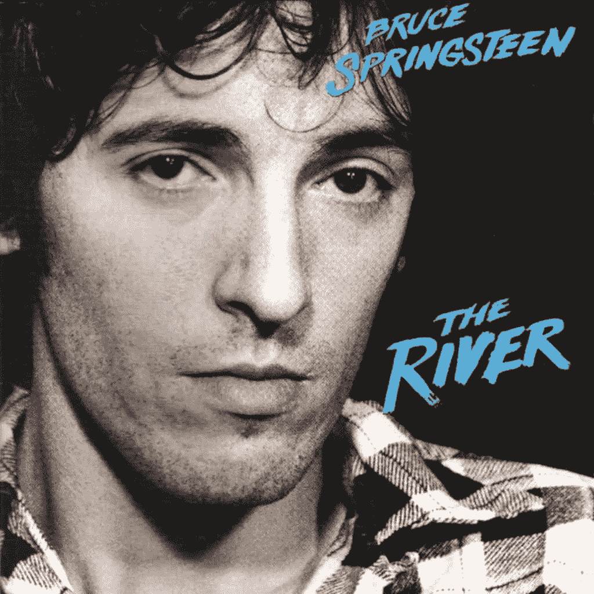
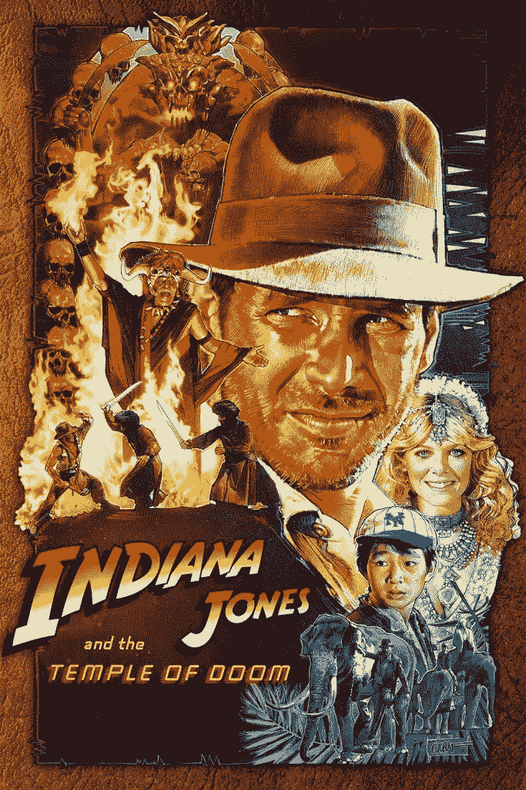
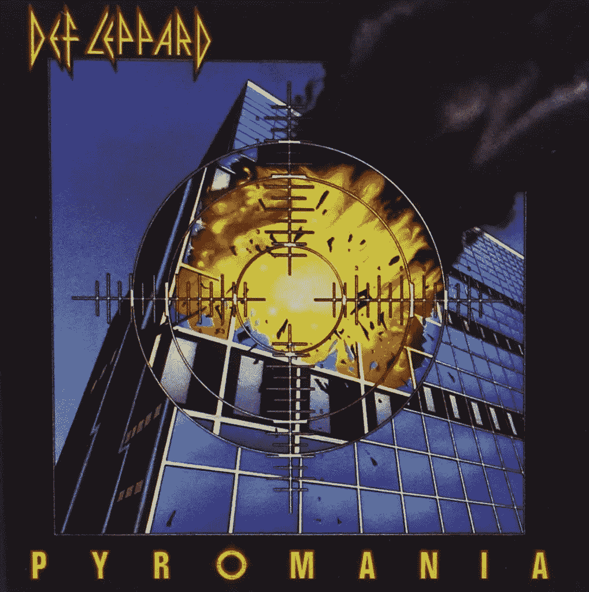
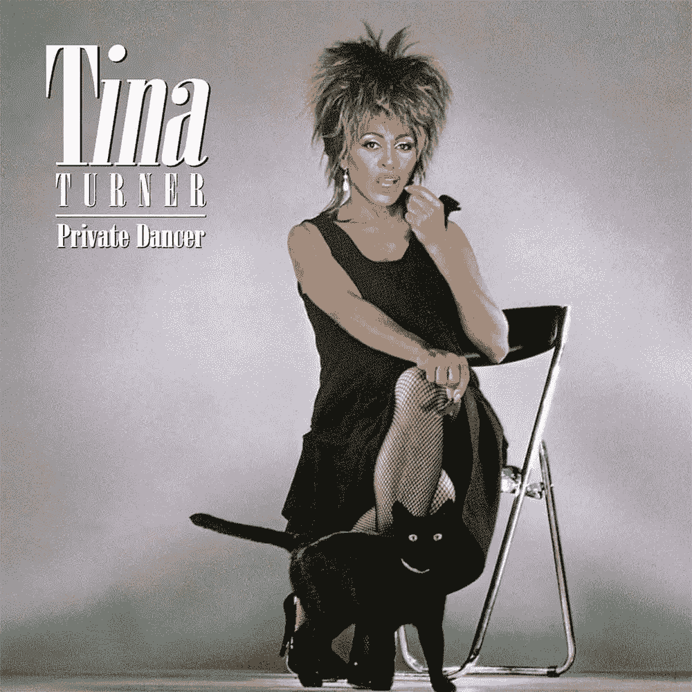
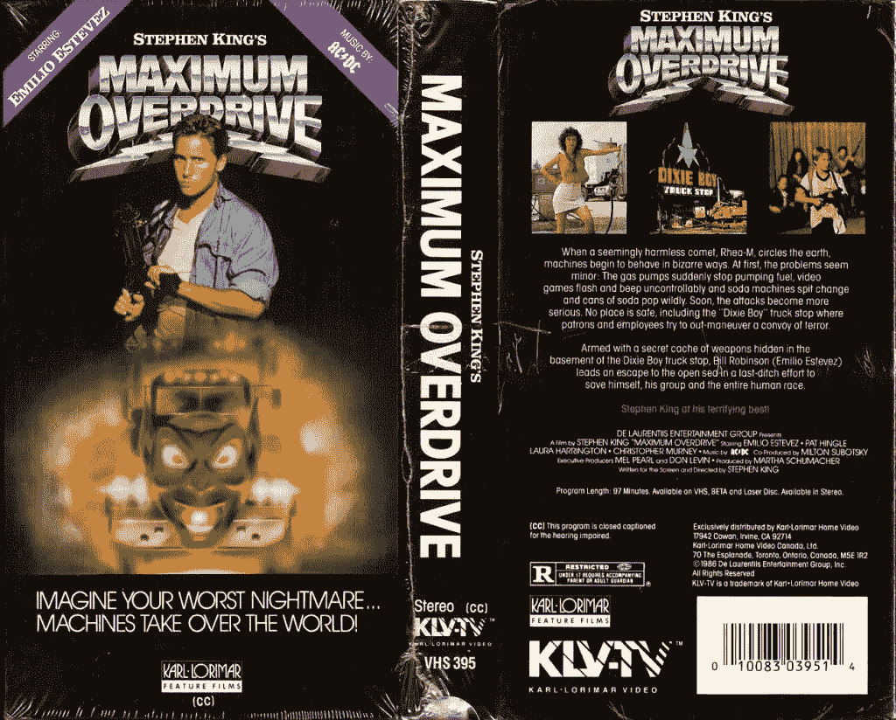

# 你可能没有考虑过使用的 5 种 80 年代字体

> 原文：<https://www.sitepoint.com/80s-fonts-probably-havent-considered-using/>

作为我们 80 年代电影海报大赛的一部分， [Graphic Stock](http://www.graphicstock.com/partner/99designs?utm_source=sitepoint_article3_1115&utm_medium=custom&utm_campaign=sitepoint_article3_1115) 在 SitePoint 上赞助了一个设计系列。这些文章中讨论的主题—[Photoshop 编辑](https://www.sitepoint.com/making-alternative-80s-film-history-come-life-photoshop/)和 80 年代字体选择——可以帮助你赢得比赛。注册参加[图形股票试用](http://www.graphicstock.com/partner/99designs?utm_source=sitepoint_article3_1115&utm_medium=custom&utm_campaign=sitepoint_article3_1115)，准备好赢取 5000 美元一等奖的机会。

当你看到一张电影海报、专辑封面或过去的广告时，通常很容易猜到它来自哪个时期。你会从 80 年代的电影海报和专辑封面中感受到真正的怀旧之情。

虽然他们在那个时代有他们的角色，但在我们的时代很难为这些字体找到一个家。以这些字体为特色的设计看起来可能会过时——而且不是很酷的“广告狂人”那种风格。除非你试图挖掘怀旧的 80 年代氛围，否则很难将它们改造成我们今天可以使用的东西。但有时需要新的眼光去发现新的可能性。

让我们来看看过去几个以 80 年代字体为特色的关键设计，看看它们为什么有效，以及我们现在是否能为它们找到一席之地。

## 布鲁斯·斯普林斯汀——河流

斯普林斯汀的《河流》上的字体显然是定制字体，很可能是用粗画笔创作的。最大的暗示？你会注意到所有的 E 都略有不同。

仔细观察，你会发现每个 E 的所有横线都有一定程度的不同。有些真的很厚，有些中等厚度，最后变得更薄。

几个月前，我会说手工笔刷字体看起来过时了，但如果你经常收到来自设计捆绑网站的电子邮件，你会很快意识到它们正在大规模回归。虽然许多设计师迷恋精确、优雅的字体，但毫无疑问，手工制作的“手工”字体可以带来一股清新的气息。

这将是一个很好的使用手工笔刷字体，就像在河上使用的一样，因为这是目前的趋势。和往常一样，记住你应该谨慎地使用设计趋势是有好处的。避免在需要更长寿命的项目上使用它们，如徽标和标牌。

## 印第安纳·琼斯和末日神殿

《夺宝奇兵与末日神殿》是一部充满冒险的经典电影。标题字体看起来很鲜明，你可以找到一个类似的数字版本，叫做(恰如其分)[冒险](http://www.dafont.com/adventure.font)。还有[软呢帽](http://www.dafont.com/sf-fedora.font)，也很好用。类似的字体已经使用了很多年，因为它们会立即给你一种冒险或狩猎的印象。你会立即想到探险或丛林跋涉。

这种字体常用于今天的促销活动。你可能不会考虑使用这种字体，不是因为它无效，而是因为它已经在几乎所有可以想象的场景中被过度使用了。

毁灭神殿字体是一种完全不同的字体。它最初似乎有点格格不入，因为它有更多的未来的外观。它看起来像是 Eurostile 简单产品的变体，非常适合。唯一真正的区别是小写的“m”更圆润。

## 威豹乐队——纵火狂

威豹乐队乐队和一张名为《狂热》的专辑齐头并进。威豹乐队的乐队标志尖叫着 80 年代的外观，尖锐的角度和夸张的高度。除非今天用于展示目的，否则很难使用如此夸张的字体。你不会想用它来复制正文。你用它做的任何东西都会立刻有一种 80 年代摇滚的感觉。

单词“Pyromania”所用的字体需要是几何字体，仅仅是因为“O”需要足够圆以适应十字符号。

## 蒂娜·特纳——私人舞者

这张蒂娜·特纳专辑是 80 年代许多人的赞美诗。当我看到这张专辑的标题文字时，我立即意识到这是 Bodoni 的变体。

在搜索了我自己的字体集后，我发现使用的字体实际上是 Bodoni Std Poster 压缩的。它有如此夸张的高度，大写字母 t 的衬线又长又高。

蒂娜·特纳是一个偶像，所以毫不奇怪，她的名字的标题字体将是高大和主导，同时仍然是优雅和复杂的。

Bodoni 因其独特的外观和优雅而成为许多设计师的首选字体。然而，这个版本的博多尼是截然不同的。那些拉长的衬线应该少用。当使用这种字体时，你应该坚持标题，海报和书籍封面。我不会把它用在任何可能会损坏的地方，比如用在较小的字体上。

## 最大过载

《最大超速行驶》是一部关于车辆自我控制的电影，由传奇作家斯蒂芬·金编剧和导演。它需要一个大胆、前卫和未来的标题。

这个时代的很多电影都是关于未来和科幻的。你会在文字处理上发现许多金属文字和金属外壳。那种表情本身就过时了。在加粗的文字上加上假的 3D 效果，你就有了一部典型的 80 年代电影或专辑标题。

我发现了一种与这里使用的类似的现代字体，叫做 Passion One Bold，你可以在这里找到它。你当然可以在今天的设计中使用这种字体，但是你可能不想给它添加金属的 3D 效果。否则，你最终会看到类似于 Maximum Overdrive 的标题，以及 80 年代的其他标题。

## 结论

印刷术本身就是一种艺术形式。就像你可以看着一幅画说出它来自哪个时间段一样，我们也可以看着很多音乐专辑和电影海报说出它们来自哪个时间段。如果您将这些字体与特定的字体处理相结合，它可以进一步增强特定时期的外观。

另一方面，这并不意味着那些字体不再有它们的位置。一个有才华的设计师几乎可以改变任何字体的用途，并以一种新的有趣的方式使用它。

字体时尚，就像服装和发型一样，是循环往复的。时不时地，一种时尚会重新出现，艺术家会给它注入新的生命。了解字体的起源将有助于你理解如何以新的方式使用它。

*报名参加[graphic stock Ultimate 80 年代电影海报大赛](http://www.graphicstock.com/partner/99designs?utm_source=sitepoint_article3_1115&utm_medium=custom&utm_campaign=sitepoint_article3_1115)，准备好赢取 5000 美元大奖的机会吧。80 年代电影海报大赛将于 2015 年 11 月 16 日结束。想提交多少次就提交多少次。提交的海报必须是原创作品，至少使用 1 个来自 GraphicStock 库的项目，并且不得包含或使用任何受版权保护的材料。*

## 分享这篇文章