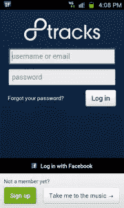
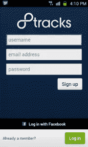
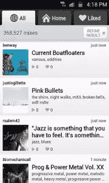
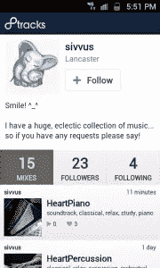
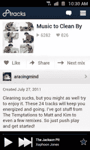
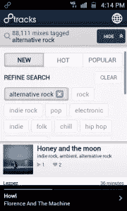
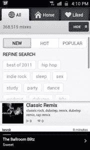
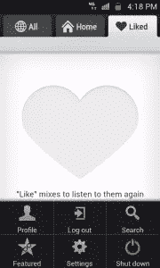
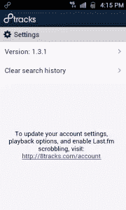
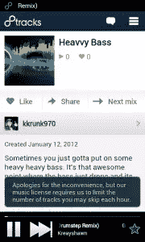

# 听手工制作的 8 轨混音带

> 原文：<https://www.sitepoint.com/8tracks-handcrafted-mixtapes/>

当我十几岁的时候，我一直用收音机里的歌曲在磁带上制作混音带。最好的混音带有一致的主题，很酷的作品，没有广播广告或歌曲间尴尬的停顿。不幸的是，磁带已经不再受欢迎了，但是编译你自己的混音带的概念是一个真正现代的创造，它存在于任何媒介之外。

8tracks 是一个互联网电台网站，它对这个概念进行了有趣的诠释。用户可以使用他们上传的歌曲或 SoundCloud 上公开的歌曲创建自己的混音带，然后与 8tracks 社区或他们的朋友分享。

最近，8tracks 发布了一款免费的 [Android 应用](https://market.android.com/details?id=com.e8tracks)，供人们在旅途中收听 mixtapes。让我们试一试，好吗？

### 首轮放映

第一次运行时，用户会看到一个标准的登录屏幕。目前的 8tracks 用户(8tracks 称他们的用户为*DJ*)可以输入他们的用户名或电子邮件以及密码，或者你可以使用你的脸书账户登录。按下绿色的**注册**按钮，你可以注册一个 8tracks 账户，并登录使用该应用程序。然而，你不必是一个 8tracks DJ 来享受应用程序。只要按下**带我去听音乐**按钮，你就会直接进入应用程序的主屏幕。

        

### 主屏幕

8tracks 应用程序的主屏幕默认为 **All** 选项卡。在此选项卡上，您可以滚动浏览其他 8tracks DJs 制作的最新混音带。每个 mixtape 都位于自己的一行，点击该行会将你带到特定 mixtape 的页面，并立即开始播放。在 mixtape 的页面上，你可以喜欢 mixtape，使用你的任何原生 Android 共享选项来共享它，访问 mixtape 的 DJ 的个人资料页面，或者导航到下一个 mixtape。

你也可以点击为 mixtape 列出的任何标签，应用程序将调出使用相同标签的其他 mixtape。我注意到当你点击“下一个混音”按钮时，它不会从最新创建的混音带列表中跳到下一个混音带；它只是去一个随机的混音带。

        

### 附加屏幕

8tracks 应用程序中的其他标签名为**首页**和【T2 喜欢的】T3。**主页**标签包括你添加为好友的其他 DJ 的最新混音带，**喜欢的**标签包括你喜欢的混音带。在这两个选项卡上，您还可以根据混音带中包含的标签来优化您的搜索。如果你有几十个喜欢的粉丝或混音带，这可能会很有用。

这个搜索功能也存在于**主页**选项卡上，这可能是该应用程序最强大的功能。您可以根据几个标签深入查找非常具体的混音带。您也可以使用位于应用程序菜单选项下的搜索页面，通过艺术家或描述进行搜索(*菜单按钮* - > *搜索*)。

    

### 设置

8tracks app 的设置隐藏在二级菜单选项中(*菜单按钮* - > *更多* - > *设置*)。不幸的是，一旦你进入**设置**页面，只有一个设置——清除你的搜索历史的选项。您也可以从该页面查看应用程序的 changelog，但任何其他选项都必须在 8tracks 网站上完成。

    

### 缺点

8tracks 应用程序缺乏设置是许多缺点中的第一个。我发现在强大的 4G 连接下，在应用程序的标签之间导航至少需要 5-10 秒(我使用的是[三星 Galaxy S II](http://www.samsung.com/global/microsite/galaxys2/html/) )。如果您通过应用程序创建您的 8tracks 帐户，您将无法编辑您的个人资料，除非您访问 8tracks 网站。你也不能选择将应用程序的主屏幕更改为不同的选项卡；有一个**主页**标签看起来很奇怪，它不是应用程序的实际主屏幕。

8tracks app 的主要功能是听其他 DJ 的混音带；然而，大多数 mixtapes 在 30-60 秒没有活动后会突然中断，迫使你回到应用程序的主屏幕才能继续播放(即使这样，它也会跳到 mixtape 中的下一首歌)。你只能选择向前跳过混音带，所以你不能重放歌曲或向后移动来听其他歌曲。无论你播放多少混音带，每小时也只能跳过三首歌曲。这些可能是 8tracks 无法绕过的法律限制(类似于 Pandora)，但在用户尝试跳过歌曲之前，他们并不是很清楚。

8tracks 应用程序的另一个大缺点是 mixtapes 不能直接从应用程序中创建。播放的歌曲也不会自动滚动到 [Last.fm](http://www.last.fm) 。你可以在 8tracks 网站上设置 Last.fm scrobbling，但令人惊讶的是，该应用并没有根据你的 Android 设备上是否安装了 Last.fm 应用来搜索歌曲(Android 上的大多数音乐应用默认都是这样做的)。希望这些问题将在应用程序的未来版本中得到解决。

        

### 结论

8tracks 应用程序是一个令人钦佩的尝试，可以聆听来自 8tracks 社区的共享混音磁带，但回放和缺乏设置的问题使聆听体验更令人沮丧而不是有益。在未来的版本中，我希望看到更好的回放控制，原生的滚动，以及定制你的个人资料的选项。

* * *

8tracks 在 Android Market 上是免费的，需要 Android OS v2.1 或更高版本才能运行。从下面的市场链接或使用右侧提供的二维码下载应用程序。

[下载 8 首曲目](https://market.android.com/details?id=com.e8tracks)

## 分享这篇文章