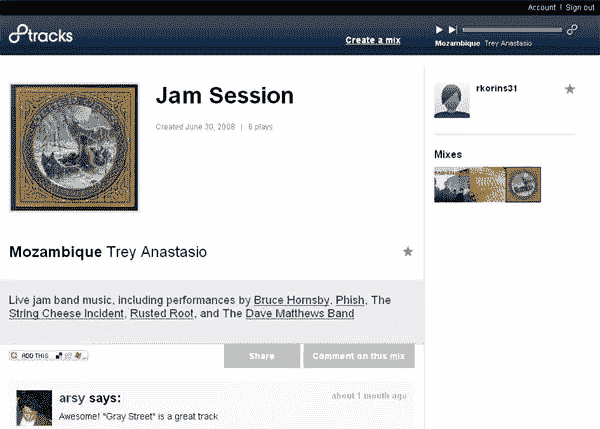

# 8tracks —合法的网络混音带

> 原文：<https://www.sitepoint.com/8tracks-the-legal-web-mixtape/>

一项新的在线混音磁带/网络广播服务将于周五推出，它允许用户上传音乐，并创建 8 首歌曲混音与其他用户分享。8tracks 由前 Live365 总经理戴维·波特创立，致力于提供合法服务。像 Muxtape 这样的竞争服务似乎并没有真正提到让用户上传和分享歌曲所涉及的法律问题。

8tracks 根据美国 1998 年《数字千年版权法》建立的网络广播强制许可运营。该公司根据许可向 SoundExchange 支付版税，并同意遵守某些规则，限制同一张专辑或艺术家的歌曲在三个小时内从同一张混音带中传输的次数。此外，8tracks 还拥有 ASCAP、身体质量指数和 SESAC 的公共演出许可证。

8tracks 还利用了版权法中的一个“漏洞”，据 VentureBeat 称，只要听众不知道接下来会发生什么，音乐就可以在线播放。因此，8tracks 允许用户创建 8 首歌曲，然后以随机顺序播放。

用户可以分享混音、评分、评论，并通过将混音中的曲目添加到“收藏夹”列表来重新混音，该列表可以用作未来混音的素材。该接口简单易用，比类似的服务(如前面提到的 Muxtape)更简洁。

那么，保持 8 个磁道的合法成本是多少呢？根据该网站的法律页面，他们需要平均每分钟 20 澳元的广告费用(2010 年由于许可费上涨为 30 澳元)才能达到收支平衡——这还不包括支付给 ASCAP、身体质量指数和 SESAC 的版税。8tracks 将试图主要通过广告来弥补成本，最终将增加“从亚马逊购买”链接和付费订阅选项。

很难说这是否可行，但因为我敢打赌大多数网络电台听众会选择网络电台，然后在工作时最小化窗口并在背景中听音乐，所以 8tracks 是否会有非常热衷于传统网络广告的观众是值得怀疑的。不过，VentureBeat 的文章也提到了音频广告，这可能会更好。

如果唱片公司聪明的话，他们会看到在这种服务中传播新音乐的机会，并会与 8tracks 和 Muxtape 等网站达成协议，以突出他们新艺术家的歌曲。我仍然会听我最初在 Napster 或 MP3.com 上发现的艺术家的音乐——令人惊讶的是，这些年来，唱片公司仍然没有意识到曝光的力量。举例来说，如果几年前我没有在高中浏览原版 Audiogalaxy 上的歌曲时发现它们，我就不可能拥有 3 张柠檬果冻专辑。

## 分享这篇文章