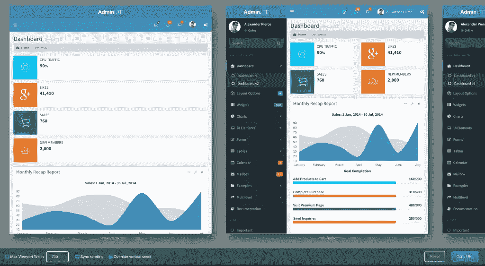

# 你应该知道的 9 个开发工作流程升级

> 原文：<https://www.sitepoint.com/9-development-workflow-upgrades-you-should-know-about/>

每隔一段时间，我会遇到一个非常有用的工具或插件，我不能*不*把它添加到我的武器库中。我通常会大声喊出[的推文](https://twitter.com/bitfalls)，并试图以这种方式传播消息，但这次我相信我收集了如此整洁(有点随意)的提高生产力条目，它们值得一篇集体文章。


以下是对您的开发工作流程的 9 项新升级:

## 第一名

[git-fresh](https://github.com/imsky/git-fresh)*让你的回购保持新鲜*。它为一些非常有用的 git 命令和组合提供了一套超级方便的快捷方式——它将修剪远程分支，重新建立基础，合并或重置您的工作区，甚至有效地隐藏更改，以便您可以轻松地推送或切换分支，而无需提交最新的更改。

它只支持 Linux 和 OS X，但是因为我们对 [Homestead 改进了](https://www.sitepoint.com/quick-tip-get-homestead-vagrant-vm-running/)无论如何，它对我们来说都是 Linux。事实上，我们正在考虑将它添加到默认的[家园改进版](https://www.sitepoint.com/quick-tip-get-homestead-vagrant-vm-running/)安装中，这样它就可以开箱即用了。想法？

## 2.git-extras

由[神话中的 TJ Holowaychuk](https://medium.com/@kelas/how-is-tj-holowaychuk-so-insanely-productive-604818b4e9eb#.tk6jsubpk) 拥有的 git-extras ，同样用非常有用的附加命令扩展了 git 的功能。这是一个相当老的插件，但我只是刚刚发现它，我相信有更多的人会发现它相当方便。新命令的示例包括:

*   git setup:初始化一个 repo，并第一次为您提交文件；从本质上讲，这是回购的一个更加“自力更生”的开始。
*   git ignore:一个命令行“ignore ”,这样您就可以在不离开终端或进入文本编辑器的情况下向`.gitignore`添加文件
*   git summary:提供了一个简洁的回购摘要，包括它的年龄、最活跃的贡献者等等
*   git undo:这是一个真正的救命稻草——它撤销了最后一次提交，但仍然保持更改未提交，所以一旦您用`git status`检查了回购的条件，您就可以安全地调用`git reset --hard`来放弃它们
*   git changelog:自动创建一个 changelog 文件，并使用自 repo 中创建最后一个标记以来的所有提交消息的减价列表填充该文件。
*   git release x.y.z:创建发布的快捷方式。这调用了一个预发布挂钩(用于构建/测试)，创建了一个给定版本的发布标签，将标签和 repo 推送到远程，以及您在发布日可能做的其他事情
*   git fork:命令行分叉！
*   git squash:更容易挤压提交！

点击查看完整列表[。](https://github.com/tj/git-extras/blob/master/Commands.md)

## 3.编写器变更日志

composer-changelogs 是一个 composer 插件，当一个项目的依赖关系被更新时，它会显示更丰富的信息和适当的链接。对变更日志相当有用！


## 4\. Dotfiles

[mislav/dotfiles](https://github.com/mislav/dotfiles) 是各种 bash 脚本和 *dotfiles* (以`.`开头的文件)的精彩集合，它们为您的环境添加了别名和其他有用的特性。例如，对于目录树列表，它将添加:

```
alias l="ls -lah"
alias ll="ls -l"
alias la='ls -A' 
```

然后是 vim 设置、路径整合、 [nginx 服务器脚本生成](https://github.com/mislav/dotfiles/blob/master/bin/nginx-dir)等等。

## 5.PhpStorm 更快的渲染

不是一个插件或插件，而是一个快速破解，迫使 [PhpStorm](https://www.sitepoint.com/phpstorm-top-productivity-hacks-shortcuts/) 使用图形加速来渲染其窗口，从而提高帧率。

首先，这是 OS X 的程序，根据这个要点:

```
cp /Applications/PhpStorm.app/Contents/bin/phpstorm.vmoptions ~/Library/Preferences/PHPSTORM_FOLDER
echo -ne "\n-Dawt.useSystemAAFontSettings=lcd\n-Dawt.java2d.opengl=true" >> ~/Library/Preferences/PHPSTORM_FOLDER/phpstorm.vmoptions 
```

将`PHPSTORM_FOLDER`替换为 PhpStorm 文件夹的名称——如果您使用的是 10.0 版本，可能类似于`WebIde100`(通常是 WebIdeVERSION)。

在其他操作系统上，首先根据[这个帖子](https://tldrify.com/ens)找到`phpstorm.vmoptions`文件。然后，把它复制到你系统的 PhpStorm preferences 文件夹中，你可以在[这篇文章](https://www.jetbrains.com/phpstorm/help/directories-used-by-phpstorm-to-store-settings-caches-plugins-and-logs.html)中找到它的位置。

最后，编辑新复制的文件，并在其底部添加以下两行:

```
-Dawt.useSystemAAFontSettings=lcd
-Dawt.java2d.opengl=true 
```

保存、退出、重启 PhpStorm(如果它正在运行)。

## 6.OS X 上 PHP 版本的快速切换

如果你是一个 OS X 用户，并且不太喜欢漫游，你可以使用这个脚本在 PHP 版本之间快速切换，以便在不同的运行时上测试你的应用程序。

我们仍然不认为这是正确的做法，如果你真的不想使用虚拟机，我们希望你至少选择[phpbrew 和 virtenv](https://www.sitepoint.com/use-phpbrew-virtphp/)，但是，嘿，只是为那些喜欢在主机操作系统上运行 PHP 的人提供一下。

## 7.Composer 并行下载

【Composer 的这个插件强制它“并行”下载文件，显著提高了依赖项的安装速度。使用是自动的，插件可以通过以下方式全局安装:

```
composer global require hirak/prestissimo 
```

请注意，这种方法的“并行”方面还有待讨论，但这并没有贬低安装时间大幅缩短的事实(根据自述文件，Laravel `create-project`命令从大约 5 分钟缩短到 30 秒以下)。

## 8.使用 Emmet Re 快速移动预览:查看

Emmet Re:View 是一个很棒的浏览器扩展，它可以立即以 CSS 中媒体查询定义的所有尺寸呈现当前打开的网页。非常方便地快速查看您的应用程序在不同屏幕尺寸上的外观和感觉。

该扩展还有一些漂亮的附加选项，如定义新的自定义屏幕大小，同步所有屏幕的滚动，动态调整每个屏幕的大小，以便您可以看到媒体查询的运行，等等。这里有一个 [AdminLTE 演示](https://almsaeedstudio.com/themes/AdminLTE/index2.html)的渲染示例。



## 9.舒适系列

最后但并非最不重要的是，我想简单地与你分享一个组合设置，我用它来舒适地编码，没有背痛、体重增加或其他通常与在计算机上工作一段时间相关的问题。我使用下面所有的工具/方法。如果你想知道更多，请在评论中提问。

*   [F.lux](https://justgetflux.com/) 是一个多平台工具，它可以在夜晚来临时调整屏幕色调，使其变得更加*黄色*，消除白色/蓝色眩光。事实证明，这种强光是[在试图入睡时遇到困难](https://prezi.com/rzw6hj6mc3z-/the-affect-of-screens-on-the-secretion-of-melatonin/)的原因。

*   [咖啡因](http://lightheadsw.com/caffeine/)阻止你的 Mac 入睡。没有人会认为这有一个共同的用例，但它确实有——尤其是在我的工作领域。当我在两个大屏幕或一台投影仪上铺开一堵需要编辑或校对的文字墙时，通读它需要一段时间，OS X 有时认为这是懒惰的表现。在我的指尖有一个“防止睡眠按钮”有助于这一点。

*   [在跑步机上工作](https://www.quora.com/Daily-Life/What-are-some-good-habits-to-follow/answer/Bruno-Skvorc)帮助你彻底摆脱和预防超重、下背部和颈部疼痛、骨盆前倾、痔疮等。一旦你习惯了，它还会提高工作效率，因为走路会分散你大脑中“让我们玩耍”部分的注意力，让“让我们工作”部分可以平静地工作。

*   [分离式键盘](http://www.kinesis-ergo.com/shop/freestyle2-for-mac/)–在跑步机办公桌上工作时非常有用，坐着时也很有用。当我们在窄窄的键盘上打字时，就像较小的 Macbooks 上的键盘一样，我们的肩膀和头是弯曲的，几乎会聚在一点上。这导致抽筋，脖子疼痛，基本上是你长了一个驼峰。它还会削弱你的胸肌和三角肌，让你变得僵硬。在一轮漫长的编码后站起来，只是绕着他们的轴旋转你的头或躯干，几乎可以保证崩溃。有了分体式键盘，你可以用自然的姿势握住双手，保持适当的姿势。此外，再加上跑步机，它会让你觉得自己像拉塞尔·克罗(Russel Crowe)一样精湛:

    

*   这个*废弃的软件*实际上非常方便，可以在跑步机上避开鼠标。学习曲线非常高，很难找到足够精确的应用程序，但一旦你做到了，一旦你习惯了它(这可能需要两个月，很容易)，你就很少接触鼠标或触控板。除了看起来很酷，这也让你在需要把手从键盘上拿开的时候保持姿势。

## 结论

我希望这个列表中至少有一些条目能成为你的日常习惯——如果你有任何其他的建议，请在下面发表评论，如果你想了解更多关于“舒适设置”的信息或想与我们分享你自己的设置，请让我们知道——包括图片是非常好的！

## 分享这篇文章