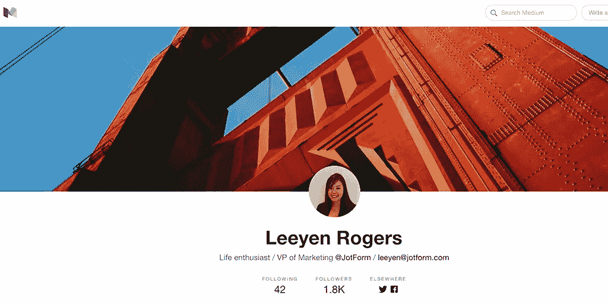
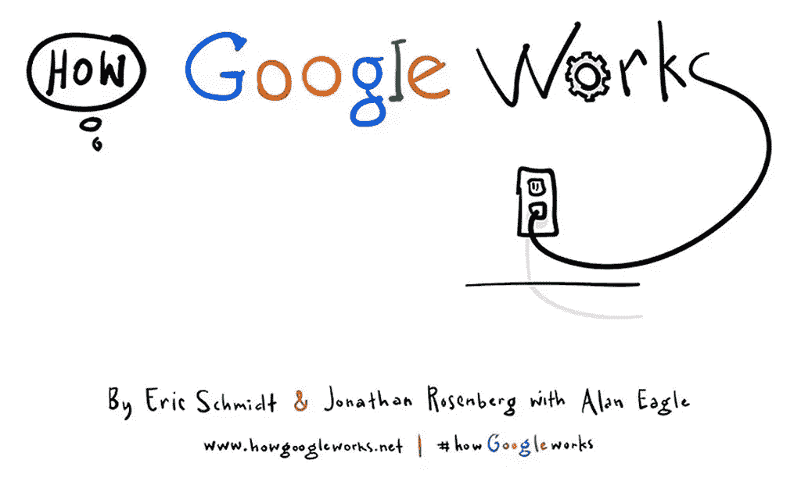

# 9 位企业家和他们感激的公司

> 原文：<https://www.sitepoint.com/9-entrepreneurs-and-the-companies-theyre-thankful-for/>

每个企业都是从一个想法开始的，但是除非你是一个相当于瑞士军刀的企业家，否则将想法变成现实需要工具。资源。咖啡。诸如此类。

本着感恩的精神，我们邀请了九位企业家告诉我们，他们和他们的职业生涯感谢什么。

## 杰克·戈德曼， [10up](http://10up.com/) 的总裁兼创始人

*10up 是一家提供全方位服务的网络机构，专注于卓越的内容管理体验和大规模实施，拥有全职设计师、工程师、战略家和系统专家。*

### **我感谢的是:智能手机**

虽然许多人认为我们的智能手机是让我们整天都被工作束缚的罪魁祸首，但我认为我的 iPhone 是我拥有的最自由的资源。

现代“电话”和移动网络使我能够离开办公桌进行短暂休息或更长时间的活动，而不会限制我与团队联系、回复重要消息以及处理突发的时间敏感事项的能力。因为有了这些现代化的微型超级计算机，无论我们身在何处，我们都可以随时获取关键信息。

你可以称之为束缚——作为一个企业主和有竞争力的企业家，我称之为自由，我很感激。

## 莫妮卡·伊顿·卡尔多内，首席运营官，911 退款计划的联合创始人

*退款 911 是一家风险管理公司，专门帮助在线企业通过防止损失、最小化风险和恢复收入来管理退款。*

### **我要感谢的:[难缠的泥巴](https://toughmudder.com/)**

我们公司把这项艰难的比赛作为一项团队活动(是的，你可以说我们很多人都很疯狂！).许多人会认为激励我的是乐趣、泥泞、挑战，或者仅仅是活着通过电击和流沙的纯粹刺激。

然而，最激励我的是见证我的团队，他们已经完成了许多惊人的壮举，走到一起，正面迎接新的前沿！我们有各种健康水平的不同群体，但总是那些我最意想不到的人走得更远。

这类事件激励我相信他人，并继续投资于他们无限的潜力。底线:永远不要卖空任何人。你不知道一个人能完成什么，直到你给他们一个真正展示你的机会。

勇气、奉献、激情和动力远远超过内在的敏锐。这些都是产生影响的因素，我感谢我的所有员工给了我他们最好的！

## Leeyen Rogers， [JotForm](http://www.jotform.com/) 的营销副总裁

JotForm 是一个在线表单生成器，它可以帮助你创建在线表单并接收回复，而无需编写任何代码。

### **我所感谢的:[中型](https://medium.com/)。 [PS:跟我来=)](https://medium.com/@leeyenrogers)**

博客平台极大地帮助了我的整个公司互相学习和启发。

无论你在 JotForm 的哪个团队，我们都鼓励你在 Medium 上以博客的形式分享你的知识，这些博客可以发布在公司的 Medium 频道上。这让我们能够及时了解其他
团队正在做什么，甚至是我们欧洲办公室的团队和正在世界各地旅行的远程开发人员。

我们也相信这是提高当地品牌知名度的好方法。JotForm 和 Medium 都位于旧金山，Medium 的许多读者恰好位于湾区。

## 大卫·巴彻勒，[DialMyCalls.com](https://www.dialmycalls.com/)的总裁兼联合创始人

DialMyCalls 是一项使用用户创建的语音信息或文本信息拨打或发送电话号码的服务。

### **我要感谢的:[stay focused](https://chrome.google.com/webstore/detail/stayfocusd/laankejkbhbdhmipfmgcngdelahlfoji?hl=en)**

我感谢那个创造了一个叫做 StayFocusd 的浏览器插件的天才。这个应用程序基本上将你每天在任何你想去的网站上的时间限制在 X 分钟。

我安装它作为一个快速测试，每天 10 分钟后屏蔽脸书，这应该是足够的时间，因为我只有 10 个朋友。有一次我被屏蔽了，我简直不敢相信一天中有多少次我本能地在 Facebook.com 输入，结果却出现在被屏蔽的屏幕上。不开玩笑，一天至少 15-20 次。

我想说这个简单的小应用程序每周至少为我节省了三个小时的时间。这真是一个圣诞奇迹！

## [雷凯·卡尔](http://www.kaileicarr.com/)，形象战略家&

雷凯·卡尔是一位演说家和顾问，她为那些对提升自己的形象、改善自己的形象和尽最大努力实现职业目标感兴趣的女性提供帮助。

### **我所感谢的:[坎瓦](https://www.canva.com/)**

我在工作中制作了很多演示文稿和图片，考虑到我与人们一起提升他们的个人和网络形象，对我的图片进行润色是很重要的。

通过 Canva.com 创建设计良好的图像，这些图像可以在不雇佣平面设计师的情况下创建，帮助我节省了时间和金钱，当然也提高了我的图像质量。

现在，我已经用 Canva 设计了所有的东西，从我的播客标志、在线课程中的工作表，到演示幻灯片。这是我最喜欢的免费资源！

## 约翰·基诺伊，[礼品切片公司](https://www.giftslicer.com/)的创始人

GiftSlicer 是一款即将推出的社交礼物应用程序，让分享送大礼的喜悦变得简单而有趣。

### **我要感谢的: [*谷歌如何运作*](http://www.amazon.com/How-Google-Works-Eric-Schmidt/dp/1455582344)**

作为一家初创公司的创始人，我发现这本书里的见解浓缩了我已经知道的一些东西，并对成就一家伟大公司的重要因素提供了一个很好的视角。

这是一本超级简单、引人入胜的读物。

我开始为我的团队成员购买书籍，现在我们在工作的时候会进行即兴的读书俱乐部讨论。他们太投入了，以至于我们开始挖掘作者的脚注。

一本关于创建一个伟大团队的书确实对加强我的团队很有帮助，对此我很感激。

## 大卫·丹宁，[jumpanje](http://jumpanzee.com/)的联合创始人

*jumpanje 为小型企业&初创企业*提供价格合理的品牌、网页设计、&开发服务

### **我要感谢的:[Reddit](http://reddit.com)**

我们(和我们的企业)非常感激和感激的一个资源是 Reddit。这里的社区(尤其是[r/企业家](http://reddit.com/r/Entrepreneur/)、[r/初创企业](http://reddit.com/r/startups/)和[r/小企业](http://reddit.com/r/smallbusiness/))对我们公司的发展给予了极大的帮助和支持。它随时准备提供建设性的批评，无论是对我们的网站，营销策略，还是我们的业务工具。

此外，Reddit 一直是新业务的绝佳来源，我们的大多数客户都是通过该网站找到我们的。

我强烈建议小企业主查看我提到的子网站，为自己寻求反馈和建议。

## 亚当·费伯，负责的营销总监

*Chargify 提供计费软件，可简化订购管理和重复计费。*

### **我感谢的是:共同工作空间**

当我开始远程工作时，共同工作空间并不像现在这样受欢迎，也没有太多选择。现在，几乎在任何一个大城市都有多个合作空间。

我一周大约有四天去共同工作空间。它提供了一种从家庭办公室逃离的方式，并有助于工作/生活的分离。作为一个远程团队，Chargify 的许多人利用并受益于这一新趋势。

Chargify 恰好处理全球许多联合办公空间的重复计费，因此这是一个双赢的局面。

## 史蒂夫·沙利文，[纤维运动](http://www.fibreathletics.com/)的首席执行官兼创始人

Fibre Athletics 是一家即将成立的服装公司，专注于多功能、时尚、耐用和可持续的服装产品。

### **我要感谢的:好事多杂志**

听起来可能很有趣，但《好事多》杂志改变了我对职业道路的整个看法。

一天，我在我女朋友住的大楼的大厅里，地板上放着一份好市多顾客通讯，封面故事是关于汤姆的鞋子的创始人布莱克·麦可斯基。读到他们如何将商业模式和产品营销与一项事业联系起来，改变了我对自己想做什么的想法。

当时，我在想，我将创办一个非营利组织，帮助恢复环境和减轻贫困，因为这是我过去 10 年来一直在做的事情。好市多的故事再次证实了我的信念，即商业是、也应该是解决我们这个时代关键问题的关键驱动力，而环境和贫困是我们面临的几乎所有挑战的根源。

虽然我们不遵循 Tom 的“买一赠一”模式，但我们寻求产生影响，支持当地社区自己解决这些问题，这是利用商业解决困难问题的一个明显例子。这是鼓舞人心的，并提供了导致纤维运动的火花。

## 分享这篇文章