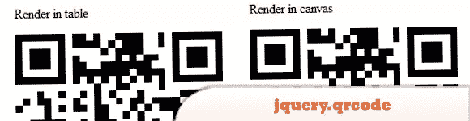
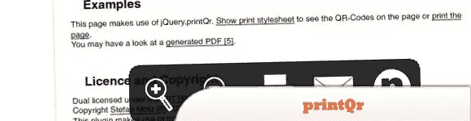
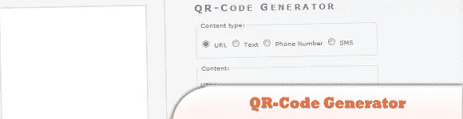
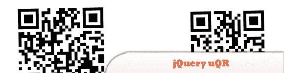
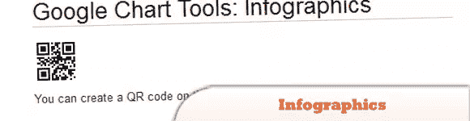
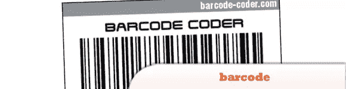

# 9 个 jQuery QR 插件

> 原文：<https://www.sitepoint.com/9-jquery-qr-plugins/>

QR 码是一种流行的二维条形码(也称为硬链接或物理世界超链接)。如果你不知道它存储多达 4296 个字母数字字符的任意文本。该文本可以是任何内容，例如 URL、联系信息、电话号码，甚至是一首诗！

下面是一些 **jQuery QR 插件和生成器**。玩得开心！

相关帖子:

*   [**创建自己的手机条码玩意儿**](http://www.jquery4u.com/mobile/create-mobile-phone-barcode-thingy/)
*   [**10 个交互性和通信 jQuery 插件**](http://www.jquery4u.com/widgets/10-interactivity-communication-jquery-plugins/)

## 1.jquery，qrcode

用于纯浏览器二维码生成的 jQuery 插件。

  
[来源](http://blog.jetienne.com/blog/2011/04/07/jquery-qrcode/)
[演示](http://jeromeetienne.github.com/jquery-qrcode/examples/basic.html)

## 2.printQr jQuery 插件

这个插件将任何指定链接的二维码添加到页面底部。打算把这些二维码从屏幕上隐藏起来，显示出来打印。

  
[源+演示](http://www.stefan-motz.de/oss/printQR/)

## 3.jquery QR 影像外挂程式

一个 jQuery 插件，可以在你的站点中包含 QR 图像。

  
[来源](https://github.com/BraulioVM/jQuery-QR-Image-Plugin)
[演示](https://github.com/BraulioVM/jQuery-QR-Image-Plugin/tree/6810df5fd8ff055f9626229554a5348c650fa438/demo)

## 4.二维码生成器

免费二维码生成器和二维码在线创建器。

  
[源+演示](http://qrcode.kaywa.com/)

## 5.jquery uqr 外挂程式

jQuery uQR 是一个由马里乌斯·斯坦丘·塞尔久编写的 jQuery 插件，这个插件可以让你在网页中嵌入二维码。

  
[源+演示](http://www.class.pm/files/jquery/jquery.uqr/demo/)

## 6.谷歌图表工具:信息图表

您可以通过 URL GET 请求即时创建 QR 码。

  
[源+演示](https://developers.google.com/chart/infographics/docs/qr_codes#standards)

## 7.jquery。MyQRCode.js

使用带有 jquery 的 Google Chart Api 为移动设备生成 QR 码。默认情况下，插件会为页面的 URL 生成 QR 码。您还可以指定二维码的文本、编码和大小。

  
[源+演示](http://www.kfsoft.info/MyQRCode/demo.php)

## 8.jQuery 插件:条形码

要使用这个插件，只需定义一个容器来托管可视条形码。

  
[源+演示](http://barcode-coder.com/en/barcode-jquery-plugin-201.html)

## 9.jquery . QR code . js . jquery . QR code . jquery . QQ 查询. qrcode . js

它允许您轻松地将二维码添加到您的网页。是单机，minify+gzip 后不到 4k，无图片下载。

  
[源+演示](http://jeromeetienne.github.com/jquery-qrcode/)

## 分享这篇文章