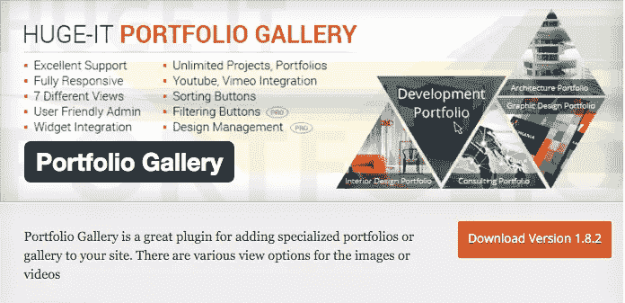
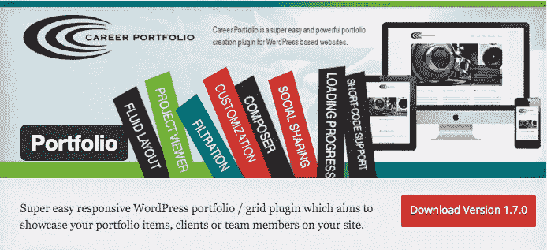
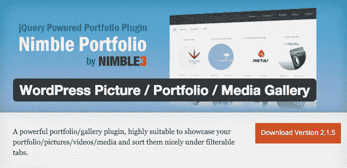
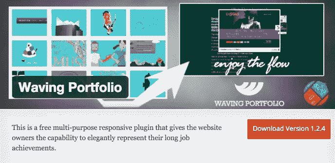
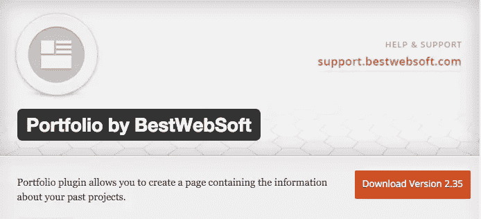
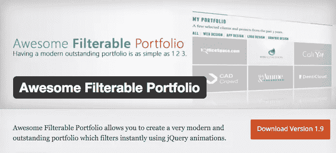
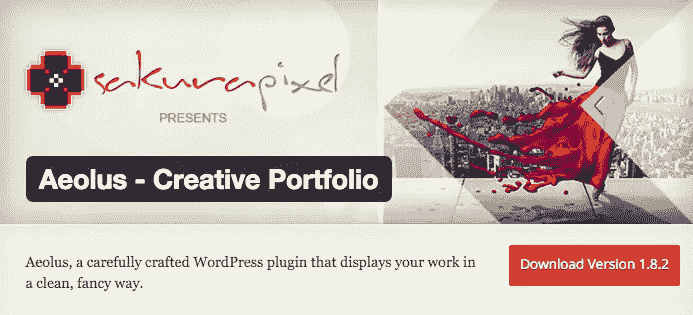
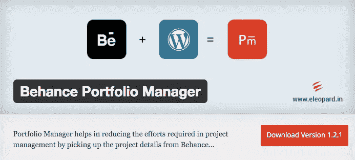
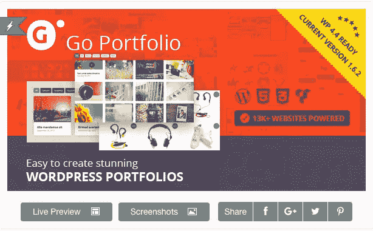

# 9 个最好的 WordPress 组合插件

> 原文：<https://www.sitepoint.com/9-of-the-best-wordpress-portfolio-plugins/>

使用我们的教程创建你自己的 WordPress 主题[从头开始创建一个基本的 WordPress 主题](https://www.sitepoint.com/premium/screencasts/create-a-bare-bones-wordpress-theme-from-scratch)。

如果你在网上工作，你绝对需要一个文件夹。你可以拥有大量的酷字体和所有你可能需要的弹出插件。但是如果你不能向潜在客户展示你的作品，你就错过了。能够以一种吸引人的方式展示你的项目是一个无价的工具，因为它可以告诉读者为什么你在你所做的事情上比其他人都好。

对于一个惊人的投资组合，你有两个选择。你可以[使用作品集主题](https://www.sitepoint.com/5-stunning-wordpress-portfolio-themes-for-designers/)或者获得作品集插件。如果你不喜欢任何投资组合主题，或者只是想使用不同的主题，那么投资组合插件就是为你准备的。

下面列出的插件是 9 个最好的 WordPress 组合插件，它们是精华。它们包含了许多有用的功能，并且易于使用。其中有几个是免费的，它们都会吸引潜在客户的眼球。

## 1.[由庞大 IT 提供的作品集图库(免费)](https://wordpress.org/plugins/portfolio-gallery/)

这是列表中最灵活的组合插件之一，也是我使用的一个。它提供了七个独特的视图，将您的作品集展示为一个响应式画廊。您可以从以下视图中选择:

*   块上下切换
*   全高积木
*   图库/内容-弹出窗口
*   全宽块
*   常见问题向上/向下切换
*   内容滑块
*   灯箱-画廊

所有这些选项都以干净、不显眼的方式展示您的作品。界面很直观，任何 WordPress 主题看起来都很棒。

要添加项目，您只需添加视频幻灯片或图像，并输入项目的详细信息。你只需要在你选择的页面上粘贴一行短代码，瞧，你就有了一个闪亮的新投资组合。

免费版本有你需要的一切开始和定制你的投资组合。如果你选择付费版本(40-100 美元)，你会有更多的选择和更高水平的定制。

## 2.[Miixee 职业组合(免费)](https://wordpress.org/plugins/portfolio-wp/)

职业投资组合是一个精简的、基于网格的投资组合插件。这是一个完全响应的设计，支持短代码，易于设置。

免费版本带有一种布局风格和一种全屏浏览器风格，如果你正在寻找一个简单的投资组合，这是很好的。它看起来很棒，非常适合从作家到设计师的所有人。

职业投资组合(30-50 美元)的付费版本提供了更多的好处:

*   3 种布局样式
*   类别过滤
*   设计定制
*   自定义 CSS 和 JS

因此，如果你喜欢它的外观，并希望能够定制它，购买付费版本是一个明智的投资。

## 3.[Nimble 3 的 Nimble 投资组合(免费)](https://wordpress.org/plugins/nimble-portfolio/)

Nimble Portfolio 为展示您的项目提供了一个简单的画廊。这是一个基于框架网格的用户友好、反应灵敏的设计。

你有很大的空间来使用这个插件，因为你几乎可以修改任何东西。您可以选取缩略图样式，对项目进行分类，以及嵌入视频或 PDF 预览。它的灵活性是一个强大的优势，使它成为几乎每个人的理想选择。

Nimble Portfolio 还提供了几个高级附加组件，包括各种皮肤和 lightbox 选项。这是目前功能最全的免费组合插件之一。

## 4.[iTechFlare(免费)挥舞作品集](https://wordpress.org/plugins/waving-portfolio/)

Waving Portfolio 是另一个基于网格的 Portfolio，它使用短代码进行定制。添加项目很简单，观众可以使用类别按钮从前端过滤。

查看者可以单击您的项目来查看包含更多详细信息的弹出窗口。对于那些想要对自己的投资组合不大惊小怪的创意人员来说，这是一个很好的选择。

您可以选择浅色或深色皮肤，并定制组合项目的大小/尺寸。如果你需要一个不需要复杂维护的定期使用的投资组合，波动投资组合是一个可靠的选择。

## 5.[BestWebSoft 的作品集(免费)](https://wordpress.org/plugins/portfolio/)

BestWebSoft 的 Portfolio plugin 是一个免费的选项，它提供了几个功能，因此您可以个性化您的投资组合。

您可以修改各种元素，如图像大小和标签。结果是一个动态的投资组合，很好地展示了你的工作。虽然它的响应速度不够快，但却非常方便，而且用户界面友好。

[付费版本(25 美元)](http://bestwebsoft.com/products/portfolio/)提供额外的功能，包括分类和扩展支持。免费版是开始建立你的专业作品集的好方法。

## 6.[BriniA 的超棒可过滤投资组合(免费)](https://wordpress.org/plugins/awesome-filterable-portfolio/)

令人敬畏的可过滤的投资组合正好给你这一点--一个独特的，可过滤的投资组合，展示你的工作风格。这个插件附带了动画和图像悬停效果，为你的作品集增添了一些活力。

您可以轻松地订购投资组合类别和项目，并配置动画属性。对于想要以引人注目的方式展示他们的图像的艺术家或摄影师来说，这是一个直观的选择。

## 7.[风神创意组合由樱花外挂(免费)](https://wordpress.org/plugins/aeolus-creative-portfolio/)

风神是当代创意者的完美组合插件，他们希望自己的作品有一个令人印象深刻的基座。您可以在 parallax showcase 中显示您的作品，也可以在 column showcase 中显示缩略图。

它反应灵敏，颜色不限，所以你可以根据自己的喜好进行调整。另一大优势是管理面板的拖放界面，这使得定制变得轻而易举。

作为一个免费插件，Aeolus 拥有一些最好的特性。如果你喜欢 parallax showcase，这是给你的作品集插件。

## 8.[e leopard 的 Behance 投资组合经理(免费)](https://wordpress.org/plugins/portfolio-manager-powered-by-behance/)

如果你是 Behance 的用户，管理你的投资组合变得简单多了。这个漂亮的 portfolio 插件帮助你在 WordPress 网站上整合 Behance 项目，并允许你从 Behance 界面管理一切。

这是一个干净、简约的布局，基于网格，但不笨重或不自然。它响应迅速，允许观众轻松浏览您的投资组合。

该插件提供分类、标签定制、定制样式等等。这是一个非常棒的插件，是 Behance 用户的梦想。

## 9.[格兰特的围棋组合(23 美元)](http://codecanyon.net/item/go-portfolio-wordpress-responsive-portfolio/5741904)

Go Portfolio 提供全套功能和设计选项，售价仅为 23 美元。基于百分比的网格布局对任何网站都有吸引力。Go Portfolio 有四种默认风格，谷歌网络字体支持，可定制的垂直和水平空间，以及大量其他有用的功能。

管理面板给你所有你可以要求的选项。你可以有无限的投资组合和自定义帖子类型。

您可以随心所欲地修改任何内容，并根据您的需求进行定制。这对公司和个人都很好，不管你是在哪个行业。如果你正在寻找一个强大的组合插件，给你提供丰富的选择，那么 Go Portfolio 很容易就值 23 美元。

## 结论

在这个世界上，几乎每个领域的竞争都越来越激烈，优秀的作品集会让你的作品大放异彩。通过以一种吸引人、令人难忘的方式展示你的工作，潜在的雇主和客户更有可能留下深刻印象，并注意到你和你的工作。

这些文件夹插件提供了一种简单的方式来组织你的工作，你可以自定义所有你想要的。将它们添加到您选择的主题中，您就可以开始了。

在你完成定制你的作品集后，你可以分享给所有人，如果你的作品得到更多的关注，不要感到惊讶。

使用我们的教程创建你自己的 WordPress 主题[从头开始创建一个基本的 WordPress 主题](https://www.sitepoint.com/premium/screencasts/create-a-bare-bones-wordpress-theme-from-scratch)。

## 分享这篇文章