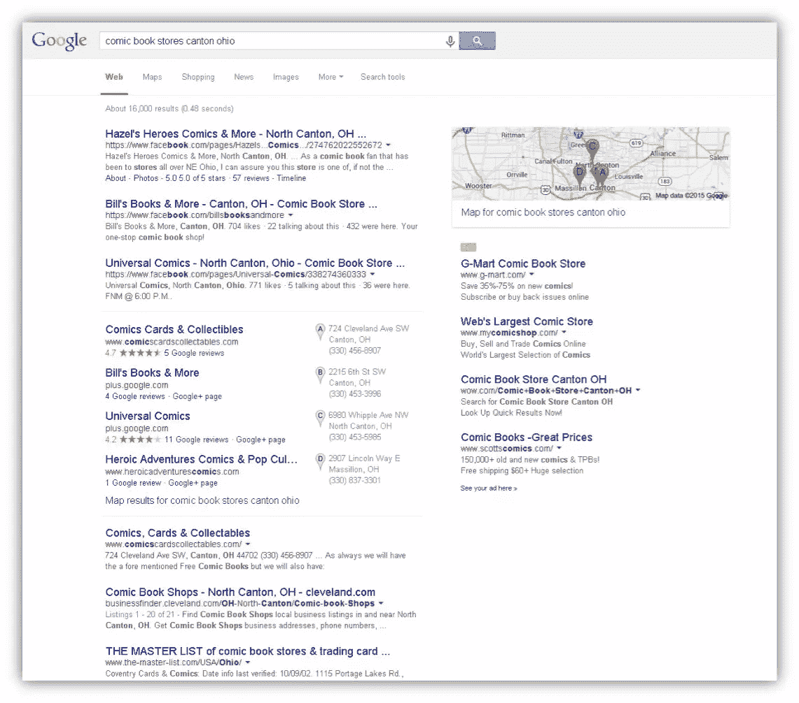
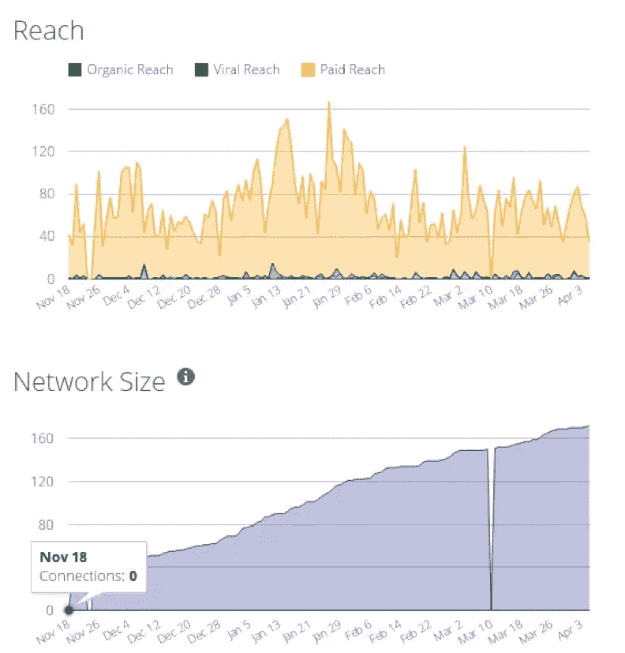
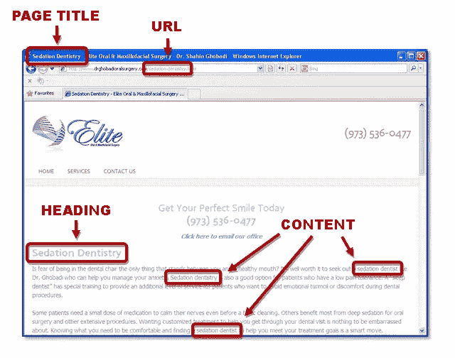
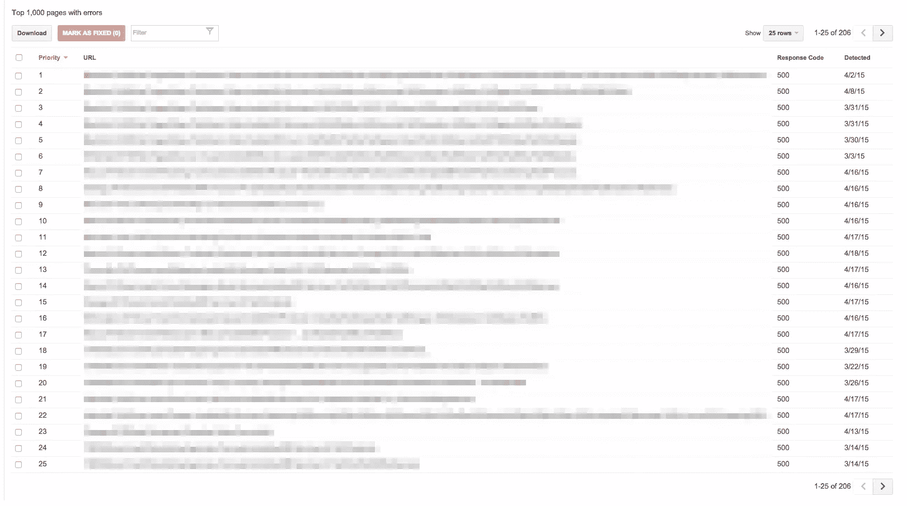

# 针对预算有限的小型企业的 9 个 SEO 创意

> 原文：<https://www.sitepoint.com/9-seo-ideas-small-businesses-budget/>

*本文由 [SEO PowerSuite](http://www.link-assistant.com/?utm_source=sitepoint&utm_medium=9_ideas_tagline&utm_campaign=sitepoint) 赞助。感谢您对使 SitePoint 成为可能的赞助商的支持。*

搜索引擎优化可以定义为“你所做的一切来提高你在搜索引擎中的知名度。”但是 SEO 已经超越了单纯的页面优化和链接建设。曾经不相关的领域如社交媒体和内容营销已经成为成功的搜索引擎优化策略的必要组成部分。所以，这里有九个方法可以提高你在搜索引擎中的可见度——当然是在预算之内。

## 1.开始使用社交媒体

### 社交媒体和搜索引擎优化

虽然谷歌没有将社交媒体活动作为排名因素，但两者之间有很强的相关性。在一个案例研究中，一家公司的脸书页面获得 50 个赞和 70 次分享后，其网站排名上升了 6.9%。

更重要的是，在二月份，Twitter [与 Google](http://techcrunch.com/2015/02/05/twitter-confirms-new-google-firehose-deal-to-distribute-traffic-to-logged-out-users/) 达成了一项协议，使得推文一发布就能在 Google 的搜索结果中显示出来。据 TechCrunch 报道:

> Twitter 估计，已经有大约 6 亿人以“注销”(即未注册)用户的身份登陆 Twitter 页面，相比之下，Twitter 目前每月有 2.88 亿注册活跃用户。

### 你不需要在每个平台上

在你开始创建你的 Twitter 账户之前，问问你自己它的用户是否符合你的客户人口统计。在所有平台中，脸书的人口分布最均匀(尽管很明显，青少年很快放弃了 Instagram 和 Tumblr)。

不要试图出现在每一个平台上，只要[去你的客户所在的地方](http://blog.wishpond.com/post/72672192941/social-media-marketing-which-platform-is-right-for/)。

### 为什么脸书网页排名很好

谷歌对待社交媒体页面就像对待任何其他网页一样——它的机器人抓取网站并将信息添加到其索引(即数据库)中。

然而，脸书不仅仅是“任何其他网页”这是互联网上第三大最常用的网站。作为一个“权威”网站，你可以利用它的排名优势。

在上面的截图中，这个搜索查询的第一位置是商店的脸书页面。更重要的是，它是出现在 SERP 中的那个商店的唯一的*列表。*

业主告诉我，脸书是他们目前唯一的在线存在。如果他们没有，你不会知道商店的存在。

### 设置您的脸书页面

我不推荐脸书(或任何其他社交媒体平台)成为“你唯一的在线存在”然而，如果你刚刚起步，你可以建立一个比网站更快的脸书网页。以下是让你开始的步骤。

脸书页面需要个人资料。如果你没有，你需要先做这个。
在您的个人资料左侧栏的“页面”下，点击“创建页面”。
添加增强内容(封面照片、商业信息等。)
每周至少发布三次。你也可以提前[安排帖子](https://www.facebook.com/help/389849807718635)。
通过邀请你的脸书朋友喜欢你的页面、通过电子邮件发送你的客户名单以及[推广你的页面](https://www.facebook.com/help/294671953976994/)来获得关注者。

推广你的页面不是免费的，但是——正如下面的截图所示——你会接触到更多的人，获得更多的关注者，而不是仅仅依靠有机接触。

## 2.给你的网站改头换面

根据 2014 年[的一项调查](http://www.slideshare.net/gordonborrell/what-is-main-street-really-spending-on-digital)，近 40%的中小企业网站是由“我自己、员工、朋友或家人”创建的但是拥有一台相机并不能让我成为一名专业摄影师。这就是为什么[大多数小企业在他们目前的网站上没有取得成功。](http://www.haineslocalsearch.com/5-reasons-website-failure/)

让一个网站看起来漂亮并不困难。让它在搜索引擎中表现良好，并把访问者转化为买家，需要专业的技巧。下面是你必须做的事情，让你的网站更上一层楼。

### 更新您的内容

在网络成为主流近 20 年后，古老的格言“内容为王”仍然适用。如果没有相关的、写得好的内容，你的网站很难在搜索引擎中排名靠前。

理想情况下，聘请专业文案是最好的。但是因为这篇文章是关于预算有限的商业，所以非作者的网络写作指南是必读的。

### 优化您的页面

为了确定你的网站是关于什么的，搜索引擎会从每个页面的**标题**、**网址**、**标题**和**内容**中得到提示。

最好为每个产品或服务创建单独的页面，然后在每个地方使用适当的关键字(以及这些关键字的变体)。

提醒一句。不要为了获得更好的排名而在你的内容中塞满关键词。自从网络出现以来，搜索引擎变得越来越聪明，如果你的内容写得不自然，它会惩罚你。写给普通人阅读的内容会比写给搜索机器人的内容排名更高。

想要更多关于如何让搜索引擎注意到你的内容的信息吗？查看[非作家的搜索引擎写作指南](https://www.sitepoint.com/non-writers-guide-writing-search-engines/)。

### 研究你的关键词

但是等等！在你做以上任何事情之前，你需要[确定你的最佳关键词](http://www.convinceandconvert.com/digital-marketing/how-important-are-keywords/)。

许多企业主认为他们已经知道人们使用哪些关键词来搜索他们的产品或服务。但是他们错过了访问现存最可靠数据库的机会。我相当肯定谷歌关于消费者如何搜索我的企业的信息比我的“最佳猜测”更准确。

SEO PowerSuite 的[排名追踪器](http://www.link-assistant.com/news/improved-keyword-research.html?utm_source=sitepoint&utm_medium=9_ideas_link2&utm_campaign=sitepoint)会向你展示最相关的、产生流量的关键词。

### 组织你的网站

如果你的网站看起来像我的桌子，祝你好运有人找到任何东西。(嘿，难道你不知道凌乱的桌子是创意天才的标志吗？)

但是困难就在这里:“……在大量的报纸、杂志和各种各样的物品下，有一种组织感*只有创作者才能通过*来操作。”所以一个没有组织的网站既不是创意也不是天才。这是导致灾难的原因。

如何组织你的网站是另外一篇文章——不幸的是我没有写过。但是这里有一个我可以强烈推荐。

## 3.善待移动用户

4 月 21 日，谷歌正式将“移动友好度”作为排名因素。这意味着经过优化可以在移动设备上正常显示的网站将会在移动搜索结果中排名更靠前。根据网站管理员中心博客的说法，这一变化“将对我们的搜索结果产生重大影响。”

### 移动对本地和非本地企业都至关重要

我已经写了很多关于为什么[移动现在是关键任务](https://www.sitepoint.com/mobile-seo-6-steps-mobile-friendly-website/)的文章。谷歌最近的举动更是如此。

### 如何检查你的网站是否适合移动设备

在智能手机上查看你的网站是显而易见的答案。如果你想要更深入的分析，SEO PowerSuite 有一个方便的工具来检查你的网站是否适合移动设备。

### 快速移动现有站点的工具

如果你需要一个快速的移动网站，有大量的移动网站建设者可以选择。虽然这可能不是理想的长期解决方案，但它会让你的手机网站达到谷歌的“手机友好”标准(T2)

使用 WordPress？没问题。这里有一些最好的插件来移动一个 WordPress 站点。

## 4.看看引擎盖下面

搜索引擎使用自动软件程序(称为机器人或蜘蛛)在网络上搜索内容。当他们找到一个网站，他们“爬行”通过它，跟随链接到每个页面，然后将内容添加到他们的数据库。

有时，这些蜘蛛会遇到一个错误，阻止它们成功地爬行整个站点。不幸的是，除非您“深入观察”，否则您永远不会知道这些错误是否正在发生。

### 使用谷歌网站管理员工具

Google [网站管理员工具](http://www.elegantthemes.com/blog/tips-tricks/how-to-use-google-webmaster-tools-to-improve-your-website)会向你展示类似上面的网站错误。不幸的是，它不一定告诉*如何*修复这些错误。SEO PowerSuite 的[网站审计清单](http://www.link-assistant.com/news/site-audit-checklist.html?utm_source=sitepoint&utm_medium=9_ideas_link4&utm_campaign=sitepoint)将帮助你识别和修复抓取错误。

### 创建网站地图

站点地图是一个 XML 文件，它列出了您站点的所有页面，以便搜索引擎可以更有效地搜索它。如果你的网站比较大，或者是新的，外部链接很少，这很有帮助。

你可以手动创建一个站点地图，或者使用一个在线站点地图生成器。一旦你这样做了，把它上传到你的站点的根文件夹，然后[在网站管理员工具里提交你的站点地图](https://support.google.com/sites/answer/100283?hl=en)。

对于 WordPress 网站， [Google XML 站点地图生成器插件](https://wordpress.org/plugins/google-sitemap-generator/)创建站点地图，点击几下就提交给搜索引擎。

## 5.上市，被发现

如果你是一家本地企业，那么在众多的在线目录和本地搜索门户上列出你的企业信息是在网上找到你的关键因素。

你的企业在越多的地方被一致且准确地列出，谷歌和其他搜索引擎就越有信心你的企业确实存在，并且他们提供给用户的信息是准确的。

### 认领你的本地物品

首先也是最重要的是，[声明你的谷歌列表](https://www.google.com/business/)。然后，如果你有时间，也可以申请雅虎、必应和 Yelp。

### 列表提交服务

对于数百个其他本地搜索目录，您可以将您的业务信息提交给四个数据提供商，主要的搜索引擎和目录都从这些数据提供商那里获得列表:

[信息组](http://www.expressupdate.com/search)
[信息组](https://mybusinesslistingmanager.myacxiom.com/)，
位置组
事实组

(请注意，向每个提供商提交您的列表可能会产生费用。)

关于优化你的本地形象的更多建议，请参见[掌握本地 SEO](https://www.sitepoint.com/series/mastering-local-seo/) 。

## 6.利用入站链接的离线关系

### 比赛场地是*而不是*水平

在谷歌的理想世界中，链接是自然获得的，简单地通过创造高质量、独特的内容。事实上，在其他条件相同的情况下，知名品牌总是比小型商业网站表现更好，因为它们能吸引更多的链接。

此外，搜索引擎更青睐品牌，因为它们的用户数据告诉它们，相比非品牌网站，人们更倾向于点击品牌网站。随着这些网站在搜索结果中排名的提高，人们会比非品牌网站更多地点击(和链接)品牌网站。如此循环往复。

链接建设是一项艰巨的工作。但是，如果你从现有的线下关系、活动和促销开始，就不会那么痛苦。这些都可以利用到入站链接。

例如，一家脊椎按摩运动公司可以通过赞助一所大学的年度 5000 米长跑来获得[有价值的 EDU 反向链接](http://www.searchenginejournal.com/find-build-powerful-edu-backlinks/90365/)。

同样地，[举办本地活动](http://moz.com/blog/the-complete-guide-to-link-building-with-local-events)或者像 [Groupon](http://www.localseoguide.com/forget-linkbuilding-do-a-groupon/) 这样的本地推广也能产生链接。

在网上搜索你的企业名称可能会发现在他们的网站上提到过你的组织，但是没有链接回来。请他们这样做。

## 7.让顾客谈论你

评论是另一个本地排名因素。在所有条件相同的情况下，评论多的企业往往比没有评论的竞争对手排名更高。大多数本地搜索专家认为[谷歌偏爱 Google+评论](http://www.localvisibilitysystem.com/2011/11/28/9-known-ranking-factors-of-reviews-in-google-places/)。

### 评论如何以及为什么成为排名因素

谷歌主导搜索市场，因为它决心给用户最好的体验。这意味着搜索者用来做出购买决定的任何东西最终都会成为谷歌搜索算法的一个因素。

不幸的是，企业对评论的效果一无所知。许多人在他们甚至不知道存在的网站上有差评。抵消负面评价的唯一方法是获得更多正面评价。欢迎来到声誉营销 101 课程。

### 征求评论的正确方式

监控你的声誉不会改善你的搜索结果，谷歌也不会因为你的差评而惩罚你。但是，当搜索结果页面显示你的不太好的评级让所有人都看到时，在谷歌上排名靠前是没有意义的。

关键是你要[正确回应负面评价](http://www.haineslocalsearch.com/how-to-combat-negative-reviews/)。但是为了抵消负面评价，提高你在搜索引擎中的排名，T2 获得正面评价同样重要。

你甚至可以要求客户直接从他们的 Gmail 收件箱提交评论[。](http://www.socialmediatoday.com/content/marketers-can-now-use-gmail-directly-collect-customer-reviews)

## 8.成为内容营销摇滚明星

曾几何时，SEO 是一项纯粹的技术工作，包括优化网站页面和获取链接。但不再是了。将“内容营销”融入其中。

> 内容营销意味着创造和分享有价值的免费内容，吸引潜在客户并将其转化为客户，将客户转化为回头客。你分享的内容类型和你卖的东西密切相关；换句话说，你在教育人们，让他们了解你，喜欢你，信任你，愿意和你做生意。–[copy blogger](http://www.copyblogger.com/content-marketing/)

我之前讲过社交媒体。博客是内容营销硬币的另一面。分享他人的内容很好，但创建自己的内容可以达到两个目的:

直接为您的网站带来流量
建立您作为专家的信誉，从而产生销售线索

### 博客如何影响排名

我曾经在工作日结束时发表了一篇博文，第二天上午 10 点在谷歌的第一页找到了这篇博文。当然，这不是一个竞争激烈的类别。但这表明了谷歌对新鲜内容的关注程度。以下是博客帮助的其他三种方式。

#### 更多索引页面

请记住，谷歌排名的是*网页*，而不是网站。每篇博客文章都是你网站上的一个页面，有可能对你的关键词进行排名。所以数量和质量是必须的。

#### 入站链接

博客文章可以吸引其他网站的入站链接，这是好的搜索引擎排名的一个重要因素。

#### 社会化媒体

在你的社交媒体档案上分享你的博客文章可以产生赞、分享和其他社交媒体活动，从而产生到你网站的反向链接。

### 将博客添加到您的网站

如何将博客添加到你的网站取决于它是如何建立的。

如果你运行的是一个**自托管的 WordPress 站点**，你的主题可能已经包含了博客功能。你只需要让那部分活起来。

如果你正在使用 Wix 或 Squarespace 这样的 DIY 平台，那么添加一个博客部分应该相对简单。我说“应该”是因为，如果你有一个免费计划，你的选择可能会受到限制，除非你升级。

有了**静态 HTML 站点**，你有几个选择:

将 WordPress 安装在当前站点的子目录中(例如 www.yourdomain.com/blog)。然而，你选择的 WordPress 主题与你当前的站点不匹配。

将 WordPress 安装在你当前站点的子目录中，然后[让你的 WordPress 站点看起来像你当前的设计](https://codex.wordpress.org/Integrating_WordPress_with_Your_Website)。(这可能需要一个熟练的 PHP 程序员。)

在 WordPress 中重建你的整个网站并完成它。

给你个建议:这篇文章的标题是，**预算有限的小企业的 9 个 SEO 点子**。对于许多小企业来说，“预算”通常是“我没有钱花，所以我可以免费做什么？”

请记住,“免费”是有代价的——你的时间。在我提出的所有想法中，建立一个网站/博客是最耗时的，也是最需要技巧的。多年来，我遇到过许多企业主，他们认为他们可以通过建立自己的网站来省钱，但结果却是生产出了一个劣质产品，甚至更糟——根本没有机会去做。

你的网站是你在线形象的基础。所以我的建议是，花一部分预算雇一个专业人士。因为，在现实中，唯一比专业人士更费钱的就是业余爱好者。

### 开始写博客

如果你以前从来没有写过，写博客可能看起来有点吓人。(要想快速提高写作水平，请看[非写作者的网络写作指南](https://www.sitepoint.com/non-writers-guide-writing-web/)。)

如果是你，承诺每月写一篇文章。确保它是信息性或教育性的，而不是宣传性的。为了通过博客来发展你的业务，你必须首先[建立一个受众](https://www.sitepoint.com/building-audience-build-business/)。

自动化你的内容营销将节省时间。之前我提到过如何提前预定脸书的帖子。像 [BuzzBundle](http://www.link-assistant.com/buzzbundle/?utm_source=sitepoint&utm_medium=9_ideas_link5&utm_campaign=sitepoint) 这样的工具可以让你从一个仪表盘向多个社交媒体档案发布内容。

还有[插件](https://managewp.com/automatically-share-blog-posts)和[第三方服务](http://twitterfeed.com/)，可以自动将你的博客文章分享到你的社交媒体个人资料中。

## 9.通过视频迅速传播

视频影响排名，产生流量

*   如果你的网站包含视频，那么它出现在谷歌第一页的可能性是普通网站的 53 倍
*   75%的消费者在观看视频后会访问公司网站(DigitalSherpa)
*   73%的消费者在观看解释产品或服务的视频后更有可能购买(Animoto 在线和移动视频研究，2014 年)

### DIY 视频制作

专业视频制作可能需要数千美元。对于预算有限的企业来说，自己动手制作视频是唯一的选择。

有了一部[智能手机](http://wistia.com/blog/shot-on-an-iphone)、[一些设备技巧](http://blog.punchinthefacemarketing.com/it-is-okay-to-use-your-iphone-for-small-business-video-marketing)，再加一点练习，你也可以拍摄出专业质量的视频。去找点乐子。

## 下一步是什么？

如果这看起来工作量很大，那么你是对的——的确如此。这就是像我们这样的营销公司存在的原因。但是不要绝望。我已经按照重要性的顺序组织了这篇文章。我认为 1 到 6 分钟是“关键任务”(非本地企业可以跳过第 5 项。)从这些开始。如果你看到一个改进，其他的可能就没必要了。

根据你所在市场的竞争力，你可能需要比别人付出更多的努力来排名。是的，这需要时间，但是一年后，你会希望你今天就开始了。

有问题吗？把它们贴在下面的评论里。

## 分享这篇文章