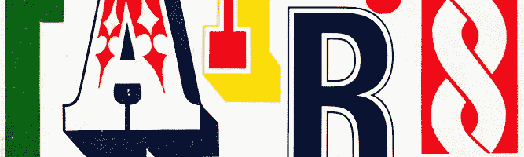
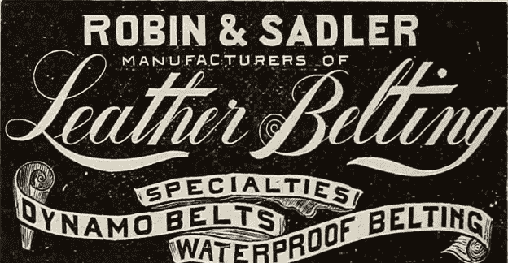
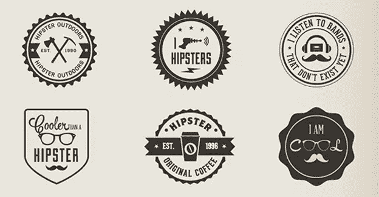
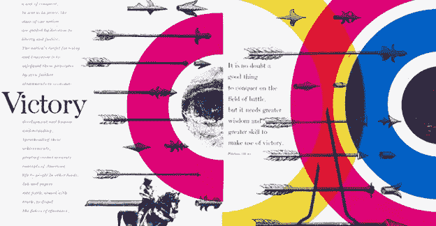
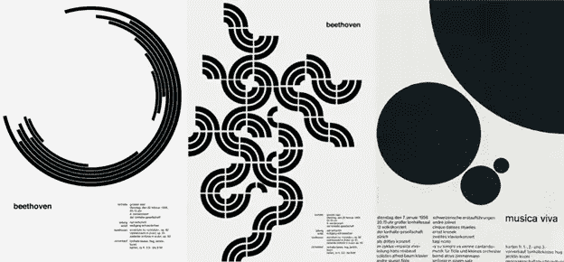
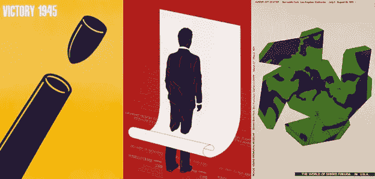

# 设计趋势阻碍你的 9 种方式

> 原文：<https://www.sitepoint.com/9-ways-design-trends-holding-back/>

每一个伟大的设计师都是潮流的引领者。假设你不想只是一个普通的设计师，他的设计无法辨认，你需要超越潮流。

在我最近写的一篇文章《[为什么你不是一个著名的设计师](https://99designs.com/designer-blog/2015/01/27/not-famous-graphic-designer/)》中，我概述了一些我们都知道并喜爱的著名设计师从人群中脱颖而出的方式。那篇文章中的一些要点包括挖掘你的个性，不要害怕成为一个革命性的思想家。像设计潮流引领者一样思考！

## 1.设计需要一种进化的方式

*网上存档图书图片(via [Flickr](http://www.flickr.com) )*

没有引领潮流的人，设计就无从发展。当陷入一种趋势时，平面设计就成了一只追逐自己尾巴的狗——哪里也去不了。这种思想在进化带来改变的时候是令人悲哀的，令人耳目一新，令人振奋。对我来说，不断变化和发展的过程才是真正值得的。就像呼吸新鲜空气一样。

没有进化，设计看起来仍然和 19 世纪晚期一模一样(如上所述)。虽然这些早期的设计本身就令人惊叹，但它们在今天的设计中没有一席之地，我当然很高兴设计已经向前发展了。想到每天都有令人兴奋的新面貌出现，感觉真好。

不要害怕存在于设计进化的前沿！

## 2.追随潮流没什么意思

*【免费潮人徽章(via xoo.me)*

当跟随趋势时，你本质上是一个电脑操作员——一个执行电脑命令而没有真正创造性思维的人。虽然这肯定可以算作一种职业，但它不是即兴创作。它并不创新，最重要的是，它并不那么有趣。

以潮人 logo 潮流为例。如果你的工作是将公司名称插入到上述模板中，那会很快变得令人厌烦。举个例子，设计师蒂姆·狄杰创造了广受欢迎的 2013 年《T2 潮人标志设计指南》。狄杰强调了这样一个事实，即创造潮人标志没有艺术完整性——这只是一个公式。一遍又一遍地遵循同样的公式并不好玩。

设计是一种媒介，它拥抱创造力，欢迎大胆的艺术探索。正是在这种创造性和疯狂的探索中，设计变得有趣起来。放了它！

## 3.与众不同可以带来更多的客户

*童书设计:[索尔·巴斯](https://en.wikipedia.org/wiki/Saul_Bass)*

当寻求设计工作时，客户面临成千上万的选择。如果你没有以这样或那样的方式让自己与众不同，你就不可能被委任或被询问。

客户在寻找设计师的过程中需要一种风格和个性。考虑真正让你的独特品质在你的工作和沟通方式中闪耀，这样你就能抓住潜在客户的眼球。

## 4.设计不需要有竞争力

*设计:*

时尚设计师的世界是一个充满竞争的世界。通过跟风，每个人都在做非常相似的事情。这可能会增加竞争，并导致设计师之间在寻求客户和工作方面的紧张关系。

但是这种紧张是不需要存在的。让喜欢你风格的客户因为你提供的东西而雇佣你。如果不是为了他们，那也没关系。让他们走吧。总会有更多的客户需要你的帮助。

设计师 Bradbury Thompson(上图)完全沉浸在自己的世界里，他使用颜色的方式。他没有竞争对手，因为当时没有其他作品可以与之相比。他没有向客户提供潮人标志或时尚外观，因为他们不是为了时尚外观来找他的。他们来找他是因为他独特的设计和色彩方法。

## 5.跟上潮流是令人疲惫和耗时的

*图案:[约瑟夫·穆勒-布罗克曼](https://en.wikipedia.org/wiki/Josef_M%C3%BCller-Brockmann)*

当然，你可以看看趋势预测的博客文章。例如，这可能会帮助你更好地理解你在设计世界中的位置。然而，真正跟上流行设计的趋势和细微差别需要不断地在互联网上搜索新的设计公司和作品，然后通过额外的研究进行分析，以形成流行趋势。这是一个巨大的时间承诺，否则可以花在你自己的创造性工作和探索。

如果约瑟夫·穆勒-布罗克曼(如上所述)花时间在互联网上寻找流行趋势，他将永远没有时间来完善自己的工作，这显然是非常耗时的！

## 6.设计中鼓舞人心的东西并不流行

*海报设计:[福田茂](https://en.wikipedia.org/wiki/Shigeo_Fukuda)*

想想当初是什么让你进入设计行业的。希望你对这个问题的回答是这样的:

*   制作美丽的东西
*   看到鼓舞人心的形状，凝视令人兴奋的字体
*   看到精彩展示的信息或
*   创造我们周围世界的样子

现在想想，如果跟随别人设定的趋势，这些事情怎么都做不到。不要被潮流所吸引。回到你最初开始设计的原因。上面这些 Shigeo Fukuda 的海报没有激发你的创造力和挑战极限吗？

## 7.“好主意很少成群出现”

*照片来自保罗·兰德展览。凯瑟琳·罗宁(via [Flickr](http://www.flickr.com) )*

这句著名的保罗·兰德名言在这里非常贴切。好主意来自一个神奇的地方——它们不能被分离出来，变成好主意的公式。不要以为跟风就能创造好点子。如果你想创造真正好的想法，你需要探索未知。

## 8.为正确的理由而设计

*图案:[詹·柴尔德](https://en.wikipedia.org/wiki/Jan_Tschichold)*

设计是一种艺术形式，应该受到尊重。它不应该被滥用作为一种轻松赚钱的方式。这种方法只会传播以下趋势。设计应该仅仅是出于对媒介的真诚兴趣，它能促进灵感和创造力。

## 9.每个人都有成为个体的潜力

*设计:*

想到一个设计社区朝着多样化和个性化的状态努力是很好的。在这里，每个人都有自己独特的风格，并因其贡献而受到尊重和利用。我相信每个人都有独一无二的倾向、品味和风格，但(不幸的是)这些倾向、品味和风格经常被趋势和压力所压制，以某种方式进行设计。

花一点时间问问自己，你是否给了真实的自己一个展现的机会。你是怪胎吗？酷！你说话温柔吗？太好了！你是僵化和被遏制的吗？那也行！不要害怕别人对你的评价。要知道，我尊重任何走自己的路，让自己的真实身份成形的设计师。

保罗·兰德(如上图所示)再次成为设计世界中无与伦比的个人的完美典范。

## 结论

不要被潮流所困！那么多美好的东西会从自我探索、个人主义和自由的创造性探索中产生。不仅如此，真实的自我表达会让你在设计世界中走得更远，而不是跟随潮流！

#### 有其他方法成为设计潮流的引领者吗？分享在评论里！

*经 [99designs 设计师博客](http://99designs.com/designer-blog/)许可转载 T3*

## 分享这篇文章