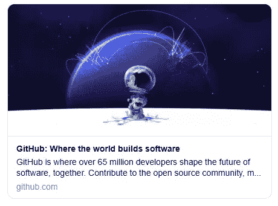

# HTML5 模板:任何项目的基本样板

> 原文：<https://www.sitepoint.com/a-basic-html5-template/>

随着你学习 HTML5 并向你的工具箱中添加新技术，你可能会想要为自己构建一个 HTML 样板文件来开始所有未来的项目。这绝对值得去做，网上有很多起点可以帮助你建立自己的 HTML5 模板。

在本文中，我们将了解如何开始构建自己的 HTML5 样板文件。我们将介绍 HTML 模板的基本元素，最后介绍一个您可以随身携带并在其上构建的基本模板。

如果你宁愿现在抓取代码，稍后再阅读这篇文章， [**这里是我们完成的 HTML5 模板**](#thecompletehtml5boilerplate) 。

## HTML5 模板的剖析

HTML 模板通常包括以下部分:

1.  [文档类型声明](#thehtml5doctype)(或 doctype)
2.  [元素`<html>`元素](#thehtmlelement)
3.  [字符编码](#htmldocumentcharacterencoding)
4.  [视口元元素](#theviewportmetaelement)
5.  [`<title>``description``author`](#thetitledescriptionandauthor)
6.  [打开社交卡的图形元元素](#opengraphmetaelementsforsocialcards)
7.  [收藏图标和触摸图标](#faviconsandtouchicons)
8.  [链接到样式表和脚本](#includingastylesheetandscripts)

除了文档类型声明和`<html>`元素之外，上面列出的元素大多位于 HTML 模板的`<head>`部分。

## HTML5 文档类型

你的 HTML5 模板需要以一个文档类型声明开始，或者是 *doctype* 。doctype 只是告诉浏览器或任何其他解析器它正在查看什么类型的文档的一种方式。在 HTML 文件的情况下，它意味着 HTML 的特定版本和风格。doctype 应该总是任何 HTML 文件顶部的第一项。许多年前，doctype 声明是一个丑陋且难以记忆的混乱，通常被指定为“XHTML Strict”或“HTML Transitional”。

随着 HTML5 的出现，那些难以辨认的眼中钉不见了，现在你需要的只是这个:

```
<!doctype html> 
```

简单明了。doctype 可以大写、小写或大小写混合书写。你会注意到声明中明显缺少了“5”。尽管当前的 web 标记迭代被称为“HTML5”，但它实际上只是以前 HTML 标准的一个演变——未来的规范将只是我们今天的发展。永远也不会有“HTML6”，所以通常将 web 标记的当前状态简单地称为“HTML”。

因为浏览器需要支持 Web 上的旧内容，所以不需要依赖 doctype 来告诉浏览器在给定的文档中应该支持哪些特性。换句话说，单靠 doctype 并不能让您的页面兼容现代的 HTML 特性。实际上，无论使用何种文档类型，都是由浏览器根据具体情况来决定特性支持。事实上，您可以在页面上使用带有新 HTML5 元素的旧文档类型，页面将呈现与使用新文档类型时相同的效果。

## `<html>`元素

在任何 HTML 文档中，跟随 doctype 的是`<html>`元素:

```
<html lang="en"> 
```

自 HTML5 出现以来，这一点没有发生任何重大变化。在上面的代码片段中，我们包含了值为`en`的`lang`属性，它指定文档是英文的。对于要验证的页面来说，这不是必需的，但是如果您不包含它，大多数验证器都会警告您。

`<html>`元素分为两部分，即`<head>`和`<body>`部分。`<head>`部分包含不向最终用户显示的关于文档的重要信息——比如[字符编码](#htmldocumentcharacterencoding)，以及指向 CSS 文件的[链接，可能还有 JavaScript](#includingastylesheetandscripts) 。`<body>`部分包含浏览器中显示的所有内容——文本、图像等等。

## HTML 文档字符编码

HTML 文档的`<head>`部分的第一行定义了文档的字符编码。这是一个可选特性，不会在验证器中引起任何警告，但是对于大多数 HTML 页面来说，这是推荐的:

```
<meta charset="utf-8"> 
```

几乎在所有情况下，`utf-8`都是您将在文档中使用的值。对字符编码的完整解释超出了本文的范围，您可能也不会对此感兴趣。尽管如此，如果你想更深入一点，你可以[阅读 HTML 规范](https://html.spec.whatwg.org/multipage/infrastructure.html#encoding-terminology)中的字符编码。

*注意:为了确保某些老版本的浏览器能够正确读取字符编码，整个字符编码声明必须包含在文档的前 512 个字符中。它还应该出现在任何基于内容的元素之前(比如在我们的示例中后面出现的`<title>`元素)*。

关于这个主题，我们可以写得更多，但是现在，我们满足于接受这个简化的声明，并继续我们文档的下一部分。

## 视口元元素

viewport meta 元素是几乎每个 HTML5 模板都会有的特性。这对于响应式网页设计和移动优先设计非常重要:

```
<meta name="viewport" content="width=device-width, initial-scale=1"> 
```

这个`<meta>`元素包括两个属性，它们作为一个名称/值集一起工作。在这种情况下，`name`被设置为`viwport`，并且值为`width=device-width, initial-scale=1`。这仅由移动设备使用。您会注意到该值有两部分，如下所述:

*   `width=device-width`:您希望网站呈现的视口的像素宽度。
*   `initial-scale`:这应该是 0.0 到 10.0 之间的正数。值“1”表示设备宽度和视口大小之间的比例为 1:1。

你可以在 MDN 上多读一点关于这些元元素特性[的内容，但是现在你只需要知道，在大多数情况下，具有这些设置的元元素最适合移动优先、响应迅速的网站。](https://developer.mozilla.org/en-US/docs/Web/HTML/Element/meta/name#standard_metadata_names_defined_in_other_specifications)

## `<title>`、`description`和`author`

HTML 模板的下一部分包含以下三行:

```
<title>A Basic HTML5 Template</title>
<meta name="description" content="A simple HTML5 Template for new projects.">
<meta name="author" content="SitePoint"> 
```

这些元素已经成为 HTML 的一部分很长时间了，所以这里没有什么太新的东西。`<title>`是浏览器标题栏中显示的内容(比如当你悬停在浏览器标签上时)。这个元素是`<head>`中唯一的强制元素。

另外两个是可选的`<meta>`元素，为 SEO 目的和作者定义描述。除了`<title>`之外，`<head>`中的所有元素都是可选的。事实上，您可以在`<head>`中放置任意多的有效`<meta>`元素。

## 社交卡的开放图形元元素

如前所述，所有元元素都是可选的，但许多元素对 SEO 和社交媒体营销都有好处。我们的 HTML5 样板文件的下一部分包括一些元元素选项:

```
<meta property="og:title" content="A Basic HTML5 Template">
<meta property="og:type" content="website">
<meta property="og:url" content="https://www.sitepoint.com/a-basic-html5-template/">
<meta property="og:description" content="A simple HTML5 Template for new projects.">
<meta property="og:image" content="image.png"> 
```

这些`<meta>`元素利用了一种叫做开放图协议的东西，还有许多其他你可以使用的东西。这些是你可能最常使用的。您可以在 [Open Graph 网站](https://ogp.me/)上查看可用 Open Graph 元选项的完整列表。

我们在这里包括的这些将会增强网页的外观，当它被链接到社交媒体帖子时。例如，此处包含的五个`<meta>`元素将出现在嵌入以下数据的社交卡中:

*   内容的标题
*   正在传送的内容的类型
*   内容的规范 URL
*   内容的描述
*   与内容相关联的图像

当你在社交媒体上看到分享的帖子时，你经常会看到这些数据被自动添加到社交媒体帖子中。例如，如果你在推文中加入 GitHub 主页的链接，会出现以下内容:



<small>[图片来源:GitHub](https://user-images.githubusercontent.com/558709/121095418-5218c200-c7be-11eb-97d3-75bbaf52e244.png)</small>

## 收藏夹图标和触摸图标

HTML5 模板中的下一部分包括`<link>`元素，这些元素指示作为 favicon 和 apple touch 图标包含的资源:

```
<link rel="icon" href="/favicon.ico">
<link rel="icon" href="/favicon.svg" type="image/svg+xml">
<link rel="apple-touch-icon" href="/apple-touch-icon.png"> 
```

`favicon.ico`文件是用于遗留浏览器的，不必包含在代码中。只要你的`favicon.ico`文件包含在你的项目根目录下，浏览器就会自动找到。`favicon.svg`文件适用于支持 SVG 图标的现代浏览器。当页面被添加到用户的主屏幕时，最后一个元素引用苹果设备上使用的图标。

您可以在这里包含其他选项，包括引用其他图标的 web 应用程序清单文件。要进行全面的讨论，我们推荐 Andrey Sitnik 关于这个主题的帖子。但是这里包含的内容对于一个简单的初学者模板来说已经足够了。

## 包括样式表和脚本

HTML 模板的最后两个重要部分是对样式表和脚本的引用。当然，两者都是可选的:

```
 <link rel="stylesheet" href="css/styles.css?v=1.0"> 
```

使用带有适当的`rel`属性的`<link>`元素来包含样式表。样式表可以包含在文档中的任何地方，但是您通常会在`<head>`中看到它。与旧版本的 HTML 不同，不需要包含一个`type`属性(这本来就不需要)。

同样，对于脚本元素，你几乎可以在文档的任何地方看到它们，但是作为一种最佳实践，它们通常在底部(就在结束的`</body>`标签之前)。

```
<script src="js/scripts.js"></script> 
```

将`<script>`元素放在页面底部是为了提高页面加载速度。当浏览器遇到脚本时，它会暂停下载并呈现页面的其余部分，同时解析脚本。当大型脚本出现在页面顶部任何内容之前时，这会导致页面加载速度变慢。因此，大多数脚本应该放在页面的最底部，这样只有在页面的其余部分加载后才能解析它们。但是请注意，在某些情况下，脚本可能需要将放在文档的头部，因为您希望它在浏览器开始呈现页面之前生效。

与样式表引用类似，脚本上的`type`属性不需要(也从来不需要)。因为 JavaScript 实际上是 Web 上使用的唯一真正的脚本语言，而且因为所有的浏览器都会假设您正在使用 JavaScript，即使您没有明确声明这一事实，您可以放心地省略掉在遗留代码中经常出现的`type="text/javascript`。

## 关于旧浏览器和新元素的说明

当 HTML5 推出时，它包含了许多新元素，如`<article>`和`<section>`。您可能会认为对未识别元素的支持是老版本浏览器的一个主要问题——但事实并非如此！大多数浏览器实际上并不关心你使用什么标签。如果你有一个带有`<recipe>`元素(或者甚至是`<ziggy>`元素)的 HTML 文档，并且你的 CSS 将一些样式附加到该元素上，几乎每个浏览器都会像这完全正常一样运行，毫无怨言地应用你的样式。

当然，这种假设的文档可能无法验证，并且可能存在可访问性问题，但它可以在几乎所有浏览器中正确呈现——旧版本的 Internet Explorer (IE)除外。在版本 9 之前，IE 阻止未识别的元素接受样式。这些神秘元素被渲染引擎视为“未知元素”，因此您无法改变它们的外观或行为。这不仅包括我们想象的元素，还包括开发这些浏览器版本时尚未定义的任何元素，包括新的 HTML5 元素。

幸运的是，不支持新元素样式的旧浏览器现在几乎不存在了，所以您可以放心地在几乎任何项目中使用任何新的 HTML 元素。

也就是说，如果你真的需要支持古老的浏览器，你仍然可以使用可靠的 T2 html 5 Shiv T3，这是一个简单的 JavaScript，最初由约翰·雷西格开发。[受 Sjoerd Visscher](https://www.paulirish.com/2011/the-history-of-the-html5-shiv/) 工作的启发，它使新的 HTML5 元素可以在 IE 的旧版本中使用。不过，今天真的不需要这个。正如 caniuse.com 所指出的，所有正在使用的浏览器都支持 HTML5 元素。

## 完整的 HTML5 样板文件

这是我们最终的 HTML5 模板——一个你可以用于任何项目的基本样板:

```
<!doctype html>

<html lang="en">
<head>
  <meta charset="utf-8">
  <meta name="viewport" content="width=device-width, initial-scale=1">

  <title>A Basic HTML5 Template</title>
  <meta name="description" content="A simple HTML5 Template for new projects.">
  <meta name="author" content="SitePoint">

  <meta property="og:title" content="A Basic HTML5 Template">
  <meta property="og:type" content="website">
  <meta property="og:url" content="https://www.sitepoint.com/a-basic-html5-template/">
  <meta property="og:description" content="A simple HTML5 Template for new projects.">
  <meta property="og:image" content="image.png">

  <link rel="icon" href="/favicon.ico">
  <link rel="icon" href="/favicon.svg" type="image/svg+xml">
  <link rel="apple-touch-icon" href="/apple-touch-icon.png">

  <link rel="stylesheet" href="css/styles.css?v=1.0">

</head>

<body>
  <!-- your content here... -->
  <script src="js/scripts.js"></script>
</body>
</html> 
```

现在，您可以将这个简单易用的 HTML5 模板放到任何项目中！在此基础上，您可以在`<body>`和`</body>`标签之间添加任何您想要的内容。

## 后续步骤

让你的网页布局更上一层楼的一个好方法是使用 *[《美丽网页设计的原则》，第四版](https://www.sitepoint.com/premium/books/the-principles-of-beautiful-web-design-4th-edition/?utm_source=blog&utm_medium=articles)* 。这本书将教你设计的原则*和*告诉你如何在网络上实现它们。它在 2020 年 9 月被完全重写，包括了你在其他地方没有读到过的尖端技术。

为了磨练你的 CSS 知识，我们的[现代 CSS 项目](https://www.sitepoint.com/master-modern-css-projects/)课程将帮助你掌握 CSS3 的最新高级版本。

除此之外，你可以通过交互性和可编程的、反应式的用户界面将你的网站或 web 应用程序开发提升到一个新的水平。例如，查看 SitePoint 在 [JavaScript](https://www.sitepoint.com/javascript/) 和 [React](https://www.sitepoint.com/javascript/react/) 上的丰富资源。了解如何[更快地开始新项目](https://www.sitepoint.com/start-new-projects-faster/)使用我们的最佳脚手架网络工具和库指南。或者，如果你想在不学习编码的情况下构建 web 体验，请阅读我们关于[无代码运动](https://www.sitepoint.com/the-rise-of-the-no-code-movement/)的初级读本。最新的无代码工具改变了游戏。第一次，它们强大到足以在许多情况下为编码提供一个严肃的替代方案。

## 分享这篇文章