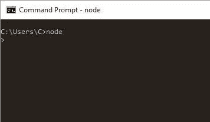
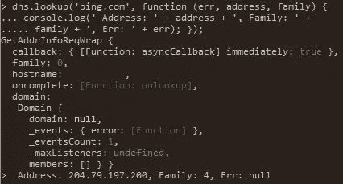

# Node.js 的初学者挥霍

> 原文：<https://www.sitepoint.com/a-beginner-splurge-in-node-js/>

现在是凌晨 3 点。你双手放在键盘上，盯着一个空空的控制台。黑暗背景上的明亮提示已经准备好，渴望接受命令。想黑一下 Node.js 吗？

Node.js 令人兴奋的一点是它可以在任何地方运行。这为实验堆栈提供了多种可能性。对于任何经验丰富的老手来说，这都是命令行工具的有趣运行。特别的是，我们可以从命令行的安全网内检查堆栈。我们仍然在讨论 JavaScript，这很酷——所以大多数熟悉 JS 的读者理解它是如何工作的应该没有任何问题。那么，为什么不在控制台上启动`node`呢？

在本文中，我们将向您介绍 Node.js。我们的目标是在攀登一些相当高的高地的同时回顾主要的亮点。这是堆栈的中间概述，同时将它全部放在控制台中。如果你想要一个 Node.js 的初学者友好指南，可以看看 SitePoint 的[用 Node.js](https://www.sitepoint.com/premium/courses/node-js-an-introduction-2866) 构建一个简单的后端项目课程。



## 为什么是 Node.js？

在我们开始之前，让我们回顾一下使 Node.js 脱颖而出的花絮:

*   它是为非阻塞 I/O 而设计的
*   它是为异步操作设计的
*   它运行在 Chrome 的 V8 JavaScript 引擎上。

你可能从很多渠道听说过这些观点，但这都意味着什么呢？您可以将 Node.js 视为向 JavaScript 语言公开许多 API 的引擎。在传统计算中，进程是同步的，当您执行任何 I/O 操作时，API 在运行下一行代码之前会等待。例如，I/O 操作就是读取文件或进行网络调用。Node.js 不会这么做；它从一开始就被设计成异步操作。在当今的计算市场上，这有着巨大的优势。你能想出上一次你买新电脑是因为它有更快的单处理器吗？内核数量和更快的硬盘更重要。

在本文的剩余部分，当您看到一个提示符号`>`时，它意味着您应该点击`Enter`来输入下一个命令。此外，在运行本文中的代码之前，您必须打开 CLI 并执行命令`node`。说完了，让我们开始参观吧！

## 回收

首先，键入以下函数:

```
> function add(a, b, callback) { var result = a + b; callback(result); } 
```

对于新手来说，JavaScript 中的回调可能看起来很奇怪。它当然不像任何经典的 OOP 方法。在 JavaScript 中，函数是对象，对象可以接受其他对象作为参数。JavaScript 并不关心一个对象有什么，因此函数可以接受一个恰好是另一个函数的对象。 **arity** ，即参数的数量，从`add()`中的两个变为回调中的单个参数。这个回调系统非常强大，因为它支持封装和实现隐藏。

在 Node.js 中，您会发现许多 API 将回调作为参数。考虑回调的一种方式是作为代表。抛开编程行话不谈，委托是被派来并被授权代表他人的人。所以回调就像派人去跑腿。给定一个参数列表，比如一个购物清单，他们可以自己去完成一项任务。

玩弄`add`:

```
> add(2, 3, function (c) { console.log('2 + 3 = ' + c) });
> add(1, 1, function (c) { console.log('Is 1 + 1 = 3? ' + (c === 3)); }); 
```

有很多更有创意的方法来玩回调。回调是 Node.js 中一些重要 API 的构建块。

## 异步操作

通过回调，我们能够开始构建异步 API。例如:

```
> function doSomething (asyncCallback) { asyncCallback(); }
> doSomething(function () { console.log('This runs synchronously.'); }); 
```

这个特殊的例子有一个同步执行。但是我们已经拥有了 JavaScript 中异步所需的一切。例如，`asyncCallback`可能在同一个线程中被延迟:

```
> function doSomething (asyncCallback) { setTimeout(asyncCallback, Math.random() + 1000); }
> doSomething(function () { console.log('This runs asynchronously.'); }); console.log('test'); 
```

我们使用一个`setTimeout`来延迟当前线程中的执行。超时不能保证执行时间。我们放置了一个`Math.random()`使其更加易变，并调用`doSomething()`，后跟一个`console.log('test')`，以显示延迟的执行。您将经历一到两秒钟的短暂延迟，然后看到屏幕上弹出一条消息。这说明异步回调是不可预测的。Node.js 将这个回调放到一个调度器中，并继续它的快乐之路。当计时器触发时，Node.js 会选择执行发生的地方并调用回调。因此，您必须将注意力集中在任性的回调上，以理解 Node.js。

简而言之，回调并不总是像 JavaScript 中显示的那样。

让我们继续做一些更酷的事情——比如在 Node.js 中进行简单的 DNS 查找:

```
> dns.lookup('bing.com', function (err, address, family) { console.log(' Address: ' + address + ', Family: '  + family + ', Err: ' + err); }); 
```

回调返回`err`、`address`和`family`对象。重要的是返回值作为参数传递给回调。所以这不像你的传统 API`var result = fn('bing.com');`。在 Node.js 中，您必须获得回调和异步，才能了解全局。(查看 [DNS Node.js API](https://nodejs.org/api/dns.html) 了解更多细节。)这是 DNS lookupc 在控制台中的样子:



## 文件输入输出

现在让我们加快速度，在 Node.js 上进行文件 I/O。想象一下这样一个场景，您打开一个文件，读取它，然后将内容写入其中。在现代计算机体系结构中，I/O 绑定操作滞后。CPU 寄存器快，CPU 缓存快，RAM 快。但是你去读和写磁盘，它变得很慢。因此，当同步程序执行 I/O 绑定操作时，它运行缓慢。更好的选择是异步完成，就像这样:

```
> var fs = require('fs');
> fs.writeFile('message.txt', 'Hello Node.js', function () { console.log('Saved.'); }); console.log('Writing file...'); 
```

因为操作是异步的，所以在文件保存到磁盘上之前，您会看到“正在写文件…”。回调函数的自然使用非常适合这个 API。从这个文件中读取怎么样？您能马上猜出在 Node.js 中如何做到这一点吗？我们给你一个提示:回调接受`err`和`data`。试试看。

答案如下:

```
> fs.readFile('message.txt', function(err, data) { console.log(data); }); 
```

您也可以传入一个`encoding`选项来获取文件的`utf-8`内容:

```
> fs.readFile('message.txt', {encoding: 'utf-8'}, function(err, data) { console.log(data); }); 
```

在 Node.js 中使用带有异步 I/O 的回调函数看起来不错。这里的优势是我们利用了 JavaScript 中的一个基本构建块。通过不阻塞的异步 API，回调被提升到了一个全新的水平。

## 网络服务器

那么，网络服务器怎么样？任何好的 Node.js must 都必须运行 web 服务器。想象一个名为`createServer`的 API，带有一个接受`request`和`response`的回调函数。你可以在文档中探索[HTTP API](https://nodejs.org/api/http.html)。你能想到那看起来像什么吗？你需要`http`模块。继续并开始在控制台中键入。

答案如下:

```
> var http = require('http');
> var server = http.createServer(function (request, response) { response.end('Hello Node.js'); }); 
```

Web 基于请求和响应的客户机-服务器模型。Node.js 有一个来自客户端的`request`对象和一个来自服务器的`response`对象。因此，堆栈通过这个简单的回调机制包含了 Web 的关键。当然，它是异步的。我们在这里所做的与文件 API 没有太大的不同。我们引入一个模块，告诉它做一些事情，然后传入一个回调函数。回调的工作方式类似于给定参数列表后执行特定任务的委托。

当然，如果我们不能在浏览器中看到它，一切都是废话。要解决此问题，请在命令行中键入以下内容:

```
server.listen(8080); 
```

将你最喜欢的浏览器指向`localhost:8080`，对我来说是 Edge。


想象一下这个`request`物体有大量的信息可供你使用。为了给`server`重新布线，让我们先把它拉下来:

```
> server.close();
> server = http.createServer(function (request, response) { response.end(request.headers['user-agent']); }); server.listen(8081); 
```

将浏览器指向`localhost:8081`。对象给你来自浏览器的 T2 信息。我们还可以遍历`headers`对象:

```
> server.close();
> server = http.createServer(function (request, response) { Object.keys(request.headers).forEach(function (key) { response.write(key + ': ' + request.headers[key] + ' '); }); response.end(); }); server.listen(8082); 
```

这次把浏览器指向`localhost:8082`。一旦你玩完了你的服务器，一定要把它拿下来。如果您不这样做，命令行可能会变得很奇怪:

```
> server.close(); 
```

现在，您可以通过命令行创建 web 服务器了。我希望你喜欢这个大约`node`的迷幻之旅。

## 异步等待

ES 2017 引入了异步函数。异步函数本质上是 JavaScript 中处理异步代码的一种更干净的方式。创建 Async/Await 是为了简化处理和编写链式承诺的过程。您可能已经体验过连锁代码变得多么不可读。

创建一个`async`函数非常简单。您只需要在函数前添加 async 关键字:

```
async function sum(a,b) {
    return a + b;
} 
```

再说说`await`。如果我们想要强制代码的其余部分等待，直到承诺解析并返回结果，我们可以使用`await`。只等待有承诺的作品；它不适用于回调。另外，`await`只能在`async`功能中使用。

考虑下面的代码，它使用了一秒钟后返回新值的承诺:

```
function tripleAfter1Second(number) {
    return new Promise(resolve => {
        setTimeout(() => {
            resolve(number * 3);
        }, 1000);
    });
} 
```

当使用`then`时，我们的代码看起来像这样:

```
tripleAfter1Second(10).then((result) => {
    console.log(result); // 30
} 
```

接下来，我们想使用 async/await。我们希望在对这个结果执行任何其他操作之前，强制我们的代码等待三倍的值。在下面的例子中，如果没有关键字`await`,我们会得到一个错误，告诉我们不可能得到“undefined”的模数，因为我们还没有三重值:

```
const finalResult = async function(number) {
    let triple = await tripleAfter1Second(number);
    return triple % 2;
} 
```

关于 async/await 的最后一点意见是:注意未捕获的错误。当使用`then`链时，我们可以用`catch`结束它，以捕捉执行过程中发生的任何错误。但是，await 不提供这种功能。为了确保捕捉到所有错误，用一个`try … catch`块将 await 语句括起来是一个很好的做法:

```
const tripleResult = async function(number) {
    try {
        return await tripleAfter1Second(number);
    } catch (error) {
        console.log("Something wrong: ", error);
    }
} 
```

要更深入地了解 async/await，请查看[用异步函数](https://www.sitepoint.com/simplifying-asynchronous-coding-async-functions/)简化异步编码。

## 结论

Node.js 非常适合现代解决方案，因为它简单而轻量。它利用现代硬件的无阻塞设计。它包含了网络固有的客户机-服务器模型。最棒的是，它运行 JavaScript——这是我们喜爱的语言。

吸引人的是，堆栈的症结并不新鲜。从一开始，Web 就围绕着轻量级、可访问的模块而构建。当你有时间的时候，一定要阅读蒂姆·伯纳斯·李的[设计原则](https://www.w3.org/DesignIssues/Principles.html)。如果选择使用 JavaScript，最小功率原则适用于 Node.js。

希望您喜欢这个命令行工具。黑客快乐！

*这篇文章由[拉比·基兰](https://www.sitepoint.com/author/rkiran/)进行了同行评审。感谢 SitePoint 的所有同行评审员使 SitePoint 的内容尽可能做到最好！*

## 分享这篇文章