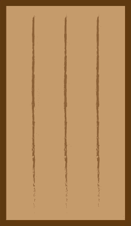
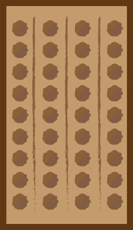
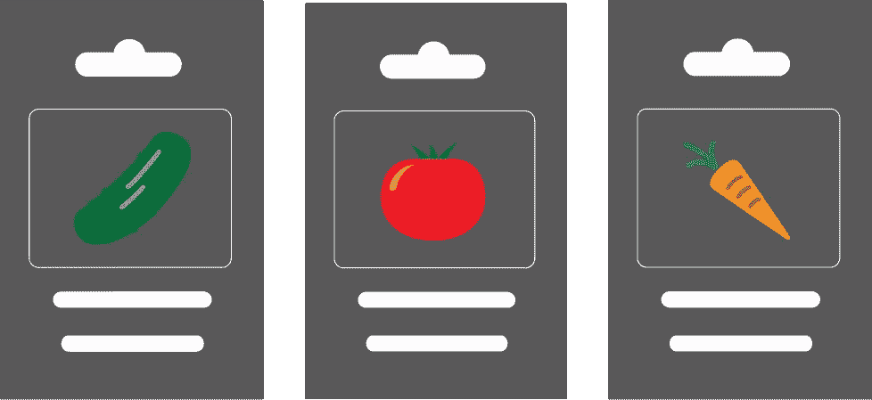
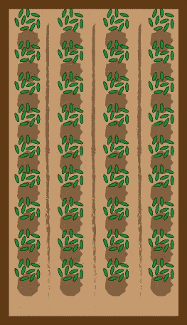
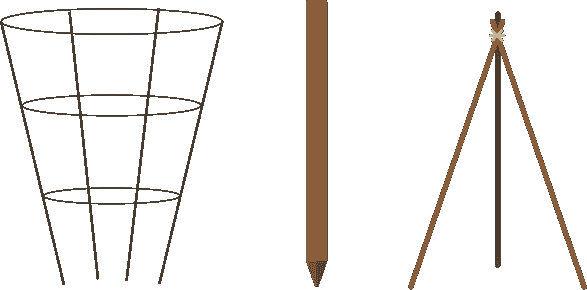

# D3.js 数据绑定初学者指南

> 原文：<https://www.sitepoint.com/a-beginners-guide-to-data-binding-in-d3-js/>

[D3.js](https://d3js.org/) 是一个强大的数据可视化库，让你只用几行代码就能创建令人惊叹的图表——比如[气泡图](https://www.sitepoint.com/simple-bubble-charts-using-d3-js/)、[折线图和条形图](https://www.sitepoint.com/creating-simple-line-bar-charts-using-d3-js/)。

凭借对 JavaScript 的初学者理解，您可以将您的数组或对象转换成彩色显示。然而，每个初学者一开始都很难理解数据是如何与 DOM 中的实际元素联系在一起的。这被称为“数据绑定”或“数据连接”。这是一件大事，因为这是整个过程的第一步！

直觉上，您可能期望一个`for()`循环，在这里您循环遍历数据中的每一项并创建一个元素。像这样:

```
var data = [{x: 100, y: 100}, {x: 200, y: 200}, {x: 300, y: 300}]

for(var i=0; i< data.length; i++){
    svg.append("circle")
        .attr("cx", function(data) { return data[i].x; })
        .attr("cy", function(data) { return data[i].y; })
        .attr("r", 2.5);
}
```

但事情不是这样的！事实上，根本不存在`for()`循环。相反，下面是包含上述功能的代码块:

```
var data = [{x: 100, y: 100}, {x: 200, y: 200}, {x: 300, y: 300}]

svg.selectAll("circle")
    .data(data)
    .enter().append("circle")
    .attr("cx", function(d) { return d.x; })
    .attr("cy", function(d) { return d.y; }) 
    .attr("r", 2.5);
```

这将在 SVG 画布上添加 3 个黑色圆圈。哇哦。这是因为 D3 使用了一种[声明式](https://en.wikipedia.org/wiki/Declarative_programming)的编程风格。这个代码块中隐含了`for()`循环。

这需要一些时间来适应，所以我将一行一行地检查上面的代码块，这样您就可以准确地理解发生了什么。和种菜园是一个思路。当你完成阅读后，你将能够在 5 到 10 行内构建任何基本的可视化，并开始设计风格(简单的部分)。

如果你正在寻找这个概念的更技术性的解释，请查阅一下 [D3 文档](https://bost.ocks.org/mike/join/)或者斯考特·玛瑞的[数据绑定指南](http://alignedleft.com/tutorials/d3/binding-data)。

## 第一步:SVG/地块

首先，您需要选择想要绘制数据可视化的位置。这相当于选择你想要种植的区域:

```
>var svg = d3.select("body")
    .append("svg")
    .attr("width", '800px')
    .attr("height", '800px');
```

这就创造了一个 800 像素乘 800 像素的陆地区域——身体——你可以在其中添加你的元素。很简单。



## 步骤 2:选择所有/创建孔

接下来，我们需要一个 selectAll()语句来创建一个组，稍后我们将用元素填充该组。把这想象成在你的花园里挖洞。D3 这样做是为了让您以后可以一次更新或删除整个元素集。这里有一个例子:

```
svg.selectAll("circle")
```

如果你以前没有添加任何圈子，这将工作得很好。请注意“圆形”是来自 [SVG 规范](https://developer.mozilla.org/en-US/docs/Web/SVG/Element/circle)的基本形状。如果你之前已经添加了圆，你可以在这里使用一个类，比如:

```
svg.selectAll(".circleClass")
```



好吧，这张图片有点误导。在你计划种植的那部分花园里有无数个洞。没有很好的方法在合理的空间内将它转化为图像。重要的部分是你正在描绘一个你将要种植数据元素的特定区域。如果您想添加 SVG“rect”元素，您可以在花园的另一个地方添加。在代码的这一点上，还不清楚实际要添加多少元素。让我们来解决这个问题！

## 第三步:数据/种子

这是最重要的部分。它决定了哪些数据将用于可视化。在 JavaScript 中，可以以数组或对象的形式传递这些数据。在这一步中，您将数据“绑定”到您在`selectAll()`中指定的 DOM 元素类型。此后，您可以像在 JavaScript 中一样引用数组或对象中的项。我们将分两步来讨论这个问题。在下面的例子中，数组中有三个元素，所以我们希望在完成后，三个元素将被添加到 DOM 中:

```
var data = [{x: 100, y: 100}, {x: 200, y: 200}, {x: 300, y: 300}]

svg.selectAll("circle")
    .data(data)
```

这与为花园选择特定类型的种子是一样的。每种类型的种子都有一定的特征，并会开花成为一种已知类型的植物。



## 第四步:把种子放进洞里

`.enter()`命令将`selectAll`语句与数组/对象中的元素数量进行匹配，并确定需要创建的元素数量。你不再拥有无限的土地！现在，您的地块上的坑数与您想要种植的植物数量相匹配:

```
svg.selectAll("circle")
    .data(data)
    .enter()
```



在这个例子的代码中，现在有三个洞，每个洞里有一种特定类型的种子(例如，西红柿)。这也决定了代码将自动经历的迭代次数(同样是 3 次)。

## 第五步:添加植物的结构

的。append()命令决定你将使用哪个 [SVG 基本形状](https://developer.mozilla.org/en-US/docs/Web/SVG/Tutorial/Basic_Shapes)。虽然对于`selectAll()`语句您有许多选项，但是在这一步中只有七种形状可供选择(或者一个“g”，但那更高级)。`selectAll()`命名组，`append()`命名实际形状:

```
svg.selectAll("circle")
    .data(data)
    .enter().append("circle")
```

这类似于赞美你的植物的结构。你希望你的植物长成什么样？如果你想种西红柿，你需要一个塔。不同的形状和数据可视化适用于不同的数据集。



## 关于如何访问数据的简要说明

好了，现在你已经在 DOM 中添加了三个圆形元素。你选择你的那块地，挖坑，播种，为植物生长提供结构。以下是如何选择每个圆的属性:

```
.attr("cx", function(d) { return d.x; })
.attr("cy", function(d) { return d.y; })
```

从 circle 规范中，我们知道可以用`cx`和`cy`来确定一个圆在 SVG 画布中的位置。在这两种情况下，我们都使用`function(d)`来访问原始数组中每一项的属性。因为您使用了`.enter()`，所以您知道这个代码块将为数组中的每一项运行，总共运行三次。

与`{x: 100, y: 100}`一样，`d`代表数组中的每一项。如果显示的是`d,i`，那么`i`将是第一项的索引`0`，第二项的索引`1`，依此类推。当您要求它返回`d.x`时，您只是查看每个项目的`x`属性，并将其转换为像素。在这种情况下，这将是原点右侧 100 个像素。现在你只是在使用普通的 JavaScript！你可以使用`if`语句，函数调用和其他任何东西。

## 结论

在用 D3 构建任何很酷的东西之前，您需要理解它将数据转换成您选择的 DOM 元素的具体方法。与数据部分相比，样式非常简单。添加文本与添加形状非常相似，因此一旦您理解了数据部分，您也就理解了文本。

虽然你可能会诅咒 D3 的创造者，因为他们在学习过程的早期就加入了如此具有挑战性的概念，但他们有充分的理由这样做。D3 是一个灵活的库，几乎可以自动处理如此多的挑战。这种数据绑定结构将允许您在一两行代码中完成复杂的操作。现在，走出去“惊艳”你的用户吧！

* * *

*编者按:这篇文章还有一个[互动版](https://www.rtfmanual.io/d3garden/)。*

## 分享这篇文章