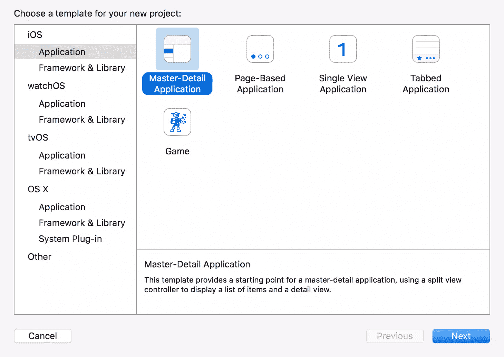
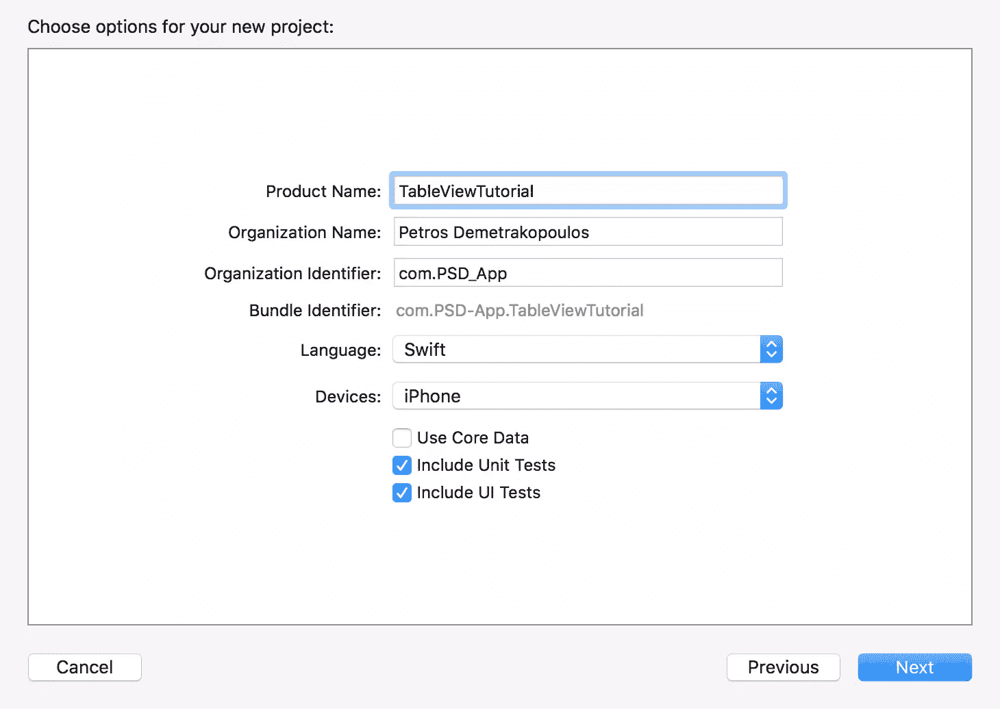
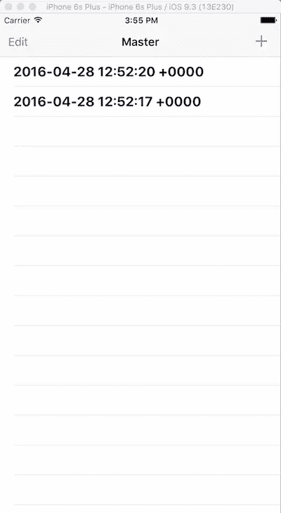
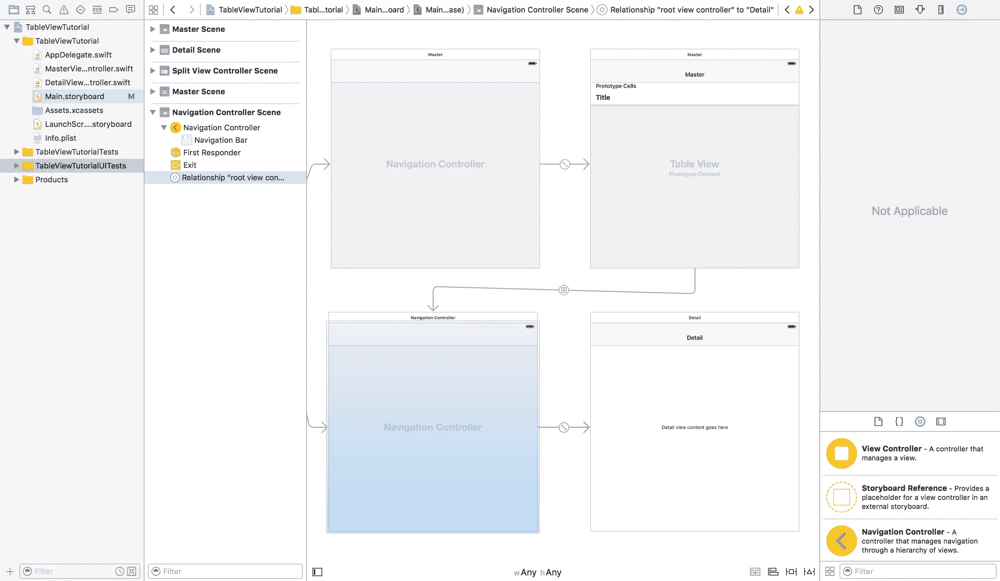
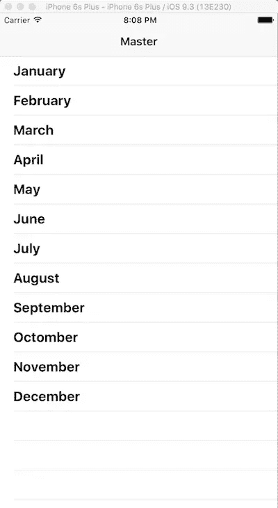

# 在 iOS 中填充和使用表格视图的初学者指南

> 原文：<https://www.sitepoint.com/a-beginners-guide-to-populating-and-using-tableviews-in-ios/>

使用表格一直是显示和布局数据的流行方法，从电子表格到网页，当然现在还有移动应用程序。

在本教程中，我将向你展示如何使用和填充 iOS 的数据。

## 入门指南

首先创建一个新的 Xcode 项目，选择*主从应用*模板。



点击下一个的*，为项目添加一个名称。如下图所示设置项目选项，点击*下一步*。*



如果您运行这个项目，您会看到一个表格视图，在顶部栏的右侧有一个 *+* 按钮。每当用户点击时，这将在表格的新行中添加当前日期和时间。如果您点击其中一行，详细视图将显示带有所选行日期的标签。



## 桌子摆好了

从项目导航器中打开*master view controller . swift*文件。它是`UITableViewController`类的一个实例，控制表视图的功能和数据。

`viewDidLoad`功能设置 *+* 按钮和分割视图控制器。分割视图控制器只能在 iPads 上使用。

`numberOfSectionsInTableView`函数返回表格中的节数。如果不添加任何分类，它将返回 1。

`tableView(tableView: UITableView, numberOfRowsInSection section: Int) -> Int`函数返回表格在每个部分中的行数。在表格视图中，数据以数组结构呈现在表格视图中。在本例中是`objects`数组。

`tableView(tableView: UITableView, cellForRowAtIndexPath indexPath: NSIndexPath) -> UITableViewCell`函数创建表格中的每个单元格，设置文本和其他属性。`indexPath.row`值提供了索引的整数值。

`tableView(tableView: UITableView, canEditRowAtIndexPath indexPath: NSIndexPath) -> Bool`函数返回一个定义单元格是否可编辑的值。

`tableView(tableView: UITableView, commitEditingStyle editingStyle: UITableViewCellEditingStyle, forRowAtIndexPath indexPath: NSIndexPath)`函数改变单元格的样式，包括删除和插入样式的样板代码。

## 与桌子互动

至此，你已经学会了如何设置`tableview`以及它需要哪些功能。

该类还包含此函数:

```
func insertNewObject(sender: AnyObject) {
  objects.insert(NSDate(), atIndex: 0)
  let indexPath = NSIndexPath(forRow: 0, inSection: 0)
  self.tableView.insertRowsAtIndexPaths([indexPath], withRowAnimation: .Automatic)
} 
```

当用户点击 *+* 按钮，将当前日期对象添加到`objects`数组，从而添加到`tableview`的第一行时，该函数运行。

## 详细视图

*Main.storyboard* 文件处理大部分细节视图。在下面的屏幕截图中，您可以看到 selected segue 处理行的选择，并将其显示在详细视图中。



当用户选择一行时，`MasterViewController`类的`override func prepareForSegue(segue: UIStoryboardSegue, sender: AnyObject?)`函数运行:

```
override func prepareForSegue(segue: UIStoryboardSegue, sender: AnyObject?) {
  if segue.identifier == "showDetail" {
      if let indexPath = self.tableView.indexPathForSelectedRow {
          let object = objects[indexPath.row] as! NSDate
          let controller = (segue.destinationViewController as! UINavigationController).topViewController as! DetailViewController
          controller.detailItem = object
          controller.navigationItem.leftBarButtonItem = self.splitViewController?.displayModeButtonItem()
          controller.navigationItem.leftItemsSupplementBackButton = true
      }
  }
} 
```

此函数检查 segue 是否为详细视图，并根据所选行设置详细视图属性。

## 用内容填充表格

现在用数组中的静态内容填充这个表。为此，首先从*masterview controller . swift*的`override func viewDidLoad()`函数中删除以下行。

```
self.navigationItem.leftBarButtonItem = self.editButtonItem()
let addButton = UIBarButtonItem(barButtonSystemItem: .Add, target: self, action: "insertNewObject:")
self.navigationItem.rightBarButtonItem = addButton 
```

这将移除 *+* 和*编辑*按钮。

现在将下面几行代码添加到同一个函数中。

```
objects.insert("January", atIndex: 0)
objects.insert("February", atIndex: 1)
objects.insert("March", atIndex: 2)
objects.insert("April", atIndex: 3)
objects.insert("May", atIndex: 4)
objects.insert("June", atIndex: 5)
objects.insert("July", atIndex: 6)
objects.insert("August", atIndex: 7)
objects.insert("September", atIndex: 8)
objects.insert("October", atIndex: 9)
objects.insert("November", atIndex: 10)
objects.insert("December", atIndex: 11) 
```

这些行填充了`objects`数组，该数组将一年中所有月份的名称作为字符串值提供给表视图。

在`tableView(tableView: UITableView, cellForRowAtIndexPath indexPath: NSIndexPath) -> UITableViewCell`功能中，更改以下两行:

```
let object = objects[indexPath.row] as! NSDate
cell.textLabel!.text = object.description 
```

收件人:

```
let object = objects[indexPath.row] as! String
cell.textLabel!.text = object 
```

而在`override func prepareForSegue(segue: UIStoryboardSegue, sender: AnyObject?) {`的变化中:

```
let object = objects[indexPath.row] as! NSDate 
```

收件人:

```
let object = objects[indexPath.row] 
```

这些行被改变是因为现在`objects`数组的值是字符串值，你可以立即将`cell.textLabel!.text`的值设置为`objects[indexPath.row]`，因为它是一个字符串。

运行该应用程序，您应该会看到表格中充满了一年中的月份。当您点击表格中的某一行时，详细视图就会显示，并显示月份名称的标签。



您可以在 [GitHub](https://github.com/sitepoint-editors/TableViewTutorial) 上找到您所做更改的最终项目。

这是对`tableview`的基本介绍，它们有很大的潜力，如果你有兴趣了解更多， [SitePoint 有更高级的教程](https://www.sitepoint.com/?s=tableview)和[iOS 开发者图书馆有一些很棒的后续步骤](https://developer.apple.com/library/ios/referencelibrary/GettingStarted/DevelopiOSAppsSwift/Lesson7.html)。

有任何问题或意见吗？下面请告知。

## 分享这篇文章