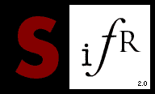
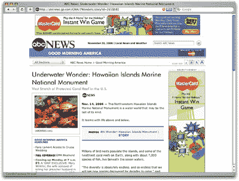

# SIFR 文本替换简介

> 原文：<https://www.sitepoint.com/a-brief-introduction-to-text-replacement-with-sifr/>

网页字体很棒，越来越多的浏览器采用了它们，这确实有助于推动网页设计向前发展。诸如 Typekit 之类的服务使得实现 webfonts 变得很容易，没有很多麻烦。不幸的是，仍然有一些原因使您可能想要使用文本替换——其中最主要的原因是对出于品牌原因而需要使用的字体的许可限制。

最受欢迎的文本替换选项之一是 sIFR(发音为“siffer”)，这是可伸缩因曼 Flash 替换的首字母缩写，这是一种允许设计师使用 Flash 和 JavaScript 将他们选择的字体应用到标题的技术。

sIFR 背后的基本前提是，Flash 电影能够嵌入字体，并以抗锯齿的美丽向大多数安装了 Flash 的 web 用户显示，JavaScript 能够用 Flash 电影替换指定的 HTML 对象。

通过将这两个概念结合在一起，网页设计师和开发者肖恩·因曼创造了一种他称之为因曼闪存替代(IFR)的技术，这是 sIFR 的前身。IFR 是网页排版的革命性发展，但是它有一些小缺点。它最显著的缺点是只能用来替换单行文本。认识到这项技术的潜力，Mike Davidson 和 Mark Wubben，以及无数的支持者和测试者，共同开发了一个文档完善、易于实现的解决方案——sIFR，并作为开源软件发布给开发社区。

那些对 Flash 和 JavaScript 解决网络问题的方案持怀疑态度的人可以放心了，因为 sIFR 是一个完全可访问的解决方案，并且降级很好。如果用户没有安装 Flash，或者他们关闭了 JavaScript，他们将看到脚本和 Flash 本应替换的普通旧浏览器文本。

在网站上寻找 sIFR 文本的例子可能很困难，特别是当他们使用它来显示通常安装在许多计算机上的字体时。例如，美国广播公司新闻过去常常使用 sIFR 来显示《未来》的新闻标题，如下图所示。Futura 是默认为 OSX 用户安装的字体，但通过使用 sIFR，ABC 可以确保其大多数用户以相同的字体看到标题。

要下载 sIFR 的最新版本，并访问完整的安装说明，请访问[迈克·戴维森的 sIFR 页面](http://www.mikeindustries.com/sifr/)或[马克·沃本的 sIFR 维基](http://wiki.novemberborn.net/sifr/)。

你使用过 SIFR 来替换你建立的网站上的文本吗？有哪些小技巧或警告可以分享？

## 分享这篇文章