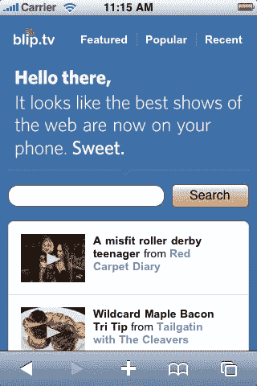

# 简单看一下屏幕分辨率

> 原文：<https://www.sitepoint.com/a-brief-look-at-screen-resolutions/>

与固定和流动的争论相比，在过去的几年里，关于为特定屏幕分辨率而设计的争论已经变得相当平淡。当设计者说一个网站是为特定的屏幕分辨率而设计或优化的，他们实际上是在谈论浏览者的显示器的分辨率。在过去，关于屏幕分辨率的争论主要集中在我们的设计是否应该在不显示水平滚动条的情况下支持 800×600 的显示器分辨率。

根据 W3Schools 的屏幕分辨率统计，在 2010 年 1 月，1%的网络用户将他们的屏幕设置为 800×600 像素(低于 2009 年的 4%)，20%的用户将他们的分辨率设置为 1024×768 像素(低于 36%)，高达 76%的访问者的分辨率高于 1024×768 像素。下图说明了这些趋势。

如今，桌面浏览器显示至少 1024×768 是一个既定的假设。甚至大多数上网本的分辨率都是 1024×600 或更高。因此，960 像素已经成为大多数网页设计项目中事实上的宽度。W3Schools 报告了分辨率大于 1024 的用户的增长，你可能会认为我们正在寻求将标准宽度推过 960，但有几个原因可能不会发生这种情况。首先，大多数使用较大显示器的用户仍然将浏览器窗口设置为小于 1024 像素宽，这样他们就可以看到正在运行的其他应用程序。另一个原因是线路长度。如果一行文字太长，可读性就会降低。因此，更宽的默认布局宽度只会允许我们添加更多的列。

W3Schools 的屏幕分辨率统计

尽管 W3Schools 提供的桌面浏览器统计数据证明了我们使用 960 像素布局的合理性，但它们忽略了网络浏览人群中的一个主要部分:移动用户。再次引用伊桑·马科特的[“响应式网页设计”](http://www.alistapart.com/articles/responsive-web-design/) *的一篇文章，移动浏览有望在三到五年内超过基于桌面的访问。随着移动屏幕分辨率的提高和移动浏览器赶上桌面浏览器，可以肯定地说，你的网站设计将在现代移动设备上可读。不过，你仍然应该在浏览器测试中包括流行的移动设备；如果我们在努力使我们设计的网站在 IE7 中看起来正确，难道我们不应该也在移动浏览器上检查它们吗？*

更严肃地看待移动使用的增长，越来越多的网站正在提供他们网站的移动优化版本；当然，这意味着越来越多的客户也会要求移动优化网站。这曾经是一项复杂的任务，要处理手机特有的语言，比如[<acronym title="Wireless Markup Language">【WML】</acronym>](http://en.wikipedia.org/wiki/Wireless_Markup_Language)和糟糕、笨拙的浏览器，比如黑莓的老式 <acronym title="Research In Motion">RIM</acronym> <abbr>OS</abbr> 。

iOS 上的 Blip.tv(如 http://cssiphone.com 上所见)

幸运的是，今天设计一个移动优化的网站主要是修改你的布局以在移动屏幕上工作，同时可能利用操作系统的一些额外功能来使它发光。涵盖设计移动优化网站的技术细节超出了本书的范围，但是本章剩余部分讨论的布局原则和设计理论仍然适用。归根结底，不管你在设计什么，你的客户和他们的目标受众的需求应该是你决策的驱动力。

## 美丽网页设计的原则

这篇文章来自杰森·比厄德的 [*美丽网页设计的原则*一书](https://www.sitepoint.com/premium/library "SitePoint.com: The Principles of Beautiful Web Design, 2nd Edition")(第二版现已出版)。这是第一章的第十二部分。

如果你更喜欢色彩，请务必在设计节上查看现有的[色彩章节的数字化版本。](https://www.sitepoint.com/design-ux/color/ "DesignFestival.com: Everything on Color")

## 分享这篇文章