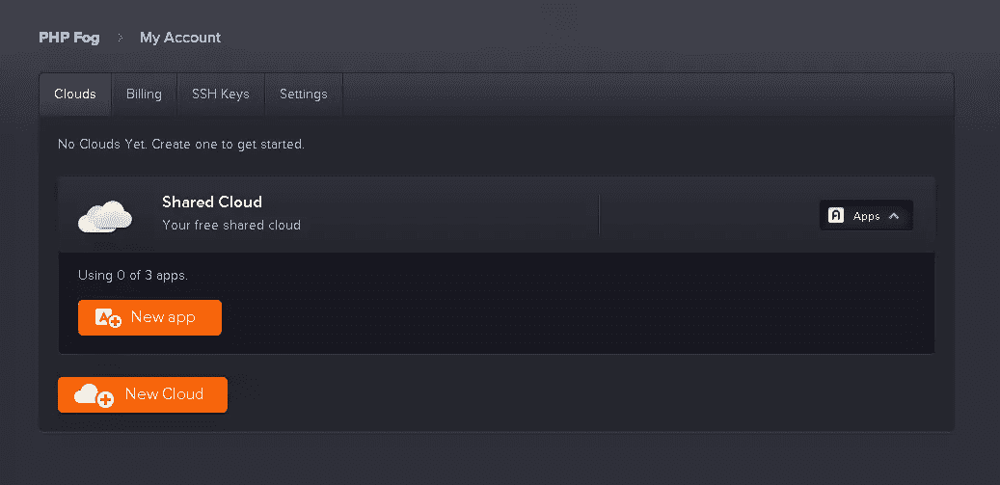
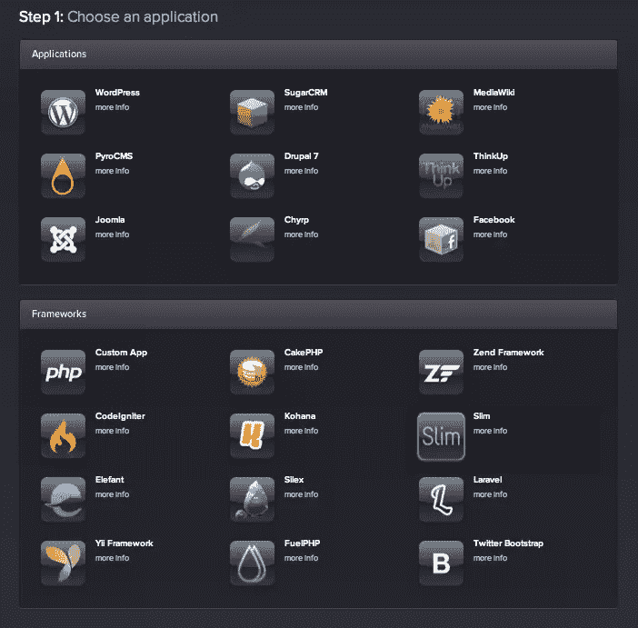
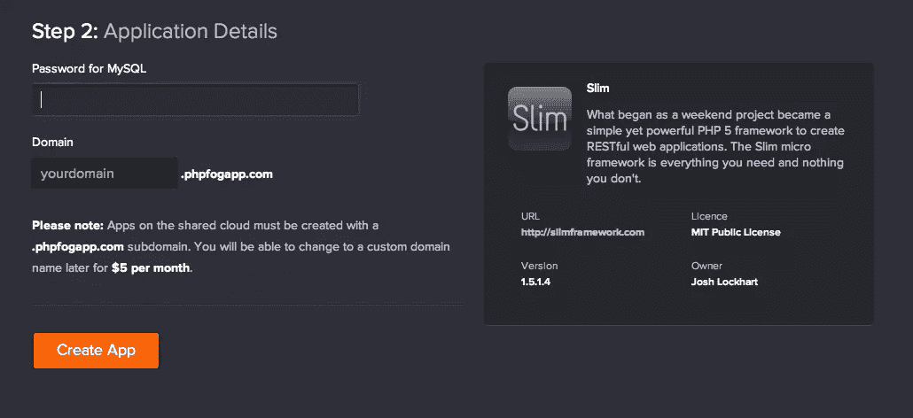
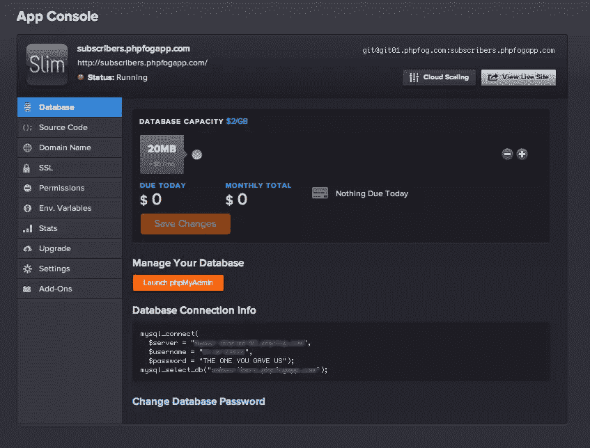
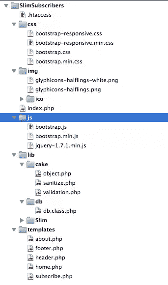

# 一个专门用于 PHP 应用的云，向 PHPFog 问好

> 原文：<https://www.sitepoint.com/a-cloud-dedicated-to-php-apps-say-hello-to-phpfog/>

PHPFog 是一个相对较新的云托管提供商，专门为 PHP 应用程序设计。他们的使命是“更少的管理，更多的代码”，整个平台都围绕着最常用和最可靠的 PHP 工具。举个例子，我试着用免费计划创建一个全新的 WordPress 博客，只用了 3 分钟！另外，安装和更新插件和主题的过程是即时的！

在本教程中，我将使用两个 PHPFog 支持的框架构建一个简单的订阅表单应用程序:用于 PHP 部分的 Slim 和用于 CSS 部分的 Twitter Bootstrap。作为奖励，该应用程序将利用 Bootstrap 2 框架的新响应功能，并且可以从桌面 PC、平板电脑和智能手机上开箱即用。

## 平台主要特性

PHFog 与其他提供商有何不同？

首先，PHPFog 平台建立在众所周知且可靠的开源技术之上。HTTP 请求首先由 Varnish 缓存代理服务器过滤，然后通过 Nginx 负载平衡器传递，该平衡器在几个应用服务器之间分配工作负载。这些服务器是运行 Apache 的专用 Linux 机器，带有 mod_php 和 APC(高级 php 缓存)扩展。数据库存储由 MySQL 使用主从可伸缩设置进行管理。

其次，这个平台是为开发者和非开发者设计的。在应用程序设置期间，您可以选择从一个空白的可定制 PHP 应用程序开始，使用推荐的 PHP 框架之一(包括 CakePHP、CodeIgniter、Zend Framework 等)，或者，对于非开发人员，您可以选择从一个列表中部署一个现成的应用程序，包括 WordPress、Drupal、Joomla、Media Wiki 等。

如果您使用`.phpfogapp.com`域，您还可以获得免费的 SSL。

## 设置您的帐户

PHPFog 的注册过程非常快，你只需要提供一个电子邮件地址，选择一个密码就可以登录了。最初不需要信用卡，因为每个账户都有一个免费计划，使用一个共享云，包含 3 个应用程序、100MB 磁盘存储和 20MB MySQL 存储。如果您决定升级到高级计划，您将拥有一个拥有专用资源(CPU、RAM、磁盘和数据库存储)的私有云。Premium 计划还允许您扩展所使用的数据库和应用程序服务器的数量，甚至是一天或两天，只为您所使用的内容付费，最小单位为 24 小时。

在你的帐户设置过程中，你必须做的最“复杂”的事情就是设置你的 SSH 密钥，但是 PHPFog 的工作人员为你提供了这个[逐步指南](http://dev.appfog.com/features/article/generating_a_ssh_key)。就这样，你被录取了！您的帐户页面应该如下所示:



## 创建您的应用程序

在您的帐户页面上，您应该会看到“共享云”框。使用“新建应用程序”按钮创建新的应用程序。您的屏幕应该类似于以下内容:



从那里你可以选择部署任何预制的应用程序(上图)或基于框架的应用程序(下图)，其中第一选择是一个空白的 PHP 应用程序。我们需要选择 Slim，因为 PHPFog 提供的这个框架的版本包括一些修改，以便更好地执行，我们稍后将得到引导程序的东西。下一步，系统会提示我们选择应用程序的详细信息:应用程序域名和 MySQL 密码。



您的应用程序可以通过 URL `http://myappname.phpfogapp.com`访问，我为我的应用程序选择了`http://subscribers.phpfogapp.com`。

在接下来的 2 到 3 分钟内，PHPFog 平台将为您工作，为您的应用程序创建环境，并为您提供对应用程序控制台的完全访问权限:



此时，您可以使用您最喜欢的 Git 工具将应用程序的存储库克隆到您的本地机器上:

【源代码】$ git 克隆 git @ git 01 . phpfog . com:subscribers . phpfogapp . com。/slim subscribers
克隆到。/SlimSubscribers'…
身份已添加:/Users/ragman/。ssh/id_rsa (/Users/ragman/)。ssh/id_rsa)
远程:计数对象:82，完成。
远程:压缩对象:100% (74/74)，完成。
远程:总计 82 (delta 35)，复用 0 (delta 0)
接收对象:100% (82/82)，75.79 KiB，完成。
解决增量:100% (35/35)，完成。
[/源代码]

我只是在本地 Apache 的 DocumentRoot 中克隆了应用程序目录，所以我的开发 URL 是`http://localhost/SlimSubscribers/`。

## 在本地构建应用程序

现在您有了一个瘦框架“hello world”应用程序的本地副本。我们首先需要的是添加其他组件并组织我们的项目。



从上面的截图中可以看到，应用程序根只包含两个文件:保留“原样”的`.htaccess`文件和将成为我们的主应用程序控制器的`index.php`文件。

我创建了一个`lib`目录，在那里我移动了完整的 Slim 包，然后我又添加了两个库。`db`库是一个简单的 PHP 类，包装了 PDO。`cake`目录包含两个从 CakePHP 框架中提取的类，在这里用于净化和验证用户输入。这两个类都可以从本文的代码包中获得。

此时，您可以下载官方的 Twitter 引导包和最新版本的 jQuery 并在其他目录中填充 css、js 和图像文件。

然后在本地 MySQL 服务器上创建一个空数据库，将其命名为`slim_subscribers`，并使用以下查询创建`subscribers`表:

[source code]创建表订户(
id INT(11)NOT NULL AUTO _ INCREMENT 主键，
first name VARCHAR(128)NOT NULL，
lastname VARCHAR(128) NOT NULL，
email VARCHAR(128)NOT NULL UNIQUE，
创建时间戳
)；
[/sourcecode]

所有主要组件就绪后，我们将把工作集中在主控制器`index.php`和存储前端文件的`templates`目录上。该应用程序将有两个静态描述页面，`home.php`和`about.php`以及包含订阅表单的`subscribe.php`页面。所有这些页面都将包括通用的页眉和页脚，我从 Bootstrap 在其网站上提供的示例文件开始将它们放在一起。

这是标题:

```
<!DOCTYPE html>
<html lang="en">
  <head>
    <meta charset="utf-8">
    <title><?php echo (!empty($pageTitle))? $pageTitle . ' | ' : ''; ?>Slim Subscribe</title>
    <meta name="viewport" content="width=device-width, initial-scale=1.0">
    <meta name="description" content="Sample application with Slim Framework and Twitter Bootstrap">
    <meta name="author" content="Your Name">

    <!-- Le styles -->
    <link href="css/bootstrap.min.css" rel="stylesheet">
    <style>
      body {
        padding-top: 60px; /* 60px to make the container go all the way to the bottom of the topbar */
      }
    .form-actions {
        background-color: transparent;
        border: none;
    }
    </style>
    <link href="css/bootstrap-responsive.min.css" rel="stylesheet">

    <!-- Le HTML5 shim, for IE6-8 support of HTML5 elements -->
    <!--[if lt IE 9]>
      <script src="http://html5shim.googlecode.com/svn/trunk/html5.js"></script>
    <![endif]-->

    <!-- Le fav and touch icons -->
    <link rel="shortcut icon" href="https://www.sitepoint.com/wp-content/uploads/2012/04/ico/favicon.ico">
    <link rel="apple-touch-icon-precomposed" sizes="114x114" href="https://www.sitepoint.com/wp-content/uploads/2012/04/ico/apple-touch-icon-114-precomposed.png">
    <link rel="apple-touch-icon-precomposed" sizes="72x72" href="https://www.sitepoint.com/wp-content/uploads/2012/04/ico/apple-touch-icon-72-precomposed.png">
    <link rel="apple-touch-icon-precomposed" href="https://www.sitepoint.com/wp-content/uploads/2012/04/ico/apple-touch-icon-57-precomposed.png">
  </head>

  <body>

    <div class="navbar navbar-fixed-top">
      <div class="navbar-inner">
        <div class="container">
          <a class="btn btn-navbar" data-toggle="collapse" data-target=".nav-collapse">
            <span class="icon-bar"></span>
            <span class="icon-bar"></span>
            <span class="icon-bar"></span>
          </a>
          <a class="brand" href="<?php echo $baseurl ?>/">Slim Subscribe</a>
          <div class="nav-collapse">
            <ul class="nav">
              <li<?php if ('home' == $action) echo ' class="active"'; ?>><a href="<?php echo $baseurl ?>/">Home</a></li>
              <li<?php if ('subscribe' == $action) echo ' class="active"'; ?>><a href="<?php echo $baseurl ?>/subscribe">Subscribe</a></li>
              <li<?php if ('about' == $action) echo ' class="active"'; ?>><a href="<?php echo $baseurl ?>/about">About</a></li>
            </ul>
          </div><!--/.nav-collapse -->
        </div>
      </div>
    </div>

    <div class="container">
```

我添加的第一个东西是一个动态标题标签，`$pageTitle`变量将由控制器文件传递，因此我们可以为每个页面使用不同的标题，或者使用默认的标题。默认情况下，这个版本的 Bootstrap 提供了`viewport` meta 标签，以支持移动设备和平板电脑。然后是样式，首先是主`bootstrap.css`，然后是一些嵌入式定制，最后是使用`@media`查询来适应小屏幕布局的`bootstrap-responsive.css`。

另一个默认的引导组件是从 Google 加载的 HTML5 shim javascript，它为 IE 8 和更早版本注入了 HTML5 标签支持。在标题部分的最后，我放置了 favicon 和 touch 图标链接，保留了 Github 上的默认引导图标。

通用主体从一个响应式导航条组件开始。我从 Bootstrap 文档中复制了基本代码，并添加了由 Slim controller 注入的`$action`变量，以触发链接活动状态。`bootstrap.js`中默认的 javascript“折叠”插件将负责将导航转换成小屏幕的下拉菜单。

页脚代码是:

```
<footer>
          <p>(cc) 2012 Your Name &amp;bull; Some rights reserved.</p>
        </footer>

    </div> <!-- /container -->

    <!-- Grab Google CDN's jQuery, with a protocol relative URL; fall back to local if offline -->
    <script src="//ajax.googleapis.com/ajax/libs/jquery/1.7.1/jquery.min.js"></script>
    <script>window.jQuery || document.write('<script src="js/jquery-1.7.1.min.js"></script>')</script>

    <script src="js/bootstrap.min.js"></script>

  </body>
</html>
```

页脚文件只是关闭应用程序容器并插入 jQuery 库和`bootstrap.js`文件。

我们现在可以开始处理索引文件了。这个文件处理由`.htaccess`传递的所有 URL，这些 URL 没有映射到服务器上的实际文件。

```
/**
 * Simple Configuration
 */
if ('localhost' == $_SERVER['SERVER_NAME']) {

    $config['app']['home'] = '/SlimSubscribers';

    $config['db'] = array(
        'host' => 'localhost',
        'user' => 'myuser',
        'pass' => 'mypass',
        'name' => 'slim_subscribers',
    );

} else {

    $config['app']['home'] = '';

    $config['db'] = array(
        'host' => 'mysql-shared-xx.phpfog.com',
        'user' => 'Slim-xxxxx',
        'pass' => 'THE ONE YOU CHOSE',
        'name' => 'yourdb_phpfogapp_com',
    );
} // end if

/**
 * Step 1: Require the Slim PHP 5 Framework
 */
require 'lib/Slim/Slim.php';

// ...add other accessory libraries
require_once 'lib/db/db.class.php';
require_once 'lib/cake/sanitize.php';
require_once 'lib/cake/validation.php';

/**
 * Step 2: Instantiate the Slim application
 */
$app = new Slim();
```

在第一行中，我做了一个快速配置，放置数据库细节和基本路径，它们将被添加到所有的链接中。我需要它，因为我的本地版本运行在 localhost 的子路径中。然后加载 Slim 框架和其他库，并使用默认设置创建一个新的 Slim 应用程序对象(参见 Slim 文档了解更多信息)。

一旦创建了`$app`对象，我们就可以使用它了。Slim 允许我们将想要处理的 URL 映射到我们的自定义函数，所有未处理的 URL 默认情况下都被视为 404 错误。最简单的映射是两个静态页面:

```
// Map the Home route
$app->get('/', function () use($app, $config) {

    $pageTitle = 'Welcome to Slim Subscribe';

    $action = 'home';

    $app->render('home.php', array(
        'pageTitle' => $pageTitle,
        'action' => $action,
        'baseurl' => $config['app']['home'],
        ));

});

// Map the About route
$app->get('/about', function () use($app, $config) {

    $pageTitle = 'About Slim Subscribe';

    $action = 'about';

    $app->render('about.php', array(
        'pageTitle' => $pageTitle,
        'action' => $action,
        'baseurl' => $config['app']['home'],
        ));

});
```

`$app->get()`方法将给定的 URI 路径(`/`和`/about`)作为第一个参数，并将该 URL 的 HTTP 方法`GET`映射到作为第二个参数传递的函数。在这个例子中，我使用了两个匿名函数(需要 PHP 5.3 或更高版本)，我向它们传递了将被视为局部变量的`$app`和`$config`。

首先，我设置当前的`$pageTitle`和`$action`值，然后通过`$app->render()`方法，我告诉应用程序对象从默认的`templates`目录加载`home.php`模板文件(第一个参数),并使用作为第二个参数提供的数组注入给定变量。对于`/about` URI 也是如此。`home.php`模板文件如下所示:

```
<?php require_once 'header.php';?>

<div class="hero-unit">
    <h1>Hello, world!</h1>

    <p>This is a simple subscription form application built with Slim Framework, styled with Bootstrap and hosted on PHPFog.</p>

    <p>
        <a class="btn btn-primary btn-large" href="<?php echo $baseurl ?>/subscribe">Subscribe now</a> or 
        <a class="btn" rel="external" href="http://phpfog.com/">Learn more about PHPFog &amp;raquo;</a>
    </p>
</div>

<?php require_once 'footer.php'; ?>
```

而`about.php`模板文件是:

```
<?php require_once 'header.php';?>

<div class="page-header">
    <h1>About Slim Subscribe</h1>
</div>

<div class="row content">

    <div class="span12">

        <p>Slim Subscribe is a demo application written to test the PHPFog cloud platform.</p>
        <ul>
            <li>Built using <a href="http://www.slimframework.com/">Slim Framework</a></li>
            <li>Styled with <a href=">Twitter Bootstrap</a></li>
        </ul>

    </div>
</div>

<hr/>

<?php require_once 'footer.php'; ?>
```

这两个文件都包括通用的页眉和页脚。home 模板使用了一个名为`hero-unit`的组件，用于展示内容和一些样式良好的按钮。about 页面使用一个标准的`page-header`组件和一个单列的内容容器。

URL 是应用程序的核心功能，它的结构类似于其他两个页面，但是它也必须处理表单界面和用户发布的数据。订户的控制器代码是:

```
// Map the Subscribe route
$app->map('/subscribe', function () use($app, $config) {

    $pageTitle = 'Join Slim Subscribe';

    $action = 'subscribe';

    $data = array();
    $errors = array();

    if ($app->request()->isPost()) {

        // Sanitize
        $data = $app->request()->post();
        $data = Sanitize::clean($data, array('escape' => FALSE));

        // Validate
        $valid = Validation::getInstance();

        if (!$valid->email($data['email'])) {
            $errors['email'] = 'Invalid email address';
        } // end if

        if (!$valid->notEmpty($data['firstname'])) {
            $errors['firstname'] = 'Please insert your name';
        } // end if

        if (!$valid->notEmpty($data['lastname'])) {
            $errors['lastname'] = 'Please insert your last name';
        } // end if

        // Check/Insert subscriber
        if (empty($errors)) {

            if ($db = Db::getConnection()) {

                try {

                    // First check
                    $query = "SELECT COUNT(id) AS count FROM subscribers WHERE email = :email";

                    $stmt = $db->prepare($query);
                    $stmt->bindParam(':email', $data['email'], PDO::PARAM_STR);

                    $stmt->execute();

                    $row = $stmt->fetch(PDO::FETCH_ASSOC);

                    if ((int) $row['count'] > 0) {
                        throw new PDOException("This email address is already subscribed!");
                    } // end if

                    // Then Insert
                    $query = "INSERT INTO subscribers (firstname, lastname, email) VALUES(:firstname, :lastname, :email)";

                    $stmt = $db->prepare($query);

                    $stmt->bindParam(':firstname', $data['firstname']);
                    $stmt->bindParam(':lastname',  $data['lastname']);
                    $stmt->bindParam(':email',     $data['email']);

                    $stmt->execute();
                    $app->flashNow('success', "Subscription completed successfully!");

                } catch (PDOException $e) {
                    $app->flashNow('error', "Unable to process your request: " . $e->getMessage());
                } // end try

            } else {
                $app->flashNow('error', "Unable to access access database");
            } // end if

        } // end if

    } // end if

    $app->render('subscribe.php', array(
        'pageTitle' => $pageTitle,
        'action' => $action,
        'data' => $data,
        'errors' => $errors,
        'baseurl' => $config['app']['home'],
        ));

})->via('GET', 'POST');
```

首先，你可以注意到绘制 URI 的方法是不同的。我使用的是`$app->map()`方法，它允许指定多个 HTTP 方法。在本例中，GET 方法显示表单，POST 方法处理提交的数据。该函数的第一部分和最后一部分与其他页面类似:在开始时我们设置一些变量，在结束时它们被传递给视图文件。这个函数使用两个额外的变量，`$errors`包含输入验证错误，`$data`存储用户提交的数据。

方法`$app->request()->isPost()`检查提交的数据，如果有提交的数据，就用`$app->request()->post()`将其复制到`$data`数组中。发布的数据首先被清理以删除无效字符，然后被验证，发现的任何错误被存储到`$errors`数组中。如果没有数据验证错误，脚本会尝试连接到数据库，使用`$app->flashNow()`方法将错误消息存储到当前会话中。模板将访问包含所有消息的关联数组`$flash`。

数据库逻辑发生在`try/catch`语句中。首先，我们检查提交的电子邮件地址是否已经注册，如果已经注册，就会抛出一个异常。然后，我们尝试将发布的数据插入到订户表中，成功和错误情况下都会用到`$app->flashNow()`。这将我们直接带到订阅前端。

```
<?php require_once 'header.php';?>

<div class="page-header">
    <h1>Join Subscribe</h1>
</div>

<?php if (!empty($flash['error'])): ?>
<div class="alert alert-error">
    <a class="close" data-dismiss="alert">×</a>
    <?php echo $flash['error'] ?>
</div>
<?php endif; ?>

<?php if (!empty($flash['success'])): ?>

<div class="alert alert-success">
    <?php echo $flash['success'] ?>
    <a href="<?php echo $baseurl ?>/subscribe">Do it again &amp;raquo;</a>
</div>

<?php else: ?>

<div class="row content">

    <div class="span12">
        <form class="form-horizontal" action="" method="post">

            <div class="control-group<?php if (!empty($errors['email'])) echo ' error' ?>">
                <label for="email" class="control-label">Your email address</label>
                <div class="controls">
                    <input name="email" id="email" class="input-xlarge" type="email" placeholder="john@example.com" value="<?php echo (!empty($data['email'])) ? $data['email'] : ''; ?>">
                    <?php $field = 'email'; if (!empty($errors[$field])):?><span class="help-inline"><?php echo $errors[$field] ?></span><?php endif; ?>
                </div>
            </div>

            <div class="control-group<?php if (!empty($errors['firstname'])) echo ' error' ?>">
                <label for="firstname" class="control-label">Name</label>
                <div class="controls">
                    <input name="firstname" id="firstname" class="input-xlarge" type="text" placeholder="John" value="<?php echo (!empty($data['firstname'])) ? $data['firstname'] : ''; ?>">
                    <?php $field = 'firstname'; if (!empty($errors[$field])):?><span class="help-inline"><?php echo $errors[$field] ?></span><?php endif; ?>
                </div>
            </div>

            <div class="control-group<?php if (!empty($errors['lastname'])) echo ' error' ?>">
                <label for="lastname" class="control-label">Last Name</label>
                <div class="controls">
                    <input name="lastname" id="lastname" class="input-xlarge" type="text" placeholder="Smith" value="<?php echo (!empty($data['lastname'])) ? $data['lastname'] : ''; ?>">
                    <?php $field = 'lastname'; if (!empty($errors[$field])):?><span class="help-inline"><?php echo $errors[$field] ?></span><?php endif; ?>
                </div>
            </div>

            <div class="form-actions">
                <button class="btn btn-primary btn-large" type="submit">Subscribe</button>
            </div>

        </form>
    </div>

</div>

<?php endif; ?>

<hr/>

<?php require_once 'footer.php'; ?>
```

包括了常见的页眉和页脚模板，并为标题使用了一个`page-header`组件。就在页面标题之后，脚本检查`$flash`会话变量中的全局应用程序错误。使用 Bootstrap 提供的警报类显示错误消息。“x”锚被 Javascript 自动钩住，用来关闭消息框。

对使用“alert-success”类显示的成功消息执行类似的检查。如果我们没有任何成功消息，要么是有一些错误，要么是没有数据发布，所以显示表单。订阅表单是使用 Bootstrap 提供的组件构建的。我选择了“窗体-水平”窗体类型，每个控件都包装在一个“控件组”div 周围。对于每个控制组，我检查相关数据是否触发了任何验证错误，如果是这样，一个“错误”类被添加到组中，相应的消息显示在输入字段附近。

`index.php`控制器文件的最后一行是`$app->run();`，它负责执行 Slim 应用程序。

## 测试和部署

此时，我们应该让我们的应用程序在本地主机上完美地工作。为了出版它，我们要做的就是:

*   使用 PHPFog 提供的 phpMyAdmin 在我们的远程数据库中创建 subscribers 表，
*   从我们最喜欢的 git 界面执行一个`git push`命令。

您的应用程序在`http://theappname.phpfogapp.com`启动并运行，完全可以从台式机、平板电脑和智能手机上使用。

## 摘要

毫无疑问，PHPFog 是另一个可以快速发布应用程序的好工具。它仍然有一些限制，大部分是由于它仍然是一个年轻的平台。尽管阅读了文档，您会看到幕后的工作人员正在非常努力地工作以填补空白，同时他们为您提供了解决当前限制的提示和技巧。

然后是 Bootstrap 接口框架，它与 Slim 或任何其他您喜欢的 PHP 库相结合，是构建出色的用户界面并让您专注于编程的一个很好的起点。事实上，写这篇文章比从头开始构建示例应用程序花费的时间还多。:)

我希望这篇教程能提高你探索其他平台特性的勇气。编码快乐！

## 分享这篇文章