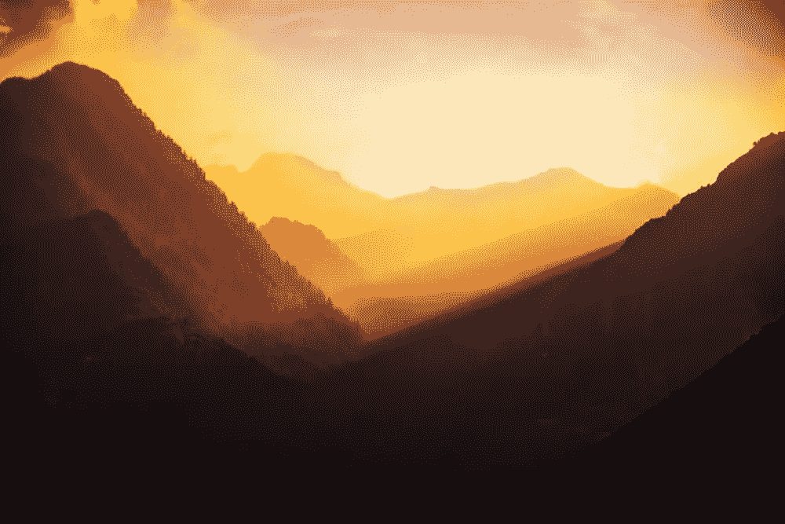
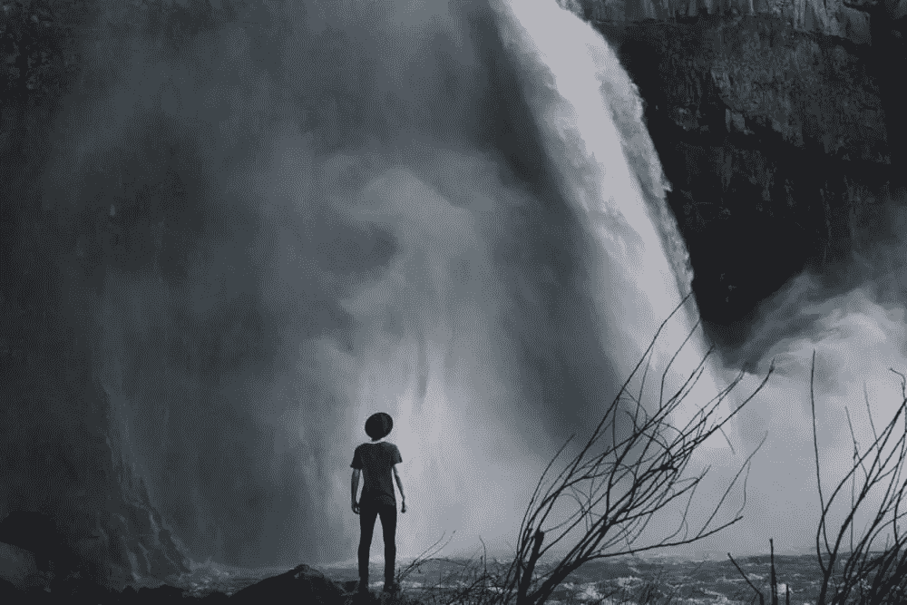
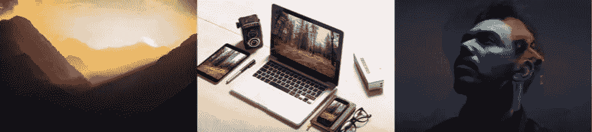
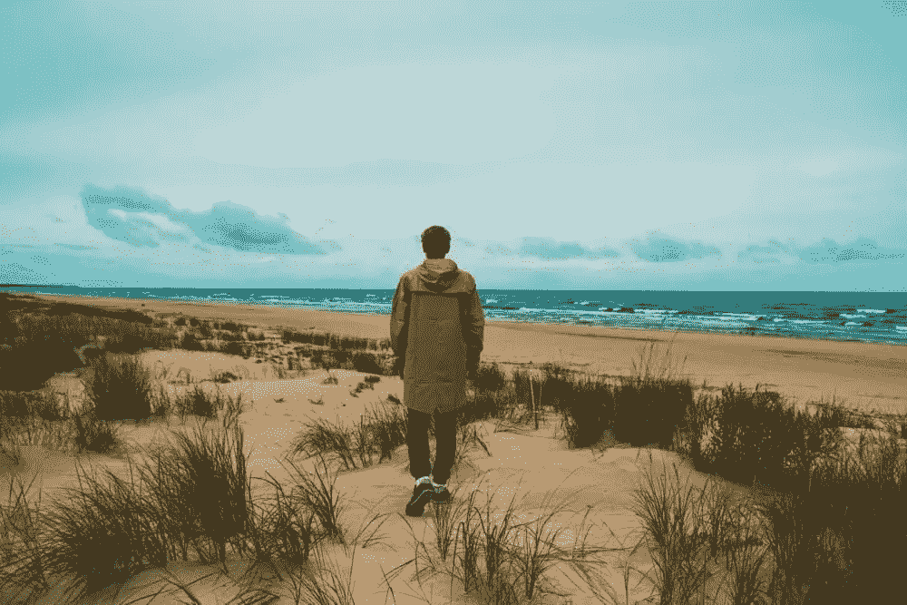

# 2017 年 25 个下载免费股票图片的网站

> 原文：<https://www.sitepoint.com/a-collection-of-30-free-stock-photo-sites/>

作为一名设计师，毫无疑问，你需要定期免费的库存图片。无论你是平面设计师、网页设计师还是用户界面设计师，摄影都是捕捉深度和情感的强大工具。让我们不要忘记大标题和英雄形象，这是非常时髦的！

我们最初在 2009 年写了这篇文章，但由于设计趋势的发展，库存摄影变得不那么俗气，设计师的需求也发生了变化，我们认为用今天可用的一些更新的选项来更新这篇文章将是一个不错的主意。

让我们来看看 2017 年十大最佳免费图片网站——还有 15 个值得一看。

## 1.[马德琳](https://magdeleine.co)

*   需要学分:有些是，有些不是
*   可搜索性:平均
*   风格/流派:阴郁、环境和情绪化——主要是自然

以自然为焦点，[magdeline](https://magdeleine.co)倾向于策划黑暗但柔和的图像。预计会有很多不饱和的色调和潜在的孤独气氛。你可以在浅色和深色背景之间切换，也可以缩小搜索范围，只显示免费的 CC0 图片(不需要任何属性)。

## 2.[免费自然股票](http://freenaturestock.com/)

*   要求信用:否
*   可搜索性:相当不错
*   风格/流派:未经编辑的自然主题图片

免版税的自然资源图片，每天更新。它们完全未经编辑，随时可以被你 PS。应用您选择的过滤器/情绪/氛围。标签#nofilter！

## 3.[拆分份额](https://www.splitshire.com)

*   要求信用:否
*   可搜索性:平均
*   风格/流派:明亮、振奋、新潮

SplitShare 可能与 Magdeleine 完全相反。每张图片都是明亮的、令人振奋的、彩色的，包括各种你认为当今流行的经过完全编辑的普通图片(MacBooks、双重曝光等)。你真的会想看一看他们的[顶级照片](https://www.splitshire.com/topbestphotos/)部分！

## 4.[新老股票](http://nos.twnsnd.co/)

*   信用要求:没有，但你应该仔细检查
*   可搜索性:不错，藏在左上角
*   风格/流派:黑白、棕褐色、复古等

[新老股票](http://nos.twnsnd.co/)是关于黑色和白色，复古，深褐色，一般是旧的或旧的- *看起来*股票图片-他们是从 Flickr 策划的，所以在使用前仔细检查许可证，以确保他们确实可以免费使用！

## 5.[流芳百世](http://fancycrave.tumblr.com/)

*   要求信用:否
*   可搜索性:体面
*   风格/流派:各种主题

每天都有两张新图片，在 [FancyCrave](http://fancycrave.tumblr.com/) 上总会有新发现。丰富的类别，简约的布局，一个强有力的竞争者。

## 6.[突击摄影](https://skitterphoto.com/)

*   要求信用:否
*   可搜索性:相当准确
*   风格/流派:任何事物

Skitterphoto 有一个相当大的免费库存图片数据库，所以这里没有特定的风格或主题，但我注意到这是一个有用的网站，可以找到事物的特写镜头。许多图片已经在 Photoshop 中编辑过了，所以看起来很时髦。

## 7.[去飞溅](https://unsplash.com/)

*   信用要求:不，所有图像都有 CC0 许可证
*   可搜索性:非常准确
*   风格/流派:任何事物

你显然听说过 [Unsplash](https://unsplash.com/) 吧？它非常大，每天都有大量的免费图片被添加进来。他们甚至有一个 API——如果你是 InVision 的用于素描或 Photoshop 的[工艺插件](https://www.invisionapp.com/craft)的用户，你可能已经知道你可以从 Unsplash 直接插入图像到你的设计中！

## 8.[吃货们喂](https://foodiesfeed.com/)

*   要求信用:否
*   可搜索性:出乎意料的高效
*   风格/流派:食物、食物和更多食物

[Foodies Feed](https://foodiesfeed.com/) 致力于免费提供……嗯……食物的图片！尽管它的利基性质，搜索结果相当高效(搜索“牛排”你就知道了！).

*提示:这里列出的许多资源可以在 [Zoommy App](http://zoommyapp.com/) 上找到，这是一个桌面应用程序，收集了来自 50 多个来源的 CC0(创作共用零)和公共领域图像！这最后一年对我来说真是派上用场了！*

## 15 个网站找到免费的股票图片

11.[创业股票照片](http://startupstockphotos.com/)

一个非常受欢迎的商业、创业和企业家主题的股票图片网站，但是它没有经常更新，所以很多照片被过度使用。虽然这是一个很好的备份！

12\. [Jay Mantri](http://jaymantri.com/)

杰伊·曼特里以其精彩的摄影而闻名，然而它的更新是随机的，所以很不幸我不能把它列入前 20 名。当然，这是你想要收藏的资源！

15.[街头意志](http://streetwill.co/)

Streetwill 提供了大量日常城市生活的照片——建筑、食物、交通、街道、人物——但来自世界各地的各种文化和国家。

16.[免费股票](http://freestocks.org/)

我喜欢 Freestocks 的一点是，当你找到一张合适的照片，但希望它是从稍微不同的角度拍摄的时候，一张股票图片通常会有多种变化。

17.[旅行咖啡本](http://travelcoffeebook.com/%20target=)

令人惊叹的未经编辑的旅行照片——经常更新。

18.[照片收藏](https://photocollections.io/)

与旅行咖啡书类似，照片集展示了以旅行为主题的股票图片以及自然和动物特写，尽管许多照片使用滤镜来创造一种平静的氛围，而不像旅行咖啡书提供未经编辑的照片。

19.[免费照片](http://freelyphotos.com/)

高质量，明亮，有时尖锐，Freelyphotos 提供的股票图像，创造影响。当然全部免费——CC0。

20. [Visualhunt](https://visualhunt.com/)

视觉搜索是一个巨大的数据库，所以许多搜索结果可能看起来是随机的，不如其他选项质量高，但是有一些隐藏的宝石，所以它值得书签。

21.[轴](https://www.pexels.com/)

与 Unsplash 类似，Pexels 在 2016 年和 2017 年成为股票图像领域的巨大竞争者。他们还提供视频，这让他们与众不同！你会想把这个加入书签的！

22.泡菜坛子

23.[逼真的镜头](http://realisticshots.com/)

24.[臭鼬](http://skuawk.com/)

25. [MMT 库存](http://mmtstock.com/)

26.[公共领域档案](http://publicdomainarchive.com/) ( *三十多页的股票图片！*)

*非常重要的注意事项:请记得在使用前检查图像许可，因为许多网站和摄影师在您向图像所有者提供信用的基础上提供照片供个人和/或商业使用。每个网站，可能每个网站上的每个摄影师通常都会有不同的要求，所以尊重他们很重要。*

这些免费图片网站中，哪一个让你印象深刻？这里有没有你已经用了一段时间的，或者可以个人推荐的？有什么我们漏掉的吗？请告诉我们，因为我们将在未来再次更新这篇文章！

## 分享这篇文章